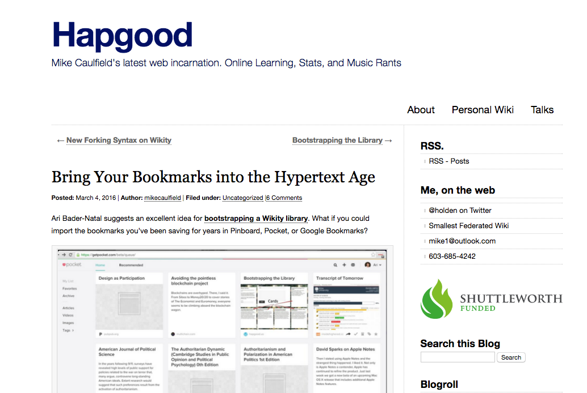

# ONLINE (Draft)

## AMY COLLIER
Middlebury College | http://digitallearning.middcreate.net

---

##### Publication Status:
* unreviewed draft
* **draft version undergoing editorial review**
* draft version undergoing peer-to-peer review
* published 

--- 
REBECCA: Editorial comments by Rebecca Frost Davis are included inline below following "REBECCA:" for each paragraph of feedback. I begin with overall feedback before the curatorial statement, then add more inline comments mostly following the paragraph to which the feedback applies.

## CURATORIAL STATEMENT

REBECCA: Because this keyword is being developed for one of the last batches of keywords in the collection and because the online environment underpins so much of digital pedagogy you face both a challenge and an opportunity.  On the one hand, you need to delineate a space for this keyword in the context of all the others without replicating them.  I think you do this well by speaking to all those preconceptions about what online learning is then demonstrating the limits of those preconceptions and pointing to the possibilities of the online environment.  Your opportunity is that I expect this keyword may be an entry point to this collection for many people.  I believe that in the final collection we will want to use it to point to other keywords.  I am noting those below for your reference, but I expect we will add those pointers after open peer review.

In higher education, the term “online” has become synonymous with eLearning-style training and MOOCs. This narrow view of online, with a focus on content delivery and automated assessment, is spread via mainstream media, as in this recent quote from *Inside Higher Ed*: “Online education can offer personalized pathways through course content with short lecture videos and well-timed quizzes that help students retain knowledge…” This perspective values online learning for its efficiency, flexibility, and convenience, claiming the appeal of “anytime, anywhere” education (Richardson & Swan 69). It has also marginalized online learning and de-emphasized the characteristics that make it distinctive and exciting as a model of education (Pacansky-Brock). It’s no surprise when pundits and educators alike argue that online learning can never match the quality of face-to-face or even blended learning because, as Ian Lamont argues, “there [i]s almost no meaningful student/teacher or student/student interaction. To equate this type of online learning with a real-world classroom experience is a major stretch.”

REBECCA: Please add the  citation for Inside Higher Ed? You refer to it as mainstream media, but I think you mean mainstream in the higher ed industry rather than in general.

REBECCA: You distinguish the potential of online learning from the conventional vision that figures it as a more efficient vision of classroom learning. Shawn Graham makes a similar argument in the introduction to the keyword, History, under open peer review now: https://digitalpedagogy.commons.mla.org/keywords/history/ This is a link we might point to in later versions of the collection.

To be fair, much online learning treats online spaces as containers, especially where institutions have adopted self-paced or templated models. However, many educators reject this view and instead focus on how online can transform education and provide new reflections on what it means to be and learn online. 

REBECCA: This is my inner picky classicist speaking: “however” is a post-positive—it should never come first in the sentence.  Rephrase as “Many educators, however, reject . . .”

REBECCA: I’m bothered by how short this paragraph is.  I think you should merge it with paragraph 3.  In the previous paragraph you quote multiple sources illustrating the negative view of online learning.  Here, I might expect some evidence of those many educators who reject this view.  I see that you are setting up the pedagogical artifacts as proof of your assertion of the opposite view.

This collection of resources is shaped by the educators who have embraced online learning beyond content. These resources, and the educators behind them, elevate new ways of thinking about online-ness and ask students to participate fully and critically in the online experience. They encompass some of the digital literacies considered essential for today’s teachers and learners. Artifacts in this collection are divided into three focus areas: authorship, community/networked participation, and presence/embodiment. Though treated separately, some examples demonstrate the ways in which all three can be addressed in meaningful learning contexts.

REBECCA: Merge with paragraph 2.

REBECCA: Mentions digital literacies—I’m expecting to see that picked up and substantiated with secondary literature below—I think it would be good to highlight, list, or point to some of those literacies here.
REBECCA: You list three categories that mirror aspects of the online learning experience—these also echo three of our other keywords.  We can add those cross references later, but you should be aware of the overlap.  Those keywords are:
* author (forthcoming)
* community: https://github.com/curateteaching/digitalpedagogy/blob/master/keywords/community.md
* network (forthcoming)

### Authorship 
Online authorship is not just writing in online spaces. Implicit in the notion of authorship are the “language, methodology, and training” (Rheingold 31) teachers and learners need to no longer consume what is online, but to author it. Too many technologies and models of online learning relegate the learner to a consumer role and give authorship rights only to the instructor (or sometimes, only to the designer of an online course). Examples in this section push back a plug-and-play view of online spaces and embrace the uncertainty and complexities of digital authorship, including questions raised by “public” authorship, sharing, and remixing.

REBECCA: note that your final sentence evokes some other keywords:
* public: https://github.com/curateteaching/digitalpedagogy/blob/master/keywords/public.md
* remix: https://github.com/curateteaching/digitalpedagogy/blob/master/keywords/remix.md

### Community and networked participation
Perhaps the greatest, and often unrealized, opportunity for meaningful online learning is through connections to people and networks within and outside of a class. Students work in online “walled gardens,” such as Learning Management Systems, and are not encouraged to venture beyond those digital walls to connect to people and networks. Yet those unwalled connections are Gardner Campbell argued, “we must add digitally mediated networked learning to Kuh's [high impact practices] list, because the experience of building and participating within a digitally mediated network of discovery and collaboration is an increasingly necessary foundation for all other forms of experiential learning in a digital age. Moreover, the experience of building and participating within a digitally mediated network of discovery is itself a form of experiential learning…” Resources in this collection provide examples for intentional building and fostering of networks and communities as part of online learning.

REBECCA: Thank you for taking on the learning management system!  There is a problem here with the grammar around the quote from Gardner Campbell.  The lead in phrase seems to be missing something—“those unwalled connections are . . .”  What are they? Also, your works cited lists 3 pieces by Gardner Campbell.  Please clarify which one you are referencing here.

### Presence/Embodiment
The third area this collection investigates is presence and embodiment. Siân Bayne (105) says, “The distanced, unstable relationship between body and subject with which we engage when we communicate online involves us in modes of identity formation and pedagogical relations which are very different from those which, as learners and teachers, we experience in the face to face classroom.”  The lack of physical embodiment and co-presence may be most detrimental to online learners, as those can contribute to feelings that online learning lacks authenticity or veracity (Land 531). Land noted, “The notion that the visibility of the learner or teacher serves as an anchor of truthfulness or veracity (‘you can look your interlocutor in the eye’) might lead one to conclude that authenticity is dependent upon physical embodiment. It would follow from this line of reasoning, that lack of embodiment renders the cyber space, which is unquestionably a simulated environment, a ‘false’ environment.” 

REBECCA: I really like the way you take on social presence here because this is one of the challenges to online learning I hear so often from those at my institution who are used to teaching face-to-face. You raise issues of both social presence and authenticity in this paragraph.  You may want to unpack those into two different paragraphs and highlight that these are two areas of research.  You do that for social presence.  For authenticity you imply the challenge of veracity which leads to concerns about cheating.  I’m not sure if you want to go there or not, but you are flirting with it already. Could you make that more explicit? Again, here I am imagining your audience as a humanist who has avoided digital pedagogy (even to enhance a traditional rather than in a blended or online class) because of the types of concerns generally raised about online learning.

REBECCA: In general, when you end a paragraph with someone else’s quote I feel like I am missing your voice—what conclusion do you want the reader to draw from this evidence?

As expected, questions of embodiment and presence pervade the literature on online learning, highlighting their importance. The disembodied or absent online learner is characterized as a “lurker” and strategies for dealing with lurkers often devolve to compliance (number of logins, number of discussion posts, etc.). Research points to the importance of establishing social, cognitive, and teaching presence in online learning experiences, the integration of which is said to foster a Community of Inquiry (Garrison) among teachers and learners. Examples in this section explore or reimagine presence and provide a sense of eventness for online learning experiences.

## CURATED ARTIFACTS

REBECCA: In general, please develop your annotations further.  For each category you will want to ensure that you are saying illustrating a different aspect with each artifact in the category.  Also, in the final version some of these artifacts might be encountered alone so they need enough annotation to make them intelligible.

REBECCA: Several of your artifacts have open questions about permissions.  I will share a permissions form with you that you can use to secure permissions from the creators.

## Authorship

REBECCA: Be sure to highlight how each example speaks to a different aspect of online authorship or creativity.

### ds106 Assignment Bank creator

* Artifact type: Github repository
* Source URL: [https://github.com/cogdog/ds106bank](https://github.com/cogdog/ds106bank)
* Artifact permissions: No specific license noted, but Alan is clearly open to reuse
* Creator and Affiliation: Alan Levine

Github provides a unique platform for authorship, collaboration, and peer review; educators are beginning to explore how Github could be used in their classrooms for these purposes. Levine’s Github repository could enable students to author their own Assignments bank and build a community around the assignments they create. The Assignments Bank model has been used by a number of online courses and communities, many of which are listed on Levine's Github page. 

REBECCA: You will need to get explicit permissions for this example; are there some sort of permissions built into using github?  Also, does Alan have an institutional affiliation?
Given our project’s use of github, clearly I’m going to like this artifact.  I think you need to add one more sentence at the beginning of the annotation explaining what github is, e.g., a tool that developed for collective software development.

REBECCA: Rather than “could enable” maybe it should be “has enabled” the ds106 community and others; then make suggestions for other uses.  Could you push the possibilities further and comment on the connection to authorship vs. consumerism? Why is it important that this occurs in a community? Would you use this in or out of the LMS? Do you expect this to move outside of the traditional boundaries of the classroom? How is this important as a model and how does it differ from the ForkU example that follows?  I think you are keying in on the collective creation—you could consider tying this to participatory culture characterized by low barriers to creation? How does this connect to digital literacies?

### Fork U! Resource Page

* Artifact type: Assignments, guide for learning and using Github
* Source URL: [http://oudiglearn.github.io/forku/](http://oudiglearn.github.io/forku/)
* Artifact permissions: CC-BY 4.0
* Creator and Affiliation: Adam Croom, John Stewart / University of Oklahoma

Github provides a unique platform for authorship, collaboration, and peer review and educators are beginning to explore how Github could be used in their classrooms. This resource, assembled for a presentation at the Online Learning Consortium's Innovate conference, provides low-barrier and forkable activities instructors and/or students can complete. All of the resources on this site are forkable (i.e., they can be copied and reused). Any changes made to a "forked" copy do not impact the original "master" unless a pull request is accepted. Other examples of resources on Github include this [Musicianship syllabus](http://kris.shaffermusic.com/musicianshipResources/), course materials for [Humanizing Technology](https://github.com/karlstolley/ht), assignments for [Fashioning Circuits](https://github.com/fashioning-circuits), and peer assessment activities for a course on [Reproducible Data](https://github.com/rdpeng/RepData_PeerAssessment1). 

REBECCA: I wonder if this should come before the Assignment bank creator because it explains Github? The focus here is on the “forkable” nature of things.  That aspect of reuse and modification particularly characterizes the online environment and takes a different approach to creativity.  Again, how might you connect this example to digital literacies? This tool makes explicit creation based on adaption and modification of a model so that the original can still be traced.  Thanks for including other examples,  as well.

### ThoughtVectors in Concept Space syllabus

* Artifact type: Syllabus
* Source URL: [http://thoughtvectors.net/syllabus/](http://thoughtvectors.net/syllabus/)
* Artifact permissions: Not specifically noted
* Creator and Affiliation: Gardner Campbell / Virginia Commonwealth University

This artifact could be considered an example of both authorship and community. Thought Vectors, a course offered at Virginia Commonwealth University, gives each students their own space on the web in the model of [Domain of One's Own](https://medium.com/bright/the-web-we-need-to-give-students-311d97713713#.y7hguujk3). Students participate in the course via their authored environments. Additional information on participation in the community can be found on the [Thought Vectors](http://thoughtvectors.net/how-to-participate/) website.

REBECCA: You need to send Gardner a permissions form or ask him to add a license.

REBECCA: Please add one more sentence explaining the concept of Domain of One’s Own and the connection of this artifact to authorship.  It seems that this one focuses more on empowering a student’s individual authorship.  Consider citing Gardner’s piece on personal cyberinfrastructure again.

### Wikity: Bring your bookmarks into the digital age

* Artifact type: Blog post / guide for using Wikity (federated wiki) for bookmarking
* Source URL: [https://hapgood.us/2016/03/04/bring-your-bookmarks-into-the-hypertext-age/](https://hapgood.us/2016/03/04/bring-your-bookmarks-into-the-hypertext-age/)
* Artifact permissions: Wikity content is CC-BY-SA
* Creator and Affiliation: Mike Caulfield, Washington State University - Vancouver

Wikity is a federated wiki environment created by Mike Caulfield. Mike's writings about the benefits of federated wikis are worth reading. In brief, Wikity allows a user to write and maintain individually-controlled wiki pages and to make editable copies of others' wiki pages. According to Caulfield, Wikity captures some of the best characteristics of blogs (individual voice and control) with the best characteristics of wikis (collaboration, sharing) by allowing users to maintain connected copies of information. Wikity could be used in an online course for students to create bookmarks and libraries of resources that are connected to resources written by others in their class and outside of their class. 

REBECCA: Is this blog post, like Wikity, also CC-BY-SA? How does this connect to authorship/creativity?  Also, how does this overlap with github?

## Community

REBECCA: Be sure to highlight how each example speaks to a different aspect of online community.  I see some potential for overlap with the keyword, “network” which I am also editing.  I’ll work with both you and the two curators of “network” to avoid that.

### clMOOC

* Artifact type: Online community and course
* Source URL: [http://clmooc.educatorinnovator.org/2015/](http://clmooc.educatorinnovator.org/2015/)
* Artifact permissions: CC-BY-SA 4.0
* Creator and Affiliation: Educator Innovator / National Writing Project

This artifact shows how an online course can be designed to intentionally foster community. Every activity, every design choice, centers on the community. clMOOC makes explicit its goal of connected learning and provides ample opportunities for learners to connect (see examples of Twitter chats, Make Cycles, Blog Hub, Make Bank, and social tools). 

REBECCA: The annotation on this artifact is very brief.  You should probably differentiate it from the MOOC and then explain in more detail how at least one activity you list explicitly promotes community.  Then you might explain how this illustrates the connection between community and digital literacy.  I would keep the list of other activities without explaining them in depth.  Why is community important? Also, you mention connected learning but don’t cite any literature on that movement.  I think that approach should come up in the works cited or in related works. I will say that the curators of network are working from that perspective so you don’t need to cover it; just reference it.

### FemTechNet: Key Learning Projects

* Artifact type: Assignments
* Source URL: [http://femtechnet.org/get-involved/self-directed-learners/key-learning-project/](http://femtechnet.org/get-involved/self-directed-learners/key-learning-project/)
* Artifact permissions: Copyright FemTechNet, but assignments appear to be available for reuse
* Creator and Affiliation: FemTechNet organizers

FemTechNet is called a DoCC -- Distributed Open Collaborative Course. Like the clMOOC example, FemTechNet aims to foster community and provides key learning assignments that are shared across the various institutions where the course is being offered. 

REBECCA: FemTechNet gets used as an artifact multiple times in this project.  I’ll send you a spreadsheet with the full list of artifacts.  So, it would be great if you could pick some aspect that has not been cited before.  I love the wikistorming example and the way it leverages the power of networks for collective action—in fact, I wrote about it in a forthcoming publication (“Pedagogy and Learning in a Digital Ecosystem.” In J. Moore & R. Bass (Eds.), Understanding Writing Transfer and its Implications for Higher Education. (forthcoming 2016)). FemTechNet is not the same as the DOCCs.  As a community it sponsors DOCCs, which have been explicitly created as an alternative to MOOCs.    They see this as part of feminist pedagogy.  I think that is an important point to highlight here.  These key learning projects are both the product of a community and an opportunity to create further community.  You might consider reframing this artifact to focus in on one key learning project and demonstrate its connection to community then you could still reference the others, as well as the FemTechNet community. One of their current co-directors, Anne Cong-Huyen, curated the keyword “gender” which is now in open peer review: https://digitalpedagogy.commons.mla.org/keywords/gender/  She includes the artifact, "Situated Knowledges Map”, a version of Feminist Wikistorming, and the DOCC: Dialogues on Feminism and Technology. The Exquisite Engendering Remix is included in Remix: https://digitalpedagogy.commons.mla.org/keywords/remix/.

### The Daily Connector

* Artifact type: Assignments
* Source URL: https://dailyconnector.wordpress.com/
* Artifact permissions: Not specified
* Creator and Affiliation: Connected Courses

The Daily Connector provides activities and assignments that aim to grow connections between individuals in a course or across multiple courses. These activities encourage community building online as part of intentional daily practice. An instructor could replicate the activities in her class to stimulate the creation of a vibrant and active community of learners in online spaces.

REBECCA: This is a nice tool.  Could you specifically explain how one activity functioned to make connections and how this relates to community?  What aspect of community does this address?  Is it the challenge of finding activities that break down the walls of the classroom be they physical or virtual?

## Presence

REBECCA: Be sure to explain how each artifact connects to this category and builds the readers understanding of this concept. What is logic of order of activities in this section? You might move from presence in the virtual classroom to presence that moves beyond that classroom. Or are you moving through different aspects of presence/embodiment? Chronological?

### Annotation Flash Mob

* Artifact type: Blog post with links to assignment details
* Source URL: [https://gamesandlearning.wordpress.com/2016/04/27/about-that-annotation-flash-mob/](https://gamesandlearning.wordpress.com/2016/04/27/about-that-annotation-flash-mob/)
* Artifact permissions: Unclear, but assignment details are publicly available
* Creator and Affiliation: Remi Holden / CU Denver

Inspired by Sean Michael Morris' [Teaching in our right minds: Critical Digital Pedagogy and the Response to the New](http://www.digitalpedagogylab.com/hybridped/teaching-in-our-right-minds/) Remi Holden organized an annotation flash mob in his course, where his students were already using hypothes.is for collaborative annotation. Holden's blog post with instructions on how to participate in the flash mob [is here](https://gamesandlearning.wordpress.com/2016/04/24/an-annotation-flash-mob-invitation/). The annotation flash mob is a fascinating example of bringing eventness to the collaborative web. Several of Holden's students and many individuals outside of the course jumped in to annotate Morris' article. One participant's comments captured the feeling of eventness, "“Love[d] getting to play in the digital annotation flashmob – I’m reminded of the frequently referenced analogy of the digital mimicking sandbox play." 
More generally, instructors are using hypothes.is in their courses for collaborative annotation, as in this [example from Brian Watkins at Austin College](http://acdigitalpedagogy.org/category/hypothes-is/).

REBECCA: Need to send permissions form.

REBECCA: This is a great example that again points to another keyword (annotation, https://github.com/curateteaching/digitalpedagogy/blob/master/keywords/annotation.md) but also takes it further with your focus on “presence”.  Please add link to the hypothes.is tool.  Thanks for the example of annotation in general—here you can also point to the keyword.  This annotation has nice specificity that illustrates how it embodies presence.

### The Daily Create

* Artifact type: Assignments
* Source URL: [http://daily.ds106.us/](http://daily.ds106.us/)
* Artifact permissions: CC-0
* Creator and Affiliation: Alan Levine

The Daily Create involves daily activities that help faculty and students remain actively engaged and present in a course. Daily Create activities like these can minimize feelings of interpersonal distance by motivating continuous participation. Daily Create activities are brief and have low barriers to entry; the key is to provide easy and interesting ways for students to remain engaged, thus contributing to the eventness of the course.

REBECCA: This is a nice example of social presence.  Do you want to connect to Henry Jenkins on participatory culture?  You characterize these activities in the terms he uses to define such a culture.  Also, note the personal element—connecting learning to personal life by sharing photos and poems that are relevant for student.  This example also moves outside of the LMS into physical world.  There is nice modeling by the instructor.   This is another one where the artifact could be this particular assignment and then the annotation could point to the larger collection of assignments.  

### Introduction to Still Photography syllabus

* Artifact type: Syllabus
* Source URL: [https://voicethread.com/myvoice/#thread/2610203](https://voicethread.com/myvoice/#thread/2610203)
* Artifact permissions: Not specified 
* Creator and Affiliation: Michelle Pacansky-Brock / California State University Channel Islands

The use of voice sharing technologies may help to combat the disengagement felt in disembodied online courses. Pacansky-Brock voice annotates her syllabus, assignments, and she provides feedback to students using voice. She invites students to annotate course resources and assignments together, using VoiceThread. Pacansky-Brock also wrote a free ebook called [How to Humanize Your Online Class with VoiceThread](http://page.teachingwithoutwalls.com/ebook).

REBECCA: Need to get permissions.

REBECCA: Focus here is on teacher presence as a model for student presence.

## RELATED MATERIALS

Campbell, Gardner. “A personal cyberinfrastructure.” http://er.educause.edu/articles/2009/9/a-personal-cyberinfrastructure

Pacansky-Brock, Michelle. "Love letter to online learning." http://brocansky.com/2016/04/26/love-letter-to-online-learning/

Rheingold, Howard. Net Smart: How to Thrive Online. Cambridge: The MIT Press, 2014. Print.

Ross, Jen et al. "Manifesto for Online Teaching." https://onlineteachingmanifesto.wordpress.com/

Stommel, Jesse. "Online learning: A Manifesto." http://www.digitalpedagogylab.com/hybridped/online-learning-a-manifesto/

## WORKS CITED

A works cited for all references in your entry, including your ten artifacts, your five related materials, and anything referenced in your curatorial statement in MLA style.  

Bayne, Siân. “The Embodiment of the Online Learner.” Beyond the comfort zone: Proceedings of the 21st ASCILITE
Conference (2004): pp. 105-115. Web. 1 May 2016. http://www.ascilite.org/conferences/perth04/procs/pdf/bayne.pdf

Campbell, Gardner. “A personal cyberinfrastructure.” Educause Review. Web. 1 May 2016. http://er.educause.edu/articles/2009/9/a-personal-cyberinfrastructure

Campbell, Gardner. “Networked Learning as Experiential Learning.” Educause Review. Web. 1 May 2016. http://er.educause.edu/articles/2016/1/networked-learning-as-experiential-learning

Campbell, Gardner. "Thought Vectors in Concept Space: Syllabus." Web. 1 May 2016. http://thoughtvectors.net/syllabus/

Caulfield, Mike. "Wikity: Bring your bookmarks into the digital age." Web. 1 May 2016. https://hapgood.us/2016/03/04/bring-your-bookmarks-into-the-hypertext-age/

clMOOC. Web. 1 May 2016. http://clmooc.educatorinnovator.org/2015/

Connected Courses. "The Daily Connector." Web. 1 May 2016. https://dailyconnector.wordpress.com/

Croom, Adam & John Stewart. "ForkU! Resource Page." Web. 1 May 2016. http://oudiglearn.github.io/forku/

FemTechNet. "Key Learning Projects." Web. 1 May 2016. http://femtechnet.org/get-involved/self-directed-learners/key-learning-project/\

Garrison, D. R. “Online Community of Inquiry Review: Social, Cognitive, and Teaching Presence Issues.” Journal of Asynchronous Learning Networks, v11 n1 (2007): pp. 61-72. Web. 1 May 2016.
http://onlinelearningconsortium.org/sites/default/files/v11n1_8garrison.pdf

Holden, Remi. "About that Annotation Flash Mob." Web. 1 May 2016. https://gamesandlearning.wordpress.com/2016/04/27/about-that-annotation-flash-mob/

Lamont, Ian. "My online math class review: Convenience gets an 'A,' but at what cost?" I, Lamont blog. Web. 1 May 2016. http://www.ilamont.com/2010/07/my-online-math-class-convenience-gets-a.html

Land, Ray. "Issues of embodiment and risk." Beyond the comfort zone: Proceedings of the 21st ASCILITE
Conference (2004): pp. 105-115. Web. 1 May 2016. http://www.ascilite.org/conferences/perth04/procs/land.html

Levine, Alan. "Assignment Bank Creator. Web. 1 May 2016. https://github.com/cogdog/ds106bank

Levine, Alan. "The Daily Create." Web. 1 May 2016. http://daily.ds106.us/

Pacansky-Brock, Michelle. "Introduction to Still Photography syllabus." Web. 1 May 2016. https://voicethread.com/myvoice/#thread/2610203

Pacansky-Brock, Michelle. "Love Letter to Online Learning." Web. 1 May 2016. http://brocansky.com/2016/04/26/love-letter-to-online-learning/

Rheingold, Howard. Net Smart: How to Thrive Online. Cambridge: The MIT Press, 2014. Print.

Richardson, Jennifer & Karen Swan. "Examing Social Presence in Online Courses in Relation to Students' Perceived Learning and Satisfaction." Journal of Asynchronous Learning Networks, vol7, issue 1, 2003. https://www.ideals.illinois.edu/bitstream/handle/2142/18713/RichardsonSwan%20JALN7%281%29.pdf?sequence=2

Ross, Jen et al. "Manifesto for Online Teaching." Web. 1 May 2016. https://onlineteachingmanifesto.wordpress.com/

Stommel, Jesse. "Online learning: A Manifesto." Hybrid Pedagogy. Web. 1 May 2016. http://www.digitalpedagogylab.com/hybridped/online-learning-a-manifesto/
Status API T