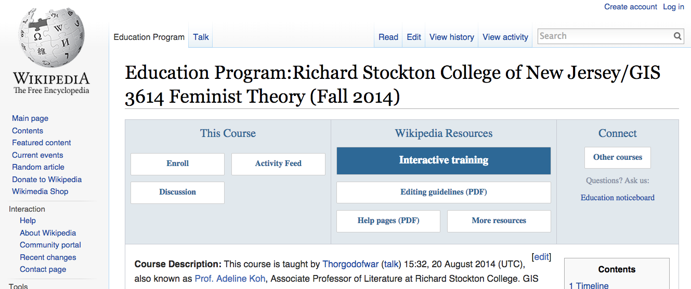
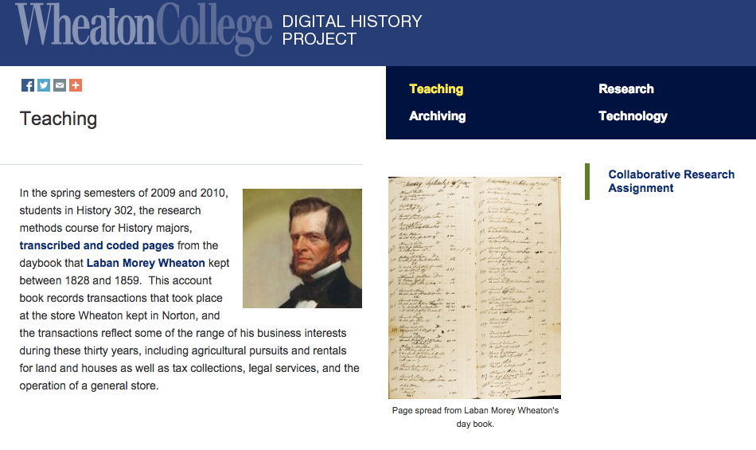
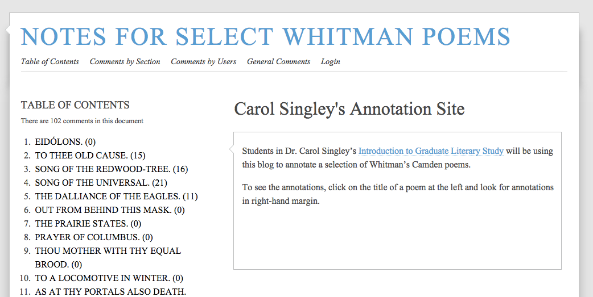
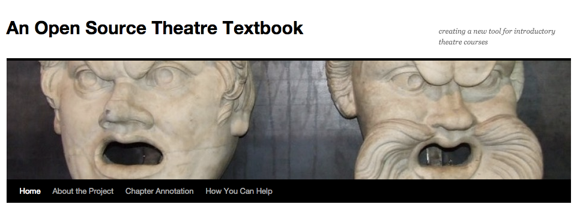
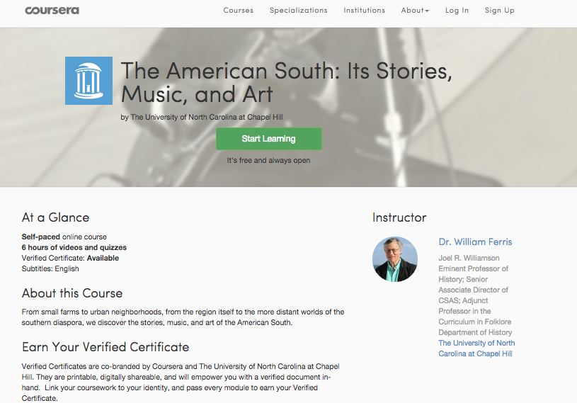
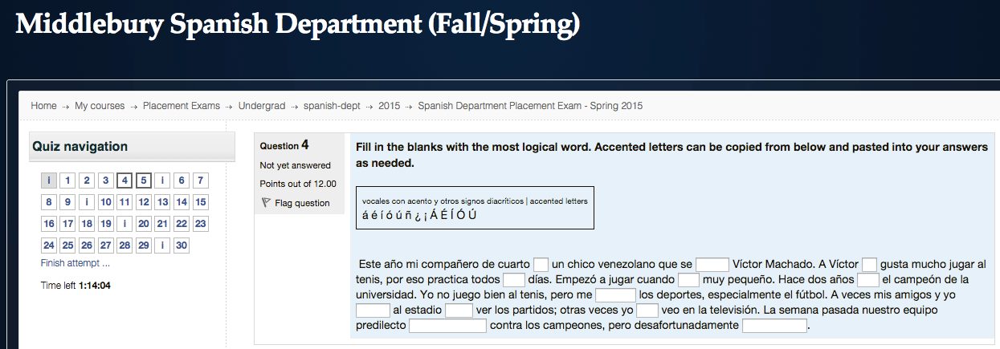
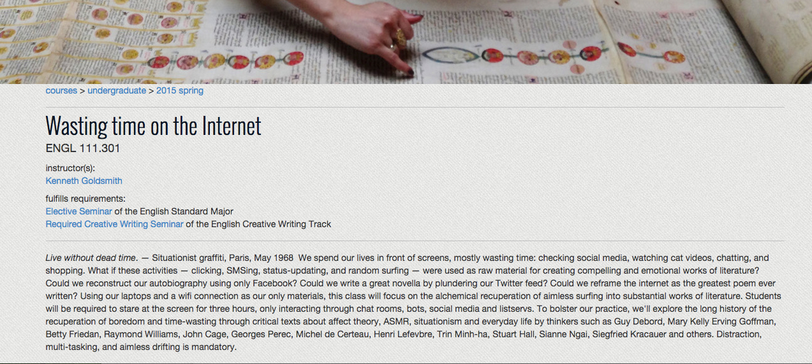

--- 
title: Digital Pedagogy in the Humanities
subtitle: Concepts, Models, and Experiments 
chapter: Open
URL: keywords/open.md
author: 
- family: Roy
  given: Michael
editor: 
- family: Harris
  given: Katherine D.
publisher: Modern Language Association
type: book
---

# OPEN (Draft)

### Michael Roy 
Middlebury College  

##### Publication Status:
* unreviewed draft
* **draft version undergoing editorial review**
* draft version undergoing peer-to-peer review
* published 

---

## CURATORIAL STATEMENT 

Open is complicated. How do the myriad "opens" connect: open source, open access, open textbooks, open educational resources, massively open online courses. Those familiar with the history of open source software will recall the  endless hours of unresolved debate surrounding the difference between "free" and “open.” The recent debates surrounding MOOCs  raise important questions about whose interests are served by going all-in for open courses. Beyond these very specific debates, to what extent does the "source" of our software matter when we make choices about platforms, systems, and environments for conducting our courses? 
KDH: FOR THESE TERMS THAT ARE USING SCARE QUOTES, YOU MAY HAVE TO TAKE A MOMENT TO EXPLAIN WHY THEY NEED CRITICAL INQUIRY MORE DELIBERATELY -- SOME OF OUR AUDIENCE WILL BE NEW TO DIGITAL PEDAGOGY AND POSSIBLY SOME OF THESE DEBATES 

In a market economy where educational technology is in the cross-hairs of Wall Street and Silicon Valley, just how committed are we <--KDH: LIMIT YOUR USE OF FIRST PERSON TO INSTANCES OF CLASSROOM EXPERIENCE THAT ARE COGENT TO THE DISCUSSION to principles of openness that may turn out to be a distraction in the face of larger structural changes that represent an existential threat to our current way of operating?  More positively, what chances do we <--KDH: HERE, TOO stand to reclaim control over the intellectual property that our current system has out-sourced to commercial publishers and software companies whose interests do not necessarily align with the interests of educators and students? How might a much more open information environment transform what happens in our classrooms? How do we promote the the open sharing of pedagogical artifacts that in turn enable us  to hack assignments and share teaching ideas and reclaim the means of production? 

RFD/KDH: Good introduction to the broad range of debates and definitions of open.
Do you want to specify which system you mean? educational? academic? 
On the other side of the proposed open information environment (hear! hear!) come concerns about faculty intellectual property and who owns courses. 
Cf. 
* Zhang, K., & Carr-Chellman, A. A. (2006). Courseware copyright: Whose rights are right?. Journal of Educational Computing Research, 34(2), 173-186.
* Peterson, R. (n.d.). Ownership of Online Course Material. Retrieved November 3, 2014, from https://net.educause.edu/ir/library/pdf/ERB0301.pdf
* Butrymowicz, S. (n.d.). Professors Peeved to Learn They Don’t Own What They Teach Online | TIME.com. Retrieved November 3, 2014. From http://nation.time.com/2014/03/01/online-courses-moocs-ownership/ 

Open is not an end unto itself, but a means to a specific end. As Mark Edington writes in the context of Open Access, Open <--KDH: WHAT IS THE REASON FOR INITIAL CAPS ON OPEN, AND OPEN ACCESS? SHOULD IT BE LOWERCASE THROUGHOUT FOR CONSISTENCY? is a strategy. Individual choices to pursue an Open strategy collectively contribute to a network that enables a form of re-mixing, bricolage, collaboration, new forms of authorship and authority, new modes of publication, and, as illustrated by this digital pedagogy volume itself, new forms of pedagogy. 

RFD/KDH: I like the sense of exploring "open" as a strategy.  Could you build on this paragraph to narrow down the effect of choosing this strategy on pedagogy.  I think I'm just looking for 2-3 more sentences here that explicitly frame the direction of your argument as unpacking the pros and cons of this pedagogical strategy no matter what type of "open" strategy is chosen (looking back to sentence 1). I think it is really important to clearly delineate these considerations for instructors who are choosing any type of open strategy. I'm looking for stronger framing of these types of open teaching practices--I see two separate paragraphs in this one paragraph.

    paragraph on open student & faculty work, pros and cons
    paragraph on pedagogy linked to open scholarship, concerns around evaluation, etc.
Or do you want to address the strategies you signal in the first sentence:
open source, open access, open textbooks, open educational resources, massively open online courses 

The artifacts discussed here illustrate a wide range of open teaching practices that bring to light both the promises but also the challenges and problems of digital pedagogy done more or less on the open internet. Most of the examples focus on student-created works in multiple formats, highlighting ways in which writing for a broader [public](https://github.com/curateteaching/digitalpedagogy/blob/master/keywords/public.md), and using a range of open platforms and formats, can support a form of information literacy involving both reading and writing that extends beyond the nominal topic of the assignment. Some exemplify either student or faculty contributions to larger works of scholarship or the creation of resources for other scholars that have a life beyond the confines of the specific classroom and semester. These in turn raise hard questions of evaluation. In many of these examples, the work is done as a group, or as part of a collective, and yet our systems of grading and evaluation are largely organized around the individual contributor.  To the extent that much of this work is ‘database work’ that involves cataloging, creating metadata, and finding aids, how much is this "scholarship"?  Open clearly does not mean inferior, but there remains much work to be done both to establish that open can mean high-quality, and to re-think our methods of evaluation to accommodate digital work. 

RFD/KDH: You reference Jeff McClurken's keyword both in paragraphs 3 and 4.  I think you need stronger organization of topics in this section.  Overall you might frame it as a series of paragraphs, each addressing one of the separate implications of open for pedagogy, which will then be further illustrated the artifacts chosen. 

In looking through the chosen  artifacts, it is also worth considering to what extent  being  ‘open’ comes at the expense of student learning and student privacy? Should students be forced to put their thoughts on-line for all to see? To what extent might these materials created when students are often  still quite young linger on-line for longer than they should? (See Jeff McClurken’s entry on [Public](https://github.com/curateteaching/digitalpedagogy/blob/master/keywords/public.md)

Many of these examples also raise important challenges to our current market-based information economy. How might these interventions in favor of openness be seen as a path forward to re-capture a system dominated by market forces? Might forcing our students to confront at some meta level these complicated issues surrounding ‘open’ in turn prepare them (and us)  to think about how our choices of how to implement technology impacts our day to day lived experience, and our lives together in what we envision as a civil society? How hard do we want to argue against the "appificaiton of everything" that creates walled-gardens of content that resist the creative linking, re-use, and bricolage that early versions of the web encouraged us to think would transform our teaching and our students’ learning?

KDH: FOR THE LIST OF ARTIFACTS, PLEASE INCLUDE THE FOLLOWING INFORMATION WITH HEADERS; YOU'VE INCLUDED SOME OF THEM HERE, BUT NOT ALL:
Title of Artifact (as it appears on the actual "document")
Artifact Type: Pedagogical artifacts may include (but are not limited to) syllabi, teaching guidelines, assignments, lesson plans, course sites, learning objective, collaborative projects, and even student work.
Screenshot (PNG or JPG), titled “keyword artifact title,” e.g. “work-AfAm-syllabus.png”
Source URL
Artifact Permissions (note whether content is shared under a Creative Commons license)
Copy of the Artifact (in HTML, PDF, DOCX, TXT, MD, RTF, MP3, MP4, MOV, PNG, or JPG), if possible
Creator and Affiliation

## CURATED ARTIFACTS 

### Wikipedia Syllabus for Feminist Theory  

* Source URL [https://en.wikipedia.org/w/index.php?title=Education_Program:Richard_Stockton_College_of_New_Jersey/GIS_3614_Feminist_Theory_(Fall_2014)&action=purge](https://en.wikipedia.org/w/index.php?title=Education_Program:Richard_Stockton_College_of_New_Jersey/GIS_3614_Feminist_Theory_(Fall_2014)&action=purge) 

* Copy of the Artifact  : forthcoming

* Creator : [Adeline Koh](http://adelinekoh.org/), Associate Professor of Literature at Richard Stockton College

Wikipedia is the gold standard for open pedagogy. <--KDH: WHY? REMEMBER, NEW EXPERIMENTERS IN DIGITAL PEDAGOGY; NEEDS MORE They have even set up an office to support the integration of wikipedia curation into courses. The thoughtful work of Adeline Koh in challenging her students to do their work via editing wikipedia articles  forces them to confront tricky questions about knowledge, power, authority, and standards. Wikipedia in turn [cautions](https://en.wikipedia.org/wiki/Wikipedia:Student_assignments) faculty that simply turning students loose to edit entries may do no good for the students, and no good for wikipedia. 

KDH: HOW DOES THIS RELATE TO OPEN? WHAT'S THE IMPLIED CRITERIA. THIS NEEDS TO BE DONE FOR ALL OF THE ARTIFACT ANNOTATIONS. ALSO, THERE ARE ONLY 9 ARTIFACTS. NEEDS ONE MORE.

### Teaching Digital History: Collaborative Markup 

* Source URL [http://wheatoncollege.edu/digital-history-project/teaching/](http://wheatoncollege.edu/digital-history-project/teaching/) 

* Copy of the Artifact 

* Creator:  Kathryn Tomasek, Wheaton College 

One of the important things computers can do for us is to help bring to the surface patterns that our human brains may not be able to detect. But computers are profoundly bad at coping with many human artifacts, including our handwritten documents. As part of a larger project to teach students how to do archival and historical research, Kathryn Tomasek from Wheaton College has her students digitize and markup historical documents, contributing to the creation of an open archive, but simultaneously providing her students with an opportunity through learning the mark-up language and applying that language to these texts, to have a deep experience with a primary text, asking of it structural and lexical questions that both provide the eventual reader with the ability to identify patterns, and provide the student with a chance to make visible a history previously lost. Like writing for wikipedia, contributing to open history allows students to engage an audience beyond just their professor, and to consider how their work contributes to a larger historical project. 

KDH: HOW DOES THIS PROJECT REPRESENT OPEN?

### First Year Seminar Digital Storytelling (digital stories)

* Source URL [http://stories.umbc.edu/fys.php](http://stories.umbc.edu/fys.php) 

* Copy of the Artifact: forthcoming

* Creator and Affiliation : University of Maryland, Baltimore County.

Open writing (contributing to Wikipedia, contributing to open history projects) is but one of many options for challenging students to produce public scholarship. In this example, first-year seminar students at University of Maryland, Baltimore County, produced short documentary videos in the form of digital stories shared via the web..The "Much in Common," first-year seminar class explored common themes in both adolescence and  aging, stages in life that can transform a person’s sense of identity. In intergenerational teams, undergraduates explore changes in their identities by producing video stories together that focus on common threads, shared insights and lessons about growth. Contributing to an open publication with an audience well beyond the professor, and creating video resources that in turn can be useful for subsequent scholars, forces students to consider a host of complex but important issues that the dominant mode of the closed classroom avoids. <--KDH: AH HA, THIS IS REALLY INTERESTING; YOU EXPLAIN THE REPRESENTATION OF OPEN IN CONTRAST TO CLOSED; ALL OF THE ANNOTATIONS NEED THIS KIND OF CONNECTION

### Open Annotations (student  annotated walt whitman poems) 

* Source URL [http://notes.lookingforwhitman.org/2009/10/05/song-of-the-redwood-tree/](http://notes.lookingforwhitman.org/2009/10/05/song-of-the-redwood-tree/) 

* Copy of the Artifact: forthcoming

* Creator:  Carol  Singley,  Rutgers University

A technology for enabling  open peer review makes its way into the curriculum with this re-purposing of CommentPress (a web publishing tool built on the open source blog engine WordPress)  to empower students of Walt Whitman’s poems to annotate his (out of copyright) poems.  While a discussion of the implications of open peer review for scholarly communication may be out of scope for this volume, this classroom exercise where students collaboratively annotate  Whitman’s poems in full public view suggests the power but also the perils of openness. How much as teachers must we <--KDH: REFRAIN FROM THE FIRST PERSON insist that our students make public their thoughts and impressions, knowing full well that one of the joys <--THIS IS AN ASSUMPTION THAT ALL STUDENTS FIND THIS JOYFUL of thinking out loud during a seminar is that there is no permanent record of trying on ideas that you may in the end completely reject? And to what extent does current copyright law inhibit such open work on materials not in the public domain? Since Whitman’s work is out of copyright, this is an easy project to do in this manner. <--GOOD; BUT THE NEXT SENTENCE IS PERHAPS NOT NECESSARY It would be nearly impossible to imagine clearing the rights to allow this sort of work for a poet whose work is still under copyright. 

### Open Source Theatre Textbook (open textbook)

* Source URL [https://opensourcetheatretextbook.wordpress.com/](https://opensourcetheatretextbook.wordpress.com/)  

* Copy of the Artifact: forthcoming 

* Creator:  Charlie Mitchell, University of Florida

The promise of Open Textbooks is that they deliver savings to students, flexibility to instructors, and the chance to reclaim control over a portion of the academic publishing universe, allowing for a world of creative re-mix and re-purposing. While the utopian vision of a completely open world of textbooks seems many revisions of copyright laws away, examples such as Mitchell’s provide hope that the current rigid and expensive system is not the only alternative. Finding open textbooks to  adapt is easy, although the odds are that for most, it will be simpler to stay the course with the current mode of teaching from closed, proprietary sources. Creating open textbooks is far more complicated, doesn’t always count for much with tenure committees, but may very well as part of a larger project, shift the dial in the direction of a more open universe of educational resources. 
KDH: I'M NOT SURE THAT THIS IS HELPFUL FOR THIS PARTICULAR KEYWORD. IT GOES FURTHER AFIELD INTO IDEOLOGICAL SPACES ABOUT OER TEXTBOOKS. IT'S NOT CLEAR HOW THIS WOULD HELP SOMEONE WHO WANTS TO TEACH THE KEYWORD "OPEN." CAN YOU CLARIFY OR CHOOSE ANOTHER ARTIFACT THAT IS WHAT WOULD BE USED? (AN ENTIRE TEXTBOOK WOULD BE TOO OVERWHELMING FOR ONE PERSON; IF YOU WANTED TO SELECT SOMETHING SPECIFIC FROM THE TEXTBOOK, THAT WOULD BE HELPFUL.)

### The American South: Its Stories, Music, and Art (Massively Open Online Course )

* Source URL [https://www.coursera.org/learn/the-south](https://www.coursera.org/learn/the-south) 

* Copy of the Artifact: forthcoming

* Creator:  William Ferris, University of North Carolina

The first O in MOOC is Open.  The notion behind open in the world of MOOCs is that hundreds, thousands, and even millions of global citizens can learn from the world’s most elite professors, and that this will change everything somehow. Making highly-visible MOOCs seems on the one hand to be only for those who the MOOC providers (for now Coursera, EDx, Udacity)  choose to allow to make MOOCs; on the other hand, there is a whole world of possibility in  re-mixing and re-purposing the Open Educational Resources provided in chunks to support various pedagogies online, hybrid, and face to face. A growing number of faculty are exploring how they might augment their own classes through the adoption of other MOOCs as a course textbook, in essence flipping their classrooms with other people’s video lectures. Here the value of openness lies in this ability to re-mix the content of the MOOC. The open nature of the MOOC also provides access to these materials to non-traditional students not necessarily enrolled in degree programs (although the promise there seems greater than the actual data about usage suggests)  . 

KDH: SAME COMMENT HERE AS WITH THE ABOVE ARTIFACT; HOW WILL THIS HELP WITH TEACHING; IT SEEMS TO BE SOMETHING TO INSPIRE TEACHING ABOUT "OPEN" RATHER THAN AN ARTIFACT FOR USE IN TEACHING

### Middlebury College Athletic History Gallery (student curated image galleries)

* Source URL [https://www.flickr.com/photos/middarchive/sets/](https://www.flickr.com/photos/middarchive/sets/)  [http://cr.middlebury.edu/amlit_civ/allen/web_museum/](http://cr.middlebury.edu/amlit_civ/allen/web_museum/) 

* Copy of the Artifact: forthcoming 

* Creator and Affiliation: Holly Allen, Middlebury College

Students in Holly Allen’s Web Museum class find, scan, annotate, and create curated collections of images that cover a wide range of topics in American cultural history, ranging from race, gender, education, popular literature, and sports. Through this activity, they grapple with the complexities of finding and interpreting primary source materials, the challenges of how to organize and structure a wide range of multimedia, and writing for a general audience in a multimedia format. As with many of the examples of ‘open’ coursework, the shift from writing for a teacher to writing for a broader audience requires students to change their rhetorical strategies. The addition of requiring a multimedia, multimodal presentation further amplifies the need for students to consider how to effectively use the medium of the web to present both materials and a thesis about those materials. As more primary source materials make their way onto the open web, these sorts of assignments become increasingly easier to execute, since the work becomes more of discovery and curation, and less of the cumbersome work of scanning from print and other analog formats. And by asking students to engage in openly published research, it provides the school with a means to highlight student research output, albeit with the risk that the uneven nature of student work may not always shine the most flattering light on the school. <--GOOD 

### Student Generated Literary Maps

* Source URL : [http://www.briancroxall.net/s14dh/assignments/mapping-mrs-dalloway/](http://www.briancroxall.net/s14dh/assignments/mapping-mrs-dalloway/) 

* Copy of the Artifact: forthcoming 

* Creator:  Brian Croxall, Emory University

Students in Brian Croxall’s "Introduction to Digital Humanities" read Virginia Woolf’s Mrs. Dalloway, and then are asked to work in assigned groups to map the movements of characters using Google Earth. The work is then shared to the world via a single google map file that aggregates the work of the various groups. Since the course explicitly concerns itself with the question of how technology can influence the act of interpreting literary texts, students are also asked to reflect on the work of making these maps, and in what ways they were able to gain insights into the text through this sort of analysis. While the priority here is on the digital method and the insights it produces, the activity of openly sharing they syllabus and resulting data is a secondary but important benefit of moving work outside of the closed, private world of course management systems, allowing for these sorts of experimental practices to be visible to other teachers. And having the student-generated map data live inside the google map application allows for this data to be mixed and matched with other data from other sources, an argument for open data formats. <--GOOD

### Open Source Course Management System

* Copy of the Artifact: forthcoming 

* Creator:  

Faculty needing to assess student language proficiency have moved to online assessments as a means of saving time and for the convenience of the students. Moodle's online assessment tools worked okay, but the Middlebury College  languages schools wanted a way to improve them in order to make them adaptive, allowing the student to move more quickly through the assessment. Because Moodle is open source, we were able to create an enhancement to the assessment that was adaptive, allowing the students to move much more quickly through the process, and delivering a better placement for the departments. Open source software and proprietary software with an open architecture can with some planning and some technical resources allow for more bespoke tweaks, improvements, and enhancements that can overcome some of the profound limitations of many digital platforms.  In this case, the open source nature of Moodle perhaps improved the LMS’s reputation as closed wall gardens that discourage sharing and the promise of remix culture. While most faculty simply use software as it is, the point about open here is that the right software (open source or open architecture) can be adapted to allow for it to better meet needs. While still "free as a free kitten", it does provide a level of freedom. (Would love more examples of how github, omeka, zotero have been used/adapted) <--SO NOT SURE HERE EITHER HOW THIS WOULD BE THE STUFF OF TEACHING AND INSTEAD SEEMS TO BE AN EXAMPLE OF OPEN

### Wasting Time on the Internet (course description)

* Source URL [https://www.english.upenn.edu/courses/undergraduate/2015/spring/engl111.301](https://www.english.upenn.edu/courses/undergraduate/2015/spring/engl111.301) 

* Copy of the Artifact: forthcoming

* Creator and Affiliation [Kenneth Goldsmith](https://www.english.upenn.edu/people/kenneth-goldsmith), University of Pennsylvania

"Wasting Time on the Internet" starts with this basic premise: how do you make art out of the enormity of the web, the internet, and everything in between? What happens if you start with the premise that there will be no textbook, nothing you need to buy at the bookstore, nothing the library needs to license on your behalf, and you simply set students loose to do what they will, and make what they can? “Wasting Time on the Internet” completely depends on an Open internet for the students to ramble through. As such, it is a fascinating case study in not just meeting students where they are, but pushing them to move beyond multitasking into a mode of pure distraction and play, all the while encouraging a level of self-awareness and reflection on what it means to create art in an age of information excess. 
KDH: HERE, TOO; THE SYLLABUS WOULD BE MORE USEFUL. THINK ABOUT THIS COLLECTION AS A SET OF ARTIFACTS WAITING TO BE USED IMMEDIATELY IN AN ASSIGNED, ADAPTED AS A SYLLABUS, RATHER THAN INSPIRING CONVERSATIONS AROUND OPEN.

## RELATED MATERIALS

Brett D. Hirsch (ed.), Digital Humanities Pedagogy: Practices, Principles and Politics [http://www.openbookpublishers.com/product/161/digital-humanities-pedagogy--practices--principles-and-politics](http://www.openbookpublishers.com/product/161/digital-humanities-pedagogy--practices--principles-and-politics)

Lisa Spiro and Bryan Alexander, Open Education in the Liberal Arts: A NITLE Working Paper [https://infocult.files.wordpress.com/2011/01/open_education_working_paper_v2_april112012.pdf](https://infocult.files.wordpress.com/2011/01/open_education_working_paper_v2_april112012.pdf)

Michael Roy, The Open-Source Bazaar Makes Scholarship Available [http://mroy.web.wesleyan.edu/talks/nitle-chicago-nov04/chronicle.html](http://mroy.web.wesleyan.edu/talks/nitle-chicago-nov04/chronicle.html) 

Jesse Stommel (ed.) , Hybrid Pedagogy, [http://www.hybridpedagogy.com/](http://www.hybridpedagogy.com/) 

Yochai Benkler, The Wealth of Networks, [http://www.benkler.org/Benkler_Wealth_Of_Networks.pdf](http://www.benkler.org/Benkler_Wealth_Of_Networks.pdf) 

## WORKS CITED

A works cited for all references in your entry, including your ten artifacts, your five related materials, and anything referenced in your curatorial statement in MLA style.

Allen, Holly. "The American Studies Web Museum at Middlebury College," n.d.

Conlin, Brian, "Charlestown Residents Impart Lessons of Transition to UMBC Students." *Baltimoresun.com*. Accessed May 11, 2015. http://www.baltimoresun.com/explore/baltimorecounty/news/ph-ca-at-umbc-charlestown-1221-20111218-story.html.

Edington , Mark D.W. "The Commons of Scholarly Communication: Beyond the Firm", Educause Review. January 12, 2015. 

Koh, Madeleine, "Education Program:  Richard Stockton College of New Jersey/GIS 3614 Feminist Theory (Fall 2014)." *Wikipedia, the Free Encyclopedia*. Accessed May 11, 2015. https://en.wikipedia.org/w/index.php?title=Education_Program:Richard_Stockton_College_of_New_Jersey/GIS_3614_Feminist_Theory_(Fall_2014)&action=purge.

Goldsmith, Kenneth. "Wasting Time on the Internet; ENGL 111.301." Penn Arts & Sciences, Department of English, n.d. https://www.english.upenn.edu/courses/undergraduate/2015/spring/engl111.301.

Hirsch, Brett D., ed. *Digital Humanities Pedagogy: Practices, Principles and Politics*. Open Book Publishers, 2012. http://www.openbookpublishers.com/product/161/digital-humanities-pedagogy--practices--principles-and-politics.

"Hybrid Pedagogy", http://www.hybridpedagogy.com/.” n.d. (Not sure how to cite an entire journal!) 

Koh, Adeline. "Integrating Wikipedia in Your Courses: Tips and Tricks." *The Chronicle of Higher Education Blogs: ProfHacker*, February 18, 2015. http://chronicle.com/blogs/profhacker/integrating-wikipedia-in-courses/59301?cid=wc&utm_source=wc&utm_medium=en.

Croxall, Brian, "Mapping Mrs. Dalloway." *Intro to DH*. Accessed May 11, 2015. http://www.briancroxall.net/s14dh/assignments/mapping-mrs-dalloway/.

Mitchell, Charlie, Dr. *An Open Source Theatre Textbook*. Accessed May 11, 2015. https://opensourcetheatretextbook.wordpress.com/.

"Moodle @ Middlebury," n.d. http://moodle.middlebury.edu/.

Spiro, Lisa and Alexander, Bryan. (2012). "Open Education in the Liberal Arts: A NITLE Working Paper." [http://hdl.handle.net/1911/79394](http://hdl.handle.net/1911/79394). 

Roy, Michael. "The Open-Source Bazaar Makes Scholarship Available." *The Chronicle of Higher Education*, (September 24, 2004). [http://m.chronicle.com/article/The-Open-Source-Bazaar-Makes/27523](http://m.chronicle.com/article/The-Open-Source-Bazaar-Makes/27523) 

"Notes for Select Whitman Poems: Song of the Redwood Tree.." Accessed May 11, 2015. http://notes.lookingforwhitman.org/2009/10/05/song-of-the-redwood-tree/.

"Collaborative Research Assignment: Digitization as Pedagogy and Scholarly Collaboration",* Teaching – Digital History Project, Wheaton College.* February 5, 2012. http://wheatoncollege.edu/digital-history-project/teaching/.

Ferris, William, "The American South: Its Stories, Music, and Art - The University of North Carolina at Chapel Hill." *Coursera*. Accessed May 11, 2015. https://www.coursera.org/learn/the-south.

"First-year Seminar: Much In Common: Intergenerational Teams Create Videos About Identity and Wisdom" , *Digital Stories @ UMBC*, http://stories.umbc.edu/fys.php.

 

