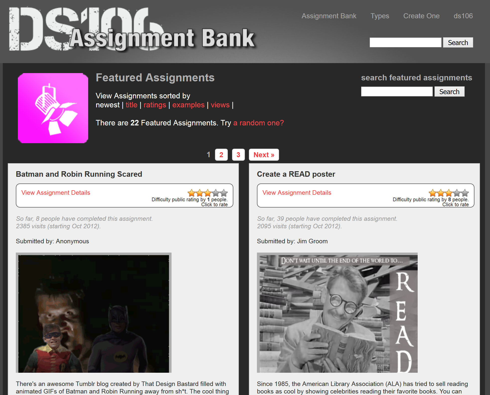

# PLAY

## Mark Sample
Davidson College | Digital Studies | [Website](http://www.samplereality.com)

---

##### Publication Status:
* unreviewed draft
	
---

## Curatorial Statement 

Play is commonly thought to be the domain of children, or of adults engaged in child-like activities—games, performances, and other "not serious" pursuits that stand "outside 'ordinary' life," as the Dutch historian Johan Huizinga put it in his classic study of play (13). Nearly twenty years later the French sociologist Roger Caillois expanded upon Huizinga's theory of play, suggesting that play is defined by six key elements: play is voluntary, separate from other aspects of life, uncertain, unproductive, governed by rules, and simultaneously more or less dependent upon make-believe (9-10). When any one of these elements is violated, play is no longer play. It is work.

Learning, especially in secondary and higher education, is also deemed to be work. It is hard. It is not exactly voluntary. Learning, the thinking goes, requires correct answers, not uncertainty. There is a product—an essay, a project, an assignment—though that product may not necessarily contribute to the world of knowledge in any kind of productive way. Learning in higher education is governed by rules though, however arbitrary and make-believe those rules may be. Course objectives, learning assessments, grading rubrics, and so on. When it comes to the element of rules, learning is not so much the opposite of play as it is zombie play, a jerky, lurching automatic response devoid of vision, passion, and awareness.

A growing number of faculty, instructional designers, and learning professionals are challenging zombie play. They are centering play in the classroom, developing what could be called *playful pedagogy.* Playful pedagogy marks a serious departure from traditional pedagogy, from "serious" pedagogy. Playful pedagogy strives to infuse learning with the excitement and unpredictability of children's play. Playful pedagogy aims to put learners in a flow state—that utterly absorbing state where, as Mihaly Csikszentmihalyi puts it, "nothing else seems to matter" (6).

A comparison between playful pedagogy and serious pedagogy highlights distinctions between the two:

- **Process over product.** Playful pedagogy, like play itself, emphasizes process over product. As a consequence, learning comes to be a series of pathways, different for every student, rather than a straight shot toward a desired destination.   
- **Low stakes over high stakes.** Serious pedagogy is a high stakes pedagogy, high stakes which may in fact limit creative problem-solving. Playful pedagogy rewards risk-taking, and risk-taking itself is an end itself. 
- **Mistakes over Success.** Play abounds with mistakes, failures, and most importantly, second chances. Every "Game Over" is also the start of a new game.
- **Ambiguity over Certainty.** As anyone who has played Euchre knows, once the outcome of a hand of cards is certain, the round is over, even if cards remain to be played. Certainty is the enemy of play, while ambiguity sustains it.  
- **Discovery over Objectives.** With play, curiosity itself is an objective. Furthermore, playful pedagogy allows learners themselves to discover their own objectives—and to change them if need be.
- **Divergent thinking over convergent thinking.** Playful pedagogy recognizes that there is no single correct answer; rather there are always multiple approaches to a problem. In many ways, divergent thinking is similar to the concept of emergent play, a kind of play game designers hope to promote. Emergent play refers to the way creative and unpredictable gameplay emerges from a set of rules. Similarly, playful pedagogy uses rules as constraints that foster creativity, rather than stifle it.

This list of differences is incomplete and meant to be merely suggestive. The artifacts presented here share one or more of these characteristics, and then some. The artifacts are grouped according to several categories of playful pedagogy: 

1. **Interventions.** These pedagogical strategies are the most recognizable, for they begin with conventional pedagogies, but pivot upon an activist or constructivist intervention into that pedagogical principle, taking it into surprising directions. An example of an interventionist strategy is deformance—the deliberate misreading of a text or cultural artifact, such as reading a poem backwards (Samuels). Interventions such as these have a long history, but digital texts and digital tools have made them readily available (Ramsay).

2. **Crafting.** Constructivist pedagogies—in which students create knowledge rather than merely absorb or duplicate knowledge—are nothing new (Paypert? Freire?). What *is* new is the range of tools that make them possible. The term crafting conjures up the core mechanic of games like *Minecraft*, but also signals a connection to pre-digital forms of making and construction. Whether it's called crafting (?), critical making (Ratto), carpentry (Bogost), or hacking (Hacker Ethos), crafting transfers the classical rhetorical values of argumention and persuasion to domains beyond writing and language.

3. **Gaming.** These artifacts represent the most literal meaning of play. The pedagogical value of games and simulations has long been known, but it was James Paul Gee's *What Video Games Have to Teach Us about Learning and Literacy* that raised awareness about gaming's potential as a pedagogical tool. The artifacts in this category either treat games as objects of study in their own right alongside literature, or provide examples of games as pedagogical tools.

## CURATED ARTIFACTS
### Ivanhoe
* Artifact Type: Classroom Game

* Source URL: [http://ivanhoe.scholarslab.org/index.html](http://ivanhoe.scholarslab.org/index.html)
* Creators: Johanna Drucker, Jerome McGann, Bethany Nowviskie, and the Scholars' Lab (University of Virginia)

Ivanhoe began as a turn-based textual game, in which students assume the roles of characters—or possible characters—in a novel or other cultural artifact. Each player makes a "move," describing an action or decision their character makes, and the next player makes a move in response. The original Ivanhoe was Java-based, but that game environment no longer functions. In 2014 the Scholars' Lab at the Uiversity of Virginia released a new version of Ivanhoe as a WordPress theme. One of the unique features of Ivanhoe is that the game doesn't actually require _any_ technology. For an example of digital pedagogy inspiring analog pedagogy, see Jason Jones' low tech adaption in [Teaching Literature with Ivanhoe](http://www.jbj.wordherders.net/2008/06/16/teaching-literature-with-ivanhoe/). Similarly, Chandler Sansing describes using [Ivanhoe](http://texttechnology.mcmaster.ca/pdf/vol12_2_04.pdf) in a middle school classroom.

### How to Not Read a Victorian Novel
* Screenshot: reflection-handmadeweb.png
* Source URL: http://diginole.lib.fsu.edu/cgi/viewcontent.cgi?article=1002&context=eng_faculty_publications
* Creator: Paul Fyfe
* This open access version of "How to Not Read a Victorian Novel" first appeared in the *Journal of Victorian Culture." In it, Fyfe describes an assignment that can be readily adapted for any public domain text. 

### Teaching with Makey Makeys
 
(image courtesy of Flickr user [Pete Prodoehl](https://www.flickr.com/photos/raster/8605560001/in/photolist-e7rKba-e7xosf-e7rGha-e7xjyU-dcthwC-dQ6xWj-dmFMNQ-dQ6CCj-ny4kr7-d25er3-dQ13n6-dsFbNo-dsFbP3-dsFb9N-dsFb5j-dsF2vB-dsfkXn-dsFcY3-dsFcWy-dsFcVo-dsF3Ug-dsF3Te-dsF3RV-dsFcR1-dsFcPQ-dsF3Nr-dsF3Mn-dsFcKN-dsFcJL-dsFcHb-dsF3FZ-dsFcEC-dsFcD1-dsF3Bp-dsFcA3-dsF3yV-dsF3xB-dsF3vZ-dsF3v6-dsFcuo-dsFcsY-dsF3rg-dsF3pP-dsF3oz-dsF3mK-dsF3ki-dsF3je-dsFcjb-dsFchL-dsFcgy)

* Source URL: http://www.slj.com/2015/04/opinion/test-drive/slj-reviews-the-makey-makey-test-drive/
* Creator: Chad Sansing
* A Makey Makey is an inexpensive microcontroller that replaces typical computer inputs (mouse, arrows, keyboard controls) with any object that conducts electricity. YouTube abounds with videos of bananas turned into electronic piano keys, but such experiments only scratch the surface of Makey Makeys. For instance, Makey Makeys can be used to dramatize Donna Haraway's still-important "Cyborg Manifesto" or to create alternative reading interfaces for poetry. In this review Chad Sansing explains why teachers might want to teach literature and the arts using Makey Makeys. Though framed for middle school students, the playful pedagogy highlighted here transfers well to higher education.

### How to make a Twitter Bot with Google Spreadsheets

* Source URL: [http://www.zachwhalen.net/posts/how-to-make-a-twitter-bot-with-google-spreadsheets-version-04](http://www.zachwhalen.net/posts/how-to-make-a-twitter-bot-with-google-spreadsheets-version-04)
* Creator: Zach Whalen (University of Mary Washington) 
* Twitter bots are small autonomous programs that algorithmically generate tweets. Bots are most often associated with spam and online marketing, but they can also be creative endeavors that help us to understand texts, authorship, and originality more deeply. Zach Whalen provides a classroom-ready way for students to create bots, using only Google Spreadsheets. This method is not an introduction to programming so much as an introduction to playful thinking with words.

### Hack for Humanities THATCamp Hackathon

* Source URL: [https://docs.google.com/presentation/d/15t6hjDLGZR_slg-6ztVqDF21buk_1eeUmfqnBTph5VY/pub?start=true&loop=false&delayms=5000#slide=id.p6](https://docs.google.com/presentation/d/15t6hjDLGZR_slg-6ztVqDF21buk_1eeUmfqnBTph5VY/pub?start=true&loop=false&delayms=5000#slide=id.p6)
* Creator: Liss LaFleur (University of North Texas)
* Hackathons are discrete crystallizations of maker culture, and they have become quite common in community makerspaces, coding camps, and so on. The idea is simple: a disparate group of people with varying skills assemble and in the space of a day or weekend, come up with a "hack"—a hastily assembled yet elegant solution to a problem, and not necessarily a digital problem. Liss LaFleur's presentation and guidelines for a "Hack for Humanities" at a THATCamp is both an excellent introduction to the idea of a hackathan and a set of concrete instructions for a specific hackathon theme.

### DS106 Assignment Bank

* Source URL: [http://assignments.ds106.us/](http://assignments.ds106.us/)
* Creator: Jim Groom, Adam Levine, and others (University of Mary Washington)
* DS106 is the longstanding online version of Digital Storytelling 106, an immensely popular online companion to a digital storytelling course at the University of Mary Washington. The DS106 assignment bank is a ready-to-use collection of hundreds of playful assignments that focus on digital fluency and creativity. Assignment types include video mashups, remixes, photo collages, soundscapes, animated GIFs, and much more. The DS106 Assignment Bank should be the first place to look for innovative new media assignments, as well as illustrative examples of completed student work. 

### Games in the Classroom
* Screenshot: activities-gamesinclassroom.png
* Source URLs: http://chronicle.com/blogs/profhacker/games-in-the-classroom-part-1/35596, http://chronicle.com/blogs/profhacker/games-in-the-classroom-part-2/36075, http://chronicle.com/blogs/profhacker/games-in-the-classroom-part-3/36217, http://chronicle.com/blogs/profhacker/games-in-the-classroom-part-4/36294
* Creator: Anastasia Salter (University of Central Florida)
* Games in the Classroom is a series of blog posts by Anastasia Salter on Profhacker. The four posts range from teaching with digital games to designing paper prototypes.

### Student Work James Brown class
* http://courses.jamesjbrownjr.net/blowntobitsgames

### How to Make Games with Twine
Easily adapted to a literature classroom.
http://www.auntiepixelante.com/twine/
Anna Anthropy

### Thoughts on Teaching Literature and Games
* Screenshot: reflection-thoughtsonteachinggames.png
* Source URL: http://www.hastac.org/blogs/amanda-phillips/thoughts-teaching-literature-and-gaming
* Amanda Phillips (University of California-Davis)
* Thoughts on Teaching Literature and Games is also a model of reflective thinking about teaching. Phillips conducts--to use a term from game development--a post-mortem on her course, dissecting what went wrong, what went right, and what she might change in the future. Readers (and players) can see for themselves the changes between the [2010 version](https://gamertrouble.wordpress.com/courses/engl165lg.blogspot.com) of the class and the [2012 version](http://engl165lg.wordpress.com/). Also of interest is the comment thread following the blog post. 

## Related Materials

Davies, Russell. “Playful.” http://russelldavies.typepad.com/planning/2009/11/playful.html. 9 Nov. 2009. Web. 5 May 2010.

Flanagan, Mary. *Critical Play: Radical Game Design.* Cambridge, Mass: MIT Press, 2009. Print.

Ramsay, Stephen. “The Hermeneutics of Screwing Around; Or, What You Do with a Million Books.” *Pastplay: Teaching and Learning History with Technology.* Ed. Kevin Kee. Ann Arbor: University of Michigan Press, 2014. 111–120. Print. Digital Humanities.

Salen, Katie, and Zimmerman Eric. *The Game Design Reader: A Rules of Play Anthology.* Cambridge, Mass.: MIT Press, 2006. Print.

Sawyer, R. Keith. *Explaining Creativity: The Science of Human Innovation.* Oxford University Press, USA, 2011. Print.

## Works Cited

Bogost, Ian. *Alien Phenomenology, Or, What It’s Like to Be a Thing.* Minneapolis: University of Minnesota Press, 2012. Print.

Caillois, Roger. *Man, Play, and Games.* Trans. Meyer Barash. New York: The Free Press, 2003. Print.

Drucker, Johanna, Jerome McGann, Bethany Nowviskie, and the Scholars' Lab. *Ivanhoe*. Charlottesville, VA, 2014.

Gee, James Paul Gee. *What Video Games Have to Teach Us About Learning and Literacy*

Huizinga, Johan. *Homo Ludens: A Study of the Play-Element in Culture.* London: Routledge and Kegan Paul, 1949. Print.

Csikszentmihalyi, Mihaly. Flow. Harper Collins, 2009. Print.

Pope, Rob. *Textual Intervention: Critical and Creative Strategies for Literary Studies.*

Ramsay, Stephen. *Reading Machines: Toward and Algorithmic Criticism.* University of Illinois Press, 2011. Print.

Ratto, Matt. “Critical Making: Conceptual and Material Studies in Technology and Social Life.” *The Information Society* 27.4 (2011): 252–260. Web.

Samuels, Lisa, and Jerome McGann. "Deformance and Interpretation." *New Literary History* 30.1 (1999): 25–56. Print.