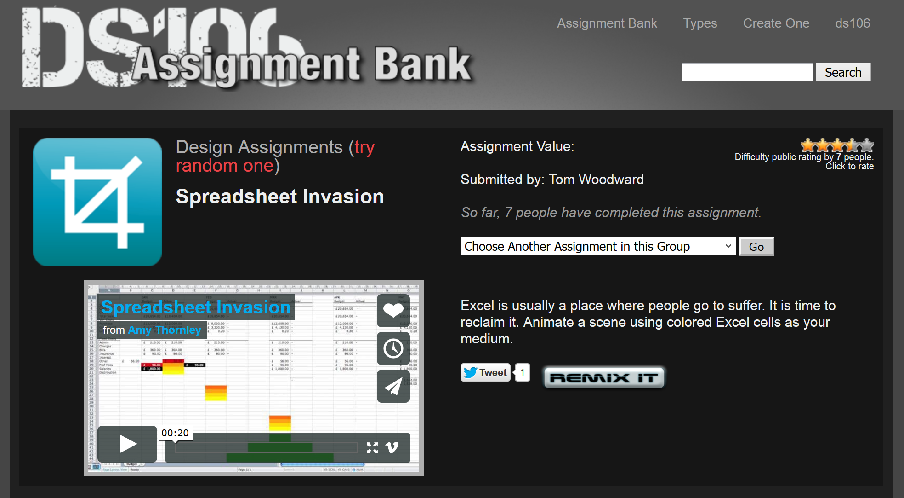
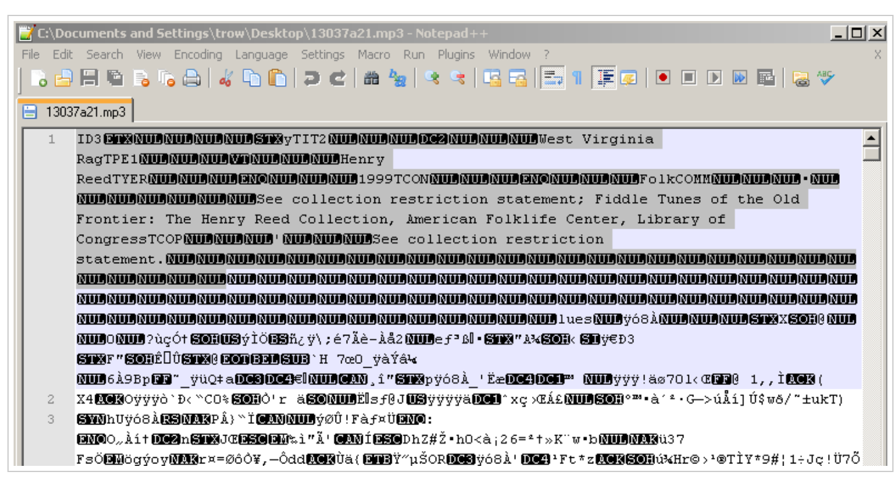
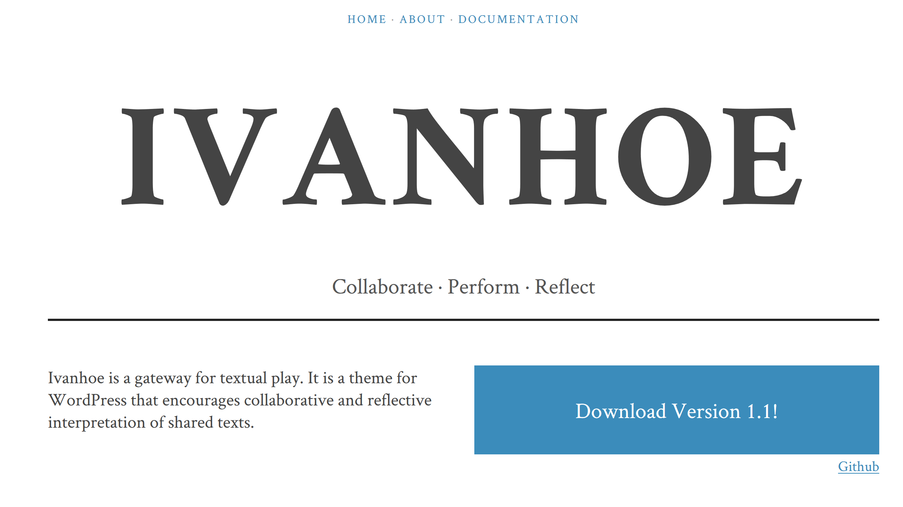
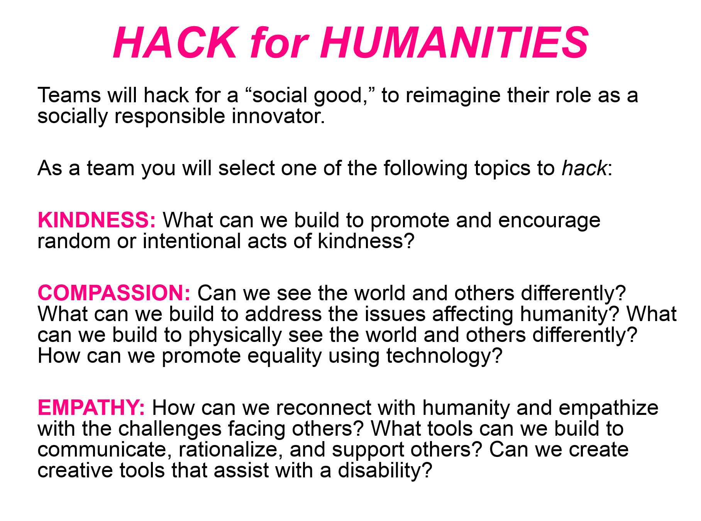
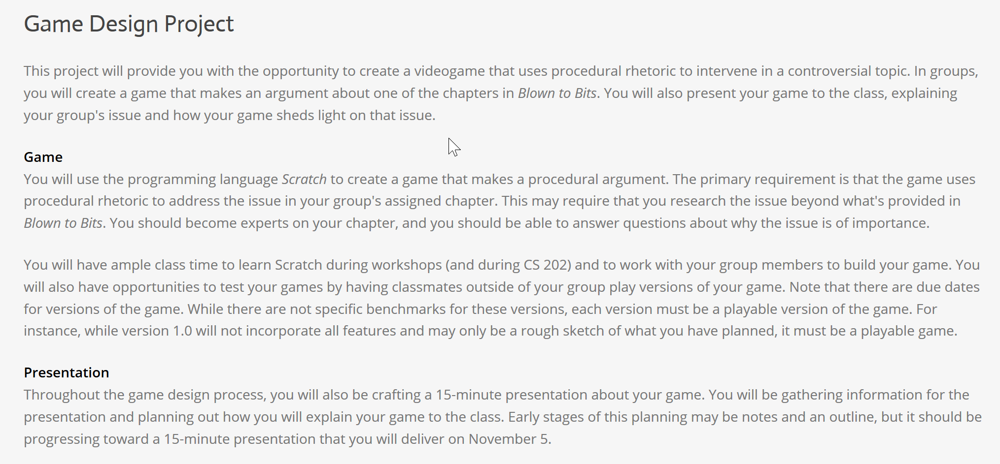
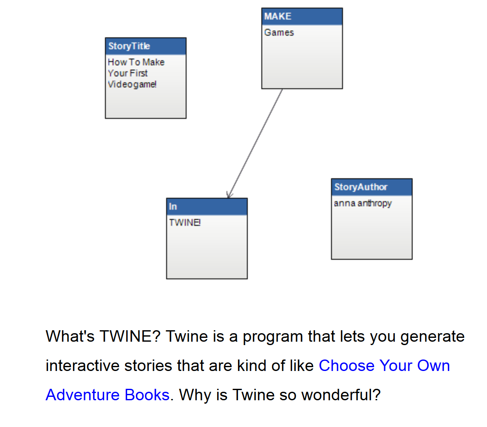
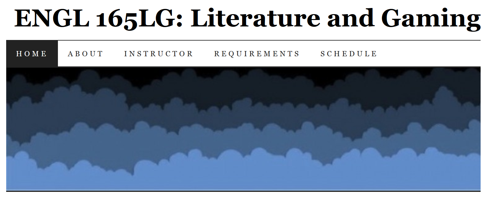
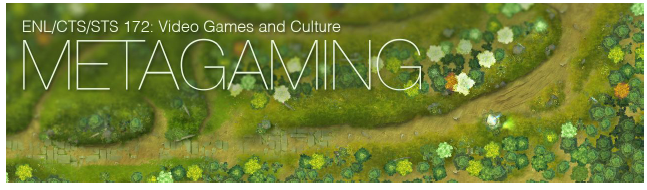

# PLAY (Draft)

## AUTHOR: Mark Sample
Davidson College | Digital Studies | [Website](http://www.samplereality.com)

---

##### Publication Status:
* unreviewed draft
* draft version undergoing editorial review
* **draft version undergoing peer-to-peer review https://digitalpedagogy.commons.mla.org/**
* published 
	
---

## CURATORIAL STATEMENT

Play is commonly thought to be the domain of children, or of adults engaged in child-like activities—games, performances, and other "not serious" pursuits that stand "outside 'ordinary' life," as the Dutch historian Johan Huizinga put it in his classic study of play (13). Nearly twenty years later the French sociologist Roger Caillois expanded upon Huizinga's theory of play, suggesting that play is defined by six key elements: play is voluntary, separate from other aspects of life, uncertain, unproductive, governed by rules, and simultaneously more or less dependent upon make-believe (9-10). When any one of these elements is violated, play is no longer play. It is work.

Learning, especially in secondary and higher education, is also deemed to be work. It is hard. It is not exactly voluntary. Learning, the thinking goes, requires correct answers, not uncertainty. There is a product—an essay, a project, an assignment—though that product may not necessarily contribute to the world of knowledge in any kind of productive way. Learning in higher education is governed by rules though, however arbitrary and make-believe those rules may be. Course objectives, learning assessments, grading rubrics, and so on. When it comes to the element of rules, learning is not so much the opposite of play as it is zombie play, a jerky, lurching automatic response devoid of vision, passion, and awareness.

A growing number of faculty, instructional designers, and learning professionals are challenging zombie play. They are centering play in the classroom, developing what could be called *playful pedagogy.* Playful pedagogy marks a serious departure from traditional pedagogy, from "serious" pedagogy. Playful pedagogy strives to infuse learning with the excitement and unpredictability of children's play. Playful pedagogy aims to put learners in a flow state—that utterly absorbing state where, as Mihaly Csikszentmihalyi puts it, "nothing else seems to matter" (6).

A comparison between playful pedagogy and serious pedagogy highlights distinctions between the two:

- **Process over product.** Playful pedagogy, like play itself, emphasizes process over product. As a consequence, learning comes to be a series of pathways, different for every student, rather than a straight shot toward a desired destination.   
- **Low stakes over high stakes.** Serious pedagogy is a high stakes pedagogy, high stakes which may in fact limit creative problem-solving. Playful pedagogy rewards risk-taking, and risk-taking itself is an end itself. 
- **Mistakes over Success.** Play abounds with mistakes, failures, and most importantly, second chances. Every "Game Over" is also the start of a new game.
- **Ambiguity over Certainty.** As anyone who has played Euchre knows, once the outcome of a hand of cards is certain, the round is over, even if cards remain to be played. Certainty is the enemy of play, while ambiguity sustains it.  
- **Discovery over Objectives.** With play, curiosity itself is an objective. Furthermore, playful pedagogy allows learners themselves to discover their own objectives—and to change them if need be.
- **Divergent thinking over convergent thinking.** Playful pedagogy recognizes that there is no single correct answer; rather there are always multiple approaches to a problem. In many ways, divergent thinking is similar to the concept of emergent play, a kind of play game designers hope to promote. Emergent play refers to the way creative and unpredictable gameplay emerges from a set of rules. Similarly, playful pedagogy uses rules as constraints that foster creativity, rather than stifle it.

This list of differences is incomplete and meant to be merely suggestive. The artifacts presented here share one or more of these characteristics, and then some. The artifacts are grouped according to several categories of playful pedagogy: 

1. **Interventions.** These pedagogical strategies are the most recognizable, for they begin with conventional pedagogies, but pivot upon an activist or constructivist intervention into that pedagogical principle, taking it into surprising directions. An example of an interventionist strategy is deformance—the deliberate misreading of a text or cultural artifact, such as reading a poem backwards (Samuels and McGann 29). Interventions such as these have a long history, but digital texts and digital tools have made them readily available (Ramsay).

2. **Crafting.** Approaches to learning in which students create knowledge rather than merely absorb or duplicate knowledge have a history stretching back to Dewey (Richardson 1637). Constructivist pedagogies are nothing new. What *is* new is the range of tools that make them possible. The term crafting conjures up the core mechanic of games like *Minecraft*, but also signals a connection to pre-digital forms of making and construction. Whether it's called crafting (Sennett 280), critical making (Ratto), carpentry (Bogost), or hacking (Hacker Ethos), crafting transfers the classical rhetorical values of argumentation and persuasion to domains beyond writing and language.

3. **Gaming.** These artifacts represent the most literal meaning of play. The pedagogical value of games and simulations has long been known, but it was James Paul Gee's *What Video Games Have to Teach Us about Learning and Literacy* that raised awareness about gaming's potential as a pedagogical tool. The artifacts in this category either treat games as objects of study in their own right alongside literature, or provide examples of games as pedagogical tools.

## CURATED ARTIFACTS

## Interventions

### Spreadsheet Invasion
* Artifact Type: Assignment

* Source URL: [http://assignments.ds106.us/assignments/spreadsheet-invasion/](http://assignments.ds106.us/assignments/spreadsheet-invasion/)
* Creator: Tom Woodward

The "Spreadsheet Invasion" is a playful intervention into the software conceit of productivity. This assignment asks students to animate cells in Excel, turning Microsoft Office into a playground. An inspiration for the more generalized [Software Invasion](http://sites.davidson.edu/hacking/course-guidelines/hack-2-software-invasion/) assignment, the spreadsheet assignment is part of DS106, an immensely popular online companion to a digital storytelling course at the University of Mary Washington. The [DS106 assignment bank](http://assignments.ds106.us/) is a ready-to-use collection of hundreds of other assignments that similarly demand critical and creative interventions into digital media. Assignment types include video mashups, remixes, photo collages, soundscapes, animated GIFs, and much more. The DS106 Assignment Bank should be the first place to look for innovative new media assignments, as well as illustrative examples of completed student work. 

### Glitching Files for Understanding
* Artifact Type: Tutorial

* Source URL: [http://blogs.loc.gov/digitalpreservation/2012/11/glitching-files-for-understanding-avoiding-screen-essentialism-in-three-easy-steps/](http://blogs.loc.gov/digitalpreservation/2012/11/glitching-files-for-understanding-avoiding-screen-essentialism-in-three-easy-steps/)
* Creator: [Trevor Owens](www.trevorowens.org/) (Institute of Museum and Library Services)

Written while Owens was a digital archivist at the Library of Congress, this tutorial introduces the idea of glitching—intentionally corrupting a digital artifact—as a kind of playful deformance. Such intrusive digital interventions can serve a forensics purpose by exposing underlying metadata, but they can also defamiliarize the digital media in question. Owens walks through the glitching of music and image files. This process could be easily expanded to include other media types, including audiobooks, PDFs, and EPUBs, all very much of interest in a literature classroom.

### Ivanhoe
* Artifact Type: Classroom Game

* Source URL: [http://ivanhoe.scholarslab.org/index.html](http://ivanhoe.scholarslab.org/index.html)
* Creators: Johanna Drucker, Jerome McGann, Bethany Nowviskie, and the Scholars' Lab (University of Virginia)

Ivanhoe began as a turn-based game of textual interventions, in which students assume the roles of  existing characters—or new characters—in a novel or other cultural artifact. Each player makes a "move," describing an action or decision their character makes, and the next player makes a move in response. The students thus actively intervene in the original text, rewriting it in unexpected ways. The original Ivanhoe was Java-based, but that game environment no longer functions. In 2014 the Scholars' Lab at the University of Virginia released a new version of Ivanhoe as a WordPress theme. One of the unique features of Ivanhoe is that the game doesn't actually require _any_ technology. For an example of digital pedagogy inspiring analog pedagogy, see Jason Jones' low tech adaption in [Teaching Literature with Ivanhoe](http://www.jbj.wordherders.net/2008/06/16/teaching-literature-with-ivanhoe/). Similarly, Chandler Sansing describes using [Ivanhoe](http://texttechnology.mcmaster.ca/pdf/vol12_2_04.pdf) in a middle school classroom. 

## Crafting

### Hack for Humanities THATCamp Hackathon
* Artifact Type: Collaborative Project

* Source URL: [https://docs.google.com/presentation/d/15t6hjDLGZR_slg-6ztVqDF21buk_1eeUmfqnBTph5VY/pub?start=true&loop=false&delayms=5000#slide=id.p3](https://docs.google.com/presentation/d/15t6hjDLGZR_slg-6ztVqDF21buk_1eeUmfqnBTph5VY/pub?start=true&loop=false&delayms=5000#slide=id.p3)
* Creator: Liss LaFleur (University of North Texas)

Hackathons are discrete crystallizations of maker culture, and they have become quite common in community makerspaces, coding camps, and so on. The idea is simple: a disparate group of people with varying skills assemble and in the space of a day or weekend, come up with a "hack"—a hastily assembled yet elegant solution to a problem, and not necessarily a digital problem. Liss LaFleur's presentation and guidelines for a "Hack for Humanities" at a THATCamp is both an excellent introduction to the idea of a hackathon and a set of concrete instructions for a specific hackathon theme. In "Hack for Humanities," students must craft an innovation that augments our kindness, compassion, or empathy, thereby using technology to make an argument about social justice.

### How to make a Twitter Bot with Google Spreadsheets
* Artifact Type: Classroom Activity

* Source URL: [http://www.zachwhalen.net/posts/how-to-make-a-twitter-bot-with-google-spreadsheets-version-04](http://www.zachwhalen.net/posts/how-to-make-a-twitter-bot-with-google-spreadsheets-version-04)
* Creator: Zach Whalen (University of Mary Washington) 

Twitter bots are small autonomous programs that algorithmically generate tweets. Bots are most often associated with spam and online marketing, but they can also be creative endeavors that help understand texts, authorship, and originality more deeply. Zach Whalen provides a classroom-ready way for students to create bots, using only Google Spreadsheets. This method is not an introduction to programming so much as an introduction to playful thinking with words. Crafting is often associated with *things*, but disassembling and reassembling language through computer models reveals that crafting can also be performed with *words*. What is writing, after all, but a craft? Building a bot reveals the seams and stitches of that craft.

### Teaching with Makey Makeys
* Artifact Type: Classroom Activity

(image courtesy of Flickr user [Pete Prodoehl](https://www.flickr.com/photos/raster/8605560001/in/photolist-e7rKba-e7xosf-e7rGha-e7xjyU-dcthwC-dQ6xWj-dmFMNQ-dQ6CCj-ny4kr7-d25er3-dQ13n6-dsFbNo-dsFbP3-dsFb9N-dsFb5j-dsF2vB-dsfkXn-dsFcY3-dsFcWy-dsFcVo-dsF3Ug-dsF3Te-dsF3RV-dsFcR1-dsFcPQ-dsF3Nr-dsF3Mn-dsFcKN-dsFcJL-dsFcHb-dsF3FZ-dsFcEC-dsFcD1-dsF3Bp-dsFcA3-dsF3yV-dsF3xB-dsF3vZ-dsF3v6-dsFcuo-dsFcsY-dsF3rg-dsF3pP-dsF3oz-dsF3mK-dsF3ki-dsF3je-dsFcjb-dsFchL-dsFcgy)

* Source URL: [http://www.slj.com/2015/04/opinion/test-drive/slj-reviews-the-makey-makey-test-drive/](http://www.slj.com/2015/04/opinion/test-drive/slj-reviews-the-makey-makey-test-drive/)
* Creator: Chad Sansing (Mozilla Foundation)

A Makey Makey is an inexpensive microcontroller that replaces typical computer inputs (mouse, arrows, keyboard controls) with any object that conducts electricity. YouTube abounds with videos of bananas turned into electronic piano keys, but such experiments only scratch the surface of Makey Makeys. For instance, Makey Makeys can be used to dramatize Donna Haraway's still-important "Cyborg Manifesto" or to create alternative reading interfaces for poetry. In this article Chad Sansing explains why teachers might want to teach literature and the arts using Makey Makeys. Though framed for middle school students, the playful pedagogy highlighted here transfers well to higher education. In particular, Makey Makeys emphasize discovery and divergent thinking; working with these devices thrusts students into such unfamiliar territory, they have no choice but to approach problems from new perspectives.

## Gaming

### Game Design Project
* Artifact Type: Assignment

* Source URL: [http://courses.jamesjbrownjr.net/node/3372](http://courses.jamesjbrownjr.net/node/3372)
* Creator: James Brown, Jr. (Rutgers Camden)

In a class called "Writing and Coding," undergraduate students must design a game that makes a procedural argument about the book *Blown to Bits* (2008). The assignment builds on Ian Bogost's  concept of procedural rhetoric, the implicit or explicit argument a computer model makes about the world. Rather than using words like a book, or images like a film, a game "makes a claim about how something works by modeling its processes" (Bogost 2009). Brown's assignment highlights the way an easy-to-use game design platform (Scratch, in this case) can be used to represent and complicate historical and cultural concepts. Brown has also shared some examples of [student work](http://courses.jamesjbrownjr.net/blowntobitsgames) from this assignment.

### How to Make Games with Twine
* Artifact Type: Tutorial

* Source URL: [http://www.auntiepixelante.com/twine/](http://www.auntiepixelante.com/twine/)
* Creator: Anna Anthropy (Independent Game Designer)

Anthropy's book *Rise of the Videogame Zinesters* (2012) launched what has come to be known as the "Twine Revolution" (Ellison 2013), in which indie game designers have used the open source platform [Twine](http://twinery.org/) to create personally expressive and politically powerful hybrids of games and narrative. Twine is increasingly being used as a writing platform in literature and composition classrooms, and this introduction to Twine by Anthropy is a good place for students to begin. Anthropy explains the Twine interface, walks through the writing and linking mechanisms, and details the publishing process. Anthropy also highlights more advanced features, such as using images and variables. The latest version of Twine (2.x) runs entirely within a web browser, making the game design platform even more accessible to students.

### Literature and Gaming
* Artifact Type: Syllabus

* Source URL: [http://engl165lg.wordpress.com/](http://engl165lg.wordpress.com/)
* Creator: Amanda Phillips (University of California-Davis)

Literature and Gaming is an undergraduate course at UC-Davis taught by Dr. Amanda Phillips. This syllabus makes connections between print-based narratives and video game-based narratives, explicitly questioning assumptions about the differences between the two. In particular, the students explore the five categories of play, narrative, space, time, and avatar across both media.  

### Metagames
* Artifact Type: Syllabus

* Source URL: [http://stephanieboluk.com/teaching/HMS540F13/blog/?page_id=2](http://stephanieboluk.com/teaching/HMS540F13/blog/?page_id=2)
* Creator: Stephanie Boluk (University of California-Davis)

Metagames is a course about games about games. While metafiction is a staple of postmodern literature, it is less common to think about  videogames—and by extension, play—in these terms. Boluk's syllabus provides a theoretical frame for thinking about play in unfamiliar contexts, including the practices and counter-practices of play. The [reading schedule](http://stephanieboluk.com/teaching/HMS540F13/blog/?page_id=2) for Metagames calls attention to the playfullest of playful games, including avant-garde videogames, art videogames, and what Boluk calls "eccentric" games. A PDF version of [the syllabus](http://stephanieboluk.com/teaching/HMS540F13/docs/HMS540-Metagames_Syllabus.pdf) is also available.

## Related Materials

Davies, Russell. “Playful.” 9 Nov. 2009. Web. 5 May 2010. <[http://russelldavies.typepad.com/planning/2009/11/playful.html](http://russelldavies.typepad.com/planning/2009/11/playful.html)>.

Kee, Kevin, ed. *Pastplay: Teaching and Learning History with Technology.* Digital Culture Books. Ann Arbor: University of Michigan Press, 2014. Web. <[http://quod.lib.umich.edu/cgi/t/text/text-idx?cc=dh;c=dh;idno=12544152.0001.001;rgn=full%20text;view=toc;xc=1;g=dculture](http://quod.lib.umich.edu/cgi/t/text/text-idx?cc=dh;c=dh;idno=12544152.0001.001;rgn=full%20text;view=toc;xc=1;g=dculture)>.

Flanagan, Mary. *Critical Play: Radical Game Design.* Cambridge, Mass: MIT Press, 2009. Print.

PBS Digital Studios. *The Art of Glitch.* Off Book. 2012. Film. 1 Sept. 2015. <[https://youtu.be/gr0yiOyvas4](https://youtu.be/gr0yiOyvas4)>.

Phillips, Amanda. "Thoughts on Teaching Literature and Gaming." HASTAC. 20 Oct. 2010. Web. 1 Oct. 2015. [https://www.hastac.org/blogs/amanda-phillips/2010/10/20/thoughts-teaching-literature-and-gaming](https://www.hastac.org/blogs/amanda-phillips/2010/10/20/thoughts-teaching-literature-and-gaming).

Salen, Katie, and Eric Zimmerman. *Rules of Play: Game Design Fundamentals*. Cambridge, Mass.: MIT Press, 2004. Print.

Salen, Katie, and Eric Zimmerman. *The Game Design Reader: A Rules of Play Anthology.* Cambridge, Mass.: MIT Press, 2006. Print.

Salter, Anastasia Salter. "Games in the Classroom." *Profhacker.* 2011. Web. 1 Aug. 2015. <[http://chronicle.com/blogs/profhacker/games-in-the-classroom-part-1/35596](http://chronicle.com/blogs/profhacker/games-in-the-classroom-part-1/35596)>, <[http://chronicle.com/blogs/profhacker/games-in-the-classroom-part-2/36075](http://chronicle.com/blogs/profhacker/games-in-the-classroom-part-2/36075)>, <[http://chronicle.com/blogs/profhacker/games-in-the-classroom-part-3/36217](http://chronicle.com/blogs/profhacker/games-in-the-classroom-part-3/36217)>, <[http://chronicle.com/blogs/profhacker/games-in-the-classroom-part-4/36294](http://chronicle.com/blogs/profhacker/games-in-the-classroom-part-4/36294)>.

Sawyer, R. Keith. *Explaining Creativity: The Science of Human Innovation.* Oxford University Press, USA, 2011. Print.

Sheldon, Lee. "Gaming the Classroom Syllabus." Indiana University, Bloomington. 2010. Web. 1 Aug. 2015. <[https://gamingtheclassroom.wordpress.com/syllabus/](https://gamingtheclassroom.wordpress.com/syllabus/)>.

## Works Cited

Abelson, Hal, Ken Ledeen, and Harry Lewis. *Blown to Bits: Your Life, Liberty, and Happiness After the Digital Explosion*. Upper Saddle River, NJ: Addison-Wesley, 2008. Print.

Anthropy, Anna. *Rise of the Videogame Zinesters: How Freaks, Normals, Amateurs, Artists, Dreamers, Dropouts, Queers, Housewives, and People Like You Are Taking Back an Art Form.* New York: Seven Stories Press, 2012. Print.

Anthropy, Anna. "How to Make Games with Twine." auntiepixelante.com. Web. 1 Oct. 2015. <[http://www.auntiepixelante.com/twine/](http://www.auntiepixelante.com/twine/)>.

Bogost, Ian. "The Proceduralist Style." Gamasutra. 21 Jan. 2009. Web. 1 Feb. 2009.

Bogost, Ian. *Alien Phenomenology, Or, What It’s Like to Be a Thing.* Minneapolis: University of Minnesota Press, 2012. Print.

Boluk, Stephanie. "Metagames: Games about Games and the Practice of Play." HMS 540, Pratt Institute. 2013. Web. 1 Aug. 2015.

Brown, James, Jr. "Game Design Project." Inter-L&S 102: Writing and Coding. 2012. Web. 1 Aug. 2015. <[http://courses.jamesjbrownjr.net/node/3372](http://courses.jamesjbrownjr.net/node/3372)>.

Caillois, Roger. *Man, Play, and Games.* Trans. Meyer Barash. New York: The Free Press, 2003. Print.

Csikszentmihalyi, Mihaly. *Flow.* Harper Collins, 2009. Print.

Davies, Russell. “Playful.” 9 Nov. 2009. Web. 5 May 2010. <[http://russelldavies.typepad.com/planning/2009/11/playful.html](http://russelldavies.typepad.com/planning/2009/11/playful.html)>.

Drucker, Johanna, Jerome McGann, Bethany Nowviskie, and the Scholars' Lab. *Ivanhoe*. Charlottesville, VA, 2014.

Ellison, Cara. "Anna Anthropy and the Twine Revolution." *The Guardian* 10 Apr. 2013. Web. 11 Oct. 2015.

Flanagan, Mary. *Critical Play: Radical Game Design.* Cambridge, Mass: MIT Press, 2009. Print.

Gee, James Paul. *What Video Games Have to Teach Us About Learning and Literacy.* 2nd ed. New York: Macmillan, 2003. Print.

Haraway, Donna. "A Cyborg Manifesto." *Simians, Cyborgs, and Women: The Reinvention of Nature*. New York, NY: Routledge, 1991. 149–182. Print.

Huizinga, Johan. *Homo Ludens: A Study of the Play-Element in Culture.* London: Routledge and Kegan Paul, 1949. Print.

Kee, Kevin, ed. *Pastplay: Teaching and Learning History with Technology.* Digital Culture Books. Ann Arbor: University of Michigan Press, 2014. Web. <[http://quod.lib.umich.edu/cgi/t/text/text-idx?cc=dh;c=dh;idno=12544152.0001.001;rgn=full%20text;view=toc;xc=1;g=dculture](http://quod.lib.umich.edu/cgi/t/text/text-idx?cc=dh;c=dh;idno=12544152.0001.001;rgn=full%20text;view=toc;xc=1;g=dculture)>.

LaFleur, Liss. "Hack for Humanities." THATCamp Piedmont. 2014. Web. 1 Aug. 2015. <[https://docs.google.com/presentation/d/15t6hjDLGZR_slg-6ztVqDF21buk_1eeUmfqnBTph5VY/pub?start=true&loop=false&delayms=5000#slide=id.p3](https://docs.google.com/presentation/d/15t6hjDLGZR_slg-6ztVqDF21buk_1eeUmfqnBTph5VY/pub?start=true&loop=false&delayms=5000#slide=id.p3)>.

Owens, Trevor. "Glitching Files for Understanding: Avoiding Screen Essentialism in Three Easy Steps." The Signal. 5 Nov. 2012. Web. 11 Oct. 2015. <[http://blogs.loc.gov/digitalpreservation/2012/11/glitching-files-for-understanding-avoiding-screen-essentialism-in-three-easy-steps/](http://blogs.loc.gov/digitalpreservation/2012/11/glitching-files-for-understanding-avoiding-screen-essentialism-in-three-easy-steps/)>.

Phillips, Amanda. "ENGL 165LG: Literature and Gaming." 2012. Web. 1 Aug. 2015. <[http://engl165lg.wordpress.com/](http://engl165lg.wordpress.com/)>.

Phillips, Amanda. "Thoughts on Teaching Literature and Gaming." HASTAC. 20 Oct. 2010. Web. 1 Oct. 2015. [https://www.hastac.org/blogs/amanda-phillips/2010/10/20/thoughts-teaching-literature-and-gaming](https://www.hastac.org/blogs/amanda-phillips/2010/10/20/thoughts-teaching-literature-and-gaming).

PBS Digital Studios. *The Art of Glitch.* Off Book. 2012. Film. 1 Sept. 2015. <[https://youtu.be/gr0yiOyvas4](https://youtu.be/gr0yiOyvas4)>.

Pope, Rob. *Textual Intervention: Critical and Creative Strategies for Literary Studies.* London: Routledge, 1994. Print.

Ramsay, Stephen. *Reading Machines: Toward and Algorithmic Criticism.* University of Illinois Press, 2011. Print.

Ratto, Matt. “Critical Making: Conceptual and Material Studies in Technology and Social Life.” *The Information Society* 27.4 (2011): 252–260. Web.

Richardson, Virginia. "Constructivist Pedagogy." *The Teachers College Record* 105.9 (2003): 1623–1640. Print.

Salen, Katie, and Eric Zimmerman. *Rules of Play: Game Design Fundamentals*. Cambridge, Mass.: MIT Press, 2004. Print.

Salen, Katie, and Eric Zimmerman. *The Game Design Reader: A Rules of Play Anthology.* Cambridge, Mass.: MIT Press, 2006. Print.

Salter, Anastasia Salter. "Games in the Classroom." *Profhacker.* 2011. Web. 1 Aug. 2015. <[http://chronicle.com/blogs/profhacker/games-in-the-classroom-part-1/35596](http://chronicle.com/blogs/profhacker/games-in-the-classroom-part-1/35596)>, <[http://chronicle.com/blogs/profhacker/games-in-the-classroom-part-2/36075](http://chronicle.com/blogs/profhacker/games-in-the-classroom-part-2/36075)>, <[http://chronicle.com/blogs/profhacker/games-in-the-classroom-part-3/36217](http://chronicle.com/blogs/profhacker/games-in-the-classroom-part-3/36217)>, <[http://chronicle.com/blogs/profhacker/games-in-the-classroom-part-4/36294](http://chronicle.com/blogs/profhacker/games-in-the-classroom-part-4/36294)>.

Samuels, Lisa, and Jerome McGann. "Deformance and Interpretation." *New Literary History* 30.1 (1999): 25–56. Print.

Sansing, Chad. “SLJ Reviews the MaKey MaKey.” *School Library Journal.* 17 Apr. 2015. Web. 31 July 2015. <[http://www.slj.com/2015/04/opinion/test-drive/slj-reviews-the-makey-makey-test-drive/](http://www.slj.com/2015/04/opinion/test-drive/slj-reviews-the-makey-makey-test-drive/)>.

Sawyer, R. Keith. *Explaining Creativity: The Science of Human Innovation.* Oxford University Press, USA, 2011. Print.

Scholars' Lab. *Ivanhoe*. University of Virginia. 2014. Web. 1 Aug. 2015. <[http://ivanhoe.scholarslab.org/index.html](http://ivanhoe.scholarslab.org/index.html)>.

Sennett, Richard. *The Craftsman.* New Haven: Yale University Press, 2008. Print.

Sheldon, Lee. "Gaming the Classroom Syllabus." Indiana University, Bloomington. 2010. Web. 1 Aug. 2015. <[https://gamingtheclassroom.wordpress.com/syllabus/](https://gamingtheclassroom.wordpress.com/syllabus/)>.

Woodward, Tom. "Spreadsheet Invasion." DS106 Assignment Bank. Web. 1 Oct. 2015. <[http://assignments.ds106.us/assignments/spreadsheet-invasion/](http://assignments.ds106.us/assignments/spreadsheet-invasion/)>.

Whalen, Zach. "How to Make a Twitter Bot with Google Spreadsheets (Version 0.4)." zachwhalen.net. 17 May 2015. Web. 1 Aug. 2015. <[http://www.zachwhalen.net/posts/how-to-make-a-twitter-bot-with-google-spreadsheets-version-04/](http://www.zachwhalen.net/posts/how-to-make-a-twitter-bot-with-google-spreadsheets-version-04/)>.
