# Poetry (Draft)

## Chuck Rybak
Associate Professor, UW-Green Bay | http://chuckrybak.com

---

##### Publication Status:

* unreviewed draft
* draft version undergoing editorial review
* **draft version undergoing peer-to-peer review**
* published

--- 
 
## CURATORIAL STATEMENT (roughly 750-800 words, MLA Format)

To talk about poetry and pedagogy is a task fraught with complication from the start. Do we mean to explore how we read, construct, and teach interpretations of poetry? Or are we interested in the pedagogy of the creative process: the writing and composition itself? Do we mean both? In the academy's recent history, these concerns are usually separated into "literature" versus "creative writing" curriculum and programs. Yet, digital pedagogy in the humanities presents us with fresh opportunities to reexamine our boundaries, and this collection of artifacts should be considered the result of such reflection. 

The selected resources intersect with traditional pedagogical concerns as applied to poetry, while also serving as a bridge to the new, often serendipitous opportunities offered by technology. The four categories that organize these artifacts are fluid rather than firm, and the rhetorical lens is one that highlights pedagogy rather than defines it. All of the artifacts represent, in a sense, digital tools, and all involve coding that is either foregrounded or backgrounded. The vital question for teachers of poetry is how to rhetorically assess digital tools so that learning and inquiry eclipse the bright lights of the technology employed. The "Digital Tools" category is constructed around the bedrock pedagogical concern of close reading; some included artifacts sometimes cast a wide net of possibility, while others prioritize specific teaching outcomes, such as understanding rhythm and meter. The "Creative Writing" category intersects with the traditional pedagogy of creation in ways that often prove messy and antithetical (automated, computer-generated poetry?), but offers students fresh entry points into interpreting the algorithmic as creative. 

"Decoding and Encoding" is the most protean category, used here to capture forms of "long-game pedagogy," meaning tools and modes of critical investigation that stretch far beyond established notions of the "assignment" or "class period." The fields of study described in this section--topic modeling and the Text Encoding Initiative (TEI)--are areas of knowledge and pedagogy that extend from an existing and significant foundation of technical expertise. And the included works, in light of these prerequisites, include deep pedagogical discussion in equal weight with research concerns; the result is not only new areas of knowledge, but new ways of writing about teaching and learning. 

The final category, "Pedagogical History," is both a coming attraction and symbolic of this project: it offers digital access to the history of poetry pedagogy, archiving the reality that pedagogy, as illustrated by the resources collected here, is always in flux, always evolving, reminding us to examine our questions against our cultural moments. 

Some questions relevant to our current poetic moment might include: What does it mean to read poems in the time of distant and mass-corpus reading? What does it mean to write poems as, and alongside, algorithmic authors? And on a more basic but no less important level, how can one incorporate digital tools to better teach traditional poetic concerns with sound pedagogy as its main support? Furthermore, for the creative writing teacher, what will it mean to do "in-class writing" or hold meetings in lab or virtual environments? The included artifacts invite teachers and students to reimagine contexts in which teaching and learning have traditionally occurred, especially in ways far more sophisticated than simple "online vs. face-to-face" distinctions. 

As a whole, these digital tools, methods, and pedagogical approaches are essential for contemporary students of the humanities, including those who study and/or create poetry in academic settings. Though one could argue that students of poetry will rarely find such an opportunity to acquire marketable skills (and this is no doubt true), it is also worth arguing that the tools, projects, and pedagogy represented in these artifacts have significantly expanded the field of poetic inquiry and creation. This expanded potential means, for teachers and students alike, that we study in a time where we can ask questions of poetry that we could not previously, we can author poetry with new media and methodology, and we can reflect on what these new experiences with poetry--the great human song--reveal about a humanity increasingly defined by digital experiences. Poetry is a formal enterprise, and those forms have been evolving for centuries. We have new forms before us. We need new pedagogies to match. 

## CURATED ARTIFACTS

## Digital Tools

### "Distant Reading Duffy"
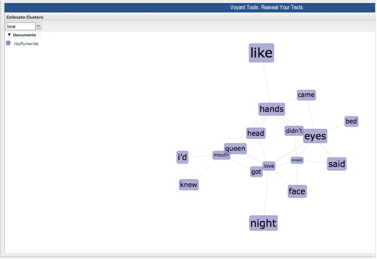

* Source URL: http://www.briancroxall.net/s15dh/assignments/distant-reading-duffy/
*  Type: Assignment
*  Creator: Brian Croxall (Brown University) 
*  This assignment, from Brian Croxall's "Introduction to Digital Humanities" course, immediately positions poetry as data for the purposes of distant reading (as opposed to close reading). Students collectively transcribe two volumes of Carol Ann Duffy's poetry--which they have already read and discussed--and then input that data into Voyant Tools, developed by Geoffrey Rockwell and Stéfan Sinclair. In the assignment description, Croxall writes, "it's important to recognize that we might not learn anything new....We're operating here under the principle of experimentation that has guided our class." Furthermore, the goal is to have fun experimenting with the different tools Voyant offers, such as Bubblelines and Scatterplots, with the hope that interesting discoveries emerge during the process. One group of students who completed this exploratory assignment analyzed word frequencies between the two volumes, while another group used Voyant's "Links" tool to search for trends emerging around the mention of body parts.    

### "Songs of the Victorians"
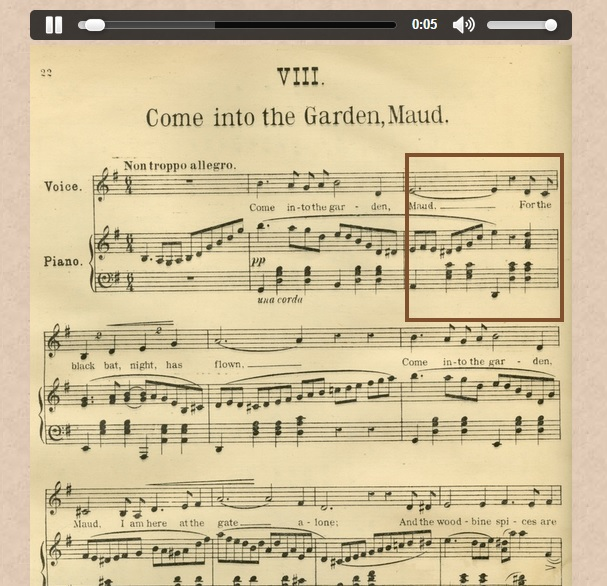

* Source URL: http://www.songsofthevictorians.com/
* Type: Online Archive/Resource
* Creator: Joanna Swafford (SUNY New Paltz) 
* This interdisciplinary resource was conceived and created by Joanna Swafford. While definitely a specialized resource, the content and chronological overlap with often-taught British literature survey courses is ripe with potential. Interdisciplinarity and close reading are this resource's heartbeat, as it exposes students to poetry as songs--meaning, literally set to music--providing the audio of the music and vocals, as well as sheet music and written verse. Thanks to Swafford's expert programming, the interface allows you to listen to the song while a visual aid moves along in time, showing the current location on the visible sheet music. In addition, each of the four songs represented includes essay-length analysis that interprets the song's rendering of the poem. However, what "Songs of the Victorians" models most clearly is a way of thinking about poetry, especially in how it applies digital tools to the solution of a specific problem. 

### "for better for verse"
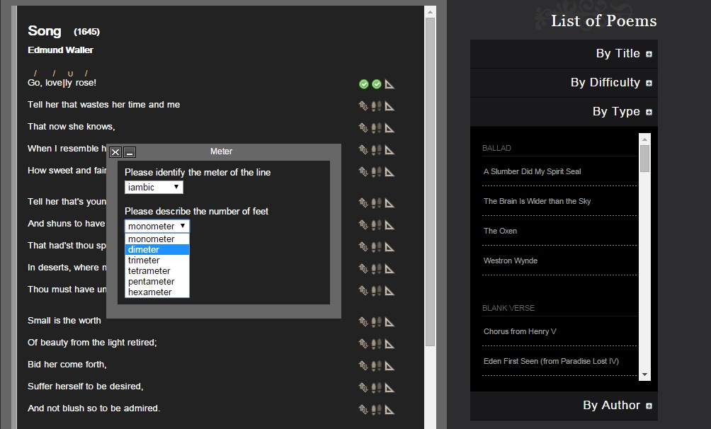

* Source URL: http://prosody.lib.virginia.edu/
* Type: Teaching resource 
* Creator: Herbert Tucker (University of Virginia)
* "for better for verse" is simply a wonder, as the site takes on the most challenging element of poetry pedagogy: teaching rhythm and meter. Authored by Herbert Tucker, this site is beautifully designed, interactive, intuitive, and most importantly, succeeds in its objectives. For any student who wishes to test and build their skills with scansion, the site provides a sizable number of poems that may be be selected according to difficulty, type, or author. Once a poem is selected, users mark stressed and unstressed syllables (simple mouse clicks), divisions between metric feet, rhyme, and identify meter by type and length (for example, anapestic trimeter). The submitted scansion is automatically checked for accuracy. Beyond these essential nuts and bolts, for better for verse also includes notes that help explain how specific elements of the rhythm and meter connect to the poem's overall content, which is the larger pedagogical aim.

### "Prism"
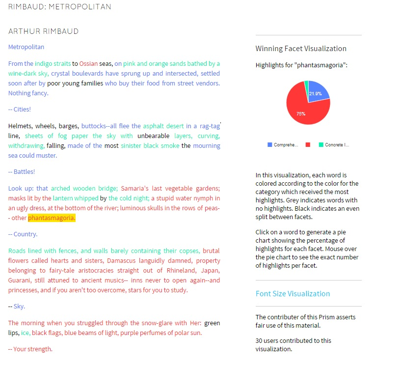

* Source URL: http://prism.scholarslab.org/
* Type: Online Tool/Resource
* Creators: The Praxis Team (University of Virginia)
* Prism, designed by student scholars at the University of Virginia, is for collaborative or crowdsourced interpretation. I have used Prism with undergraduate students, both creating assignments for students as well as having students make their own. Prism is remarkably easy to use. Users upload a text (I chose Arthur Rimbaud's "Metropolitan") and then select three "facets" that will be highlighted for the final visualizations; these facets can track poetic concerns like "concrete image," "abstract," "nature," "metaphor," etc. Once the facets are set, readers highlight the text according to the colors assigned each facet. When finished, the reader can visualize the poem in two ways. First, each word will be colored as the "winning facet," and clicking on any word will provide the associated statistics; readers can also visualize via font-size, which is helpful for readers used to seeing word clouds. Most importantly, students can compare their readings with others.   

## Decoding and Encoding

### "Topic Modeling and Figurative Language"
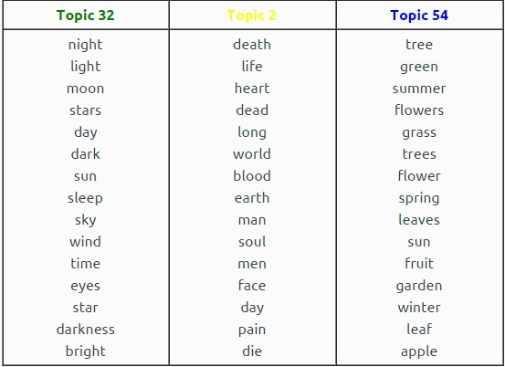

* Source URL: http://journalofdigitalhumanities.org/2-1/topic-modeling-and-figurative-language-by-lisa-m-rhody/
* Type: Published Article
* Creator: Lisa M. Rhody (George Mason University)
* Lisa Rhody is one of the few who apply topic modeling to poetry, specifically ekphrastic poems. Rhody is unconventional from the start, as her dataset, when compared with those most often modeled, is tiny. Furthermore, Rhody works with texts heavy with figurative language (poetry), which is yet another departure.  What's most valuable is Rhody's gentle introduction to topic modeling, which concentrates on its ideas (via a farmers' market metaphor and Anne Sexton's "The Starry Night") rather than deep mathematics; the material is still mighty challenging, but the mixture of close reading and computational context are fascinating. Even more valuable is Rhody's thinking laid bare: she thinks through the digital tool (MALLET) to arrive at questions she didn't have when starting the process, hence she describes them as "alternatives." This is pedagogy as discovery. Topic Modeling can be intimidating, and Rhody's work, both its scale and tone, invite exploration.   

### "Digital Close Reading: TEI for Teaching Poetic Vocabularies"
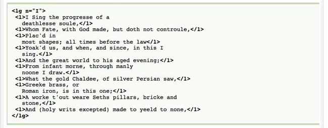

* Source URL: http://jitp.commons.gc.cuny.edu/digital-close-reading-tei-for-teaching-poetic-vocabularies/
* Type: Published Article
* Creator: Kate Singer (Mount Holyoke College)
* Scholarly articles often double as lesson plans, and Kate Singer's essay on TEI and poetry quickly made its way into my Introduction to Digital Humanities course. This article, anchored in the scholarship of teaching and learning, argues that asking undergraduates to engage in the "slow, iterative" process of text encoding teaches both close-reading skills and a critical awareness of literary terminology. The article provides a generous view of the overall project and Singer's classroom teaching of the material, where she describes using a large screen to collectively move through specific tags or elements the students would use in their own projects. The piece concludes with Singer's reflections on the specific assignment, changes she would make based on her experience, as well as student feedback. For anyone considering using TEI in the classroom--and that's not a small leap--this piece is an essential teaching companion for this long-view subject matter. 

## Creative Writing        
    
### "Anatomy of an I ♥ E-Poetry Entry"
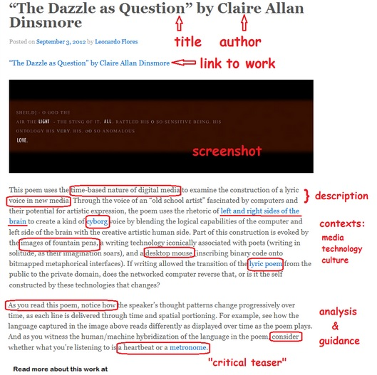

* Source URL: http://iloveepoetry.com/?p=5387
* Type: Curated Resource
* Creator: Leonardo Flores (University of Puerto Rico, Mayagüez Campus)
* The relationship between digital humanities and e-lit is rhetorically ambiguous; while the existence of these categories indicates difference, my preference is to view both as embraced by a larger, more general definition of digital humanities. Given this connection, primary digital texts are equally suitable for analysis involving digital tools. Enter "I ♥ E-Poetry." Curated by Leonardo Flores, this website collects hundreds of original works of e-poetry and allows teachers to easily introduce these primary texts into class environments, whether it be for analysis or creation. This particular assignment, "Anatomy of an I ♥ E-Poetry Entry" is a perfect introduction to the genre and the new terminology required. The assignment's included example provides guidance on not only how to analyze poetry as new media, but also how to write about that work in new-media contexts. The pedagogical payoff is guidance for both thinking and writing about the material.  

### "Using Google Spreadsheets for a Generated-Text Twitter Bot"
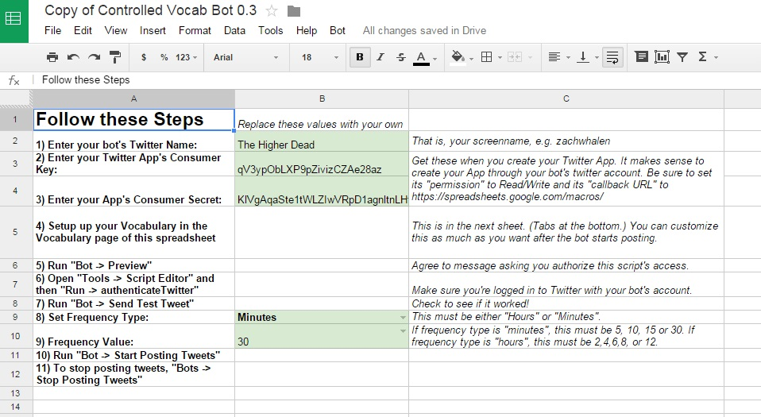

* Source URL: http://www.zachwhalen.net/posts/how-to-make-a-twitter-bot-with-google-spreadsheets-version-04/
* Type: Assignment
* Creator: Zach Whalen (University of Mary Washington)
* I consider Twitter bots to be found poetry where the lens of discovery shifts to accommodate the digital medium. Twitter bots take different forms, some more complex than others, and Zach Whalen's Google Spreadsheet version is perfect for novice students (and instructors) looking to not only create their first bot, but also  understand its mechanics. The assignment describes bot varieties, then moves to the "random text-generating bot running without the need to write any code or have access to a web server." A pre-formatted Google spreadsheet is provided, and one simply has to populate the fields accordingly. Also included is a smooth introduction to creating Twitter apps, obtaining the necessary keys, and authentication. In starting with a spreadsheet model, you must focus on the language of individual cells, how they will eventually synthesize with surrounding cells, as well as maintaining the required brevity for the randomized tweet.  

### "'Deep' Textual Hacks"
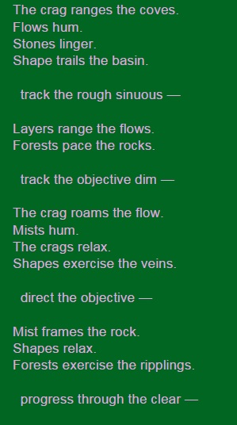
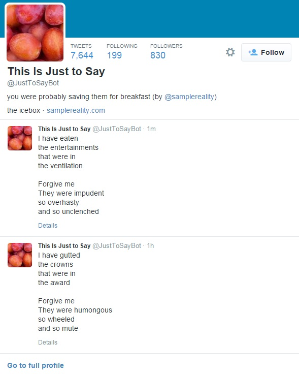

* Source URL: http://www.samplereality.com/2015/02/11/deep-textual-hacks/
* Type: Assignment
* Creator: Mark Sample (Davidson College)
* The assignment includes three separate "hacks," meaning you get to remix or make something that generates original poetry. All three are accessible and serve as a welcoming door for technological novices. The first assignment, remixing Nick Montfort's "Taroko Gorge," is one that I've done and given to undergraduate students (as has Sample). One benefit to this assignment is the "wow" factor--most students have never seen a randomly-generated poem, let alone considered creating one. Montfort's code is readily accessible, and students, by saving their own copy and remixing the word list, can turn the code toward entirely new subject matter, thus joining a growing community of "Taroko Gorge" remakes. Still, the pedagogical focus is on the language, its organization at various syntactic levels, and arrangement in a way that will fluidly engage with the code. It is possible to approach the teaching as you might a Oulipo-style writing prompt.  

## Pedagogical History

### "Princeton Prosody Archive"
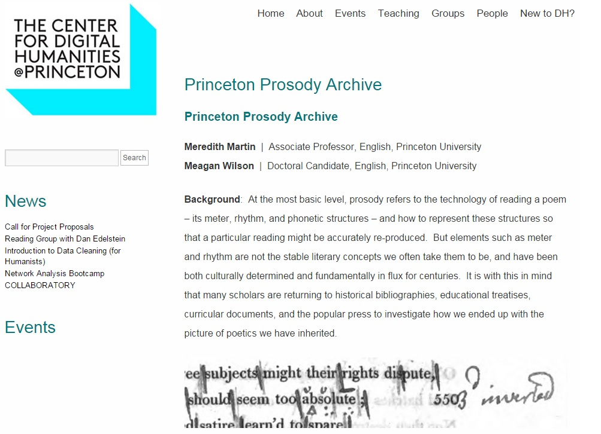

* Source URL: http://prosody.princeton.edu/
* Type: Online database
* Creators: Meredith Martin and Meagan Wilson (Princeton University)
* The Princeton Prosody Archive, a coming attraction, is ambitious and long overdue for those interested in poetry and pedagogy. Meredith Martin, the project's leader, pursued her interest in the technology (or prosody) of reading poems, and how this technology has been in flux for centuries. Evidence for these changes exists in "historical bibliographies, educational treatises, curricular documents, and the popular press," and thus the Princeton Prosody Archive. The project's current website describes the project as follows: "Using digital media to historicize the technology of reading a poem, the Princeton Prosody Archive is a full-text searchable database of over 10,000 digitized records on the teaching of poetry as both a popular and highly specialized genre between 1750-1923." As a teacher of creative writing and literature, I find the classroom promise for this material beyond promising. For example, students could "read" a single poem through the established conventions of various centuries.

## RELATED MATERIALS

* Cordell, Ryan. “Lab #12: Script(ing).” Technologies of Text. N.p., 12 Nov. 2014. Web.

* Flores, Leonardo. “I ♥ E-Poetry.” I ♥ E-Poetry. N.p., n.d. Web.

* Rhody, Lisa M. “Why Use Visualizations to Study Poetry?” Lisa @ Work. N.p., n.d. Web. 17 Mar. 2015.

* “DH Toe Dip: PRISM.” Chuck Rybak. N.p., n.d. Web. 17 Mar. 2015.

* Woodward, Tom. “JavaScript Poetry.” Bionic Teaching. N.p., n.d. Web. 15 Mar. 2015.

## WORKS CITED

* Cordell, Ryan. “Lab #12: Script(ing).” Technologies of Text. N.p., 12 Nov. 2014. Web.

* Croxall, Brian. “Distant Reading Duffy.” Intro to DH. N.p., n.d. Web. 18 Mar. 2015.

* Flores, Leonardo. “I ♥ E-Poetry.” I ♥ E-Poetry. N.p., n.d. Web.

* Flores, Leonardo. “Anatomy of an I ♥ E-Poetry Entry.” Text. I ♥ E-Poetry. N.p., n.d. Web. 16 Mar. 2015.

* Montfort, Nick. “Taroko Gorge.” nickm.com. N.p., n.d. Web.

* Rhody, Lisa M. “Topic Modeling and Figurative Language.” Journal of Digital Humanities (2013): n. pag. Web. 15 Mar. 2015.

* Rhody, Lisa M. “Topic Model Data for Topic Modeling and Figurative Language.” Journal of Digital Humanities. N.p., 7 Apr. 2013. Web. 17 Mar. 2015.

* Rhody, Lisa M. “Why Use Visualizations to Study Poetry?” Lisa @ Work. N.p., n.d. Web. 17 Mar. 2015.

* Martin, Meredith, and Meagan Wilson. “Princeton Prosody Archive.” The Center for Digital Humanities @Princeton. N.p., n.d. Web.

* Sample, Mark. “‘Deep’ Textual Hacks.” SAMPLE REALITY. N.p., 11 Feb. 2015. Web. 15 Mar. 2015.

* Singer, Kate. “Digital Close Reading: TEI for Teaching Poetic Vocabularies.” The Journal of Interactive Technology and Pedagogy 1.3 (2013): n. pag. Web.

* Swafford, Joanna. “Songs of the Victorians.” N.p., n.d. Web.

* Tucker, Herbert. “For Better for Verse.” for better for verse. N.p., n.d. Web. 15 Mar. 2015.

* University of Virginia Scholars Lab. “Prism.” Prism. N.p., n.d. Web.

* Whalen, Zach. “Using Google Spreadsheets for a Generated Text Twitter Bot.” Zach Whalen. N.p., n.d. Web. 16 Mar. 2015.

* Woodward, Tom. “JavaScript Poetry.” Bionic Teaching. N.p., n.d. Web. 15 Mar. 2015.

