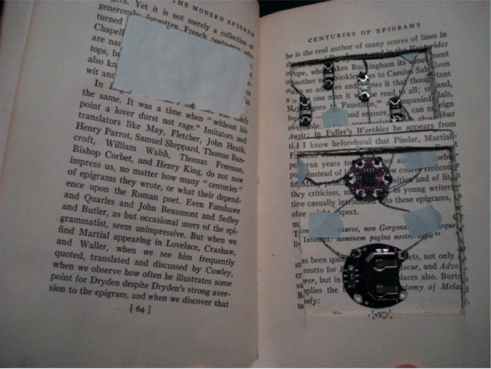
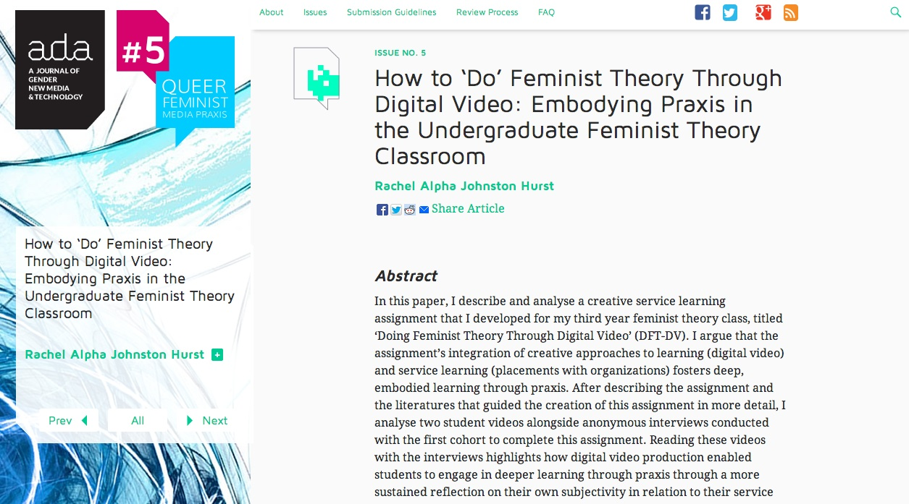
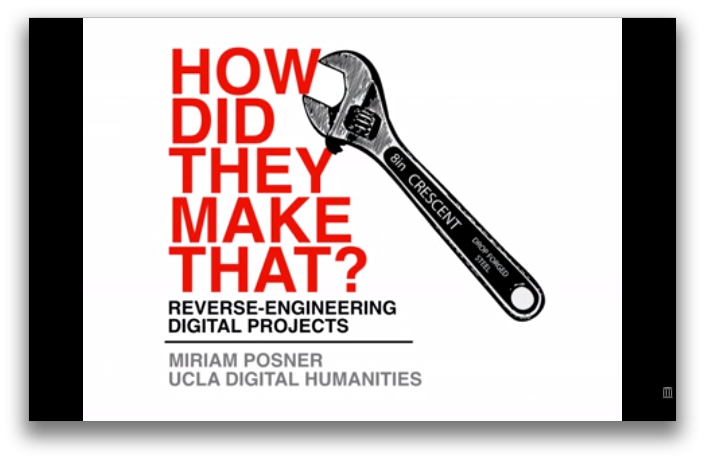
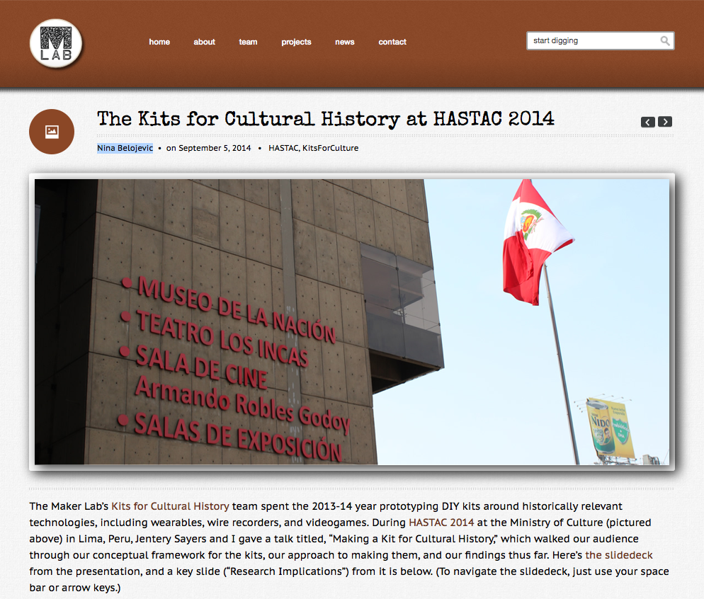
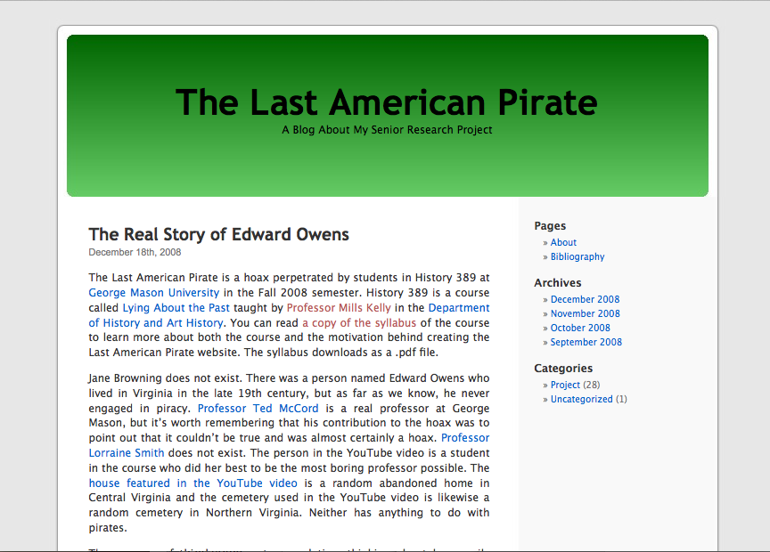
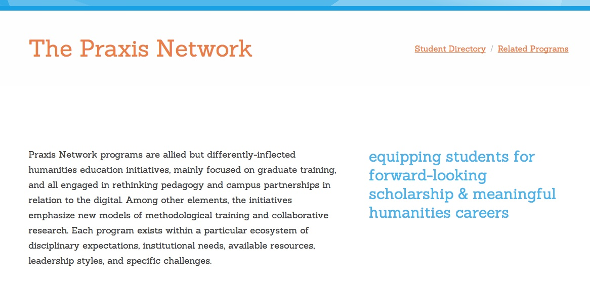
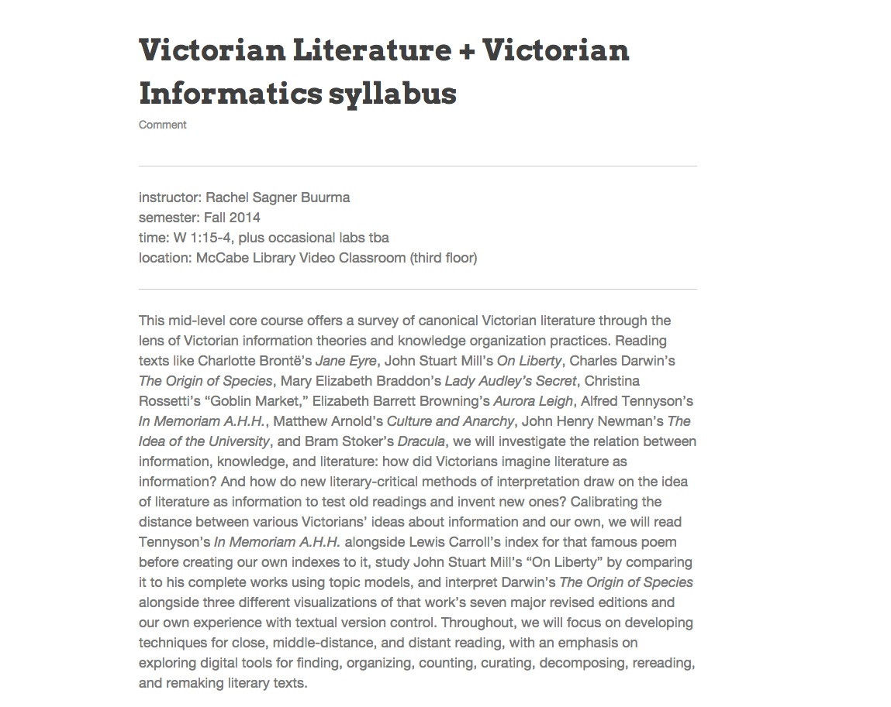
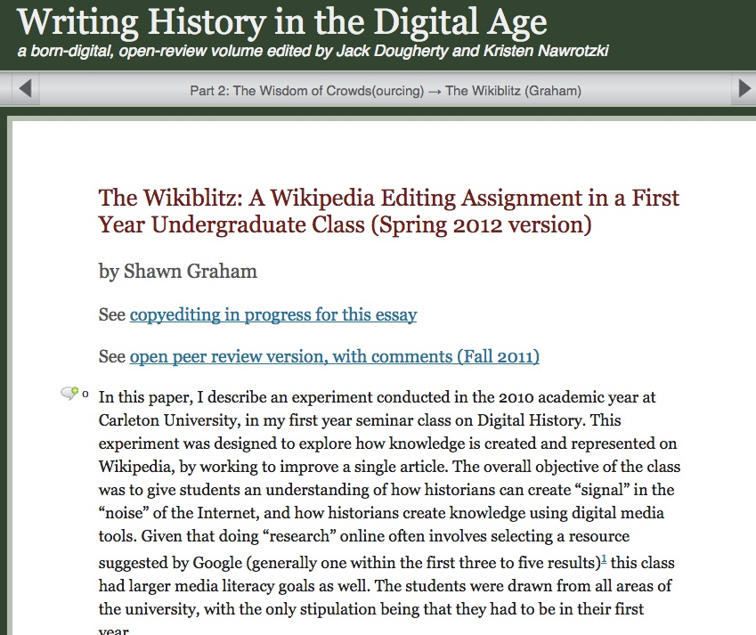
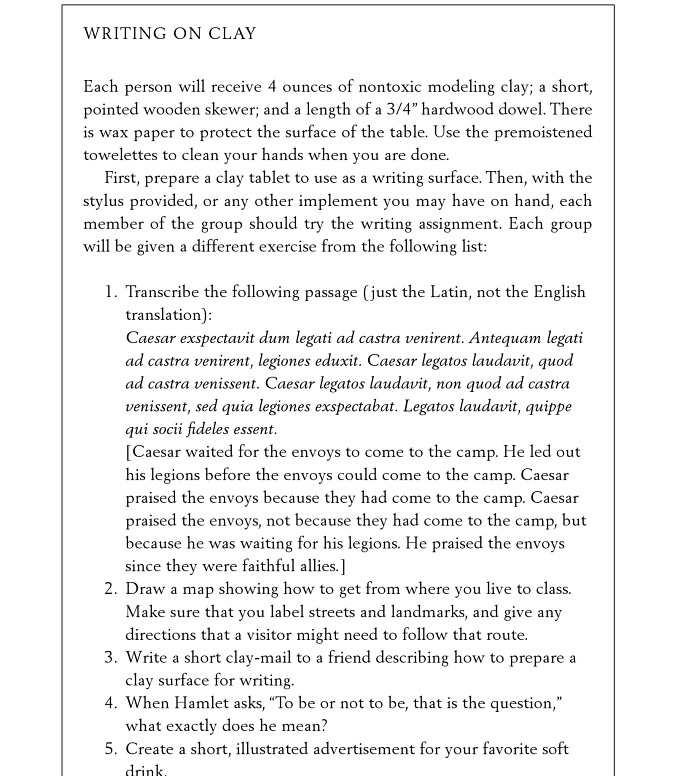

# Praxis

## Authors

* Bethany Nowviskie
* J. K. Purdom Lindblad
* Jeremy Boggs

## List of Curated Pedagogical Resources

* “Bibliocircuitry and the Design of the Alien Everday,” Charity Hancock, et. al., [http://scholarworks.iu.edu/journals/index.php/textual/article/view/5051]( http://scholarworks.iu.edu/journals/index.php/textual/article/view/5051) (sample student projects)
* “Doing Feminist Theory with Digital Video,” Rachel Alpha Johnston Hurst, [http://adanewmedia.org/2014/07/issue5-hurst/](http://adanewmedia.org/2014/07/issue5-hurst/) (article)
* “Extraordinary Materials,” Daniela K. Rosner, [http://dada.cca.edu/~drosner/materials/syllabus.html](http://dada.cca.edu/~drosner/materials/syllabus.html) (syllabus)
* "How Did They Make That?" Miriam Posner, [http://miriamposner.com/blog/how-did-they-make-that/](http://miriamposner.com/blog/how-did-they-make-that/) (tech showcase/how-to)
* “The Kits for Cultural History at HASTAC 2014,” Nina Belojevic, [http://maker.uvic.ca/lima/]( http://maker.uvic.ca/lima/) (sample student projects)
* “Lying about the Past,” T. Mills Kelly, [http://chnm.gmu.edu/history/faculty/kelly/blogs/h389/f08syl.pdf](http://chnm.gmu.edu/history/faculty/kelly/blogs/h389/f08syl.pdf) (syllabus)
* **Praxis Network**, [http://praxis-network.org](http://praxis-network.org) (institutional models)
* “Victorian Literature + Victorian Informatics,” Rachel Sagner Buurma, [http://rachelsagnerbuurma.org/uncategorized/vic_info-draft-syllabus/](http://rachelsagnerbuurma.org/uncategorized/vic_info-draft-syllabus/) (syllabus)
* “The Wikiblitz: A Wikipedia Editing Assignment in a First Year Undergraduate Class (Spring 2012 version),” Shawn Graham, [http://writinghistory.trincoll.edu/crowdsourcing/graham-2012-spring/](http://writinghistory.trincoll.edu/crowdsourcing/graham-2012-spring/) (class exercise)
* “Writing on Clay,” **A Better Pencil: Readers, Writers, and the Digital Revolution,** Dennis E. Baron, [http://books.google.com/books?id=VWzgtZMJCwgC&lpg=PP1&dq=better%20pencil&pg=PA71#v=onepage&q=modeling%20clay&f=false](http://books.google.com/books?id=VWzgtZMJCwgC&lpg=PP1&dq=better%20pencil&pg=PA71#v=onepage&q=modeling%20clay&f=false) (class exercise)

## Curatorial Statement

We understand *praxis* as thoughtful performance: a way of making and building less oriented toward the construction of end-products and more concerned with exposing the processes through which ideas become objects in space or actions in time. In the classroom, a praxis-oriented pedagogy helps students engage with theory through concrete action, and promotes understanding of the complex, playful, and materially-grounded ways in which theoretical or ideological concepts can be realized, exposed, critiqued, and iteratively generated. The pedagogical resources gathered here connect with *praxis* as an opportunity to:

* **embody an idea.** Students make or do something that represents an existing theory or idea. They demonstrate prior understanding through successful performance and instantiation.
* **illuminate an idea.** In the process of making or doing something, students reveal theoretical and intellectual complexities that may have been hidden to them in their initial understanding.
* **critique an idea.** Students challenge or question existing concepts or ideologies by building or performing new alternatives.
* **generate an idea.** New theories or concepts arise, often iteratively and playfully, through performance, construction of objects or systems, and embodied understanding.

Attention to *praxis* can encourage students to look beyond academic literature in developing an understanding of the content of a course. It can inspire them to contribute to knowledge representation and creation in new ways, and to move with confidence across disciplinary and professional boundaries. (See, for instance, the work of hairdresser Janet Stephens, now a published experimental archaeologist who has [untangled the mysteries](http://online.wsj.com/news/articles/SB10001424127887324900204578286272195339456) of Roman coiffures.) It can also foster life-long learning, as students move outward from our classrooms into the working world.

### Our Own Pedagogy

We have compiled these resources from the perspective of three digital humanities practitioners engaged in the extra-curricular mentoring and methodological training of graduate students across disciplines at a digital scholarship center: the University of Virginia [Scholars' Lab](http://scholarslab.org/). Almost everything we offer at the Scholars' Lab—from the contributions made by our internal research projects to our workshops and partnerships with faculty, our support of undergraduate research, and our hosted graduate fellowship programs—features *praxis* as [a central concern](http://scholarslab.org/about/charter/). We take an uncommon position for a library-based service unit, in that we are more oriented toward building up people, as mentors and partners, than toward building websites or tools as an on-request service. In our teaching, we are therefore always careful to emphasize *how* and *why* to make or do things, and to promote design thinking and reflective practice. *Praxis* is core to the ethos of the Scholars' Lab and to nearly all of our interactions with collaborators.  We take this tack because we feel that students, scholars, and cultural heritage or information professionals alike need to engage more deeply with making and building as a way of knowing, in preparation for more active and hopeful futures for the humanities. A pedagogy of *praxis* appreciates built objects and working systems, but attends equally to processes and manners of making, and ensures that both are instructive.

### Rationale and Criteria

We have selected the following resources according to three broad principles.

First, we chose resources that were open-access, available under fair use, or otherwise publicly available.

Second, we wanted to include a range of resources: syllabi that discuss, organize, and present *praxis*-oriented theories and activities to students; sample lessons that themselves embody *praxis* in the sense that they detail processes and outline possible, theoretically-informed outcomes; reflective demonstrations of completed projects or showcases of the tools and processes that have gone into making a particular project, object, or system; and articles that discuss the importance of *praxis* for teaching and learning. It was important to us to include resources that varied in type or format and in domain of application, to show that *praxis* can enter the classroom in a variety of ways.

Finally, we felt it important to select resources that demonstrate the interconnected, symbiotic relationships among *praxis,* theory, and product. All of these resources highlight this importance: that none can or should be understood to exist in isolation, and exploring one should necessarily mean exploring the others. We feature resources that, in our view, succeed in demonstrating that the best way to learn is through *active engagement*. These resources do not just talk about the importance of *praxis* in the abstract: they provide examples of embodied, theoretically-informed learning in action.

## Curated Pedagogical Resources

### “Bibliocircuitry and the Design of the Alien Everday”

* Screenshot: 
* Source URL: [http://scholarworks.iu.edu/journals/index.php/textual/article/view/5051](http://scholarworks.iu.edu/journals/index.php/textual/article/view/5051)
* Copy of the Resource: [files/bibliocircuitry.pdf](files/bibliocircuitry.pdf)
* Name of Creator: Charity Hancock, Clifford Hichar, Carlea Holl-Jensen, Kari Kraus, Cameron Mozafari, Kathryn Skutlin

An article detailing student exploration of the concept of *reflective design* through projects that investigate the book as interface. This activity perfectly highlights the way that exposure to and emphasis on process leads to unforeseen insight. These student authors also emphasize that *digital* work requires consideration of hardware and physical/tactile design. Instructors inspired by this article might select a particular type of object and ask students to devise ways to alter or enhance the ways users can interact with it.

### “Doing Feminist Theory through Digital Video”
* Screenshot:
* Source URL: [http://adanewmedia.org/2014/07/issue5-hurst/](http://adanewmedia.org/2014/07/issue5-hurst/)
* Name of Creator: [Rachel Alpha Johnston Hurst](http://www.rachelhurst.ca/Dr._Rachel_Alpha_Johnston_Hurst/Welcome%21.html)
* Attribution Information: Rachel Alpha Johnston Hurst is an associate professor of [Women's and Gender Studies](http://sites.stfx.ca/womens_and_gender_studies/) at [St.  Francis Xavier University](http://www.stfx.ca/) in Antigonish, Nova Scotia.

*Doing Feminist Theory through Digital Video* is a reflective essay detailing an undergraduate assignment and the literature informing the development of the assignment. Noticing her students were struggling to connect rich theoretical discussions within the classroom to "real life," Hurst offers a pathway for specific theoretical considerations (like feminism) to shape and be shaped by the application of praxis.

Hurst applies Paulo Freire's definition of praxis ("reflection and action upon the world in order to change it") with the goal of fostering sustained deep reflection, both of the theoretical foundations of her course as well as on the student's emerging scholarly voices (Freire, [1970] 2000: 51).

A semester-long, service-learning project is difficult to integrate into a content-based course. Hurst's article outlines strategies for nurturing deep learning through reflection and praxis. Reflecting on her process as well as implementation, Hurst points to methods for demystifying knowledge creation through iterative, collaborative work.

### “Extraordinary Materials”
* Screenshot: 
* Source URL: [http://dada.cca.edu/~drosner/materials/syllabus.html](http://dada.cca.edu/~drosner/materials/syllabus.html)
* Name of Creator: [Daniela K. Rosner](http://danielarosner.com)
* Attribution Information: Daniela Rosner is an assistant professor of [Human Centered Design and Engineering](http://www.hcde.washington.edu/) and co-directs the [TAT Lab](http://depts.washington.edu/tatlab/blog/) at the (University of Washington)[http://www.washington.edu/]

(Extra)ordinary *Materials* is a Human-Centered Design and Engineering course focusing on "thinking and experimenting with materials that have extraordinary properties around ordinary practices as an entry point for identifying new affordances in form-giving work." With a detailed syllabus and a blend of intriguing readings, hands-on experiments, and student participation, (Extra)ordinary *Materials* exemplifies praxis through deep investigation of material culture and objects alongside exploration of the concepts of "mutability, reproduction, age and belonging."

Readings are paired with hands-on, individual and group investigations and reflective reports. Rosner includes thoughtful learning outcomes along with explicit pairings of experiential work and theoretical readings to best explore a range of materials and properties.

### “How Did They Make That?”

* Screenshot: 
* Source URL: [http://miriamposner.com/blog/how-did-they-make-that/](http://miriamposner.com/blog/how-did-they-make-that/)
* Name of Creator: [Miriam Posner](http://miriamposner.com/)
* Attribution Information: Posner coordiates and teaches in the [Digital Humanites program at UCLA](http://www.cdh.ucla.edu/). She has a Ph.D.  from Yale University, in Film Studies and American Studies.

Miriam Posner offers a modest gallery of various digital projects, virtually disassembling them according to the tools and techniques used in their production. Her goal is to show how each is made, so that others might feel empowered to build similar projects or extend the ones highlighted. The site is a helpful starting point for students beginning their own digital projects. Have students explore the site, then visit each example project, to see how the list of parts and techniques correspond to and are manifestedin specific results. Get a feel for the affordances of different types of digital projects.

In addition to the post, Posner also offers a [video version](http://miriamposner.com/blog/how-did-they-make-that-the-video/) of "How Did They Make That."

### "The Kits for Cultural History at HASTAC 2014"

* Screenshot: 
* Source URL: [http://maker.uvic.ca/lima/](http://maker.uvic.ca/lima/)
* Name of Creator: [Nina Belojevic](http://maker.uvic.ca/author/nbelojevic/) * Attribution Information: Belojevic is Assistant Director of the [Maker Lab in the Humanities, University of Victoria](http://maker.uvic.ca/)

Nina Belojevic provides an introduction and rationale for the *Kits for Cultural History* project at the University of Victoria Makerlab. These kits help humanists explore questions and topics related to history and culture. They are not intended to be simple instruction manuals, with step-by-step instructions to complete, but rather serve as examples, encouraging inquiry, modification, and reflection. Kits include: [*Electric Jewels*](http://maker.uvic.ca/kit1/), which explores 19th-century wearables, and [*Tennis for Two*](http://maker.uvic.ca/tennis/), which looks at the first video game.  The kits suggest that *praxis* goes deeper than simple problem solving.

One obvious way to integrate these kits into the classroom is to attempt a group project recreating or extending one. From there, students could be asked to create their own kits, and to write rationales, documenting the process through which they researched and designed them.

### “Lying about the Past”

* Screenshot: 
* Source URL: [http://chnm.gmu.edu/history/faculty/kelly/blogs/h389/f08syl.pdf](http://chnm.gmu.edu/history/faculty/kelly/blogs/h389/f08syl.pdf)
* Copy of the Resource: [files/lying-about-the-past.pdf](files/lying-about-the-past.pdf)
* Name of Creator: [T. Mills Kelly](http://edwired.org/)
* Attribution Information: T. Mills Kelly is Associate Professor of [History at George Mason University](http://historyarthistory.gmu.edu/) and Associate Director of the [Roy Rosenzweig Center for History and New Media](http://chnm.gmu.edu/).

Mills Kelly has taught several iterations of an undergraduate history course entitled "Lying about the Past." The course conveys historical research methods and ethics by asking students to examine and debunk historical hoaxes. For their final projects, students create a convincing hoax of their own. [The results](http://www.theatlantic.com/technology/archive/2012/05/how-the-professor-who-fooled-wikipedia-got-caught-by-reddit/257134/) have been explosive.

Alongside the emphasis on understanding history by re-shaping it, we find this an excellent example of a praxis-based syllabus, in which it's clear that Kelly considers his students to be his collaborators, and depends on their active engagement to shape the course.

### The Scholars' Lab Praxis Program and Praxis Network
* Screenshot: 
* Source URL: [http://praxis-network.org/](http://praxis-network.org/)

The [Praxis Program](http://praxis.scholarslab.org) is an extracurricular attempt to reimagine graduate training in the humanities for the demands of the digital age. Each year, the Scholars' Lab brings together six graduate students from across the humanities and social sciences to theorize, design, build, and reflect on the process of constructing a digital tool.  Praxis Fellows work alongside the Scholars' Lab staff throughout the cycle of creating and launching a digital project.

The Praxis Network was inspired by the Scholars' Lab [Praxis Program](http://praxis.scholarslab.org) and by Michigan State University's [Cultural Heritage Informatics (CHI) Initiative](http://chi.anthropology.msu.edu/) and [CHI Fieldschool](http://chi.anthropology.msu.edu/fieldschool/). Both programs exemplify differing approaches to collaborative, humanities-based digital methods training. The Network gathers together 6 additional international models to  enable institutions seeking to develop similar efforts to compare missions, structures, research foci, funding models, and strategic directions of successful sister programs.

### “Victorian Literature + Victorian Informatics”
* Screenshot: 
* Source URL:[http://rachelsagnerbuurma.org/uncategorized/vic_info-draft-syllabus/](http://rachelsagnerbuurma.org/uncategorized/vic_info-draft-syllabus/)
* Name of Creator: [Rachel Sagner Buurma](http://rachelsagnerbuurma.org/)
* Attribution Information: Rachel Sagner Buurma is an associate professor in the [Department of English Literature](http://www.swarthmore.edu/english-literature) at [Swarthmore College](http://www.swarthmore.edu).

Victorian Literature and Victorian Informatics is a richly detailed English syllabus exploring "canonical Victorian literature through the lens of Victorian Information theory and knowledge organization practices." Buurma blends close, middle-distant, and distant reading techniques with an emphasis on digital methods for re-reading/re-making literary texts.

With a variety of workshops, demonstrations, discussions, and readings, Buurma's syllabus is exemplary in its incorporation of fresh critical methods and interpretative tools into familiar material. Related readings, tools, and workshops could be readily incorporated into an existing course, or a new course could be developed along a similar, topical and content-based model.

### “The Wikiblitz: A Wikipedia Editing Assignment in a First Year Undergraduate Class (Spring 2012 version)”

* Screenshot: 
* Source URL: [http://writinghistory.trincoll.edu/crowdsourcing/graham-2012-spring/]( http://writinghistory.trincoll.edu/crowdsourcing/graham-2012-spring/)
* Name of Creator: [Shawn Graham](http://www.graeworks.net/)
* Attribution Information: Shawn Graham is an assistant professor in the [Department of History](http://www.carleton.ca/history/) at [Carleton University](http://carleton.ca/).

Graham describes an in-class assignment designed to "explore how knowledge is created and represented on Wikipedia, by working to improve a single article." This assignment was situated in a course exploring historical materials on the Internet. Graham reflects on the overall course and the specifics of the Wikipedia assignment with a particular focus on preparing students to engage with and critique the tools available for writing history in our digital age.

Graham's article is particularly useful in that it outlines how the assignment fit into the broader course, its expected and unexpected outcomes, his rubric, and shares student feedback. Graham details the work invested in preparing students for the 2-session assignment, which could smooth the process of adapting this idea for other courses.

### “Writing on Clay”

* Screenshot: 
* Source URL: [Lesson Plan, Writing on Clay](http://books.google.com/books?id=VWzgtZMJCwgC&lpg=PP1&dq=better%20pencil&pg=PA74#v=onepage&q=modeling%20clay&f=false)
* Name of Creator: [Dennis E.  Baron](http://www.english.illinois.edu/-people-/faculty/debaron/)
* Attribution Information: Dennis Baron is a professor of [English](http://www.english.illinois.edu/) at the [University of Illinois](http://illinois.edu/).

Baron's deceptively simple in-class exercise with writing on clay encourages students to think about how context-specific technology affects their composition practices, reading, and understanding across media. Foregrounding the materiality of expression, this activity makes obvious how many layers support the physical act of communication. To write on clay, a student must prepare his or her surface, estimate the expected space needed for writing, adjust methods for correcting mistakes or revising the text, and call into question ways of sharing and preserving the finished writing.

An exercise like this requires little pre-planning, but does demand time for reflection and in-class discussion.

## 5. Related Materials (Bulleted List)

* Drucker, Johanna. “Theory as Praxis: The Poetics of Electronic Textuality.” *Modernism/Modernity* 9.4 (2002): 683-691. Web. 20 October 2014. <https://muse.jhu.edu/journals/modernism-modernity/v009/9.4drucker.html>
* Freire, Paulo. *Pedagogy of the Oppressed.* New York: Continuum, 2000. Print.
* Ito, Mizuko, et. al. “Connected Learning: An Agenda for Research and Design.” *dml Research Hub*, January, 2013. Web.  <http://dmlhub.net/publications/connected-learning-agenda-research-and-design>
* Pope, Rob. *Textual Intervention: Critical and Creative Strategies for Literary Studies.* Psychology Press, 1995.
* Thomas, Douglas and John Seely Brown. *New Culture of Learning: Cultivating the Imagination for a World of Constant Change.* n.p. 2011.  Print.

## 6. Works Cited

Baron, Dennis E. *A Better Pencil: Readers, Writers, and the Digital Revolution* New York: Oxford University Press, 2009. Web. 20 October 2014.

Belojevic, Nina. “The Kits for Cultural History at HASTAC 2014.” *Maker Lab in the Humanities*. University of Victoria, 5 September 2014. Web.  20 October 2014. <http://maker.uvic.ca/lima/>

Buurma, Rachel Sagner. “Victorian Literature + Victorian Informatics.” Swarthmore College, Fall 2014. Web. 20 October 2014.  <http://rachelsagnerbuurma.org/uncategorized/vic_info-draft-syllabus/>

Drucker, Johanna. “Theory as Praxis: The Poetics of Electronic Textuality.” *Modernism/Modernity* 9.4 (2002): 683-691. Web. 20 October 2014.  <https://muse.jhu.edu/journals/modernism-modernity/v009/9.4drucker.html>

Freire, Paulo. *Pedagogy of the Oppressed.* New York: Continuum, 2000.  Print.

Graham, Shawn. “The Wikiblitz: A Wikipedia Editing Assignment in a First Year Undergraduate Class (Spring 2012 version),” *Writing History in the Digital Age.* Jack Dougherty and Kristen Nawrotzki, eds. Web. 20 October 2014.  <http://writinghistory.trincoll.edu/crowdsourcing/graham-2012-spring/>

Hancock, Charity, et. al. “Bibliocircuitry and the Design of the Alien Everday.” *Textual Cultures* 8.1 (2013): n. pag. Web. 20 October 2014.  <http://scholarworks.iu.edu/journals/index.php/textual/article/view/5051>

Hurst, Rachel Alpha Johnston. “Doing Feminist Theory with Digital Video.” *Ada: A Journal of Gender, New Media, and Technology*. No. 5 (2014): n. pag. Web. 20 October 2014.  <http://adanewmedia.org/2014/07/issue5-hurst/>

Ito, Mizuko, et. al. “Connected Learning: An Agenda for Research and Design.” *dml Research Hub*, January, 2013. Web.  <http://dmlhub.net/publications/connected-learning-agenda-research-and-design>

Kelly, T. Mills. “Lying about the Past.” George Mason University. Fall 2008. Version 1.2. Web. 20 October 2014.  <http://chnm.gmu.edu/history/faculty/kelly/blogs/h389/f08syl.pdf>

Pesta, Abigail. "On Pins and Needles: Stylist Turns Ancient Hairdo Debate on Its Head." *Wall Street Journal.* 6 February 2013. Web. <http://online.wsj.com/news/articles/SB10001424127887324900204578286272195339456>

Pope, Rob. *Textual Intervention: Critical and Creative Strategies for Literary Studies.* Psychology Press, 1995.

Posner, Miriam. "How Did They Make That?" *Miriam Posner: Blog* 29 August 2013. Web. 20 October 2014.  <http://miriamposner.com/blog/how-did-they-make-that/>

*Praxis Network* <http://praxis-network.org>

Rosner, Daniela K. “Extraordinary Materials.” California College of the Arts, Fall 2011. Web. 20 October 2014.  <http://dada.cca.edu/~drosner/materials/>

Scholars’ Lab. “Charter.” University of Virginia Library, August 2014.  Web. 20 October 2014. <http://scholarslab.org/about/charter/>

Stacey, David E. Review of *Textual Intervention: Critical and Creative Strategies for Literacy*, by Rob Pope. *JAC Online* 17.1 (1997): n. pag.  Web. 20 October 2014.  <http://www.jaconlinejournal.com/archives/vol17.1/stacy-textual.pdf]>

Thomas, Douglas and John Seely Brown. *New Culture of Learning: Cultivating the Imagination for a World of Constant Change.* n.p. 2011.  Print.
