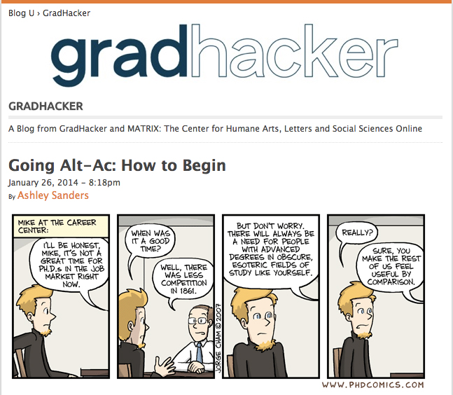
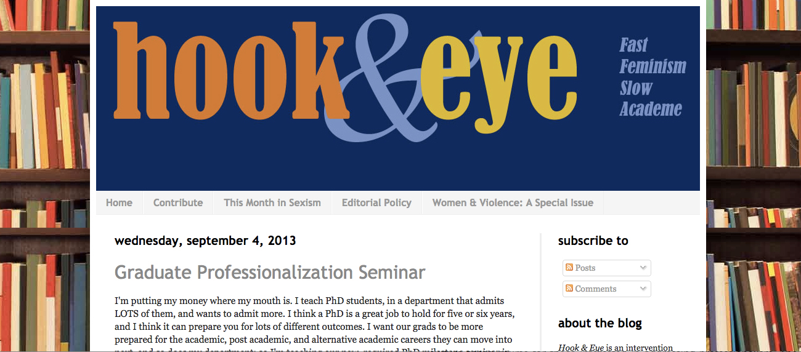
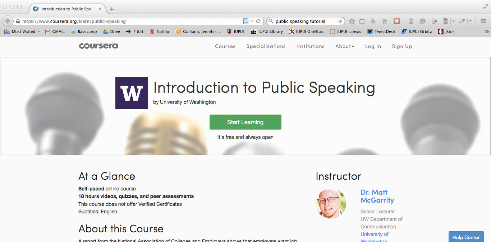
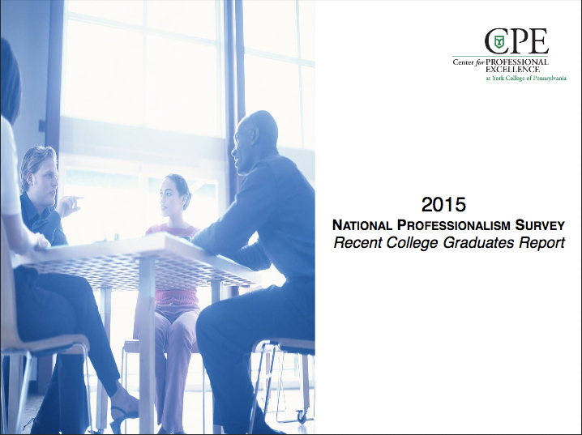
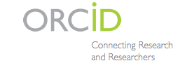
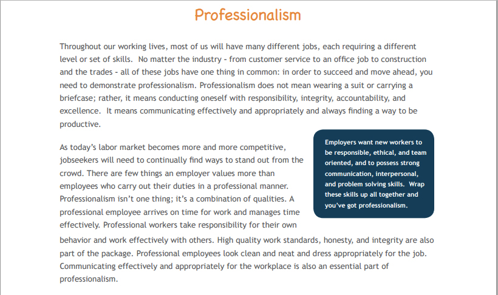
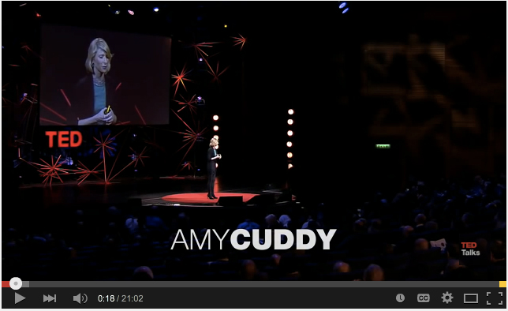

# PROFESSIONALIZATION

## JENNIFER GUILIANO
Indiana University-Purdue University Indianapolis | http://jguiliano.com/

---

##### Publication Status:
* unreviewed draft
* draft version undergoing editorial review
* **draft version undergoing peer-to-peer review**
* published

--- 

## CURATORIAL STATEMENT 
When we think about professionalization in the context of pedagogy, most frequently we are referring to teaching about one of three things: 1) classroom management; 2) presenting oneself in writing via curriculum vitae and resumes; and 3) presenting one's research in oral forms via presentations and interviews. In part, this limited view of professionalization is a result of the continuing dominance of academics, and particularly academics engaged in teaching master's and doctoral students, in determining the context through which professionalization is taught. As Professor Louis Menard remarks in his essay entitled *The Ph.D. Problem*:

> It is easy to see how the modern academic discipline reproduces all the salient features of the professionalized occupation. It is a self-governing and largely closed community of practitioners who have an almost absolute power to determine the standards for entry, promotion, and dismissal in their fields. The discipline relies on the principle of disinterestedness, according to which the production of new knowledge is regulated by measuring it against existing scholarship through a process of peer review, rather than by the extent to which it meets the needs of interests external to the field.

The rise of the alternative academic as well as sub-disciplinary concerns related to public scholarship and the public humanities have worked to destabilize the dominance of academic teaching about professionalization. Most often, that has been articulated through discussions of writing for the public, the contributions of independent scholars and "citizen" humanists to our knowledge about professionalization, as well as a focus on technologies that enable digital forms of knowledge about professionalization (e.g. websites, social media, mobile applications, multimedia forms of publication, etc.). Perhaps unsurprisingly, academics have tended to refer to these contributions as "skills" that one acquires most frequently through extracurricular workshops and training or as "applied" learning rather than core components that should layered within existing pedagogical offerings in departments and organizations. In using terminology like "skills" and "applied", departments, universities, and professional organizations construct a false, and quite detrimental, binary where the use of one's knowledge is treated as separate from the acquisition of knowledge. Yet, as we learn in our careers, knowledge and its applied state are intertwined and dependent upon each other in professional environments.

In part, departments have continued separating the knowledge they provide from the techniques, methods, and processes of its application in non-academic environments because it allows boundaries around their profession to remain non-permeable. They continue to arbitrate who can participate in knowledge-making as well as the systems of reward available to those who are deemed "professional"-enough.  Bluntly put, departments have largely avoided confronting that the majority of degree students are no longer moving toward the doctoral degree or a tenure-track professorships; thus, they have either outsourced much of the work of knowledge discovery, teaching, and distribution with regards to professionalization or have focused only on skills that will enable students to get a tenure-track job rather than knowledge, techniques, and methodologies that might serve them as they move into multiplicity of careers and stages. As a result, professionalization focuses on the act of getting a job rather than situations, attitudes, behaviors, and processes that student might encounter throughout the variety of career stages one might inhabit. This is re-affirmed continually by the focus on tracking first-job placements rather than long-term career statistics. 

###Criteria 
For our purposes, then, rather than focusing on professional knowledge used to seek a job, we'll concentrate on materials that can assist you in not just becoming a professional, but also navigating common issues in professional environments: What does it mean to be an individual in a professional environment? What knowledge should you have to operate as a professional in a collaborative work environment? What techniques can assist you in to developing aptitude across professional environments? The curated pedagogical artifacts included represent a variety of materials that might be useful when teaching about knowledge, methods, skills, and techniques for professional development. Organized alphabetically, they will assist you in developing your own pedagogy around professionalism.

## CURATED ARTIFACTS 

### “Five Year Resume” Exercise

* Source URL: [doi: 10.1177/1052562906290525](doi: 10.1177/1052562906290525 )
* Copy of Artifact: [files/professionalism_Laker_Five_Year_Resume.pdf](files/professionalism_Laker_Five_Year_Resume.pdf)
* Creators: Dennis R. Laker, Ruth Laker

The "Five Year Resume" exercise offers students the opportunity to develop a multi-year plan for their career development. With eight core components (objectives, professional experience, volunteer experience, references, personal interests, professional activities, education, and personal information), the exercise serves as a stellar model for how to construct one's resume alongside sets of activities that students would need to undertake in order to fulfill their five-year career goals. Laker and Laker offer as well a resource assessment exercise to help students identify what support systems and other information they will need in order to achieve their five year goals. Instructors will find that students struggle with how to articulate the step-by-step activities they might need to develop beyond the initial goal of getting a job. You might find that it is useful to provide examples of five-year resumes to students to illustrate how large-scale tasks might need to be broken into constituent components.

### “Going Alt-Ac: How to Begin” 

* Source URL: [https://www.insidehighered.com/blogs/gradhacker/going-alt-ac-how-begin](https://www.insidehighered.com/blogs/gradhacker/going-alt-ac-how-begin)
* Copy of Artifact: [files/professionalism_Sanders_Going_Alt_Ac.pdf](files/Sanders_Going_Alt_Ac.pdf)
* Creators: Jessica Sanders

"Going Alt-Ac: How to Begin" offers a few quick steps students can take to begin thinking about alternative academic careers. The blog helps student identify their own personal motivations, constraints, and awareness of professional outlets and environments. Importantly, while the blog assists in getting started, its focus on one's personal motivations will be very useful to those considering moving from their current employer to their next. Instructors using this resource might ask students to not only assess their own motivations but to interview professionals in their potential fields about how their decision-making articulated specific awareness and constraints.

### “Graduate Professionalism Seminar” Syllabus

* Source URL: [http://www.hookandeye.ca/2013/09/graduate-professionalization-seminar.html](http://www.hookandeye.ca/2013/09/graduate-professionalization-seminar.html)
* Copy of Artifact: [files/professionalism_Morrison_graduate_professionalism_seminar.pdf](files/professionalism_Morrison_graduate_professionalism_seminar.pdf)
* Creators: Aimée Morisson

The "Graduate Professionalism Course" Syllabus provides a skills and culture-based course for those interested in addressing professionalism. The syllabus blends academic-specific professional development (e.g. formulating academic committees and navigating academic job searches) with alternative academic career paths. Morrison highlights how to "find meaningful and interesting work "post-academic" style, and how to translate all the hard-won academic skills for non-academic hiring managers." Importantly, the syllabus also introduces how to conduct assessments of personality type and how to network. This resource will be most useful to instructors who are working with graduate students to assist them in considering their graduate experiences as part of professional development. Students looking to understand how to constitute committees and initiate professional job searches will find this syllabus particularly useful.

### “Introduction to Public Speaking” Course

* Source URL: [https://www.coursera.org/learn/public-speaking](https://www.coursera.org/learn/public-speaking)
* Copy of Artifact: none
* Creators: Matt McGarrity

With eighteen hours of video, quizzes, and peer assessment, this coursera led by Matt McGarrity provides an opportunity for students to study the principles of public speaking, examine speeches through interactive assessment, and help students prepare speeches. Instructors might look to this course to provide a complete parallel educational experience, as a model to emulate how to teach non-written competancies, and/or as a way to develop peer assessment strategies. Students will find the coursera framework useful as it can be divided into increments as short as five minutes or as long as multiple hours. 

### National Survey on Professionalism

* Source URL: [http://www.ycp.edu/media/york-website/cpe/2015-National-Professionalism-Survey---Recent-College-Graduates-Report.pdf](http://www.ycp.edu/media/york-website/cpe/2015-National-Professionalism-Survey---Recent-College-Graduates-Report.pdf)
* Copy of Artifact: [files/professionalism_York_survey.pdf](files/professionalism_York_Survey.pdf)
* Creators: Polk-Lepson Research Group, York College of Pennsylvania

When we usually approach the pedagogy of professionalism, we tend to use our own personal experience as the basis for our curriculum. In this survey conducted by the York College of Pennsylvania, 519 recent college graduates reflect on issues they faced in their transition to the workplace. For instructors, the sections on issues surrounding internet technologies and social media behaviors as well as entitlement will offer useful results for discussion with students. Students might also find the sections on workplace appearance around tattoos, piercings, and attire particularly provocative. Additional reports from York in previous years might also be useful as they survey other pertinent topics regarding professionalism.

### ORCID

* Source URL: [http://orcid.org/](http://orcid.org/)
* Copy of Artifact: none
* Creators: Orcid

ORCID is an open, non-profit, community-driven effort to create and maintain a registry of unique researcher identifiers and a transparent method of linking research activities and outputs to these identifiers. ORCID connects researchers and research through the embedding of ORCID identifiers in key workflows, such as manuscript submissions, grant applications, and digital publications. As students are likely to maintain multiple professional and institutional affiliations throughout their careers, ORCID will allow them to link their professional social media and networking accounts (e.g. LinkedIn) to their changing professional affiliations. Importantly, within the classroom, the registration and development of one's ORCID profile is a useful activity to get students thinking about how to develop their career profiles.   

### Professionalism

* Source URL: [http://www.dol.gov/odep/topics/youth/softskills/Professionalism.pdf](http://www.dol.gov/odep/topics/youth/softskills/Professionalism.pdf)
* Copy of Artifact: [files/professionalism_DOL_Professionalism.pdf](professionalism_DOL_Professionalism.pdf)
* Creators: United States Department of Labor

While this guide to professionalism is specific to the US context, the included exercises on identifying workplace bias, generational and cultural stereotypes, professional attitudes, and social dynamics within the workplace are invaluable. Each exercise offers a short activity, a journal or reflective activity, as well as suggested extension activities that instructors might build on to the particular topic. Importantly, little professionalism training in the academy focuses on social and cultural dynamics making these tutorials quite unique and useful for those looking to be successful in professional environments. Instructors will find these activities perfect for role-playing within the classroom while students will be able to work through their own responses to common workplace scenarios.

### “You Call It Professionalism, I Call It Oppression in a Three-Piece Suit” 

* Source URL: [http://everydayfeminism.com/2015/02/professionalism-and-oppression/](http://everydayfeminism.com/2015/02/professionalism-and-oppression/)
* Copy of Artifact: [files/professionalism_Rios_You_Call_It.pdf](files/professionalism_Rios_You_Call_It.pdf)
* Creators: Carmen Rios

This reflective essay from Carmen Rios for everydayfeminism.com identifies the ways in which professionalism can used as languages and behaviors of oppression within the workplace. Rios writes, "professionalism is a tool of the elite to keep workforces “in their place” – and often, that place is defined in opposition to communities of color, queer culture, and the actual working class." From dress codes to workplace behaviors to social dynamics, Rios' essay offers an important way to open discussion with students about the implicit and explicit codes within the workplace that they might not only encounter but be complicit in via their conditions of employment. Instructors might ask students to not only reflect on their experiences but to offer strategies that might be used to confront systemic inequalities within workplace doctrines and behaviors.

### “Your Body Language Shapes Who You Are” 

* Source URL: [https://www.youtube.com/watch?v=Ks-_Mh1QhMc](https://www.youtube.com/watch?v=Ks-_Mh1QhMc)
* Copy of Artifact: [files/professionalism_Cuddy_Body_Language.mp4](files/professionalism_Cuddy_Body_Language.mp4)
* Creators: Amy Cuddy

This Ted talk by social psychologist Amy Cuddy demonstrates the ways in which body language shapes how we view ourselves as well as how we view others. Importantly, Cuddy also reflects on the biological underpinnings of our body language and the ways in which our body encourages particular postures and poses. Using this video, instructors might ask students to conduct mock interviews, record social rituals (e.g. meals or mixers), and analyze the footage to discuss how their body language might imply particular feelings or actions. Students might discover subconscious behaviors or voluntary actions that might seem off-putting to employers, colleagues, or the public.

## RELATED MATERIALS
Campana, Kristie L. and Peterson, Jamie J. "Do bosses give extra credit? Using the classroom to model real-world work experiences." 2013. *College Teaching*, 61 (2), 60-66. <http://eric.ed.gov/?id=EJ997684>

Guiliano, Jennifer. "Alt-Ac No More." jguiliano.com, 18 February 2014. Web. <http://jguiliano.com/blog/2014/02/18/altac_no_more/>

Kelsky, Karen. "Negotiating Offers." professorisin.com, n.d. Blog Archive by Category. <http://theprofessorisin.com/category/negotiating-offers/>

Nowiskie, Bethany. "On Compensation". nowiskie.org, 13 March 2010. Web. <http://nowviskie.org/2010/on-compensation/>

Rockwell, Geoffrey and Stefan Sinclair. "Acculturation and the Digital Humanities Community." *Digital Humanities Pedagogy: Practices, Principles, Politics*. Brett D. Hirsch, ed. Open Book Publishers, 2012. <http://www.openbookpublishers.com/htmlreader/DHP/chap07.html>

## WORKS CITED

Amy Cuddy: Your Body Language Shapes Who You Are. Ted Talks, 2012. Online video clip. YouTube. <https://www.youtube.com/watch?v=Ks-_Mh1QhMc>

Laker, Dennis R., and Ruth Laker. “The Five-Year Resume: A Career Planning Exercise.” *Journal of Management Education* 31.1 (2007): 128–141. Web. 6 Apr. 2015. <http://jme.sagepub.com/content/31/1/128.abstract>

McGarrity, Matt. “Introduction to Public Speaking - University of Washington.” Coursera, Inc. Web. 6 Apr. 2015. <https://www.coursera.org/learn/public-speaking>

Menard, Louis. “Professionalization in the Academy". Harvard Magazine. N.p., Dec. 2009. Web. 6 Apr. 2015. <http://harvardmagazine.com/2009/11/professionalization-in-academy>

Morrison, Aimée. “Hook and Eye: Graduate Professionalization Seminar.” *Hook and Eye*, 4 September 2013. Web. <http://www.hookandeye.ca/2013/09/graduate-professionalization-seminar.html>

“ORCID.” Orcid, Inc., n.d. Web. 6 Apr. 2015. <http://orcid.org/>

Polk-Lepson Research Group. 2015 National Professionalism Survey: Recent College Graduates. York College of Pennsylvania, 2015. Web. <http://www.ycp.edu/media/york-website/cpe/2015-National-Professionalism-Survey---Recent-College-Graduates-Report.pdf>

Rios, Carmen. “You Call It Professionalism; I Call It Oppression in a Three-Piece Suit.” Magazine. Everydayfeminism.com. N.p., 15 Feb. 2015. Web. 6 Apr. 2015. <http://everydayfeminism.com/2015/02/professionalism-and-oppression/>

Sanders, Jessica. “Going Alt-Ac: How to Begin | GradHacker @insidehighered.” Inside Higher Education, 26 January 2014. Web. 6 Apr. 2015. <https://www.insidehighered.com/blogs/gradhacker/going-alt-ac-how-begin>

United States Department of Labor. “Professionalism.” Web. <http://www.dol.gov/odep/topics/youth/softskills/Professionalism.pdf>

