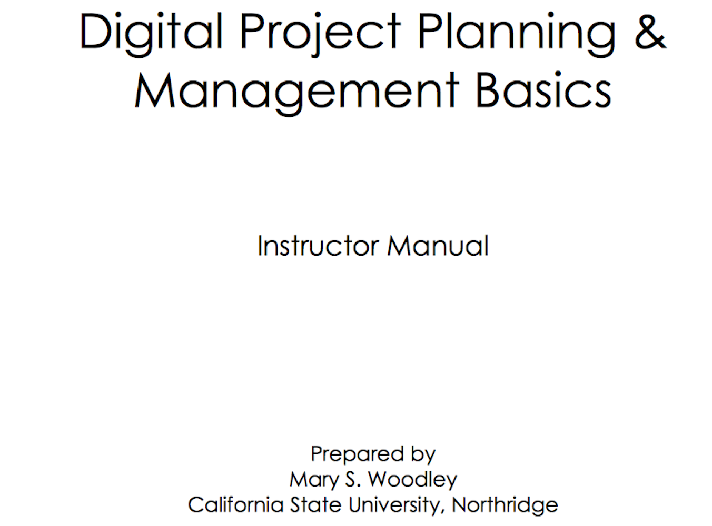
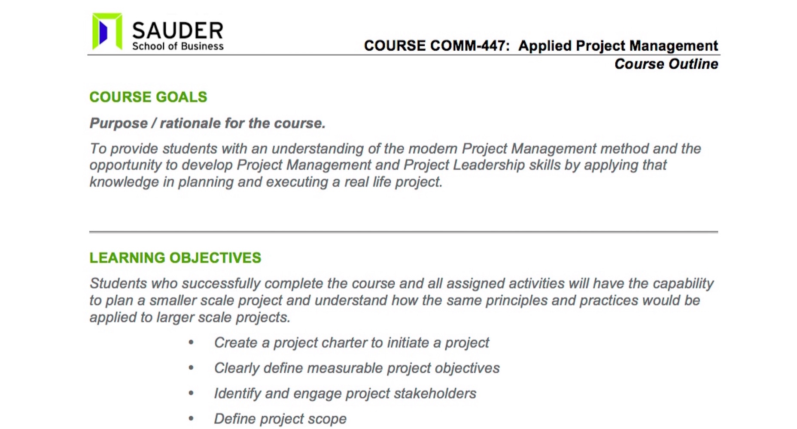
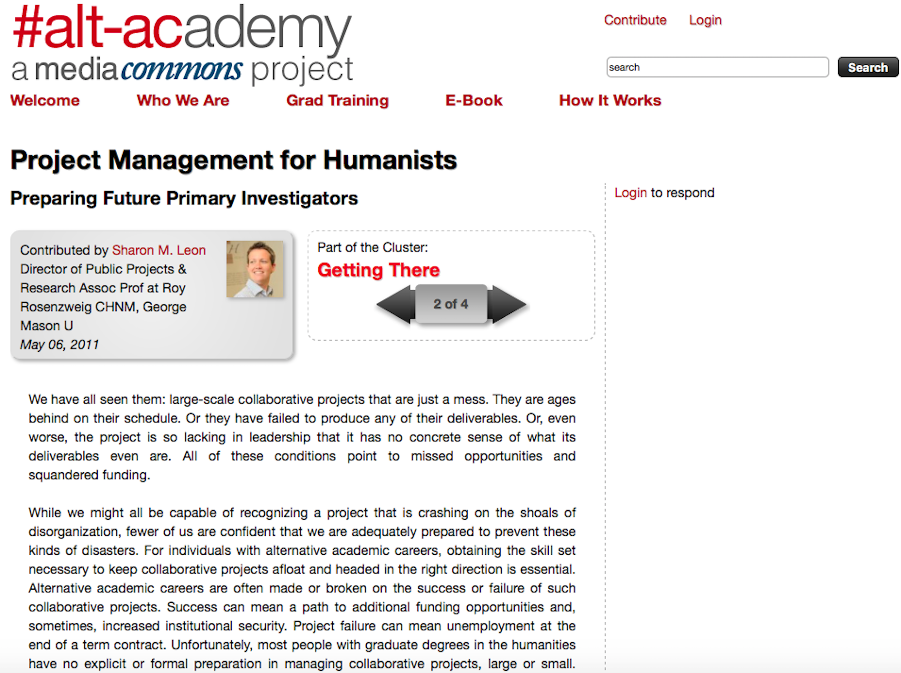
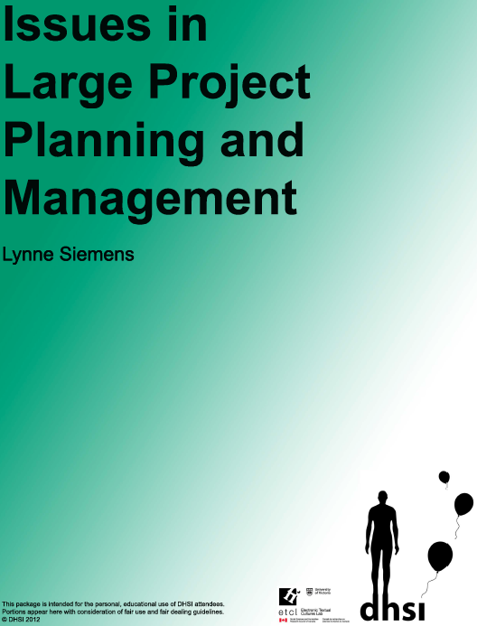
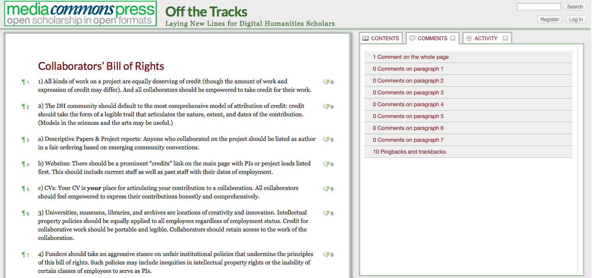
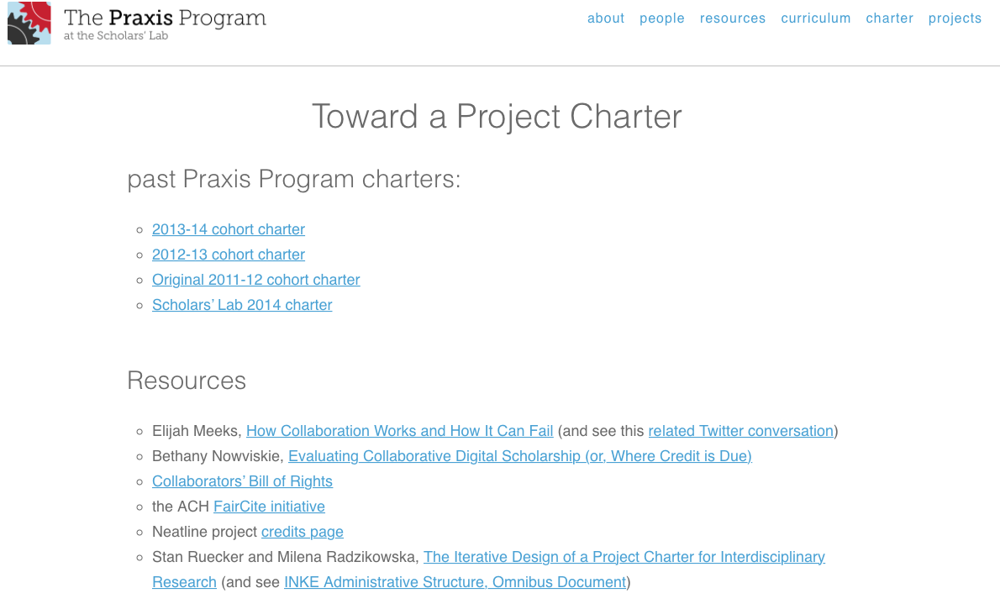
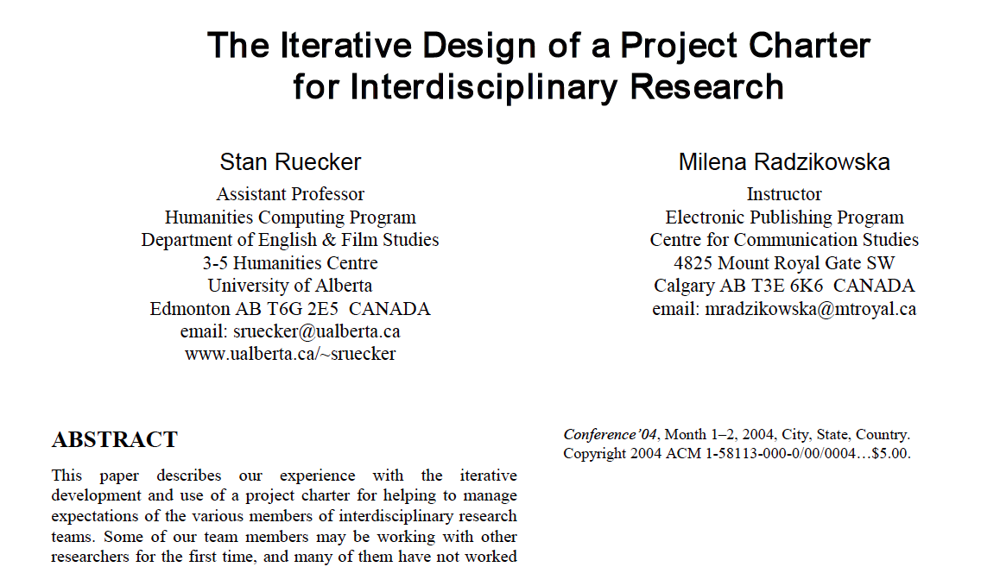
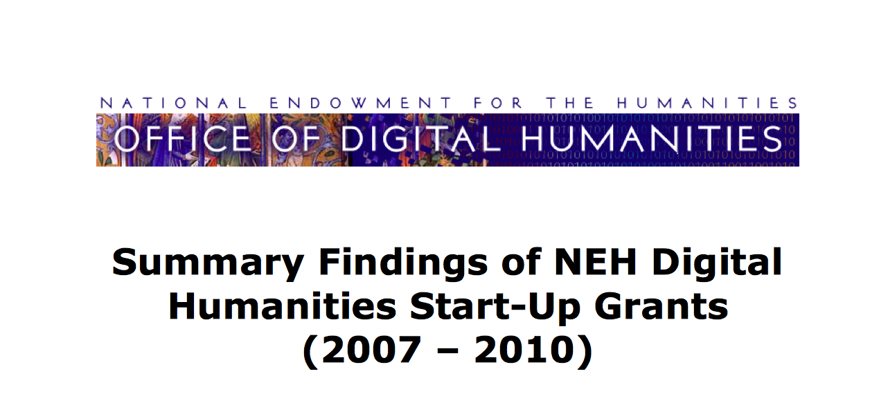

--- 
title: Digital Pedagogy in the Humanities
subtitle: Concepts, Models, and Experiments 
chapter: Project Management
URL: keywords/projectManagement.md
author: 
- family: Siemens
  given: Lynne
editor: 
- family: Sayers
  given: Jentery
- family: Davis
  given: Rebecca Frost
publisher: Modern Language Association
type: book
---

# PROJECT MANAGEMENT (Draft)

### [Lynne Siemens](https://lynnesiemens.wordpress.com)
University of Victoria, School of Public Administration 

---

##### Publication Status:
* unreviewed draft
* draft version undergoing editorial review
* draft version undergoing peer-to-peer review
* **draft version undergoing MLA copyediting**
* awaiting pre-print copy
* published 

---

### Cross-Reference Keywords: collaboration, labor, professionalization

---   

## CURATORIAL STATEMENT

Following trends in other disciplines and parts of the university, humanities researchers along with librarians, content experts, students, and others are turning to collaborations to explore increasingly complex questions and implement new types of methodologies and tools, such as those in digital humanities (DH) and/or humanities research and projects more generally. Further, granting agencies are encouraging this trend with targeted programs such as Digging into Data and Partnership Grants, among others. These large-scale projects that are even more complex than typical humanities projects require tools and strategies to manage them effectively. Even projects such as editing books and journals, creating scholarly critical editions, and other individually oriented projects can involve multiple tasks and people (such as research assistants, collaborators, editors, etc.). As a result, teams need to understand ways to coordinate efforts among tasks and members in order to accomplish project objectives and satisfy stakeholders (Siemens and INKE Research Group 2014; Siemens 2009). With its associated methods, tools, and techniques, project management provides a way to do this (Siemens 2012).

Simply stated, though complicated in practice, project management is “the application of processes, methods, knowledge, skills and experience to achieve the project objectives” (Association for Project Management n.d.). Within this context, a project is a unique endeavor that is undertaken to achieve specific outputs, outcomes and/or benefits within an agreed upon timeframe and budget (Association for Project Management n.d.; Siemens 2012). Given these definitions, it is clear that those in humanities undertake projects on a regular basis, such as collaborating on a digital project, writing a dissertation or book, or planning a new component of a department’s curriculum offering to name but a few. Individuals may even find it beneficial to apply these tools and techniques to projects outside the realm of the humanities, such as house renovations. However, they may not necessarily have the knowledge and skills to do so successfully. Hence, there is a need for training in project management. 

As Rockwell and Sinclair (2012) argue, since DH projects are team-oriented and over longer time spans, humanities students too should be “exposed to project management strategies and the discourse around project management, so that they can fit into teams and think critically about how projects are managed and about their role in its management” (183). While this may feel that there is a perhaps dubious application of management tools from the other side of campus (i.e., business schools), the adoption of these tools will benefit humanities students and scholars alike as they work to accomplish the projects that they undertake. They can take this knowledge and apply it to projects beyond the Humanities, as well. 

While most individuals would not (hopefully) deny the need for the effective planning and managing of projects, knowledge and skills about this topic are typically not a formal part of training in the humanities (Leon 2011; Siemens 2013). Instead, the gap tends to be filled on a more ad hoc basis through workshops and/or the school of hard learned experience, often very effective but potentially costly in terms of time, resources and reputation (Guiliano 2012; Simeone *et al.* 2011; Causer, Tonra and Wallace 2012; Siemens and INKE Research Group 2012; 2013; National Endowment for the Humanities Office of Digital Humanities 2010).  Beyond the ad hoc learning opportunities, project leaders may pursue professional certificates, such as those offered by the Project Management Institute (2016), which would especially benefit those who are responsible for very large projects with substantial budgets.

How can instructors integrate project management training into humanities curriculum at all levels?  From a pedagogical perspective, project management can be taught in contexts such as DH-oriented courses (for example, Bailar and Spiro 2013), stand-alone courses (for example, University of Alberta 2015), training programs (for example, Scholars’ Lab 2011a), project management workshops (for example, HILT 2015; DHSI 2015; The European Summer University in Digital Humanities 2015) and self-guided modules. The topic lends itself well to hands-on learning where participants create project plans as they engage the material. Researchers and graduate students may already have humanities-based research projects.  Some accommodation for undergraduate students may be made so that they can scale their projects more appropriate to their level of experience. The artifacts for this keyword include a variety of materials that could be used within undergraduate and graduate courses or workshops engaging project management for students, staff, and researchers alike. Those resources are divided into sections – project identification, project planning, supporting tools, and reflection. 

 

## CURATED ARTIFACTS 

### Project Identification

### Managing Your Project

 
* Artifact Type: website
* Source URL: http://devdh.org/lectures/manageproject/
* Permissions: CC BY-NC-SA 3.0 
* Creator: Jennifer Guiliano (Indiana University-Purdue University Indianapolis) and Simon Appleford (Creighton University)

As part of a larger site about project management (DevDH)--which is a repository of training materials for organizing and running projects--Jennifer Guiliano and Simon Appleford created this webpage, drawing on their experience as project managers and team members.  Of particular usefulness is the module on managing work plans that are the building blocks for a successful project. The lectures and slides step a student through ways to develop a work plan and covers basics such as the identification and scheduling tasks, and responsibility assignment for said tasks. The material also includes sample plans that can guide students in their own efforts to develop work plans. Overall, this module and site provides a useful introduction to project management.

### Digital Project Planning and Management Basics, Instructor Manual 

* Artifact Type: instructor manual
* Source URL: http://www.loc.gov/catworkshop/courses/digitalprojplan/pdf/Instructor-Final.pdf  
* Permissions: Provided by Library of Congress
* Copy of artifact: [Digital Project Planning and Management Basics, Instructor Manual](files/project_management-digital-project-planning-and-management-basics.pdf)
* Creator: Mary S. Woodley (California State University, Northridge)

This workshop manual for an intensive two-day workshop on digital project management was developed on behalf of the Library of Congress and the Association for Library Collections and Technical Services. Topics include team building and planning, business plan development, grant writing, project management, and outcome evaluation and assessment. The manual includes slides, instructor notes, classroom activities, and exercises. The accompanying trainee manual is available at http://www.loc.gov/catworkshop/courses/digitalprojplan/pdf/Trainee-Final.pdf. These guides would be useful as a syllabus for a course or workshop, modules within courses and workshops, or resources for individuals planning and managing their own projects.  It includes hands-on activities that can be applied in a course or workshop or as a course assessment. One possible activity focuses on the development of a grant proposal to fund the project.  Students could be asked to make the case for funding as a way to define and refine the project and its importance.

### COURSE COMM-447: Applied Project Management, Course Outline

* Artifact Type: Course Outline
* Source URL: n/a 
* Copy of Artifact: [COMM-447: Applied Project Management, Course Outline](files/project_management-comm-447.pdf)
* Permissions: CC-BY-NC
* Creator: Robert Goatham (University of British Columbia)

This artifact is an outline for a course on applied project management that includes course textbook and readings, assignments, and assessment tools. The topics covered within the course include various components of a project plan, ranging from project description, risk, stakeholder identification, and project reflection.  The primary focus of the course is an experiential activity where students must develop and execute a real project plan.  As outlined in the syllabus, the use of this type of activity is designed to provide a richer learning environment than would be possible with hypothetical projects. This learning allows for reflection on the real work challenges that make project management both rewarding and frustrating at the same time. 

### Project Management for Humanists: Preparing Future Primary Investigators 

* Artifact Type: Guide to Project Management
* Source URL: http://mediacommons.futureofthebook.org/alt-ac/pieces/project-management-humanists
* Permissions: CC BY 3.0 
* Creator: Sharon M. Leon (George Mason University)

One of the ongoing discussions within the Humanities concerns graduate education and the necessary skills for success in and outside the academy. This debate has led to an increasing push for professional skill development. Drawing upon her perhaps hard learned experiences, Sharon Leon articulates those necessary skills, particularly as they relate to project management. In this article, she presents a guide to project management and covers topics such as managing the project, the project manager role, and running efficient meetings. Further, she offers some thoughts on models for changing graduate education to better prepare humanities practitioners for project work and collaborations. This article would serve as a start to discussions around professional development as well as a "getting started" guide to project management. It could also serve as an introduction to project management within a course at the graduate level. 

### Project Planning

### Digital Humanities Summer Institute, Large Project Planning, Funding, and Management

* Artifact Type: Course Package
* Source URL: http://dhsi.org/content/2012Curriculum/12.ProjectPlanning.pdf
* Permissions: CC-BY-NC
* Copy of artifact: [Digital Humanities Summer Institute, Large Project Planning, Funding, and Management](files/project_management-Large-Project-Planning.edited.pdf)
* Creator: Lynne Siemens (University of Victoria)

This artifact is a course pack for a workshop in large project planning, funding, and management offered at the Digital Humanities Summer Institute, which covers a variety of topics.  One of these concerns the task identification, timing and responsibility assignment. Using hands-on exercises, students work through work breakdown structures, networks, and gantt charts.  Supplementing the course slides, the course pack includes sample diagrams of material covered. Overall, this course pack and accompanying readings would be useful for anyone developing a course or workshop in project management, as well as starting on their own project. More specifically, the material around planning tasks and their timing will establish the foundation to course assessments around these activities.

### Supporting Tools

### Comparison of Project Management Software

* Artifact Type: Website (Wikipedia)
* Source URL: http://en.wikipedia.org/wiki/Comparison_of_project_management_software
* Permissions: CC BY-SA 3.0 
* Creator: The Crowd

People often ask which software is best to use for project management. No easy answer exists. This Wikipedia page provides a comparison of the plethora of project management software across criteria, such as whether it is web-based, hosted on premises, or open source. It should be noted that this list does not include apps and "low tech" methods, such as white boards, flip charts, post-it notes, and markers. Given the variety of software, online project spaces, and apps that are available, it is not possible to recommend any specific one. It depends on the project and the team; white boards, flip charts, post-it notes and markers may be as appropriate as software.  One exercise would be to have students evaluate the tools and determine the most appropriate one for their project’s topic, scope and scale. 

### Collaborators’ Bill of Rights

* Artifact Type: Bill of Rights
* Source URL: http://mcpress.media-commons.org/offthetracks/part-one-models-for-collaboration-career-paths-acquiring-institutional-support-and-transformation-in-the-field/a-collaboration/collaborators’-bill-of-rights/
* CC-BY-NC
* Creator: Participants in the "Off the Tracks: Laying New Lines for Digital Humanities Scholars" Workshop

Teamwork and collaboration is a key component of any project, particularly within digital ones. However, clear models for recognizing team member contributions to digital projects are not present within the humanities, with its historical emphasis on the single author. As a result, the participants of the "Off the Tracks – Laying New Lines for Digital Humanities Scholars" workshop developed the collaborators’ bill of rights with the fundamental principle that "all kinds of work on a project are equally deserving of credit . . ." Anyone starting a digital project with other individuals will want to refer to this document to guide discussions about the different ways to recognize effort within the project.  It could also serve as a foundation document for the development of project charters (see the examples below as well as the Center for Digital Humanities’ Student Collaborators’ Bill of Rights.) 

### Toward a Project Charter 

* Artifact Type: Training Program
* Source URL: http://praxis.scholarslab.org/resources/toward-a-project-charter/
* Permissions: CC-BY-NC
* Creator: The Scholars’ Lab (University of Virginia) 

The Praxis Program at the Scholars' Lab is a training program in which graduate students at University of Virginia are funded to work as a team to develop a digital project or tool. To prepare students for this work, the program has developed a series of modules. Of particular note is the module entitled “Toward a Project Charter.”  A charter can be a tool that serves to guide a team in their interactions so that members can work together to achieve the collaboration’s goals and objectives.  As part of the program, the participants have blogged about their experiences with a project charter (see for example, http://scholarslab.org/grad-student-research/charter-and-design/.)  The blog and associated resources on project charters would be appropriate for project management workshops and courses as required reading. Instructors might consider having their students blog about the experience of planning and coordinating projects.

### The Iterative Design of a Project Charter for Interdisciplinary Research 

* Artifact Type: Project Charter Template
* Source URL: http://dl.acm.org/citation.cfm?id=1394476
* Permissions: CC-BY-NC
* Creator: Stan Ruecker (Illinois Institute of Technology) and Milena Radzikowska (Mount Royal University)

This paper outlines Ruecker and Radzikowska’s experience using a project charter within their collaborations. This charter outlines several principles that guide the working relationship between team members. A charter can make implicit understandings and assumptions more explicit and reduce potential misunderstandings and conflicts in advance as well as serve as a resource if a project develops problems between team members. This article will be of interest to anyone who is looking for a project charter template for their digital project. Along with the Collaborators’ Bill of Rights, it could be used as a starting point for course discussions for teams to develop their own charter within the context of a course or workshop (See “Toward a Project Charter” and “Com 447” above). Further, drawing upon various project charters, students could brainstorm the types of problems that teams might encounter. The subsequent charter could be another assessment tool.

### Reflection

### Office of NEH Progress Reports on Grants (Summary Findings of NEH Digital Humanities Start-Up Grants, 2007–2010)

* Artifact Type: Report
* Source URL: http://www.neh.gov/files/divisions/odh/odh-resource-summary.report.odh_.sug_.pdf
* Permissions: The NEH website states that all text is in the public domain and can be freely used, but commercial use of the text or images is restricted.
* Creator: National Endowments for the Humanities

While this resource may seem like a surprising choice for this list, it provides a summary of outcomes from the first round of National Endowment of the Digital Humanities Start-up Grants, including a survey of project directors and a summary of end-of-grant "white papers," which distill lessons learned from the projects. Among other things, respondents reflected on the importance of goal setting, teamwork, and contingency planning, all foundations of good project management. Anyone planning their first digital project and applying for funding would find this report an interesting read. This report and associated white papers would make a good classroom exercise where students highlight the types of challenges that one might encounter with digital projects and then plan a project where they minimize the potential negative impact of these.  Students may also use this artifact to guide their reflection on projects that they have undertaken and focus on lessons learned.

## RELATED MATERIALS

Association for Computers and the Humanities. “Best DH Project-Management System.” N.d., September 14, 2017. <http://digitalhumanities.org/answers/topic/best-dh-project-management-system>

Duarte, Deborah L., and Nancy Tennant Snyder. Mastering Virtual Teams. 3rd ed. New York, New York: John Wiley & Sons, Inc., 2006.

Howard Hughes Medical Institute, and Burroughs Wellcome Fund. Making the Right Moves: A Practical Guide to Scientific Management for Postdocs and New Faculty. 2nd ed. Research Triangle Park, North Carolina: Howard Hughes Medical Institute, Burroughs Wellcome Fund, 2006.

Knutson, Joan, and Ira Bitz. Project Management: How to Plan and Manage Successful Projects. New York, New York: AMACOM, 1991.

Siemens, Lynne, and INKE Research Group. "INKE Administrative Structure: Omnibus Document." Scholarly and Research Communication 3.1 (2012). http://src-online.ca/index.php/src/article/view/50

## WORKS CITED

Appleford, Simon, and Jennifer Guiliano. "Managing Your Project". 2013. September 14, 2017. <http://devdh.org/lectures/manageproject/>.

Association for Computers and the Humanities. “Best DH Project-Management System.” Nd, September 14, 2017. <http://digitalhumanities.org/answers/topic/best-dh-project-management-system> 

Association for Project Management. “What is Project Management?”. Nd. July 7, 2015. <http:// https://www.apm.org.uk/WhatIsPM>.

Bailar, Melissa, and Lisa Spiro. "Introduction to Digital Humanities". 2013. March 5, 2015. <http://digitalhumanities.rice.edu/fall-2013-syllabus/%3E>.

Causer, Tim, Justin Tonra, and Valerie Wallace. "Transcription Maximized; Expense Minimized? Crowdsourcing and Editing the Collected Works of Jeremy Bentham." Literary & Linguistic Computing 27.2 (2012): 119-37.

Center for Digital Humanities. “Student Collaborators’ Bill of Rights”. 2015. September 22, 2018. < http://cdh.ucla.edu/news/a-student-collaborators-bill-of-rights/>.

"Comparison of Project Management Software". 2015. The Free Encyclopedia. Wikimedia Foundation Wikipedia, Inc.: March 5, 2015. <http://en.wikipedia.org/wiki/Comparison_of_project_management_software>.

DHSI. "Digital Humanitites Summer Institute". 2015. March 5, 2015. <http://dhsi.org/%3E>.

Duarte, Deborah L., and Nancy Tennant Snyder. Mastering Virtual Teams. 3rd ed. New York, New York: John Wiley & Sons, Inc., 2006.

Guiliano, J. "NEH Project Directors Meeting: Lessons for Promoting Your Project." MITH Blog 2012. October 3, 2012. < http://mith.umd.edu/neh-project-directors-meeting-lessons-for-first-time-pis/> 

Goatham, R. “COURSE COMM-447: Applied Project Management, Course Outline.”
2011. April 2, 2016. <http://www.sauder.ubc.ca/Programs/Bachelor_of_Commerce/Program_Overview/Course_Outlines/~/media/Files/BCom/Course%20Outlines/COMM447.ashx>.

HILT. "Courses". 2015. March 5, 2015. <http://www.dhtraining.org/hilt2015/%3E>.

Howard Hughes Medical Institute, and Burroughs Wellcome Fund. Making the Right Moves: A Practical Guide to Scientific Management for Postdocs and New Faculty. 2nd ed. Research Triangle Park, North Carolina: Howard Hughes Medical Institute, Burroughs Wellcome Fund, 2006.

Knutson, Joan, and Ira Bitz. Project Management: How to Plan and Manage Successful Projects. New York, New York: AMACOM, 1991.

Leon, Sharon M. "Project Management for Humanists: Preparing Future Primary Investigators". 2011. June 24, 2011. <http://mediacommons.futureofthebook.org/alt-ac/pieces/project-management-humanists%3E>.

National Endowment for the Humanities Office of Digital Humanities. Summary Findings of NEH Digital Humanities Start-up Grants (2007-2010). Washington, D.C.: National Endowment for the Humanities, 2010.

Off the Tracks. "Collaborators’ Bill of Rights". 2011. March 5, 2015. <http://mcpress.media-commons.org/offthetracks/part-one-models-for-collaboration-career-paths-acquiring-institutional-support-and-transformation-in-the-field/a-collaboration/collaborators’-bill-of-rights/>.

Olson, Gary M., and Judith S. Olson. "Distance Matters." Human-Computer Interaction 15.2/3 (2000): 139-78.

Project Management Institute. “Project Management Institute.” 2016. April 2, 2016. < http://www.pmi.org>.

Rockwell, Geoffrey and Stéfan Sinclair. "Acculturation and the Digital Humanities Community." Digital Humanities Pedagogy: Practices, Principles and Politics, edited by Brett D. Hirsch, Open Book Publishing, 2012, pp. 177-211.  September 14, 2017. https://www.openbookpublishers.com/reader/161#page/6/mode/2up.

Ruecker, Stan, and Milena Radzikowska. "The Iterative Design of a Project Charter for Interdisciplinary Research." DIS 2007. 2007.

Scholars' Lab. "The Praxis Program at the Scholars' Lab". 2011a. September 12, 2011. <http://praxis.scholarslab.org/%3E>

Scholars' Lab. "Toward a Project Charter". 2011b. September 12, 2017. < http://praxis.scholarslab.org/resources/toward-a-project-charter/ >.

Siemens, Lynne. "DHSI Project Planning Course Pack". 2012. March 5, 2015. <http://dhsi.org/content/2012Curriculum/12.ProjectPlanning.pdf>.

Siemens, Lynne. "'It's a Team If You Use "Reply All": An Exploration of Research Teams in Digital Humanities Environments." Literary & Linguistic Computing 24.2 (2009): 225-33.

Siemens, Lynne. "Meta-Methodologies and the DH Methodological Commons: Potential Contribution of Management and Entrepreneurship to DH Skill Development." DH 2013. 2013.

Siemens, Lynne, and INKE Research Group. "Firing on All Cylinders: Progress and Transition in INKE's Year 2." Scholarly and Research Communication 3.4 (2012): 1-16.

Siemens, Lynne, and INKE Research Group. "INKE Administrative Structure: Omnibus Document." Scholarly and Research Communication 3.1 (2012). 

Siemens, Lynne, and INKE Research Group. "Responding to Change and Transition in INKE’s Year Three." Scholarly and Research Communication 4.3 (2013): 1-12.

Siemens, Lynne, and INKE Research Group. "Research Collaboration as “Layers of Engagement”: INKE in Year Four." Scholarly and Research Communication 5.4 (2014): 1-12.

Simeone, M., *et al.* "Digging into Data Using New Collaborative Infrastructures Supporting Humanities-Based Computer Science Research." First Monday 16.5 (2011).

The European Summer University in Digital Humanities. "Culture & Technology" - the European Summer University in Digital Humanities". 2015. March 5, 2015. <http://www.culingtec.uni-leipzig.de/ESU_C_T/node/97%3E.

University of Alberta. “Humanities Computing”. July 7, 2015. <http:// https://uofa.ualberta.ca/interdisciplinary-studies/grad/humanities-computing>.

Woodley, Mary S. Digital Project Planning & Management Basics: Instructor Manual, 2008.

