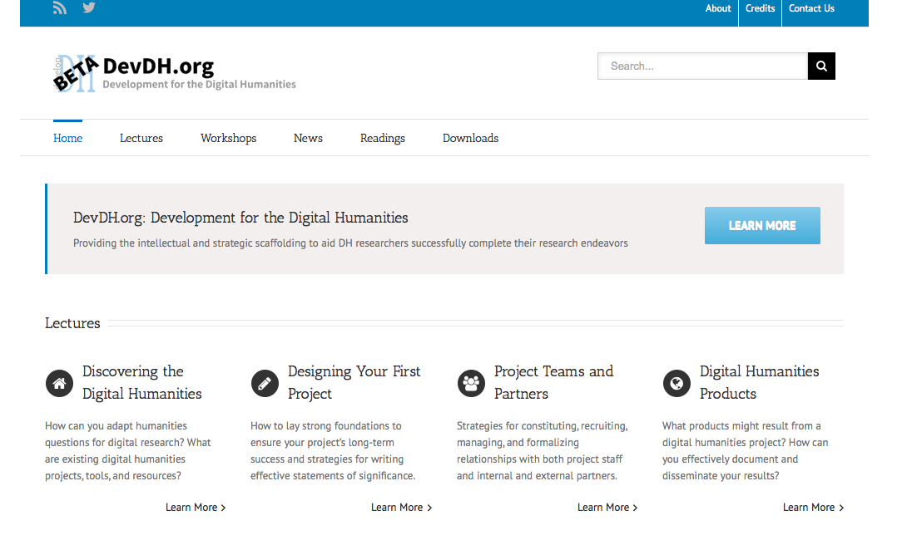
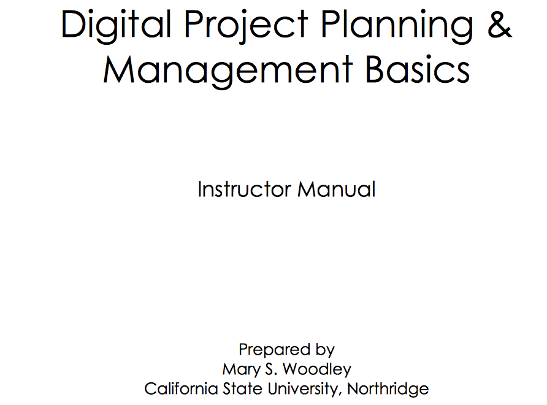
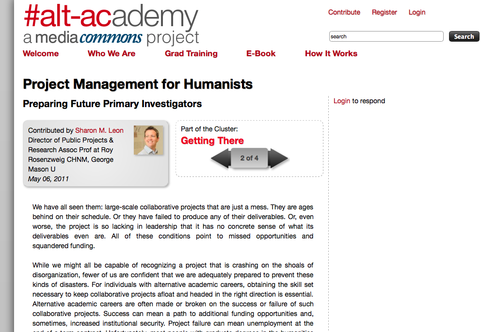
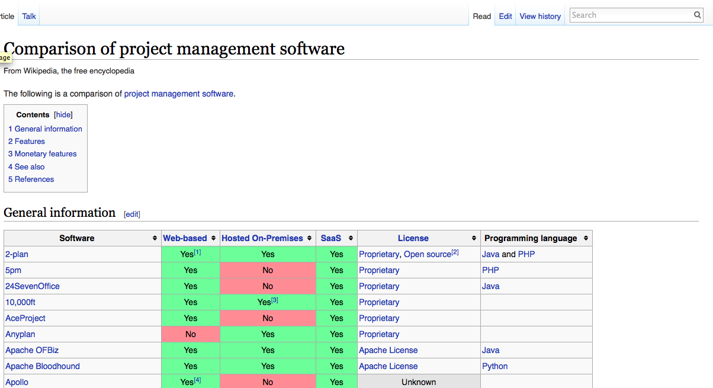
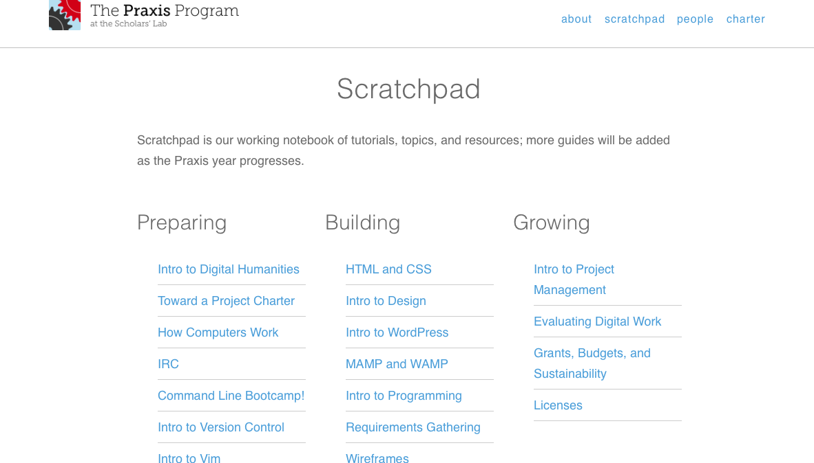
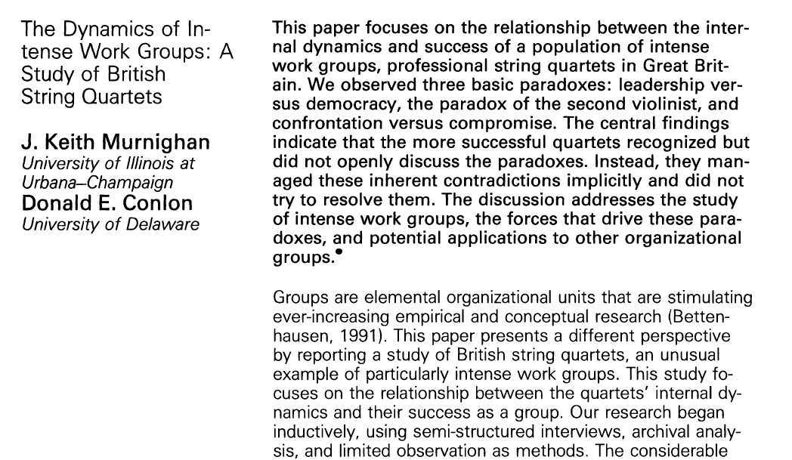
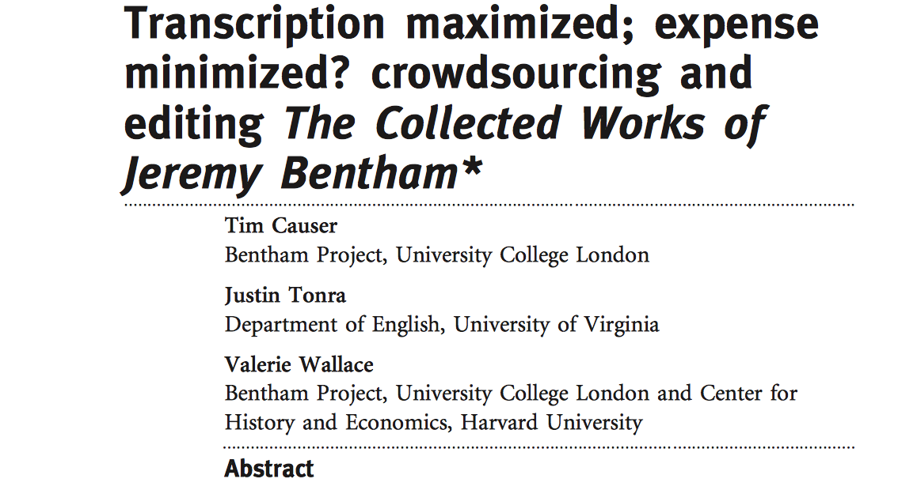

--- 
title: Digital Pedagogy in the Humanities
subtitle: Concepts, Models, and Experiments 
chapter: Project Management
URL: keywords/projectManagement.md
author: 
- family: Siemens
  given: Lynne
editor: 
- family: Sayers
  given: Jentery
publisher: Modern Language Association
type: book
---

# PROJECT MANAGEMENT (Draft)

### [Lynne Siemens](https://lynnesiemens.wordpress.com)
University of Victoria, School of Public Administration 

---

##### Publication Status:
* unreviewed draft
* draft version undergoing editorial review
* **draft version undergoing peer-to-peer review**
* published

--- 

## CURATORIAL STATEMENT

Following trends in other disciplines and parts of the university, humanities researchers along with librarians, content experts, students, and others are turning to collaborations to explore increasingly complex questions and implement new types of methodologies and tools, such as those in digital humanities (DH). Further, granting agencies are encouraging this trend with targeted programs such as Digging into Data and Partnership Grants. As a result, teams need to understand ways to coordinate efforts among tasks and members in order to accomplish project objectives and satisfy stakeholders (Siemens and INKE Research Group 2014; Siemens 2009). With its associated methods, tools, and techniques, project management provide a way to coordinate people, tasks and resources (Siemens 2012).

While most individuals would not (hopefully) deny the need for the effective planning and managing of projects, knowledge and skills about the topic are typically not a formal part of training in the humanities (Leon 2011; Siemens 2013). Instead, the gap tends to be filled on a more ad hoc basis through workshops and/or the school of hard learned experience, often very effective but can be costly in terms of time, resources and reputation (Guiliano 2012; Simeone *et al.* 2011; Causer, Tonra and Wallace 2012; Siemens and INKE Research Group 2012; 2013; National Endowment for the Humanities Office of Digital Humanities 2010).

Simply stated, though complicated in practice, project management is “the application of processes, methods, knowledge, skills and experience to achieve the project objectives” (Association for Project Management n.d.). Within this context, a project is a unique endeavor that is undertaken to achieve specific outputs, outcomes and/or benefits within an agreed upon timeframe and budget (Association for Project Management n.d.; Siemens 2012). Given these definitions, it is clear that those in Humanities undertake projects on a regular basis but may not necessarily have the knowledge and skills to do so successfully. Hence, there is a need for training in project management.

From a pedagogical perspective, project management can be taught in contexts such as DH-oriented courses (Bailar and Spiro 2013), stand-alone courses (University of Alberta 2015), training programs (Praxis 2011), project management workshops (HILT 2015; DHSI 2015; European Summer University in Digital Humanities 2015). The topic lends itself well to hands-on learning where participants create project plans as they engage the material. As will be seen below, there are a variety of digital tools which can aid project planning, coordination and reporting.

What follows below is a variety of materials that could be used within undergraduate and graduate courses or workshops engaging project management. Those who are already part of a project will find these resources useful for undertaking initial planning or managing ongoing work.  

## CURATED ARTIFACTS 

### DevDH

 
* Source URL: http://devdh.org
* Creator: Jennifer Guiliano (Indiana University-Purdue University Indianapolis) and Simon Appleford (Creighton University)

Jennifer Guiliano and Simon Appleford created this site, drawing on their experience as project managers and team members. It is a repository of training materials, recorded lectures, exemplars, and links about project management within digital humanities. It covers topics such as team development, budgeting, publicity campaigns, data management, and others. This resource would be useful in project management workshops and courses and individuals planning their first (or subsequent) project. It should be noted that the budget section is oriented towards American funding agencies. Instructors and students may find the lectures particularly useful as supplements to lecture material. Overall, this site provides a useful introduction to project management.

### Digital Project Planning and Management Basics, Instructor Manual 

* Source URL: http://www.loc.gov/catworkshop/courses/digitalprojplan/pdf/Instructor-Final.pdf  
* Creator: Mary S. Woodley (California State University, Northridge)

This is a workshop manual for a two-day workshop on digital project management, developed on behalf of the Library of Congress and the Association for Library Collections and Technical Services. Topics include team building and planning, business plan development, planning and grant writing, project management, and outcome evaluation and assessment. The manual includes slides, instructor notes, and classroom activities and exercises. The accompanying trainee manual is available at http://www.loc.gov/catworkshop/courses/digitalprojplan/pdf/Trainee-Final.pdf. These guides would be useful as a resource within courses and workshop and individuals planning and managing their projects. This resource could become the foundation for a course or workshop in the topic.

### Project Management for Humanists: Preparing Future Primary Investigators 

* Source URL: http://mediacommons.futureofthebook.org/alt-ac/pieces/project-management-humanists
* Creator: Sharon M. Leon (George Mason University)

Drawing upon her perhaps hard learned experiences, Sharon Leon presents a guide to project management, geared to the humanities practitioner undertaking their first digital project. She covers topics such as managing the project and project manager and running efficient meetings. She also offers some thoughts on models for changing graduate education to better prepare humanities practitioners for project work and collaborations. Anyone who is looking for a "getting started" guide to project management will find this a useful article. This article could serve as an introduction to project management within a course. It would also serve as a foundation article for larger discussions about graduate education and necessary skills for collaboration in and outside of the academy.

### Comparison of Project Management Software

* Source URL: http://en.wikipedia.org/wiki/Comparison_of_project_management_software
* Creator: The Crowd

People often ask which software is best to use for project management. No easy answer exists. This Wikipedia page provides a comparison of the plethora of project management software across criteria, such as whether it is web-based, hosted on premises, and open source. It should be noted that this list does not include apps and "low tech" methods, such as white boards, flip charts, post-it notes, and markers. I have taught project management with both “low tech” and “higher tech” methods. Typically, I have students first plan with paper, post-it notes, and markers. In this way, they focus on the thought process of project planning, rather than the benefits and constraints of a particular software. Once they have the basics of a plan, then they can translate it to a digital form that is appropriate to the project. Given the variety of software, online project spaces, apps that are available, I do not recommend any specific one. It depends on the project and the team.

### Office of NEH Progress Reports on Grants (Summary Findings of NEH Digital Humanities Start-Up Grants, 2007–2010)

* Source URL: http://www.neh.gov/files/divisions/odh/odh-resource-summary.report.odh_.sug_.pdf
* Creator: National Endowments for the Humanities

While this resource may seem like a surprising choice for this list, it provides a summary of outcomes from the first round of National Endowment of the Humanities Digital Humanities Start-up Grants, including a survey of project directors and a summary of end-of-grant "white papers," which distill lessons learned from the projects. Among other things, respondents reflected on the importance of goal setting, team work, and contingencies planning, all foundations of project management. Anyone planning their first project and applying for funding would find this report an interesting read. This report and associated white papers would make a good classroom exercise where students highlight the types of challenges that one might encounter with digital projects.

### The Praxis Program at the Scholars' Lab

* Source URL: http://praxis.scholarslab.org
* Creator: The Scholars’ Lab (University of Virginia) 

The Praxis Program at the Scholars' Lab is a training program in which graduate students at University of Virginia are funded to work as a team to develop a digital humanities project or tool. To prepare students for this work, the program has developed a series of modules, including "toward a project charter," "intro to project management," and "grants, budgets and sustainability." The participants regularly blog about their experiences. The blog and associated resources would be appropriate for project management workshops and courses as required reading.  The blog provides real time insights into the life of a project and team as they work together to develop a tool. Instructors might consider having their students blog about the experience of planning and coordinating projects.

### Collaborators’ Bill of Rights

* Source URL: http://mcpress.media-commons.org/offthetracks/part-one-models-for-collaboration-career-paths-acquiring-institutional-support-and-transformation-in-the-field/a-collaboration/collaborators’-bill-of-rights/
* Creator: Participants in the "Off the Tracks: Laying New Lines for Digital Humanities Scholars" Workshop

Teamwork and collaboration is a key component of any project, particularly within digital humanities. However, clear models for recognizing team member contributions to digital projects are not present within the humanities, with its historical emphasis on the single author. As a result, the participants of the "Off the Tracks – Laying New Lines for Digital Humanities Scholars" workshop developed the collaborators’ bill of rights with the fundamental principle that "all kinds of work on a project are equally deserving of credit . . ." Anyone starting a digital project with other individuals will want to refer to this document to guide discussions about the different ways to recognize effort within the project.  It could also serve as a foundation document for the development of project charters (see the examples below.)

### The Iterative Design of a Project Charter for Interdisciplinary Research 

* Source URL: http://dl.acm.org/citation.cfm?id=1394476
* Creator: Stan Ruecker (Illinois Institute of Technology) and Milena Radzikowska (Mount Royal University)

This paper outlines Stan Ruecker and Milena Radzikowska’s experience using a project charter within their collaborations as a way to reduce misunderstandings. This charter makes explicit several principles that guide the working relationship between researchers from different disciplines. Digital projects often include humanists, computer scientists, programmers, librarians and others, representing a variety of perspectives. There can be differences in areas such as authorship conventions, appropriate research questions, methodologies and outputs, work patterns and others. A charter can make these implicit understandings more explicit and reduce potential misunderstandings and conflicts in advance as well as serve as a resource if a project develops problems between team members. This article will be of interest to anyone who is looking for a project charter template for their digital project. Along with the Collaborators’ Bill of Rights, it could be used as a starting point for discussions for teams to develop their own charter. Further, drawing upon various project charters, students could brainstorm the types of problems that teams might encounter. (The Praxis program and Implementing New Knowledge Environments (INKE) also have additional examples of charters.)

### The Dynamics of Intense Work Groups: A Study of British String Quartets

* Source URL: http://www.jstor.org/stable/2393352?seq=1#page_scan_tab_contents
* Creators: J. Keith Murnighan (University of Illinois at Urbana-Champaign) and Donald E. Conlon (University of Delaware)

This article provides an interesting comparison between work groups and string quartets, between the balance of the individual and team. Successful string quartets are by definition both individualistic (with different instruments playing a variety of parts) and highly interdependent (as they play a coordinated sound). Like productive research collaborations, there is little room for individually focused musicians in successful string quarters. This article is good for anyone trying to determine if they are ready to work within a team.  Most, if not all, digital projects are undertaken within teams so it is important to understand ways to work together. Along with the Collaborators’ Bill of Rights and examples of project charters, this article would be a good one to start discussion around collaboration.

### Transcription Maximized; Expense Minimized? Crowdsourcing and Editing the Collected Works of Jeremy Bentham

 
* Source URL: http://llc.oxfordjournals.org/content/early/2012/03/28/llc.fqs004.full.pdf
* Creator: Tim Causer (University College London), Justin Tonra (University of Virginia), and Valerie Wallace (University College London/Harvard University)

An important part of project management is reflection at a project's completion to determine lessons learned. However, teams do not often take this step. This article is an exception, with an excellent review of the Transcribe Bentham project, touching on evaluation of project success against cost-effectiveness, public engagement and access, quality control, volunteer management, and other topics. These lessons are relevant to anyone considering a crowdsourcing project and other forms of digital projects. Within a project management course and/or workshop, this article would serve as a model for honest project reflection, dwelling on both the successes and challenges. It also serves to show that reflection is not only for the project team, but also for a wider audience through peer-reviewed outlets.

## RELATED MATERIALS

Duarte, Deborah L., and Nancy Tennant Snyder. Mastering Virtual Teams. 3rd ed. New York, New York: John Wiley & Sons, Inc., 2006.

Howard Hughes Medical Institute, and Burroughs Wellcome Fund. Making the Right Moves: A Practical Guide to Scientific Management for Postdocs and New Faculty. 2nd ed. Research Triangle Park, North Carolina: Howard Hughes Medical Institute, Burroughs Wellcome Fund, 2006.

Knutson, Joan, and Ira Bitz. Project Management: How to Plan and Manage Successful Projects. New York, New York: AMACOM, 1991.

Olson, Gary M., and Judith S. Olson. "Distance Matters." Human-Computer Interaction 15.2/3 (2000): 139-78.

Siemens, Lynne, and INKE Research Group. "INKE Administrative Structure: Omnibus Document." Scholarly and Research Communication 3.1 (2012). http://src-online.ca/index.php/src/article/view/50

## WORKS CITED

Appleford, Simon, and Jennifer Guiliano. "Devdh: Development for the Digital Humanities". 2013. March 5, 2015. <http://devdh.org>.

Association for Project Management. “What is Project Management?”. Nd. July 7, 2015. <http:// https://www.apm.org.uk/WhatIsPM.

Bailar, Melissa, and Lisa Spiro. "Introduction to Digital Humanities". 2013. March 5, 2015. <http://digitalhumanities.rice.edu/fall-2013-syllabus/%3E.

Causer, Tim, Justin Tonra, and Valerie Wallace. "Transcription Maximized; Expense Minimized? Crowdsourcing and Editing the Collected Works of Jeremy Bentham." Literary & Linguistic Computing 27.2 (2012): 119-37.

"Comparison of Project Management Software". 2015. The Free Encyclopedia. Wikimedia Foundation Wikipedia, Inc.: March 5, 2015. <http://en.wikipedia.org/wiki/Comparison_of_project_management_software>.

DHSI. "Digital Humanitites Summer Institute". 2015. March 5, 2015. <http://dhsi.org/%3E.

Guiliano, J. "NEH Project Director’s Meeting: Lessons for Promoting Your Project." MITH Blog 2012. Vol. October 3, 2012.

HILT. "Courses". 2015. March 5, 2015. <http://www.dhtraining.org/hilt2015/%3E.

Howard Hughes Medical Institute, and Burroughs Wellcome Fund. Making the Right Moves: A Practical Guide to Scientific Management for Postdocs and New Faculty. 2nd ed. Research Triangle Park, North Carolina: Howard Hughes Medical Institute, Burroughs Wellcome Fund, 2006.

Knutson, Joan, and Ira Bitz. Project Management: How to Plan and Manage Successful Projects. New York, New York: AMACOM, 1991.

Leon, Sharon M. "Project Management for Humanists: Preparing Future Primary Investigators". 2011. June 24, 2011. <http://mediacommons.futureofthebook.org/alt-ac/pieces/project-management-humanists%3E.

Murnighan, J. Keith, and Donald E. Conlon. "The Dynamics of Intense Work Groups: A Study of British String Quartets." Administrative Science Quarterly 36.2 (1991): 165-86.

National Endowment for the Humanities Office of Digital Humanities. Summary Findings of NEH Digital Humanities Start-up Grants (2007-2010). Washington, D.C.: National Endowment for the Humanities, 2010.

Off the Tracks. "Collaborators’ Bill of Rights". 2011. March 5, 2015. <http://mcpress.media-commons.org/offthetracks/part-one-models-for-collaboration-career-paths-acquiring-institutional-support-and-transformation-in-the-field/a-collaboration/collaborators’-bill-of-rights/>.

Olson, Gary M., and Judith S. Olson. "Distance Matters." Human-Computer Interaction 15.2/3 (2000): 139-78.

Ruecker, Stan, and Milena Radzikowska. "The Iterative Design of a Project Charter for Interdisciplinary Research." DIS 2007. 2007.

Scholars' Lab. "The Praxis Program at the Scholars' Lab". 2011. September 12, 2011. <http://praxis.scholarslab.org/%3E.

Siemens, Lynne. "DHSI Project Planning Course Pack". 2012. March 5, 2015. <http://dhsi.org/content/2012Curriculum/12.ProjectPlanning.pdf%3E.

Siemens, Lynne. "'It's a Team If You Use "Reply All": An Exploration of Research Teams in Digital Humanities Environments." Literary & Linguistic Computing 24.2 (2009): 225-33.

Siemens, Lynne. "Meta-Methodologies and the DH Methodological Commons: Potential Contribution of Management and Entrepreneurship to Dh Skill Development." DH 2013. 2013.

Siemens, Lynne, and INKE Research Group. "Firing on All Cylinders: Progress and Transition in INKE's Year 2." Scholarly and Research Communication 3.4 (2012): 1-16.

Siemens, Lynne, and INKE Research Group. "INKE Administrative Structure: Omnibus Document." Scholarly and Research Communication 3.1 (2012). 

Siemens, Lynne, and INKE Research Group. "Research Collaboration as “Layers of Engagement”: INKE in Year Four." Scholarly and Research Communication 5.4 (2014): 1-12.

Siemens, Lynne, and INKE Research Group. "Responding to Change and Transition in INKE’s Year Three." Scholarly and Research Communication 4.3 (2013): 12 pp.

Simeone, M., *et al.* "Digging into Data Using New Collaborative Infrastructures Supporting Humanities-Based Computer Science Research." First Monday 16.5 (2011).

The European Summer University in Digital Humanities. ""Culture & Technology" - the European Summer University in Digital Humanities". 2015. March 5, 2015. <http://www.culingtec.uni-leipzig.de/ESU_C_T/node/97%3E.

University of Alberta. “Humanities Computing”. July 7, 2015. <http:// https://uofa.ualberta.ca/interdisciplinary-studies/grad/humanities-computing.

Woodley, Mary S. Digital Project Planning & Management Basics: Instructor Manual, 2008.
