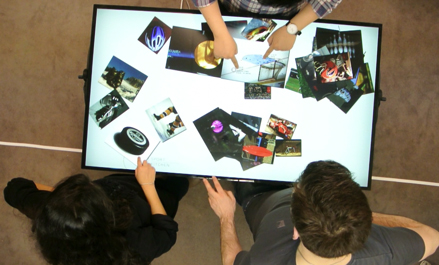
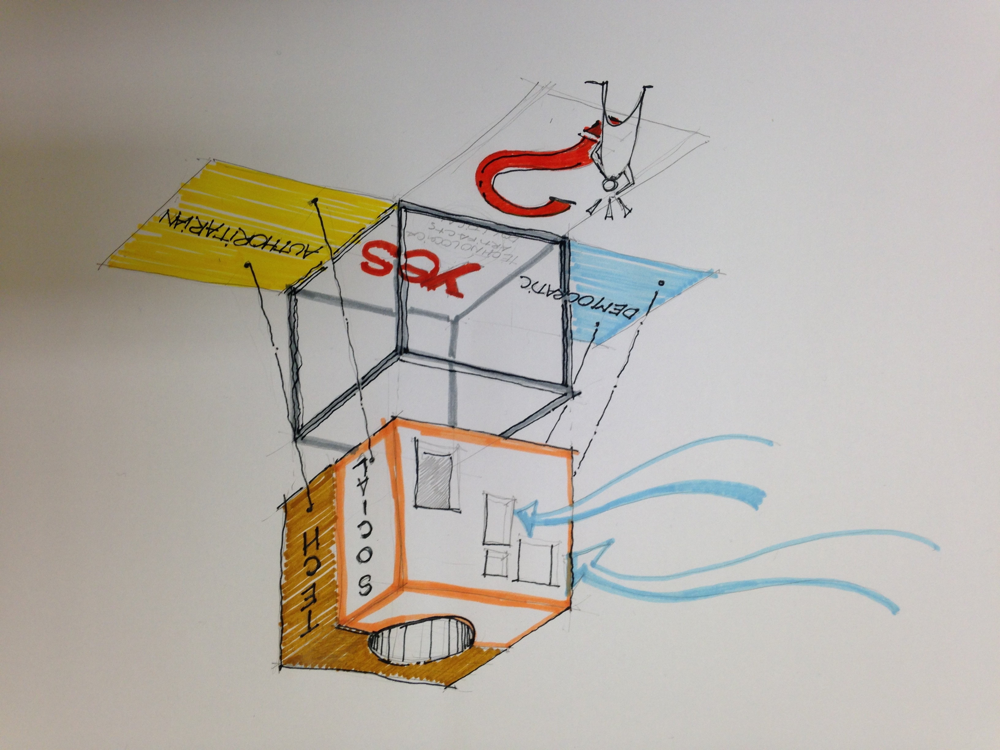
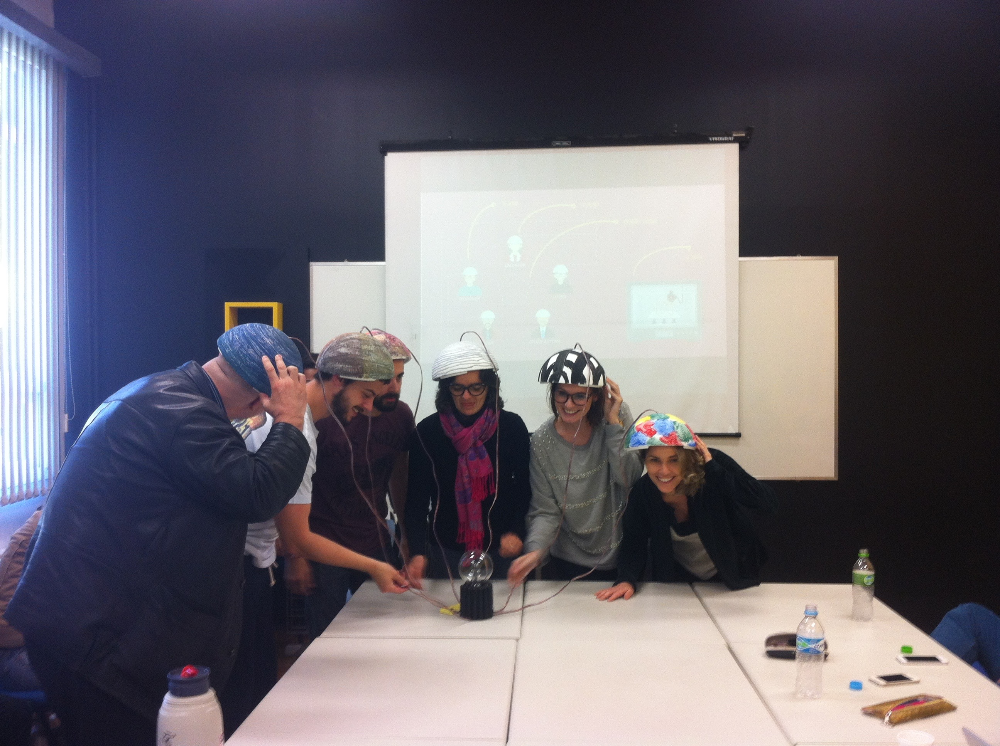
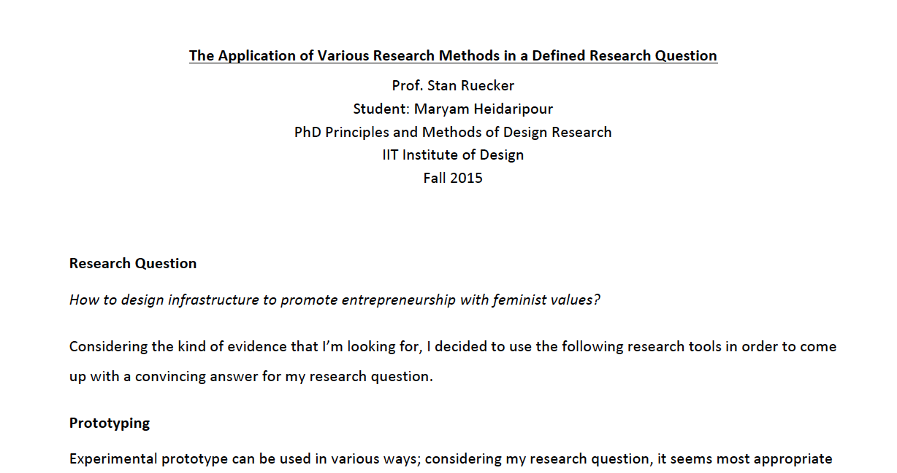
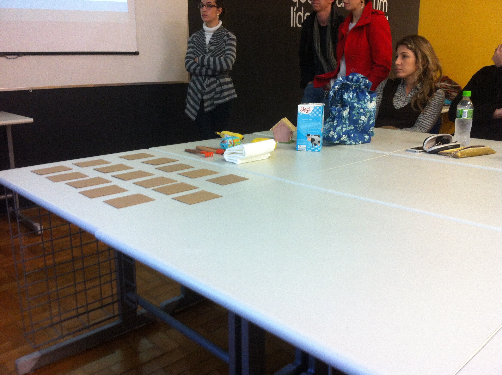
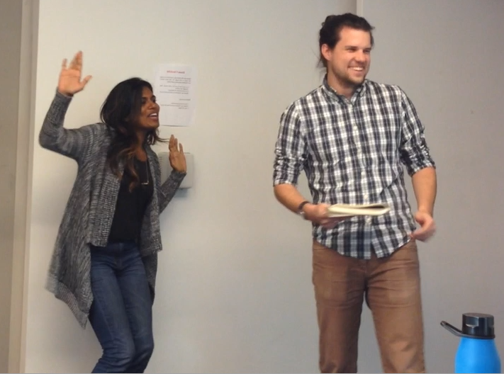
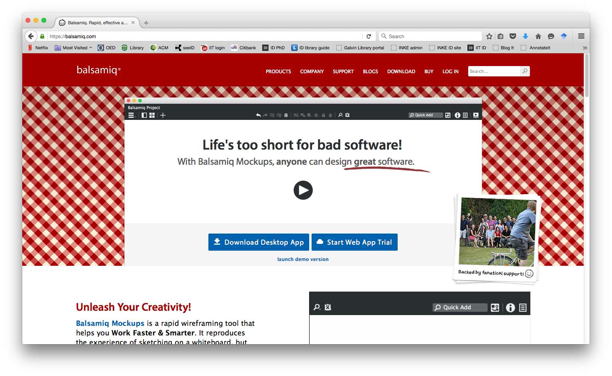
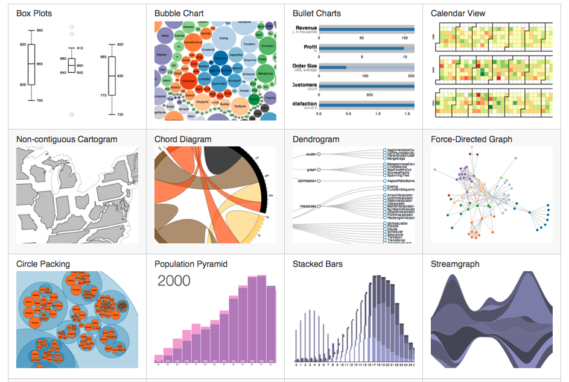

# PROTOTYPE

## Stan Ruecker ( [IIT Institute of Design](http://www.id.iit.edu)), Celso Scaletsky ([Unisinos](http://www.unisinos.br/design)), Guilherme Meyer ([Unisinos](http://www.unisinos.br/design)), Chiara Del Gaudio ([Unisinos](http://www.unisinos.br/design)), Piotr Michura ([Jan Matejko Academy of Fine Arts in Krakow](http://www.asp.krakow.pl)), and Gerry Derksen ([Winthrop University](http://www.winthrop.edu/cba/digitalinformationdesign/default.aspx?id=11776))

---

##### Publication Status:
* unreviewed draft
* **draft version undergoing editorial review**
* draft version undergoing peer-to-peer review
* published 

--- 

## CURATORIAL STATEMENT

# Why Students Need Prototypes: to engage with ideas 

Having students develop prototypes in the classroom is a good way of having them engage with ideas. A prototype can be used for interrogating a concept. Further, it will involve a particular strategy for addressing the concept. This is important in its own right, but it is also useful for students who may not agree with the approach taken. Because they have seen one strategy, they can begin to think of others.

>MATT: This is a great start, but I think you should consider defining what you mean by "prototype" very earlier on in this piece -- ideally in this first paragraph. A very short gloss is all you need

Third, a prototype has specific details that can serve as topics for discussion. Fourth, as Dobson et al. (2015) point out, prototypes can also give us ideas about other concepts, because they start people thinking not just about the concept in front of them, but also adjacent ones.

>MATT: It looks like some text got cut out here inadvertently, as this paraggraph begins with "third." I rechecked the file you sent to see if I had introduced the error, but that doesn't appear to be the case. In any case, it looks like this section may provide what I was asking for earlier.

Going further, we have argued (Ruecker and INKE 2015) that prototypes can exist for three reasons, which are experiment, development, and provocation. They overlap a bit, but are distinct enough to provide some pins in the map. An experimental prototype is one created in order to get at ideas. By contrast, a development prototype would be one in a series that would result in a polished version at the end. The rough drawings would get refined; the features would be formalized; there would need to be packaging and a catchy name and so on. None of those crucial issues for a development prototype are important for an experimental prototype: the goals are different.

>MATT: I find this paragraph to be a bit abstract and hard to follow. Might be useful to have a use case at hand as you work through all of these different ways in which a prototype could function in the design process? That would allow you to provide a concrete example, and if you were able to use that same example for multiple parts of the process, it would help people -- especially people who don't usually design or make things -- understand more clearly what you are describing.

Finally, there are provocative prototypes (e.g. Mogensen 1992), which are to help people change their point of view, or perhaps even realize that they have one. 

>Matt: Again, a concrete example here would be good.

Some people  might argue that all prototypes are part of a development process, and that the provocative ones are just closer to the beginning, followed by the experimental ones, and ending with the development ones. If that’s the case, and it could very well be, then not all projects involve all three kinds, nor should they.

# Why Graduate Students and Other Researchers Need Prototypes: to address research questions

What many disciplines don’t have is the concept of generative knowledge, by which we mean that the goal of the research is to learn something about what does not yet exist. We might be learning how something that doesn’t yet exist might work or how it could fit into society. We might be learning how better to create something new, so that it is easier, more effective, smarter, and so on.

>MATT: This is good. I would just remind you that this is a publication focused on pedagogy. Obviously, research is involved in pedagogical situations, but I think you could make that clear more explicitly here. The overall aim of this keyword should be to help people think about the role that prototyping can play in the classroom and/or in the design of digital (and other) projects. 

>MATT: please recognize, too, that this collection is aimed at teachers of both graduate and undergraduate students

Whereas in the sciences people might create a research instrument to try to figure out what is, in the generative disciplines they can start to learn about what does not yet exist by creating prototypes of it.

A prototype, like a design or a scenario, is a model of something that might exist in the future. The word has two meanings: it could be a model that exists as a template for copying; it could also be an expression of some aspect of what might exist. For example, one series of physical prototypes might explore possible forms, while others look at alternative finishes. One experience prototype might deal with what people will see, while another focuses on what they are hearing. In computer science, we also speak of horizontal vs vertical prototypes – the former shows all features but they can’t be used yet; the latter shows only some of the features, but they are developed enough to try out. Many projects create T-shaped prototypes, where (on the crossbar of the T) everything is there at a superficial level, and some parts (the trunk of the T) work.
In the case of experimental prototypes to help us address research questions, the features of the prototype should express aspects of the research question.

>MATT: This is *great* and I think should be moved much higher up -- possibly to the first paragraph. This is exactly what I was asking for earlier.

To return to the main point, however, what does it mean to have a prototype address a research question? How can they be designed and used in this way? 

>MATT: re "address a research question" -- can you be clearer about how this fits in the classroom?

1. Prototype as object of user study. We design a system and get a lot of people to try it, observe them, vary the parameters, try again.

2. Prototype as tool for thinking. 
* We learn a lot about the topic just by designing the system and thinking about it once we have it in front of us.
* We learn something further by observing one group using it.
* We don’t even finish designing the system, but learn from the process of designing the first iterations.

3. Prototype as a model of the topic area.

>MATT: This is all great, but I would suggest some restructuring of this intro as a whole. I think you should lead with an introduction to what prototypes are; then move to a discussion of different types of prototypes (experiment, development, provocation), and then move to how they are used (what you have here at the end).

>MATT: Two other things to consider: you should consider grouping your artifacts below into sections. See the Failure keyword (https://github.com/curateteaching/digitalpedagogy/blob/master/keywords/failure.md) or the Poetry keyword (https://github.com/curateteaching/digitalpedagogy/blob/master/keywords/poetry.md) for nice examples of how to do that. The other thing you need to do in this section is explain your rationale for choosing the artifacts to showcase here. What principles guided your selection? Why these artifacts and not others? What goals did you have in mind while choosing them?

## CURATED ARTIFACTS

# "Prototypes as Steps Toward Production"

* Type: Assignment
* Copy of the artifact: 
* MDes students, IIT Institute of Design, Chicago
When most people hear the word "prototype," this is the kind that comes to mind. The students are tasked with solving a problem, and create a series of prototypes that increasingly converge on a solution. The primary goal is to address the design brief, rather than inform a research question. In this example, students were asked to create a prototype system for managing digital images throughout the design process. This photo shows several of them working on a touch surface running their prototype software system.

>MATT: Can you explain how others might use this in their own classrooms?

# "Prototypes as Models of Article Content"

* Type: Assignment
* Copy of the artifact: 
* MDes students, Unisinos, Porto Alegre, Brazil
A prototype is a kind of model, and in this case the assignment is to create a prototype that models the contents of an academic article. The class will have previously read the paper; the content model is sketched in order to facilitate discussion.

>MATT: This annotation could be explicated fruitfully. Can you say a bit more about how prototypes were used in this example and how others reading this could adapt it for use in their own classrooms?

# "Prototypes Responding to an Article"

* Type: Assignment
* Copy of the artifact: 
* Xinyue Zhou, MDes student, IIT Institute of Design, Chicago
For this assignment, students are asked to read a paper, then create a prototype that can help the class think about the implications of the topic. In this case, the students had read Langdon Winner's (1986) chapter "Do Artifacts Have Politics?" in The Whale and the Reactor, but any article will do. The exercise has several steps that can be spread over multiple weeks: (1) discuss the paper (2) generate sketches for at least 3 concepts (3) produce a prototype of the selected concept (4) revise the prototype based on feedback.

The "baby bottles" interrogate the idea of teaching children about national identity. It is an inevitable process, but how soon is too soon? The student originally placed the flags on the body of the bottle, but in her revision she moved them to the nipple, since it is more clearly about the child. Flags on the bottom of the bottle would be there for the parents to see. She used 3 different flags to encourage us to think about how these artifacts would be received in different countries.

>MATT: I will note this separately, but there should be a greater range of institutions represented among these artifacts

# "Prototypes for Developing a Research Topic"

* Type: Assignment
* Copy of the artifact: 
* MDes students, Unisinos, Porto Alegre, Brazil
* This exercise is for graduate students developing a thesis topic. They are asked to create a prototype whose features can help them think about specific aspects of the research question.
In this case, a student team was asked to design a prototype related to the question: "how can the interpretation of the user more clearly match the intention of the designer?"

Their response was that a design process that gave the designer more insight into the user's thinking would help. The prototype imagines telepathic communication among stakeholders, each of whom is wearing a different hat. 
Thinking about what this kind of mental contact would mean led the team to realize that the process is not about perfect knowledge of the user, but instead about negotiation.

# "Prototypes as Objects of Study"

* Type: Assignment
* Copy of the artifact: [files/prototype--4-research-tools.pdf](files/prototype--4-research-tools.pdf)
* Maryam Heidaripour, PhD student, IIT Institute of Design, Chicago
* In the sciences and social sciences, researchers must occasionally design research instruments that will help them to investigate an existing object of study. For example, if we want to know about people's opinions, we can design an opinion survey. If we want to know about the ether, we design the Michelson-Morley experiment.
For many disciplines, however, the object of study does not yet exist--it is a possible future. In this assignment, PhD students are asked to design a set of research tools consisting of a prototype, pilot study, experimental design, and quasi-experimental design (which mines existing data for factors that would have been controlled had the researcher set up the original study).

# "Prototypes to Strengthen Empathy"

* Type: Assignment
* Copy of the artifact: 
* MDes students, Unisinos, Porto Alegre, Brazil
* In this project, students are asked to design a prototype that will give its users an experience analogous to an actual experience, in order to gain additional understanding.

For this example, the students created a paper prototype consisting of a "memory game" where cards placed face down need to be paired with cards drawn from a pack.

This team was interested in the obstacles preventing children in under-resourced communities from getting to school. Pairs of cards included "have to look after my younger sibling", "need to get food," "have to earn money to support the family" and so on.

However, there was a card in the pack labeled "go to school" which had no partner in the cards that were face down on the table. Their idea was that the frustration experienced by the players as they were repeatedly confronted with obstacles but could never actually get to school would be instructive.

# "Prototyping Experience"

* Type: Assignment
* Copy of the artifact: 
* MDes students, IIT Institute of Design, Chicago
* Although a prototype to help increase empathetic understanding is one form of experience prototype, it is not the only form. In this assignment, students were asked to design a positive experience for people interested in thinking about issues of sustainable innovation.

The game involved 2 teams, each given a brief about a sustainability project that they had to sell to stakeholders. My team had to pitch local production for McDonalds; the other team got new cell phones from Motorola that had readily serviceable parts. 

The stakeholders were randomly chosen: a child, a senior, parents, the c-suite, a lawyer. Finally, the teams had to use a mode of communication, determined by rolling the die: drawing, acting, singing, rapping. If the other team voted that the pitch was convincing, the presenters got to roll a different die to move their piece on the game board. Even choosing which team got to go first was fun—we did it by thumb wrestling.

# "Balsamiq"

* Type: Programming resources for visual interfaces
* Copy of the artifact: 
* [https://balsamiq.com/](https://balsamiq.com/)
* Balsamiq is a commercial online wireframing tool for people mocking up more or less conventional websites. It is intended to help get the interaction model right. Their slogan is: "Life's Too Short for Bad Software!"

# "Marvel"

* Type: Programming resources for visual interfaces
* Copy of the artifact: 
* [https://marvelapp.com/](https://marvelapp.com/)
Marvel is a free online prototyping tool for multiple devices. It allows the designer to use their own imagery for all components and link them up to show how the system will move among pages.

# "D3"

* Type: Programming resources for visual interfaces
* Copy of the artifact: 
* [http://d3js.org/](http://d3js.org/)
* Mike Bostock, D3 
D3 is a free, open-source javascript library that simplifies the process of creating visual interfaces for the web. It includes a wide range of examples that learners can download and modify in order to become familiar with the system.

## RELATED MATERIALS
The prototyping exercises we've described can be done in a variety of ways--as sketches on paper, with physical materials, as software, or using electronic hardware. Here we list some useful resources for electronic hardware projects.

* https://www.makerbloks.com/en/
* http://littlebits.cc/bitcraft
* http://www.makeymakey.com/
* https://www.arduino.cc/
* https://www.raspberrypi.org/products/raspberry-pi-2-model-b/

## WORKS CITED
Dobson, Teresa M., Monica Brown, Dustin Grue, Ernesto Peña, Geoff Roeder, and the INKE Research Team (2015). The Interface Implications of Understanding Readers. Special Issue: The Future of Reading. Ed. Stan Ruecker. Interdisciplinary Science Reviews 40.1 (March).
Galey, Alan, Stan Ruecker, and the INKE Research Group. “How a Prototype Argues.” Literary and Linguistic Computing. 25(3). 2010.
Meyer, Guilherme, Chiara Del Gaudio, Stan Ruecker, Piotr Michura, and Celso Carnos Scaletsky (2016). ”Learning to Create Prototypes to Address Research Questions.” Proceedings of the International Conference on Educational Technology Research, Izmir, Turkey. Feb 11-13, 2016.
Mogensen, P., (1992). “Towards a Provotyping Approach in Systems Development,” Scandinavian Journal of Information Systems 4(1): Article 5.
Ruecker, Stan and the INKE Research Group. “A Brief Taxonomy of Prototypes for the Digital Humanities.” Scholarly and Research Communication. 6(2), 2015.
Scaletsky, Celso, Santosh Basapur, and Stan Ruecker. “The Generative Similarities of Designs, Prototypes, and Scenarios.” Proceedings of the 11th Annual Research and Development + Design Conference (P&D Design 2014).  Sept 29-Oct 12, 2014. Gramado, Brazil.
Winner, Langdon. (1986). “Do Artifacts Have Politics” In The Whale and the Reactor: A Search for Limits in an Age of High Technology. Chicago: University of Chicago Press.