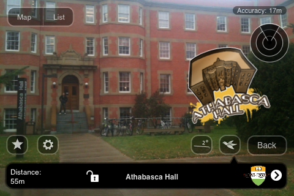
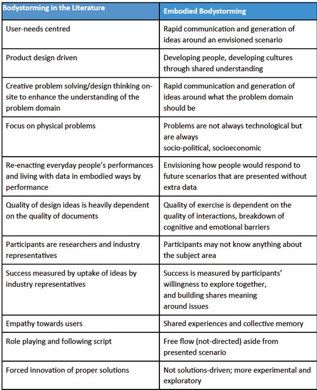
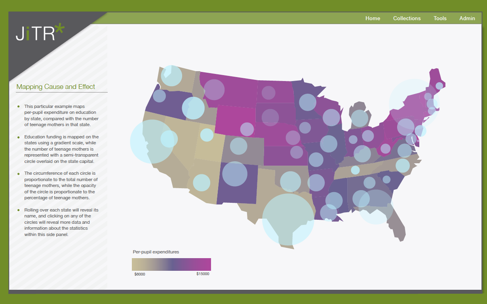
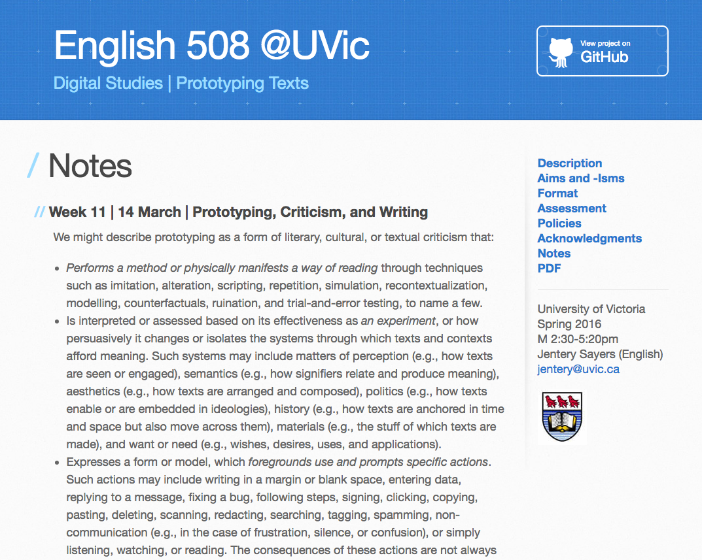
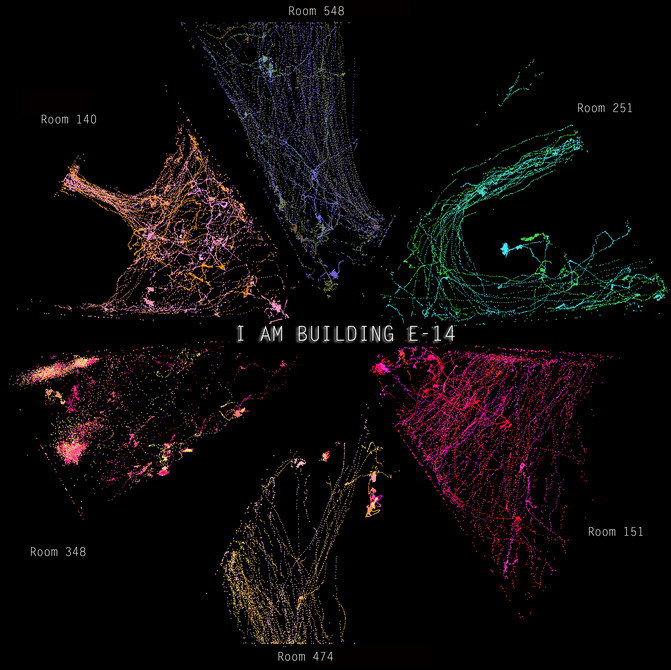

# PROTOTYPE

## Stan Ruecker ( [IIT Institute of Design](http://www.id.iit.edu)), Celso Scaletsky ([Unisinos](http://www.unisinos.br/design)), Guilherme Meyer ([Unisinos](http://www.unisinos.br/design)), Chiara Del Gaudio ([Unisinos](http://www.unisinos.br/design)), Piotr Michura ([Jan Matejko Academy of Fine Arts in Krakow](http://www.asp.krakow.pl)), and Gerry Derksen ([Winthrop University](http://www.winthrop.edu/cba/digitalinformationdesign/default.aspx?id=11776))

---

##### Publication Status:
* unreviewed draft
* **draft version undergoing editorial review**
* draft version undergoing peer-to-peer review
* published 

--- 

## CURATORIAL STATEMENT

# Why Students Need Prototypes: to engage with ideas 

Prototypes are provisional models of ideas that help us investigate, communicate, and remember specific aspects of those ideas. A prototype, like a design or a scenario, is a model of something that might exist in the future. The word "prototype" has two meanings: first, a prototype could be a template for copying; second, it could be an expression of some aspect of what might exist. For example, one series of physical prototypes might explore possible forms (e.g. what dimensions; are the corners round or square?), while others might look at various materials (e.g. plastic, aluminum, steel). One experience prototype (for the design of a shopping experience, for example) might deal with what people will see, while another might focus on what they will hear. Computer scientists speak of horizontal vs vertical prototypes: the former shows all features, including those that cannot yet be used; the latter shows only some  features, but they are developed enough to try out. Many projects create T-shaped prototypes, where (on the crossbar of the T) all the elements of the design are there at a superficial level, and some parts (the trunk of the T) function much the way they will in the final version. These are just some of the ways in which prototypes can model ideas.

Having students develop prototypes in the classroom is therefore a good way of having them engage with ideas. First, a prototype can be used for interrogating a concept. Second, it will involve a particular strategy for addressing the concept. This is important in its own right, but it is also useful for students who may not agree with the approach taken. Because they have seen one strategy, they can begin to think of others. Third, a prototype has specific details that can serve as topics for discussion. Fourth, as Dobson et al. (2015) point out, prototypes can also give us ideas about other concepts, because they start people thinking not just about the concept in front of them, but also adjacent ones.

Going further, we have argued (Ruecker and INKE 2015) that prototypes can be used for three different purposes, which are experiment, development, and provocation. They overlap a bit, but are distinct enough to provide some pins in the map. They all model ideas, but they differ in their goals, and therefore in the kinds of ideas involved.

An experimental prototype is one created in order to get at ideas that are robust enough to be useful, not for one design project in particular, but instead for many subsequent design projects. For example, a researcher might be interested in the extent to which having a pre-assigned role in a game allows people to join more quickly in. To address this idea, one strategy would be to build a game where one version had pre-assigned roles, and another did not. By bringing in new players under both conditions and observing how long it takes them to get up to speed, the researcher might get some evidence to address this question.

By contrast, a development prototype for a game would be focused on ideas useful in particular for the current design project. They might include ideas in the sense of attributes such as shape, color, materials, interactions, and so on. A development prototype is one in a series that will result in a polished version at the end (the template for copying). The rough drawings would get refined; the features would be formalized; there would need to be packaging and a catchy name and all the other components that go into a finished producet. None of those crucial issues for a development prototype are important for an experimental prototype, because the goals are different.

Finally, there are provocative prototypes (e.g. Mogensen 1992), which are intended to help people change their point of view, or perhaps even realize that they have one. Keywords related to provocative prototypes are speculative design, design fiction, and provotypes. These activities are probably the closest that design comes to the fine arts, while still remaining design. For example, Susana Soares has a series of laboratory glass diagnostic objects that incorporate living bees (http://www.susanasoares.com/index.php?id=56), since research has shown that they can be trained to smell a wide range of diseases at early stages.

Some people  might argue that all prototypes are part of a development process, and that the provocative ones are just closer to the beginning, followed by the experimental ones, and ending with the development ones. If that’s the case, and it could very well be, then not all projects involve all three kinds, nor should they.

# Why Graduate Students and Other Researchers Need Prototypes: to address research questions

In the sciences, researchers sometimes create a new research instrument (e.g. a neutrino microscope, which as far as we are aware has not yet been created) to try to learn more about the world insofar as it pre-exists to be studied. In the inventive disciplines, however, such as design, chemistry, math, engineering, and architecture, the object of study does not yet exist to be examined, so the researchers have to first create it in some form. Most often, that form is a prototype.

What is interesting even beyond the inventive disciplines, however, is that a new research question is something that does not yet exist. Although some people might argue that research questions are just waiting around to be discovered, in fact they need to be created.

For teachers or supervisors of graduate students who have to create research questions, prototypes offer a way of helping the students to more quickly focus. In this respect, a research question can be seen as a kind of inventive knowledge, by which we mean that the goal of the prototype is to take some thinking that is not yet ready for publication--perhaps just a topic idea, or a not-so-good question--and iterate it into a better one. More specifically, we've found that this exercise can help students bridge from a broad topic area into more specific detailed questions, which is something that many graduate students struggle to do.

When an experimental prototype is intended to help us develop research questions, the features of the prototype should express or embody or reify specific aspects of the research question. Within this over-arching approach, we also need to decide how best to learn from the prototype once it exists. We have to date identified three possibilities:

1. Prototype to be used by other people. 
  * We design a system and get a lot of people to try it, observe them, vary the parameters, try again. With each variation, we are modifying and hopefully improving the research questions.

2. Prototype as tool for thinking. 
  * We learn a lot about the topic just by designing the system and thinking about it once we have it in front of us.
  * We learn something further by observing one group using it.
  * We don’t even finish designing the system, but learn from the process of designing the first iterations.

3. Prototype as a model of the topic area. 
  * By creating a diagram or object that represents our understanding of a topic, we can begin to pinpoint areas of particular interest.

Prototypes used in these ways are at a different point in the research process than is usually the case. They are closer to the beginning, before the research question has been fully articulated. Once the research question exists, there is an opportunity to create another kind of research prototype--in this case to help in answering the question. 

# Principles of Curation
Our goal in selecting these materials was to provide as wide a range as possible of examples where prototypes are used in the classroom, whether with undergraduate students (section 1) or graduate students (section 2). In addition, we looked for opportunities to show how prototypes can be useful for all kinds of students, and not just for students in design or other disciplines that are more familiar with the production of inventive knowledge.

## CURATED ARTIFACTS

##  Assignments Primarily for Undergraduate Students

### "Campus Mysteries"

* Type: Assignment
* Copy of the artifact: [http://interactives.artsrn.ualberta.ca/?page_id=145] (http://interactives.artsrn.ualberta.ca/?page_id=145)
* MA students in Humanities Computing, University of Alberta, Edmonton

This exercise is using prototypes as one of the steps toward production. When most people hear the word "prototype," this is the kind that comes to mind. The students are tasked with solving a problem, and create a series of prototypes that increasingly converge on a solution. The primary goal is to address the design brief, rather than inform a research question. 

However, there can be other goals as well. In this example, teams of incoming MA students in the University of Alberta HuCo program were asked before the first term began to create an augmented reality game (ARG). The goal of the assignment is to introduce them in a hands-on way to many of the concepts, technologies, and challenges that will be dealt with throughout their coursework. It is to whet their appetites, to provide context, for what they will soon learn in more depth.

They only have one week to work on the project, so the teams work quickly, creating early concept sketches and designs for prototypes of the games that they then iterate until they can be tried out. This photo shows the screen for a game to help new students learn about the campus.

Use this exercise at the beginning of the term. Choose a prototyping exercise that will challenge students with concepts that they may have already encountered in some form, but which will be addressed in greater detail later in the term. Ask them to break into teams that will each create a prototype to the best of their abilities. By having them struggle in a hands-on way to make use of ideas that that will be explored in more detail later, they will hopefully be more motivated to focus on those ideas when the time comes to examine them in class.

### "Bodystorming"

* Type: Assignment
* Copy of the artifact: http://designresearchtechniques.com/casestudies/bodystorming/
* Dennis Schleicher, Red Privet 
* Peter Jones, Redesign, Ontario College of Art & Design
* Oksana Kachur, Ontario College of Art & Design 

Dennis Schleicher and his colleagues have been advocating for some years for the use of bodystorming techniques as an exploratory means of generating ideas. In one form, the students go to a location where their design work with be used, take on roles of the various kinds of users, and do the iterative design thinking right on site. In another variation, students recreate the intended environment of use as much as they can, using cardboard or foamcore, then carry out the physical activity within the mocked-up space.

In their paper "Bodystorming as Embodied Designing" (pp. 50-51), Schleicher et al. provide some guidelines in the form of a list of steps:

1. Select groups of five to eight participants in a troupe.
2. Every player must have a role; there should be no “trees" that are just for background
3. Props can have feelings, thoughts, and the ability to speak.
4. Use large cards that label the roles people are playing.
5. Use thought-bubble cards to show what a participant is thinking versus saying. They may say, “How can I help you?” while someone holds a thought bubble card above their head showing they are really thinking, “Jerk.”
6. Have a narrator or color commentator who explains things to observers.
7. The narrator can pretend the scenario is like television, using a remote to stop action, rewind, or fast-forward.
8. When your group is working through its presentation, try to approach it with the spirit of improv acting: “Yes, and…” rather than “No, but…”
9. Do two skits, showing a before and after.
10. Split larger groups into two or more teams that bodystorm the same scenario.

Bodystorming is a way of getting students out of their chairs and thinking with their bodies. It has a play-acting dimension that will appeal to some of the more theatrically-inclined students, but the theatricality can be downplayed for students who are less flamboyant, without excluding them from the exercise.

To use it in the class, choose an experience that is best associated with a location or environment. Take the students to that environment, or create a simulation, then have them begin to prototype the experience by acting out the various roles involved. Make a video record of the activity, and review it later with the students, looking for moments of insight. To make the experience of review more accessible, you may want to pre-select short clips for discussion. 

### "Prototypes of an Article"

* Type: Assignment
* Copy of the artifact: 
* Xinyue Zhou, MDes student, IIT Institute of Design, Chicago

For this assignment, students are asked to read a paper, then create a prototype that can help the class think about the implications of the topic. In this case, the students had read Langdon Winner's (1986) chapter "Do Artifacts Have Politics?" in _The Whale and the Reactor_, but any article will do. The exercise has several steps that can be spread over multiple weeks: (1) discuss the paper (2) generate sketches for at least 3 concepts (3) produce a prototype of the selected concept (4) revise the prototype based on feedback.

The "baby bottles" interrogate the idea of teaching children about national identity. It is an inevitable process, but how soon is too soon? The student originally placed the flags on the body of the bottle, but in her revision she moved them to the nipple, since the design is more intimate for the child, who will actually put the flag in its mouth. By contrast, flags on the bottom of the bottle would not interact directly with the child, but would instead be there for the parents to see while the bottle was in use. The designer in this case used 3 different flags to encourage people to think about how these artifacts would be received in different countries.

To adapt this for a class, choose an article that the students will read as usual before the class. Ideally it should be a paper that will engage their imaginations; it should also lend itself to thinking about things that can be prototyped, such as communications, objects, or experiences. Then have the students carry out the 4 steps above.

### "Prototype Video for Kickstarter

* Type: Assignment
* Copy of the artifact: 
* BComm students Mount Royal University

As one component of an assignment on designing visualizations, Dr. Radzikowska, at Mount Royal University in Calgary, asked students to record a 2-5 minute video advertising their solution to the public. The overall assignment was aimed at designing an interactive visualization on stories related to HIV/AIDS. 

In the visualization activity, students could choose between two vantage points - one of a single individual story and the other starting from big data. Their goals was to finish a polished development prototype of a visualization. 

However the very final phase was about recording a Kickstarter-like video, which would pitch a solution with a strong emotional appeal to an intended audience. In a sense, this was a form of a provocative prototype. 

The exercise allowed students to reinforce the most important elements of their rationale for making particular decisions during the development phases. They could also distance themselves from their work by changing roles from designer to storyteller. Finally, they were to try to address important issues related to HIV/AIDS in a short and efficient manner - probably the most demanding task of the whole project.

To try a similar project in class, it is useful to have a prior project that can form the basis of the video--as the interactive visualizations did in this case. Connecting the videos to the idea of the Kickstarter platform helps the students understand that they need to be making something short and compelling. Kickstarter also provides an endless list of possible examples to draw upon.

### "The Sustainability Game"

* Type: Assignment
* Copy of the artifact: 
* MDes students, IIT Institute of Design, Chicago

It is not necessarily well known that some designers focus on the design of experience, but such is the case. When students are assigned to create prototypes of experience, one purpose is to allow them to better understand how participation in an activity can help people to interrogate a topic. In this assignment, students were asked to design a positive experience for people interested in thinking about issues of sustainable innovation.

The game involved 2 teams, each given a brief about a sustainability project that they had to sell to stakeholders. One team had to pitch local production for McDonalds; the other team got new cell phones from Motorola that had readily serviceable parts. 

The stakeholders were randomly chosen: a child, a senior, parents, the c-suite, a lawyer. Finally, the teams had to use a mode of communication, determined by rolling the die: drawing, acting, singing, rapping. If the other team voted that the pitch was convincing, the presenters got to roll a different die to move their piece on the game board. Even choosing which team got to go first was fun—we did it by thumb wrestling.

To adapt this exercise for a class, it is not necessary for the students to prototype a game. As with the bodystorming exercise, any experience will do. What is important is that the interactions be useful in helping the students to think more deeply about a topic. With that in mind, it is a good idea to choose a topic that the students already have some familiarity with, so the experience design builds on and extends their existing ideas.

### "Experimental Interface Design"

* Type: Exercise
* Copy of the artifact: 
* [files/prototype--DH_structured_surface.pdf](files/prototype--DH_structured_surface.pdf)
* Milena Radzikowska 

This exercise is about bringing aspects of research prototyping into the classroom. Teaching an information design course to students in a communications program, Dr. Radzikowska at Mount Royal University in Calgary has integrated an exercise in the design of prototype information visualizations. The exercise is keyed to current research projects in the digital humanities. 

In this version of the syllabus, the students could choose between two DH experiments. The first was in structured surfaces, where a data visualization (like a map, for example) is used as the basis for an argument that is made by superimposing additional information (like pins into the map). The second was in attempting to accommodate big data on a wall-sized display.

As a classroom activity, this exercise does not require that the students have some skill in normal forms of interace design, since those skills may help with the technical aspects, but may interfere with the imaginative activity of representing data from the digital humanities. What is important is that the students are proficient in some form of representation, whether through sketching by hand, using tools like those in the Adobe Creative Suite, or using online tools for prototyping. 

##  Assignments Primarily for Graduate Students Doing a Thesis
### "Prototypes for Developing a Research Topic"

* Type: Assignment
* Copy of the artifact: 
* MDes students, Unisinos, Porto Alegre, Brazil

This exercise is for graduate students developing a thesis topic. They are asked to create a prototype whose features can help them think about specific aspects of the research question. This is different from the use of prototypes to address a research question that already exists.

In this instance, a student team was asked to design a prototype related to the question: "how can the interpretation of the user more clearly match the intention of the designer?"

Their response was that a design process that gave the designer more insight into the user's thinking would help. The prototype imagines telepathic communication among stakeholders, each of whom is wearing a different hat. 

Thinking about what this kind of mental contact would mean helped to lead the team to realize that the process is not about perfect knowledge of the user, but instead about negotiation.

To use this exercise in a classroom, at least one student needs to have chosen a research topic, and perhaps even made a first draft of the research goals or questions. If several students are at this stage, it will be necessary to arrange that each team has just one topic, goal, or question to work on. The team then identifies a set of issues, problems, aspects, or features associated with the topic, goal, or question, and attempts to create a prototype object or experience that focuses on those details. The purpose of the prototype is to help the team refine the topic, goal, or question. 

### "Prototypes as Objects of Study"

* Type: Assignment
* Copy of the artifact: [files/prototype--4-research-tools.pdf](files/prototype--4-research-tools.pdf)
* Maryam Heidaripour, PhD student, IIT Institute of Design, Chicago

In the sciences and social sciences, researchers must occasionally design research instruments that will help them to investigate an existing object of study. For example, if we want to know about people's opinions, we can design an opinion survey. If we want to know about the ether, we design the Michelson-Morley experiment.

For many disciplines, however, the object of study does not yet exist--it is a possible future. In this assignment, PhD students are asked to design a set of research tools consisting of a prototype, pilot study, experimental design, and quasi-experimental design (which mines existing data for factors that would have been controlled had the researcher set up the original study). The different approaches can be compared in terms of the resources required and the kind of knowledge that can be gained.

For use in a course, it may be helpful to plan a series of classes where each of the research tools is discussed in turn, with examples from the literature. The students can then discuss ways in which their own research could be supported in each way, resulting in a report that describes how those research tools would be created and deployed in each case.

### "Prototyping Texts"

* Type: Syllabus
* Copy of the artifact: 
* [http://jentery.github.io/508/notes.html](http://jentery.github.io/508/notes.html)

In his English 508 course at the University of Victoria, Jentery Sayers asks the students to go through a series of exercises in learning about text through deformation:
"Our aim, then, will not be to "prove" anything about literature and culture. It will not be to build tools, reveal networks, learn some code, or share whiz-bang visualizations, either. It will be to design and make texts differently, to better understand their significance by not only refusing to take them at face value (a hermeneutic impulse) but also prototyping what else they could be (a design impulse)."

By treating texts as a malleable medium that can be subject to any number of modifications, this project allows students to think about the authorial and cultural production and dissemination of texts. The exercise might consist of simple remediation (e.g. from plain ascii text to XML-encoded text) or the deformations might be more fundamental (e.g. changing binary genders to non-binary ones). 

In either case, the purpose of the exercise is to have students think about texts--even historically "canonical" ones--as the results of processes that can be identified and experimented with in order to better understand their effects. 

To use this in the classroom, choose documents that the students would normally be encountering, then invite them to (a) deform the texts in one or more ways, then (b) discuss or have them report on how those deformations changed the text and changed how they understand the text.

### "Science Fiction to Science Fabrication"

* Type: Syllabus
* Copy of the artifact: 
* [http://scifi2scifab.media.mit.edu/syllabus-3/] http://scifi2scifab.media.mit.edu/syllabus-3/)
* Sophia Brueckner and Dan Novy

A slightly more advanced version of the exercise of responding to an article with a prototype, this course (alternatively titled "pulp to prototype") has students respond to science fiction with a prototype. The students have a series of readings, some novels and some short stories, organized by topic (e.g. nanotech, cyborgs), and are asked to prototype some of the science fiction ideas.

The advantage of working with science fiction is that it lends itself more readily to prompting the students to think of the prototype as a guess about the future. Some science fiction authors are more specific than others about the details of the objects, experiences, technologies, or environments that contribute to their fiction, while others offer fewer details. It is therefore important to decide carefully how much the students can draw on from the text, and how much their prototype is intended to respond to the text without actually instantiating something described in it.

To use this in the classroom, choose a science fiction text with sufficient scope to allow the students a reasonable number of options. Be precise about whether or not the students are expected to prototype something directly from the text, or to prototype something they believe would fit in the environment, or else be appropriate as a response that will encourage thought. Use the prototypes as the basis for class discussions.

## RELATED MATERIALS
The prototyping exercises we've described can be done in a variety of ways--as sketches on paper, with physical materials, as software, or using electronic hardware. Here we list some useful resources for software and hardware projects.

* https://balsamiq.com/
* https://marvelapp.com/
* http://d3js.org/
* https://www.makerbloks.com/en/
* http://littlebits.cc/bitcraft
* http://www.makeymakey.com/
* https://www.arduino.cc/
* https://www.raspberrypi.org/products/raspberry-pi-2-model-b/

## WORKS CITED
* Dobson, Teresa M., Monica Brown, Dustin Grue, Ernesto Peña, Geoff Roeder, and the INKE Research Team (2015). The Interface Implications of Understanding Readers. Special Issue: The Future of Reading. Ed. Stan Ruecker. _Interdisciplinary Science Reviews_ 40.1 (March).
Galey, Alan, Stan Ruecker, and the INKE Research Group. “How a Prototype Argues.” Literary and Linguistic Computing. 25(3). 2010.
* Meyer, Guilherme, Chiara Del Gaudio, Stan Ruecker, Piotr Michura, and Celso Carnos Scaletsky (2016). ”Learning to Create Prototypes to Address Research Questions.” _Proceedings of the International Conference on Educational Technology Research_, Izmir, Turkey. Feb 11-13, 2016.
* Mogensen, P., (1992). “Towards a Provotyping Approach in Systems Development,” _Scandinavian Journal of Information Systems_ 4(1): Article 5.
* Ruecker, Stan and the INKE Research Group. “A Brief Taxonomy of Prototypes for the Digital Humanities.” _Scholarly and Research Communication_. 6(2), 2015.
* Scaletsky, Celso, Santosh Basapur, and Stan Ruecker. “The Generative Similarities of Designs, Prototypes, and Scenarios.” _Proceedings of the 11th Annual Research and Development + Design Conference_ (P&D Design 2014).  Sept 29-Oct 12, 2014. Gramado, Brazil.
* Schleicher, Dennis, Peter Jones, and Oksana Kachur. Bodystorming as Embodied Designing. ACM Interactions Nov-Dec, 2010.
* Winner, Langdon. (1986). “Do Artifacts Have Politics” In _The Whale and the Reactor: A Search for Limits in an Age of High Technology_. Chicago: University of Chicago Press.