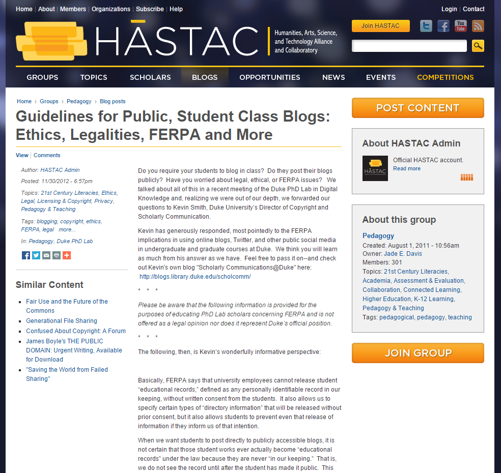
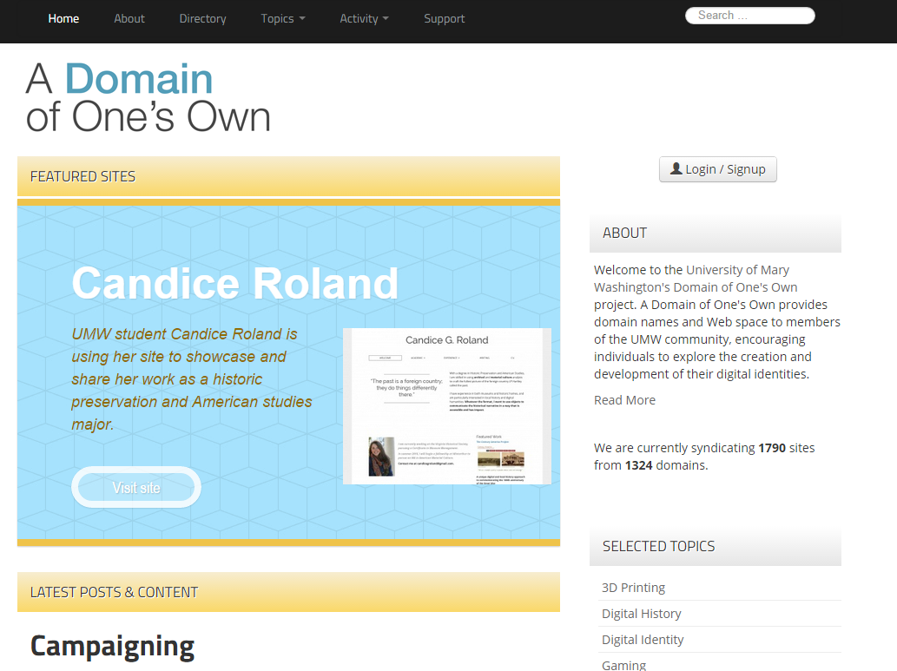
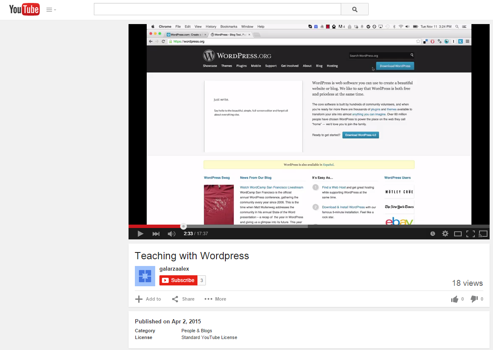
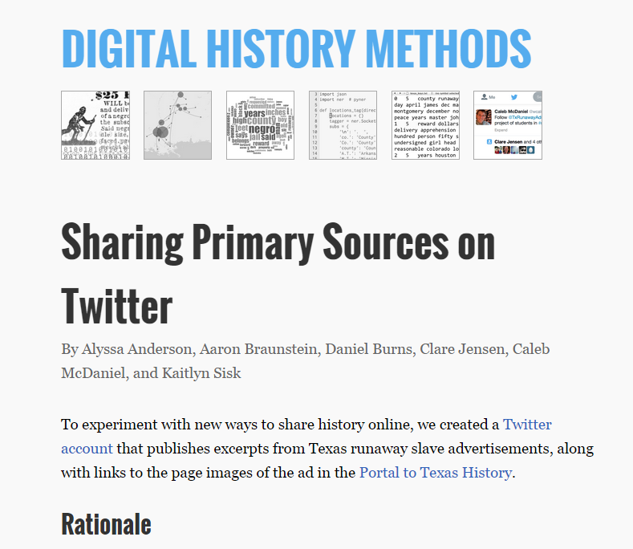
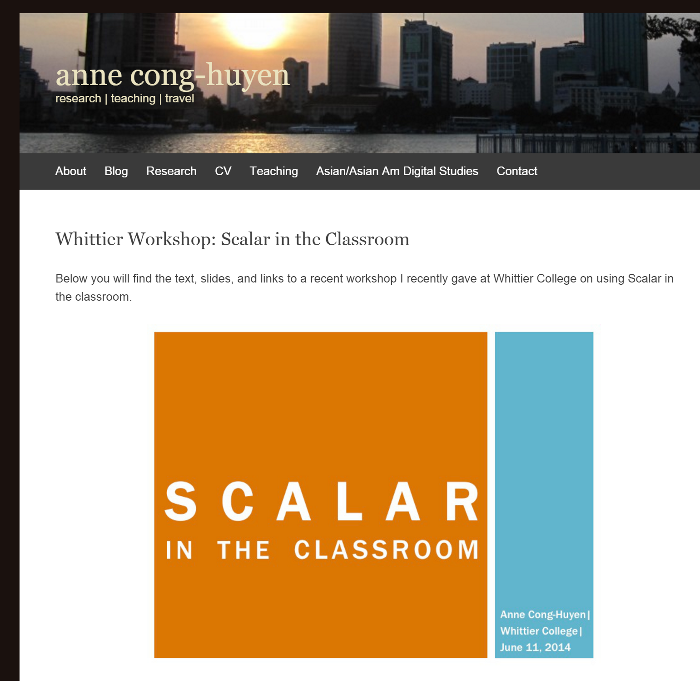
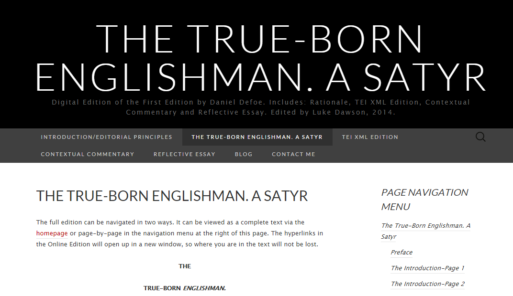
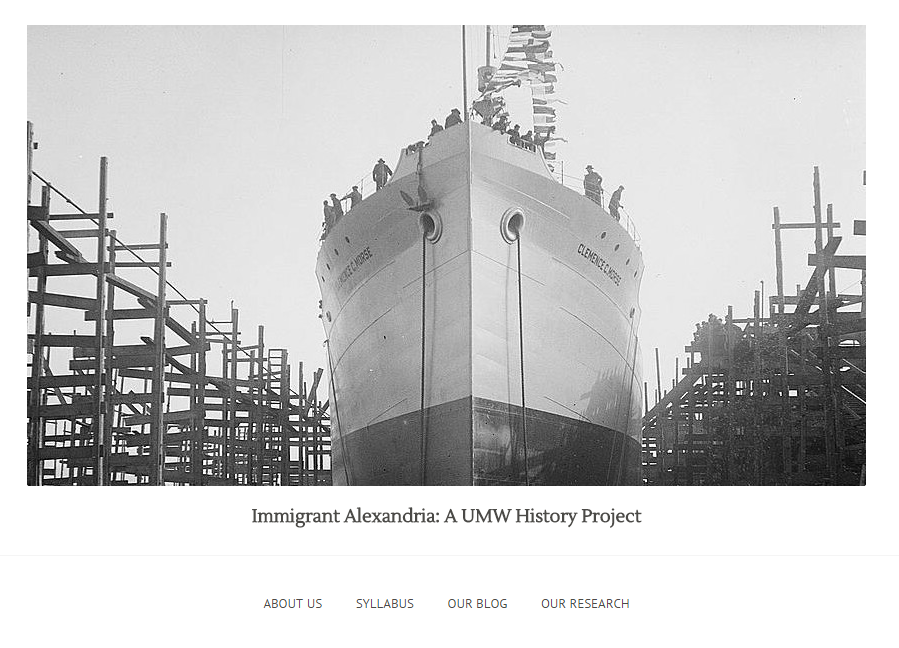

# PUBLIC

## Jeffrey W. McClurken
University of Mary Washington | http://mcclurken.org

---

##### Publication Status:
* unreviewed draft
* *draft version undergoing editorial review
* **draft version undergoing peer-to-peer review https://digitalpedagogy.commons.mla.org/**
* published 

--- 

## CURATORIAL STATEMENT 

My definition of “public” in the pedagogical context grows out of a deeply held belief that our teaching and our students should be outward facing as much as possible. We should be transcending the closed system of knowledge production that characterizes most undergraduate and even graduate courses.  What a waste not to share student work and voices where possible and safe. What a waste not to make the case for the value of higher education in general, and of the humanities in particular, at a time when they are under attack.  What a waste not to take advantage of digital publishing tools to contribute to the great sum of human knowledge.  

My link selections here are shaped by my own experiences teaching at a small, public, liberal arts university, by conversations I’ve had at digital humanities and digital liberal arts workshops and presentations across North America, and particularly by the work that I’ve seen undergraduate students do in the seventeen different courses that I’ve taught, each with some kind of public-facing component (see [http://mcclurken.org/](http://mcclurken.org/)).  The list is certainly not a complete list of public pedagogies nor is it representative of all the definitions of public that one might pursue, but it is informed by notions of "public" from public history (NCPH), digital humanities (*Disrupting the Digital Humanities*), and cultural studies (Giroux). Ultimately, the list reflects many of my own particular impulses related to making undergraduate humanities students’ work more visible and in encouraging students to claim their work in a reflective way that allows them to create a nuanced, intentional digital identity.  I’ve organized the links in three sections, first addressing the complexities of students creating in public (including the notion that some student work shouldn’t be public), then looking at platforms, and finishing with a set of examples of projects and assignments that occur in public.

One concern that is sometime broached by faculty when I talk about public projects revolves around the notion of student work not being good enough, of the possibility of students failing in a very public way.  Certainly students should have a safe space to work, but we also need to figure out ways to build iteration into students’ creation process because it is a key part of successful digital humanities projects and of learning more generally. [Other notions of "failure" can be seen in [Croxall and Warnick's keyword](https://github.com/curateteaching/digitalpedagogy/blob/master/keywords/failure.md).]

Students get the value of public projects.  They are proud of them, sharing them with family and friends.  They point to them in job portfolios and graduate school applications.  They welcome the chance to share all they have learned.  Students surveyed in my classes over the last 5+ years consistently indicate that they invest more effort, time, and attention on public class projects because they know that their creations are viewed by an audience that goes well beyond their instructors, that those creations live on beyond the class, and that they are engaged in meaningful, relevant contributions to public discourse.

## CURATED ARTIFACTS

## Concerns about Producing in Public 

### “Men Explain Technology to Me: On Gender, Ed-Tech, and the Refusal to Be Silent”
*   
* Artifact Type: Presentation/Essay
* [http://hackeducation.com/2014/11/18/gender-and-ed-tech/](http://hackeducation.com/2014/11/18/gender-and-ed-tech/)  * Audrey Watters, Hack Education

This brilliant text from a presentation that ed-tech journalist Audrey Watters gave in the Fall of 2014 reminds us that when we talk about students (and faculty) creating in public spaces, we need to start with an understanding that not everyone experiences those spaces the same way (and that not everyone behaves well in them).  Watters’ essay (and many others that she and others have written) remind us that a) we need to offer students support in their creations in public and b) that we need to be sensitive to students who might have good reasons for not owning their public work.  One point of Watters’ piece, of course, is NOT to withdraw from public spaces, but to engage in those spaces with a sense of what they are. These are lessons that are important for students to learn early on in their experiences with public work.

### “Guidelines for Public, Student Class Blogs: Ethics, Legalities, FERPA and More"
 
* Artifact Type: Blog Post
* [http://www.hastac.org/blogs/cathy-davidson/2012/11/30/guidelines-public-student-class-blogs-ethics-legalities-ferpa-and-mo](http://www.hastac.org/blogs/cathy-davidson/2012/11/30/guidelines-public-student-class-blogs-ethics-legalities-ferpa-and-mo)
* Kevin Smith, Duke University, via HASTAC Blog 

One of the barriers for some faculty in doing public projects with students is FERPA (Family Educational Rights and Privacy Act), the federal law about protecting student educational records. While this is on some level a legal issue, Kevin Smith’s brief advice in this post is very helpful in addressing most situations that would face faculty in working with students in public digital humanities class projects. Other relevant discussions of FERPA in the classroom include Jim Groom, “[You Can’t Spell FERPA without FEAR](http://bavatuesdays.com/you-cant-spell-ferpa-without-fear/),” and Ethan Watrall, “[Understanding FERPA & Educational Records Disclosure](http://chronicle.com/blogs/profhacker/understanding-ferpa-educational-records-disclosure/25002).”  But questions about FERPA should not prevent student work in public.  As faculty, our focus should be on providing students with a fair understanding of what it means to create in public but within the context of developing a public, thoughtful digital identity. 

## Platforms for Public Work ##

### A Domain of One’s Own--University of Mary Washington
 
* Artifact Type: Student controlled web hosting and domain
* [http://umw.domains/](http://umw.domains/)
* Division of Teaching and Learning Technologies, University of Mary Washington

Begun at UMW, and now with programs at 20 other institutions, including [Davidson](http://domains.davidson.edu/), [CSU-Channel Islands](http://cikeys.com/), [University of Oklahoma](http://create.ou.edu/), Domain of One’s Own provides students with their own choice of domain (URL) and web hosting that allows installation of WordPress, Omeka, and other cloud-based tools. Just as important as the technology, however, is that UMW and other schools integrate these tools into classes and programs.  UMW’s History program builds DoOO into methods classes as part of their professional training as historians.  Students use these Domains for a variety of things, including class projects, and the portfolios they create are particularly compelling ([for example](http://www.candiceroland.org/)). But DoOO also teaches students that they can establish and claim their own digital identity, they can influence what comes up when anyone searches for them, they can take control of their data, their class work, their digital life back from large corporations, and they can take control of their education.

### “Teaching with Wordpress”
 
* Artifact Type: Screencast/YouTube Video
* [https://www.youtube.com/watch?v=KnOCrTHNBJc](https://www.youtube.com/watch?v=KnOCrTHNBJc)
* Alex Galaraza, Hope College

Given the flexibility and ubiquity of WordPress in digital publishing, it is arguably both the easiest way to get students’ work in public, and the most widely applicable tool for them to learn. WordPress is a powerful and flexible platform with a wide community of supporters.  This tutorial video by Alex Galaraza explains the difference between WordPress.com and WordPress.org, how WordPress works, how and why to use WordPress in the classroom, and how to create a course site in WordPress.com.  Other useful guides to WordPress in the classroom can be found from [Maggie Hobson-Baker](https://www.youtube.com/user/mhobsonbaker/search?query=wordpress), [William and Mary](http://at.blogs.wm.edu/using-wordpress-in-your-class-for-student-writing-and-web-sites/), [Joseph Adelman](http://earlyamericanists.com/2014/01/10/using-blogs-in-the-classroom/), and [Mark Sample](http://chronicle.com/blogs/profhacker/a-rubric-for-evaluating-student-blogs/27196). 

### Sharing Primary Sources on Twitter 
 
* Artifact Type: Blog post from class 
* [http://ricedh.github.io/05-twitterbot.html](http://ricedh.github.io/05-twitterbot.html)  
* Alyssa Anderson, Aaron Braunstein, Daniel Burns, Clare Jensen, Caleb McDaniel, and Kaitlyn Sisk, Rice University

This post from Caleb McDaniel’s Spring 2014 Digital History Methods class at Rice University reveals how and why the students created a Twitter-bot to automatically tweet out primary sources about slavery, in particular nineteenth-century runaway slave ads. In addition to being a good example of how to use Twitter as more than just an alternative communication channel, the post discusses an intro to the Python programming language and the value of building on and with existing public projects (in this case, Andrew Torget’s [Digital History class](http://torget.us/HIST5100/runaway-slave-ads-project/) at University of North Texas.  [Other assignments from McDaniel’s class](http://ricedh.github.io/index.html) are also valuable fodder for advanced projects such as mapping, text mining, and topic modeling. 

### Scalar in the Classroom
 
* Artifact Type: Blog post of presentation 
* [https://anitaconchita.wordpress.com/whittierworkshop/](https://anitaconchita.wordpress.com/whittierworkshop/)  
* Anne Cong-Huyen, Whittier College

This post from Anne Cong-Huyen is an excellent introduction to how and why one might use the digital publishing platform Scalar with classes. Cong-Huyen's presentation is helpful in distinguishing this open-source platform created by the Alliance for Networking Visual Culture to create digital books from other publishing tools like WordPress. The Scalar examples she cites show the range of the platform and the ways that it allows for rich media incorporation, for collaborative authorship, and for public, accessible projects. 

##Public-facing Digital Projects with Students##

### Century America
 
* Artifact Type: Collaborative student project
* [http://centuryamerica.org/](http://centuryamerica.org/) 
* Century America Course Students, Spring 2014 & 2015.

One of the powerful possibilities that digital tools offer is the ability for students from all over to contribute to the creation of a larger public project.  The Century America site is the product of students from 15 public liberal arts schools, brought together in two semesters, Spring 2014 and Spring 2015, under the direction of faculty members from UMW (me) and UNC-Asheville (Ellen Holmes Pearson).  Students met twice weekly via video conference to talk about digital humanities tools as well as the subject of the semester and the project, life in their school’s town during the Great War and Influenza outbreak. [See [syllabus](http://course.centuryamerica.org/syllabus-2//).]  Students built individual WordPress sites off of the Century America domain (e.g., [http://truman.centuryamerica.org/](http://truman.centuryamerica.org/)), and used [TimelineJS](http://timeline.knightlab.com/) and Google Maps to add interactive elements to primary sources collected from their institution and town.

### The True-Born Englishman 
 
* Artifact Type: Literary Digital Edition
* [http://thetruebornenglishman.co.uk/](http://thetruebornenglishman.co.uk/)  
* Luke Dawson, Bath Spa University

Stephen Gregg of Bath Spa University offers English Literature students working on their independent research project the opportunity to create a public digital literary edition.  Luke Dawson’s 2014 project presents the complete text of Daniel Defoe’s first edition of “The True-Born Englishman” in multiple forms, including a TEI-XML edition (with editorial principles), and features extensive commentary.  Gregg’s guidelines and links to other digital literary editions can be found at [his site](http://shgregg.com/teaching/). Some helpful tips for replicating the process can be found in the [reflection he wrote with student Jess McCarthy](http://shgregg.com/2013/09/23/digital-editing-with-undergraduates-some-reflections/).

### Immigrant Alexandria
 
* Artifact Type: Class project and course syllabus
* [http://immigrantalexandria.org/](http://immigrantalexandria.org/) 
* Krystyn Moon, et. al., University of Mary Washington

This public project was done in partnership with the City of Alexandria.  Building on public sources and other primary sources identified by the Professor Krystyn Moon, the upper-level undergraduates in this course on immigrants to the US South since the mid-nineteenth century engaged in a scaffolded process of researching and writing about immigrant experiences in this Virginia city.  Student blog posts on primary sources became sources for the final project, four group multimedia essays on the experiences of specific ethnic groups in the city.  The [Chinese Immigration project](http://immigrantalexandria.org/chinese-immigrants-in-alexandria-va/), for example, mapped out the locations of Chinese Laundries over a 40-year period, and in doing so they identified distinctive patterns of ownership.  Overall, the project demonstrates the kind of work that can be done with students who don’t necessarily have many digital skills coming in to the course and could easily be replicated in other locations.

### Goin’ North: Stories from the First Great Migration to Philadelphia

* Artifact Type: Student Omeka Project
* [http://goinnorth.org/](http://goinnorth.org/)   
* Janneken Smucker, Charles Hardy, et.al., West Chester University 

This ongoing Omeka project is the result of a collaboration between graduate and undergraduate students at West Chester University in a Digital Storytelling class ([Syllabus](http://goinnorth.org/files/original/cc9d2af8b4c8861ac33e0a3c3cc86c3f.pdf)) and a number of community institutions.  Students took existing interviews from the 1980s and used the [Oral History Metadata Synchronizer](http://www.oralhistoryonline.org/) to link them to a wide variety of other materials, including geospatial information, photographs, and digitized newspaper articles.  The students then created a series of curated stories from all these materials.  In particular, this project shows the value that students can bring in linking and making public materials that exist in various places with varying degrees of access, providing a model for others to follow.

## RELATED MATERIALS

- Indiana University. “Indiana University Teaching Handbook: Teaching Methods: Use of Social Networks, Blogs, Wikis, and Other Third-Party Hosted Tools in Instruction.” [http://www.teaching.iub.edu/finder/wrapper.php?inc_id=s2_6_tech_04_cloud.shtml.](http://www.teaching.iub.edu/finder/wrapper.php?inc_id=s2_6_tech_04_cloud.shtml.)
- Kelly, T. Mills. *Teaching History in the Digital Age*. Ann Arbor: The University of Michigan Press, 2013.
- McClurken, Jeffrey. “Digital Liberal Arts Workshop Links & Resources,” [https://docs.google.com/document/d/1JlSHMjW5kQpq7Jhn3FYiWTbBYCsxrnZxn-bsLwJZS1c/edit](https://docs.google.com/document/d/1JlSHMjW5kQpq7Jhn3FYiWTbBYCsxrnZxn-bsLwJZS1c/edit).
- National Council on Public History. “Case Statements from 2013 NCPH Working Group on Teaching Digital History.” [http://ncph.org/cms/wp-content/uploads/Teaching-Digital-History-and-New-Media-Case-Statements.pdf](http://ncph.org/cms/wp-content/uploads/Teaching-Digital-History-and-New-Media-Case-Statements.pdf).
- Whisnant, Anne. “Digital Humanities Resources | History 671: Introduction to Public History.” [http://publichistory.web.unc.edu/resources/understanding-digital-humanities/](http://publichistory.web.unc.edu/resources/understanding-digital-humanities/).

## WORKS CITED

  
- Adelman, Joseph M. “Using Blogs in the Classroom.” The Junto. N.p., 10 Jan. 2015. Web. 4 Apr. 2015.
- Bohrer, Briana, Erin House, and Brandon Altamirano. “Chinese Immigrants in Alexandria, VA.” Immigrant Alexandria. N.p., n.d. Web. 4 Apr. 2015.
- Brennan, Sheila. “Back-to-School Edition, Use Omeka in Your Class – Omeka.” N.p., 20 Aug. 2013. Web. 4 Apr. 2015.
- “Candice G. Roland.” N.p., n.d. Web. 4 Apr. 2015.
- Chtena, Natascha. “7 Things I Learned From Teaching With Twitter | GradHacker @insidehighered.” N.p., n.d. Web. 4 Apr. 2015.
- Cong-Huyen, Anne. "Whittier Workshop: Scalar in the Classroom." N.p., 11 June 2014. 
- Croxall, Brian and Quinn Sarnecki. "Failure." N.p., n.d. Web. 1 Nov. 2015.
- CSU-Channel Islands. “CI Keys – CSU Channel Islands |.” N.p., n.d. Web. 4 Apr. 2015.
- Davidson College. “Davidson Domains |.” N.p., n.d. Web. 4 Apr. 2015.
- Dawson, Luke. “The True-Born Englishman. A Satyr.” The True-Born Englishman. A Satyr. N.p., n.d. Web. 4 Apr. 2015.
- French, Amanda. “Introduction to Omeka -Lesson Plan.” amandafrench.net. N.p., 12 Nov. 2013. Web. 4 Apr. 2015.
- Giroux, Henry A. “Cultural Studies, Public Pedagogy, and the Responsibility of Intellectuals.” *Communication and Critical/Cultural Studies* 1.1 (2004): 59–79. Print.
- Gregg, Stephen H. “Digital Editing with Undergraduates: Some Reflections.” Manicule. N.p., n.d. Web. 4 Apr. 2015.
- ---. “Teaching.” Manicule. N.p., n.d. Web. 4 Apr. 2015.
- Groom, James. “You Can’t Spell FERPA Without FEAR.” bavatuesdays. N.p., 11 Nov. 2011. Web. 4 Apr. 2015.
- Hobson-Baker, Maggie. “Maggie Hobson-Baker YouTube Videos.” N.p., n.d. Web. 4 Apr. 2015.
- Indiana University. “Indiana University Teaching Handbook: Teaching Methods: Use of Social Networks, Blogs, Wikis, and Other Third-Party Hosted Tools in Instruction.” N.p., n.d. Web. 4 Apr. 2015.
- Kelly, T. Mills. *Teaching History in the Digital Age*. Ann Arbor: The University of Michigan Press, 2013. Print. Digital Humanities.
- KnightLab, Northwestern University. “Timeline JS Beautifully Crafted Timelines That Are Easy, and Intuitive to Use.” N.p., n.d. Web. 4 Apr. 2015.
- Marks, Jennifer. “No Man’s Land | Kirksville, Missouri & the Great War.” N.p., n.d. Web. 4 Apr. 2015.
- McClurken, Jeffrey. “Digital Liberal Arts Workshop Links & Resources.” N.p., n.d. Web.
- ---. “Learning Through Digital Media » Teaching and Learning with Omeka: Discomfort, Play, and Creating Public, Online, Digital Collections.” Mobility Shifts, 2011. Web. 4 Apr. 2015.
- ---. mcclurken.org. N.p., n.d. Web. 4 Apr. 2015.
- McDaniel, Caleb. “Digital History Methods -Projects.” N.p., n.d. Web. 4 Apr. 2015.
- McDaniel, Caleb, and Alyssa Anderson, Aaron Braunstein, Daniel Burns, Clare Jensen, and Kaitlyn Sisk. “Sharing Primary Sources on Twitter | Digital History Methods.” N.p., n.d. Web. 4 Apr. 2015.
- Moon, Krystyn, and et. al. “Immigrant Alexandria.” Immigrant Alexandria. N.p., n.d. Web. 4 Apr. 2015.
- National Council on Public History. “Case Statements from 2013 NCPH Working Group on Teaching Digital History.” N.p., n.d. Web. 4 Apr. 2015.
- NCPH. “About the Field.” National Council on Public History. N.p., n.d. Web. 31 Oct. 2015.
- Nunn Center for Oral History, University of Kentucky. “OHMS: Oral History Metadata Synchronizer.” N.p., n.d. Web. 4 Apr. 2015.
- Pearson, Ellen Holmes, and et. al. “Century America | Campus, Community, and the Great War.” N.p., n.d. Web. 4 Apr. 2015.
- Pearson, Ellen Holmes, and Jeffrey McClurken. “Syllabus | Century America: The Course.” N.p., n.d. Web. 4 Apr. 2015.
- Sample, Mark. “A Rubric for Evaluating Student Blogs.” The Chronicle of Higher Education Blogs: ProfHacker. N.p., 27 Sept. 2010. Web. 4 Apr. 2015.
- ---. “Course Guidelines.” Hacking Remixing Design. N.p., n.d. Web. 4 Apr. 2015.
- Smith, Kevin, and HASTAC Admin. “Guidelines for Public, Student Class Blogs: Ethics, Legalities, FERPA and More.” HASTAC. N.p., n.d. Web. 4 Apr. 2015.
- Smucker, Janneken, and Charles Hardy. “Great Migration & Digital Storytelling Syllabus.” N.p., Fall 2014. Web.
- Smucker, Janneken, Charles Hardy, and et. al. “Stories from the First Great Migration to Philadelphia · Goin’ North.” N.p., n.d. Web. 4 Apr. 2015.
- Stommel, Jesse. “The Public Digital Humanities.” Disrupting the Digital Humanities. N.p., January 9,2015. Web. 31 Oct. 2015.
- “Stories from the First Great Migration to Philadelphia · Goin’ North.” Web. 4 Apr. 2015.
- Tavares, Elizabeth Elaine. “Teaching with Omeka | Elizabeth Elaine Tavares.” N.p., n.d. Web. 4 Apr. 2015.
- TeachingHistory.org. “Omeka | Teachinghistory.org.” N.p., n.d. Web. 4 Apr. 2015.
- Teaching with Wordpress. N.p., 2015. Film.
- Torget, Andrew. “Runaway Slave Ads Project | Introduction to Digital Scholarship.” N.p., n.d. Web. 4 Apr. 2015.
- University of Mary Washington, DTLT. “Domain of One’s Own.” N.p., n.d. Web. 4 Apr. 2015.
- University of Nebraska-Lincoln. “History Harvest.” N.p., n.d. Web. 4 Apr. 2015.
- University of Oklahoma. “OU Create | A Domains Project From the University of Oklahoma.” N.p., n.d. Web. 4 Apr. 2015.
- Watrall, Ethan. “Understanding FERPA & Educational Records Disclosure.” The Chronicle of Higher Education Blogs: ProfHacker. N.p., 23 June 2010. Web. 4 Apr. 2015.
- Watters, Audrey. “Men Explain Technology to Me: On Gender, Ed-Tech, and the Refusal to Be Silent.” N.p., n.d. Web. 4 Apr. 2015.
- Whisnant, Anne. “Digital Humanities Resources | History 671: Introduction to Public History.” N.p., n.d. Web. 4 Apr. 2015.
- William & Mary, Academic Technology. “Using WordPress in Your Class for Student Writing and Websites — Academic Technology.” N.p., n.d. Web. 4 Apr. 2015.
