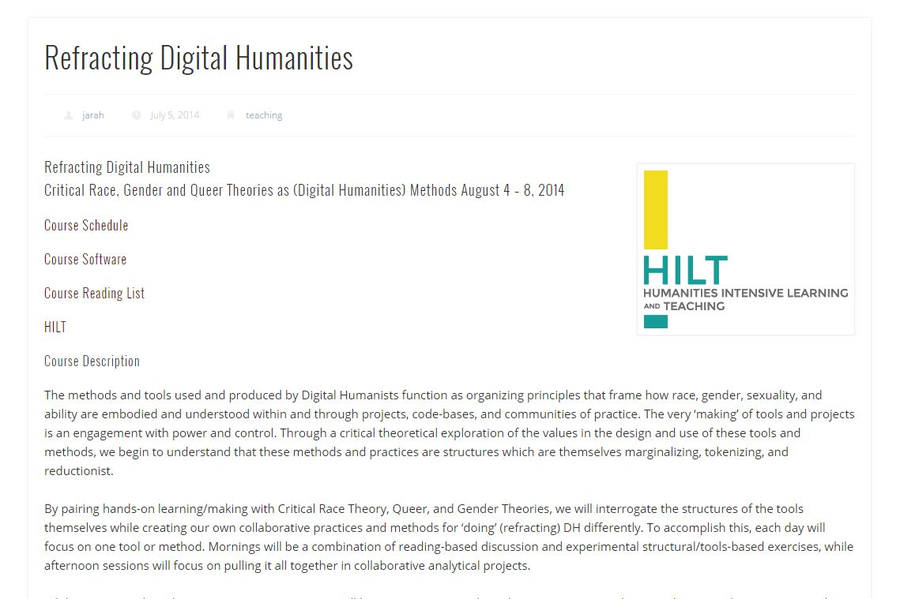
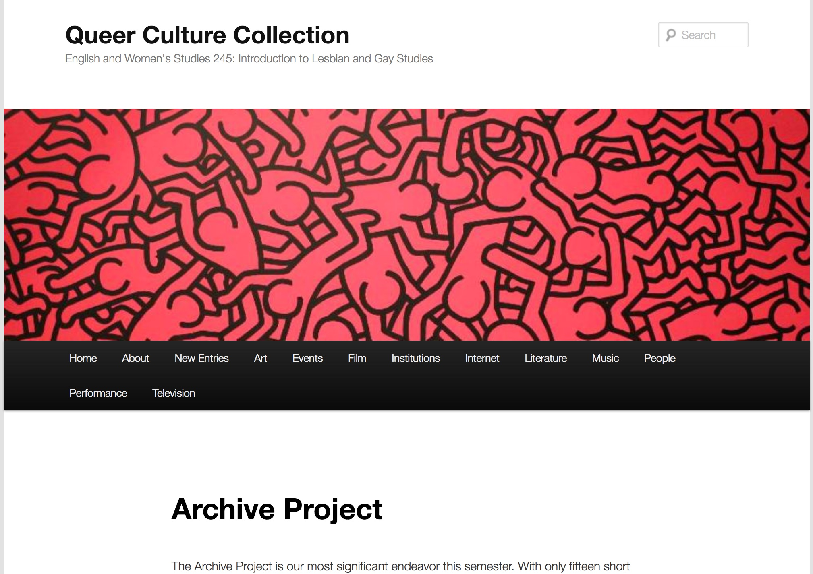
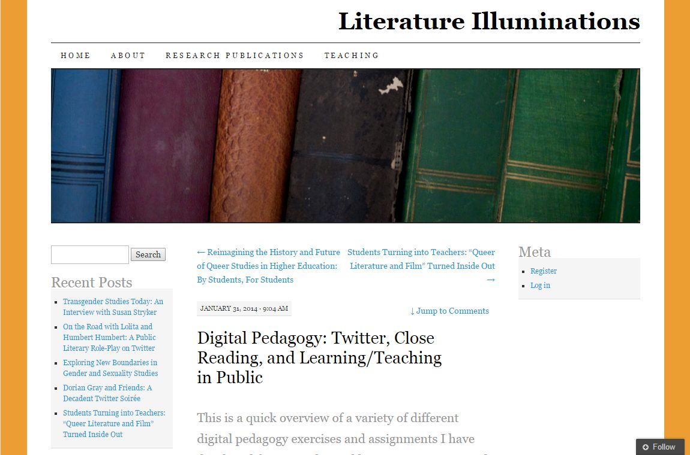
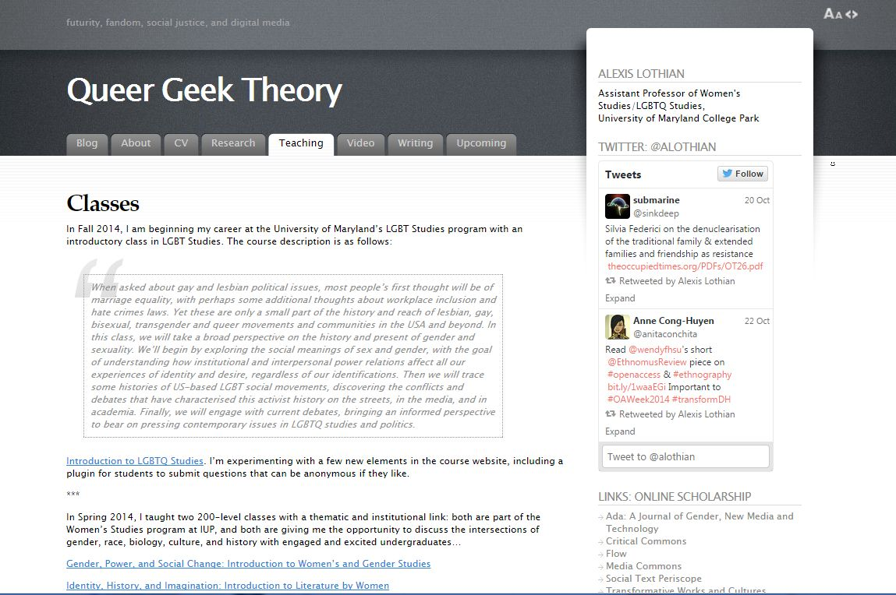
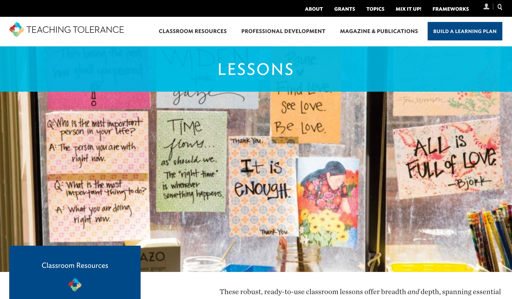
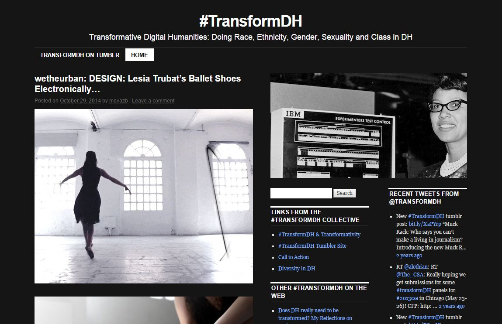
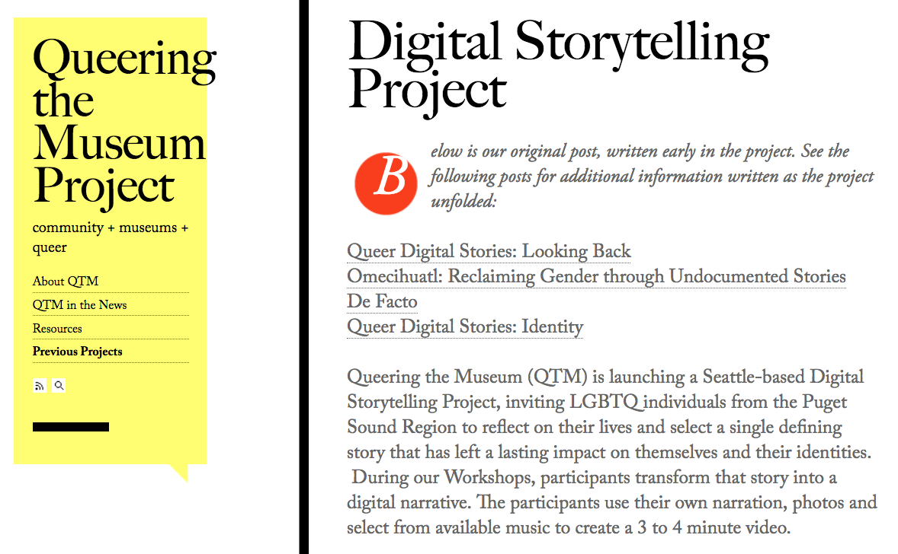
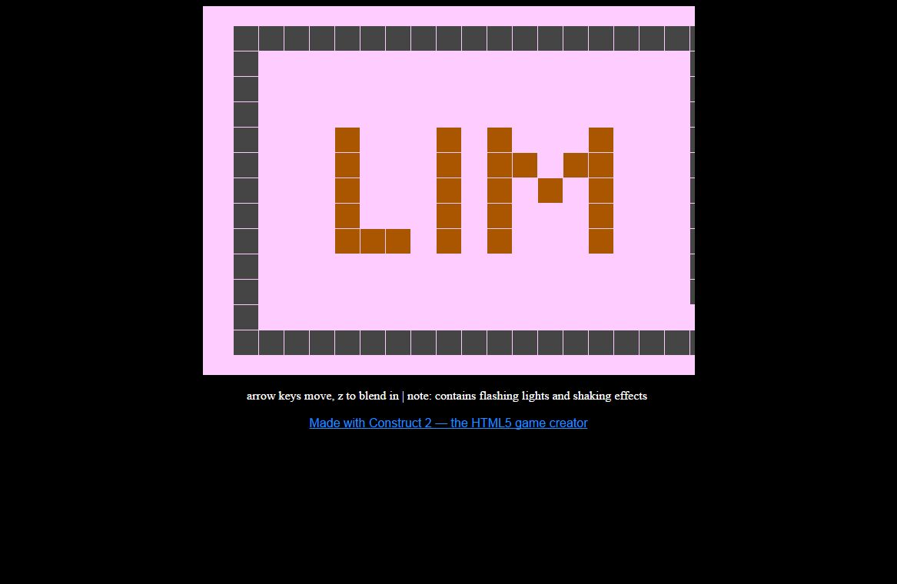

# QUEER (Draft)

### [Edmond Y. Chang](http://www.edmondchang.com/)
Ohio University | Department of English

---

##### Publication Status:
* unreviewed draft
* draft version undergoing editorial review
* draft version undergoing peer-to-peer review
* **draft version undergoing MLA copyediting**
* awaiting pre-print copy
* published 

---
Cross-Reference Keywords: Digital Divides, Disability, Gender, Intersectionality, Race, Sexuality
--- 	

### Curatorial Statement 

What is queer digital pedagogy?  What lies at the intersection and intertwingling of queer, technology, and teaching?  Foremost queer digital pedagogy understands that technology is never neutral and that the digital is a constellation of spaces, practices, and protocols that can be both liberatory and regulatory, both queer and deeply normative.  Given the black box-ness of code, computers, and information technologies, this playful and dissident work of decoding, remaking, and *queering* is needed across everyday screens, workbenches, classrooms, and society as a whole.  Teachers, programmers, scholars, librarians, artists, and gamers must embrace "the open mesh of possibilities, gaps, overlaps, dissonances and resonances, lapses and excesses of meaning" (Sedgwick 8) of queer digital pedagogy.  Digital pedagogy must embrace a philosophy of teaching (with) technology that defies the desire for one-tool-fits-all solutions.  There is no such thing as perfect communication, translation, or execution, but rather there are happy connections, coalitions, and conditions for experimentation and exploration.  

To queer the digital means to challenge the idea that there are those who inexorably belong online or innately "get tech."  To queer pedagogy is refuse the narratives and practices that naturalize a select few that belong in the classroom, digital or otherwise.  Though this metaphor of "native" and "immigrant" likely came from John Perry Barlow's ["A Declaration of the Independence of Cyberspace"](https://projects.eff.org/~barlow/Declaration-Final.html), Mark Prensky perpetuates this normative and techno-orientalizing metaphor, saying:

>. . . the most useful designation I have found for them is *Digital Natives*. Our students today are all "native speakers" of the digital language of computers, video games and the Internet...Those of us who were not born into the digital world . . . are, and always will be compared to them, *Digital Immigrants*" (1-2).  

Queer digital pedagogy noisily refuses these narratives, which rely on norms about race, gender, class, ability, and even pleasure. Queering digital pedagogy then is, in the words of Eve Sedgwick, about "promises to make invisible possibilities and desires visible . . . to smuggle queer representation in where it must be smuggled and . . . to challenge queer-eradicating impulses frontally" (3).  Queer digital pedagogy revels in "perverse" (Sedgwick 4) and inclusive reading, writing, and creating.  

The selections curated here represent the messiness and unruly impossibility of "representing" queer digital pedagogy in any easy, unitary, frictionless way. They are meant to be inspirations, puzzle pieces, and half-nibbled ideas that rub up against one another in fruitful and fraught ways.  They are provocations that hopefully demonstrate the remarkable range, color, and flexibility of what it means to intervene in print and low-tech (often read as “traditional”) humanities studies and to interrogate the technonormativity of digital media and methodologies.  

They also reflect different perspectives, interests, and proficiencies with digital work. Digital pedagogy must follow the lead of intersectional and interdisciplinary queer theory and queer studies.  The selections below are often metacognitive in approach, revealing not only what it means to teach queer material digitally, or how to use technology queerly, but also the stakes in these reconfigurations and repurposings. They provide a scaffolding, a working vocabulary.  While some of the artifacts below are plug-and-play, most serve as models and guides to be backward engineered, reimagined, and revised for a particular class or pedagogical goal.  In fact, no assignment, practice, or creation should be imported wholesale without effort or attention to local conditions.  Each of the selections are prompts, tinker toys, and better questions than easy answers.

If queer pedagogy is about "the problem of curriculum [becoming] one of prolifierating identifications not closing them down" (Britzman 219), then queer digital pedagogy is about finding, creating, and playing with multimodal and polyamorous questions, archives, and artifacts, analog and digital, flesh-to-flesh and virtual. Judith Halberstam argues, "[W]hile queer studies offers a potent critique of disciplinarity and pedagogy, it also offers an interesting interface with new digital technologies . . . [with] flexible and innovated notions of archiving, canonicity, disciplinarity and intellectual labor in hand" (364). Queer digital pedagogy asks teachers and students, readers and writers, makers and players to be perverse, critical, and reparative, to invest in these queer sites with "fascination and love" (Sedgwick 3). Whether you are tweeting close readings, looking for resources on LGBTQ inclusion, or navigating a virtual maze in a game, queer digital pedagogy demands not only a healthy suspicion of the promises and fantasies of technology but also a healthy desire for "this wave of new technologies to bring new methods and topics to the classroom" (Halberstam 364).  It is this utopian hope that inspires these selections.  

> Queerness is a structuring and educated mode of desiring that allows us to see and feel beyond the quagmire of the present . . . Queerness is that thing that lets us feel that this world is not enough, that indeed something is missing. --Jose Esteban Munoz, *Cruising Utopia*

### Curated Resources 

[Refracting the Digital Humanities](http://thejarahtree.com/2014/07/05/refracting-digital-humanities/)

* Artifact Type: syllabus, course site, reading list
* Source URL: http://thejarahtree.com/2014/07/05/refracting-digital-humanities/
* Permissions: CC-BY-NC
* Creator and Affiliation: Jarah Moesch, American Studies, University of Maryland
* Tags: advanced

Self-described as "an experimental artist-scholar who uses the queer sick body to challenge the limits of the phenomenological," Moesch's course and syllabus offer an intersectional way to examine the ways digital humanities “function as organizing principles that frame how race, gender, sexuality, and ability are embodied and understood within and through" code, digital tools, and DH practices.  What is exemplary about this resource is the fact that Moesch's syllabus solidly combines theory and practice, exploring and doing. As the course description reads, "By pairing hands-on learning/making with Critical Race Theory, Queer, and Gender Theories, we will interrogate the structures of the tools themselves while creating our own collaborative practices and methods for ‘doing’ (refracting) DH differently."  In particular, Moesch’s course attends to a range of DH tools and methods including audio, computer code, and mapping.  

[Queer Culture Collection: Archive Project](http://sites.psu.edu/245spring2015/about/archive-project/)

* Artifact Type: assignment
* Source URL: http://sites.psu.edu/245spring2015/about/archive-project/
* Permissions: CC-BY-NC
* Creator and Affiliation: Colin Hogan, English, Penn State University
* Tags: archives, crowdsourcing, representation

Hogan's "English and Women's Studies 245: Introduction to Lesbian and Gay Studies" course at Penn State University culminates in a digital archive project for which students crowdsource a collection of LGBTQA representations and artifacts including literature, music, film, art, and institutions.  According to the assignment page, "The archive project attempts a digital approach to queer archives, one that takes Derrida’s emphasis on 'participation' and 'access,' 'constitution,' and 'interpretation' seriously by handing these tasks over to you as students."  The assignment is well-conceived and organized detailing student roles, group roles, curation and annotation exercises, and overall requirements.  

[Digital Pedagogy: Twitter, Close Reading, and Learning/Teaching in Public](http://litilluminations.wordpress.com/2014/01/31/digital-pedagogy-close-reading-and-learning-in-public/)

* Artifact Type: assignments
* Source URL: http://litilluminations.wordpress.com/2014/01/31/digital-pedagogy-close-reading-and-learning-in-public/
* Permissions: CC-BY-NC
* Creator and Affiliation: Petra Dierkes-Thrun, Comparative Literature, Stanford University
* Tags: close reading, Oscar Wilde, Charles Baudelaire, Twitter

Dierkes-Thrun's website offers a quick overview of the variety of different digital pedagogy exercises and assignments she has developed for her literature seminars and feminist, gender and sexuality classes at Stanford, including "Twitter for Crowdsourcing and Role-Play Exercises," close reading and collaborative interpretation exercises, and other teaching and learning tools.  Dierkes-Thrun includes assignments on Oscar Wilde's *The Picture of Dorian Gray*, Wilde's poem "The Harlot's House," and Charles Baudelaire’s "Hymn to Beauty."  This resource serves as a jumping off point for adapting Dierkes-Thrun's assignments or for generating new ones.  What is most useful is the inclusion of reflections on the assignments by both the instructor and the students, which detail the value of queer potential of experimental assignments, role play, and collaborative annotation.

[iLogs](http://www.edmondchang.com/466/assignments.html)

* Artifact Type: assignment
* Source URL: http://www.edmondchang.com/466/assignments.html
* Permissions: CC-BY-NC
* Creator and Affiliation: Edmond Y. Chang, English, Ohio University
* Tags: identity

These brief assignments ask students to keep and maintain a weekly "identity log" or "iLog," recording, detailing, and thinking about their own identities and identifications. These "iLogs" will function as a kind of identity workbook, an analytical and metacognitive journal, connecting students' observations and experiences to the texts, theories, and ideas of an Introduction to LGBT Studies class. Prompts include thinking about identities, sexuality, queer space, and popular culture, which are shared with the class via the class's Tumblr website. The overall course syllabus and reading list are included as well.  Though the “iLogs” are not formally graded (except on timeliness and completion), they generate a portfolio, an archive of ideas, objects, and occasions for discussion, study, and reflection.  Once collected together, students can see the breadth and depth of intellectual, critical, and even affective work they and their classmates have done over the course of a term.  See for example [iLog #4: Queer Bodies](http://engl466a.tumblr.com/tagged/iLog-4).

[Queer Geek Theory: Classes](http://www.queergeektheory.org/teaching_main/classes/)

* Artifact Type: course sites, syllabi
* Source URL: http://www.queergeektheory.org/teaching_main/classes/
* Permissions: open access with citation
* Creator and Affiliation: Alexis Lothian, Women's Studies/LGBTQ Studies, University of Maryland
* Tags: 

This resource offers a range of courses and reflections on teaching queer, LGBTQ, and women's studies material. Included in Lothian's descriptions are specific mentions of incorporating digital humanities and digital technologies into the classes.  Lothian encourages the sharing of course rationales, assignments, and integrations of digital tools, describing the materials as "open source documents."  Lothian outlines her use of blogging platforms, WordPress plugins, Twitter, as well as more traditional classroom technologies.  Their course site and syllabi stress public speech, writing, and participation with digital humanities, literature, and film.  Lothian's openness in terms of teaching, technology, and materials promotes queer digital pedagogy as a capacious and collaborative practice.  

[Teaching Tolerance: Lessons](https://www.tolerance.org/classroom-resources/lessons)

* Artifact Type: activities, lesson plans
* Source URL: https://www.tolerance.org/classroom-resources/lessons
* Permissions: 
* Creator and Affiliation: Teaching Tolerance, A Project of the Southern Law Poverty Center
* Tags: getting started, middle school, high school

Part of the Teaching Tolerance project, this website offers a running list of resources and best practices for teachers, administartors, and schools to give them "the knowledge they need to create a climate in which their most vulnerable students feel safe and valued . . . to build an educational environment that is truly welcoming to all students." Though the resource is aimed at middle and secondary schools, the "LGBT 101"-style material and inclusive policies are a necessary starting point in developing vocabularies, course rationales, teaching philosophies, and ways to think about the institution.  Lesson plans include analyzing gender stereotypes in the media, challenging homophobia in sports, the history of civil rights, analyzing environmental justice, accommodating disabilities, and much more.  The broader website also includes a publication entitled "[Best Practices: Creating an LGBT-inclusive School Climate](https://www.tolerance.org/magazine/publications/best-practices-creating-an-lgbtinclusive-school-climate)," which outlines a range of queer-friendly activities, organizations, and policy recommendations.  

[#TransformDH](http://transformdh.org/) 

* Artifact Type: collaborative projects
* Source URL: http://transformdh.org/
* Permissions:
* Creator and Affiliation: #TransformDH, Multiple Contributors
* Tags: manifestos, advanced

What is important about the #TransformDH blog and collaborative project is the idea that the digital humanities and by extension DH pedagogy must be a more open, inclusive, and diverse space, discipline, and set of inquiries. #TransformDH hopes to "do" race, ethnicity, gender, sexuality, and class.  #TransformDH is exemplary in its demonstration of the queer possibilities of collaboration, interdisciplinarity, and grass-roots "making" and "doing" in digital humanities.  The website provides not only a [call-to-action](http://www.hastac.org/blogs/amanda-phillips/2011/10/26/transformdh-call-action-following-asa-2011) for transforming DH but also collects and curates a wide variety of stories, actions, perspectives, and projects walking the walk and talking the talk, including Natalie Cicire’s [In Defense of Transforming DH](http://nataliacecire.blogspot.com/2012/01/in-defense-of-transforming-dh.html), Roger Whitson’s [Does DH Really Need to be Transformed? My Reflections on #MLA12](http://www.rogerwhitson.net/?p=1358), and many others--all useful as exemplars for reading, writing, and teaching.    

[Digital Storytelling Project](http://queeringthemuseum.org/current-projects/digital-storytelling-project/)

* Artifact Type: collaborative project, short films
* Source URL: https://queeringthemuseum.org/previous-projects/digital-storytelling-project/
* Permissions: 
* Creator and Affiliation: Digital Story Telling Project, A Project of Queering the Museum
* Tags: short films, getting started, personal narratives

The Digital Storytelling Project is a Seattle-based project suppored by Queering the Museum, a group dedicated to increasing LGBTQ representation in museums. The storytelling project invites LGBTQ individuals from the Puget Sound region to reflect on their lives, to use their own narration and photos to create a short video. The project allows people to tell their own stories, to decide how they want to be represented, and to share these stories in a queer-themed exhibit at The Museum of History and Industry in Seattle.  The website includes links to three short films and artist statements that could be easily included in a course, particularly paired with a student video project (see the "Personal Narrative Audio Essay" assignment below).  The three films are [Omecihuatl: Reclaiming Gender through Undocumented Stories](https://queeringthemuseum.org/2015/11/02/omecihuatl-reclaiming-gender-through-undocumented-stories/), [De Facto](https://queeringthemuseum.org/2016/03/16/de-facto/), and [Identity](https://queeringthemuseum.org/2016/04/16/queer-digital-stories-identity/).  

[Lim](http://mkopas.net/files/Lim/)

* Artifact Type: digital game
* Source URL: [https://www.people.vcu.edu/~rpatton/currentlab/lim/](https://www.people.vcu.edu/~rpatton/currentlab/lim/)
* Permissions: CC-BY-NC
* Creator and Affiliation: merritt k
* Tags: teachable game, 5-minute game, getting started, queer glitches

On the surface, Lim is a very simple game where the play moves a small, flashing, multi-hued square through a maze populated by other squares. At first, the other squares do not bother the player's avatar as long as they blend in. But, as the player progresses, the other squares begin to attack the player's square. Lim is about many things: identity, difference, belonging, passing, and so on. The game is brief and accessible via common web browsers.  Lim also provides much needed opportunities to talk about how game content and narrative intersects with game mechanics and algorithms.  The game paired with Ian Bryce Jones's [Lesson Plan: You’re There. You’re a Square. Get Over It.](https://intermittentmechanism.wordpress.com/2016/11/16/lesson-plan-games-about-squares/), which talks about teaching procedural representation.  Finally, Lim is demonstrative of not only queer issues and concerns but of the success of queer, independent game-makers such as merrit k.    

[Personal Narrative Audio Essay](http://digitalwriting101.net/content/assignment-personal-narrative-audio-essay-upper-division/)

* Artifact Type: assignment
* Source URL: http://digitalwriting101.net/content/assignment-personal-narrative-audio-essay-upper-division/
* Permissions:
* Creator and Affiliation: Amy Goodloe, Digital Writing 101
* Tags: getting started, audio, Garage Band, Audacity, iMovie 

This thoughtful assignment asks students to draw on their own personal experiences with gender and sexuality to explore a concept from a theorist like Jacques Derrida or Michel Foucault or Judith Butler.  Goodloe's assignment provides a full assignment overview, rationale, process description, and audience analysis for the audio essays.  Inspired by personal narrative readings and sample audio essays from Ira Glass's *This American Life*, students write their own essays and then translate them from page to recording.  What makes Goodloe's assignment outstanding is the attention not only to the importance of gender and queer personal narratives but also the strengths and challenges of different mediums. Included on the assignment's page are links to help and "how to" resources recording and editing audio as well as student samples.

### Related Materials 

* Adair, Joshua and Paul Walker.  "Turned On: On the Impossibility of Queer (and) Composition." *Hybrid Pedagogy*.  2015.  [http://www.digitalpedagogylab.com/hybridped/turned-on-the-impossibility-of-queer-composition/](http://www.digitalpedagogylab.com/hybridped/turned-on-the-impossibility-of-queer-composition/).

* "Blogging (as) Feminist Digital Pedagogy." *Media Praxis*.  27 Jan. 2014. [https://aljean.wordpress.com/2014/01/27/blogging-as-feminist-digital-pedagogy/](https://aljean.wordpress.com/2014/01/27/blogging-as-feminist-digital-pedagogy/).

* O'Riordan, Kate and David J. Phillips. *Queer Online: Media, Technology, and Sexuality*. New York: Peter Lang, 2007.

* "Queer Pedagogical Performance: Funded Project Evaluation." Simpson Center for the Humanities. University of Washington, 2012. [http://mkopas.net/files/2012_Report_QPP_Appended.pdf](http://mkopas.net/files/2012_Report_QPP_Appended.pdf).

* Queerness and Games Conference Videos. 2013-14. [http://www.twitch.tv/qgcon/profile](http://www.twitch.tv/qgcon/profile).

### Works Cited 

"Blogging (as) Feminist Digital Pedagogy." *Media Praxis*. 27 Jan. 2014.  [https://aljean.wordpress.com/2014/01/27/blogging-as-feminist-digital-pedagogy/](https://aljean.wordpress.com/2014/01/27/blogging-as-feminist-digital-pedagogy/).

Britzman, Deborah P. "Is There a Queer Pedagogy? Or, Stop Reading Straight." *Curriculum: Toward New Identities*. Ed. William F. Pinar. New York: Routledge, 1998. 211-227.

Bryson, Mary and Suzanne de Castell. "Queer Pedagogy: Praxis Makes Im/Perfect." *Canadian Journal of Education* 18:3 (Summer 1993): 285-305.  

Barlow, John Perry. "A Declaration of the Independence of Cyberspace."  *Electronic Frontier Foundation*.  8 Feb. 1996.  [https://projects.eff.org/~barlow/Declaration-Final.html](https://projects.eff.org/~barlow/Declaration-Final.html).

Butler, Judith. "Critically Queer." *GLQ* 1:1 (Nov. 1993): 17-32.  

Chang, Edmond Y. "Assignments: Identity Logs." Winter 2013.  [http://www.edmondchang.com/466/assignments.html](http://www.edmondchang.com/466/assignments.html).

Dierkes-Thrun, Petra. "Digital Pedagogy: Twitter, Close Reading, and Learning/Teaching in Public." 31 Jan. 2014.  
[http://litilluminations.wordpress.com/2014/01/31/digital-pedagogy-close-reading-and-learning-in-public/](http://litilluminations.wordpress.com/2014/01/31/digital-pedagogy-close-reading-and-learning-in-public/).

"Digital Storytelling Project." *Queering the Museum*. [http://queeringthemuseum.org/current-projects/digital-storytelling-project/](http://queeringthemuseum.org/current-projects/digital-storytelling-project/).

Goodloe, Amy.  "Personal Narrative Audio Essay."  *Digital Writing 1010*.  2010. [http://digitalwriting101.net/content/assignment-personal-narrative-audio-essay-upper-division/](http://digitalwriting101.net/content/assignment-personal-narrative-audio-essay-upper-division/).  

Halberstam, Judith. "Reflections on Queer Studies and Queer Pedagogy." *Journal of Homosexuality*. 45:2-4 (Oct. 2008): 361-364.

Jones, Ian Bryce.  "Lesson Plan: You’re There. You’re a Square. Get Over It."  16 Nov. 2016.  [https://intermittentmechanism.wordpress.com/2016/11/16/lesson-plan-games-about-squares/]{https://intermittentmechanism.wordpress.com/2016/11/16/lesson-plan-games-about-squares/).

Kopas, Merritt. *Lim*. Aug. 2012. [http://mkopas.net/files/Lim/](http://mkopas.net/files/Lim/).

Lothian, Alexis. "Queer Geek Theory: Classes." Fall 2014.  [http://www.queergeektheory.org/teaching_main/classes/](http://www.queergeektheory.org/teaching_main/classes/).

Moesch, Jarah. "Refracting Digital Humanities." *The Jarah Tree*. 5 Jul. 2014. [http://thejarahtree.com/2014/07/05/refracting-digital-humanities/](http://thejarahtree.com/2014/07/05/refracting-digital-humanities/).

Munoz, Jose Esteban.  *Cruising Utopia: The Then and There of Queer Futurity*.  New York: New York University Press, 2009.  

O'Riordan, Kate and David J. Phillips. *Queer Online: Media, Technology, and Sexuality*. New York: Peter Lang, 2007.

Prensky, Marc. "Digital Natives, Digital Immigrants." *marcprensky.com*. 2001. [http://www.marcprensky.com/writing/Prensky%20-%20Digital%20Natives,%20Digital%20Immigrants%20-%20Part1.pdf](http://www.marcprensky.com/writing/Prensky%20-%20Digital%20Natives,%20Digital%20Immigrants%20-%20Part1.pdf).

"Queer Pedagogical Performance: Funded Project Evaluation." Simpson Center for the Humanities. University of Washington, 2012. [http://mkopas.net/files/2012_Report_QPP_Appended.pdf](http://mkopas.net/files/2012_Report_QPP_Appended.pdf).

Queerness and Games Conference Videos. 2013-14. [http://www.twitch.tv/qgcon/profile](http://www.twitch.tv/qgcon/profile).

Sedgwick, Eve Kosofsky. "Queer and Now." *Tendencies*. Durham, NC: Duke University Press, 1993. 1-20.

Somerville, Siobhan.  "Queer." *Keywords for American Cultural Studies*. Eds. Bruce Burgett and Glenn Hendler. New York: NYU Press, 2007. 187-191.

"Teaching Tolerance: Lessons." *Teaching Tolerance*. 2017. [https://www.tolerance.org/classroom-resources/lessons](https://www.tolerance.org/classroom-resources/lessons).
 
TransformDH. [http://transformdh.org/](http://transformdh.org/).

