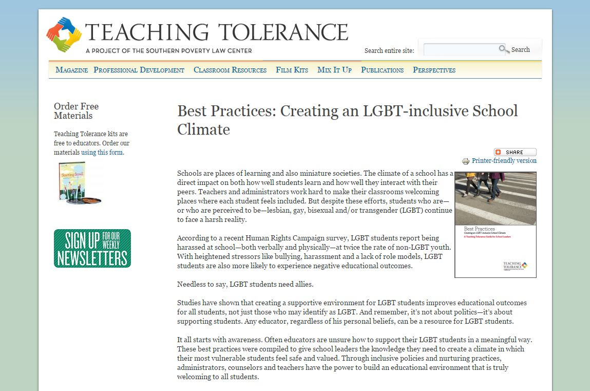
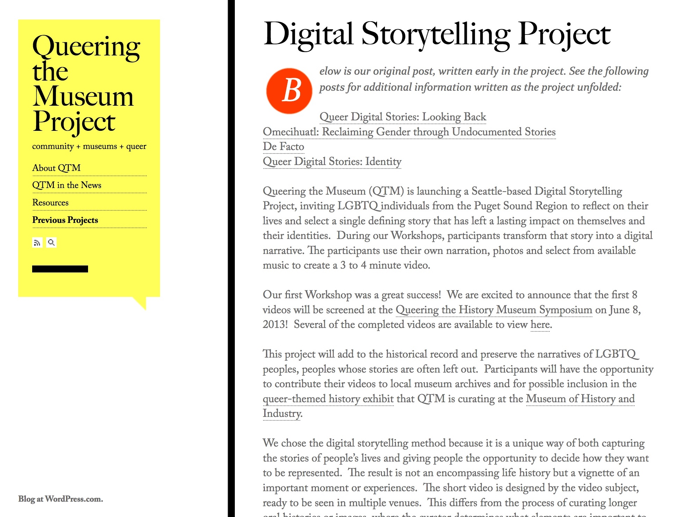
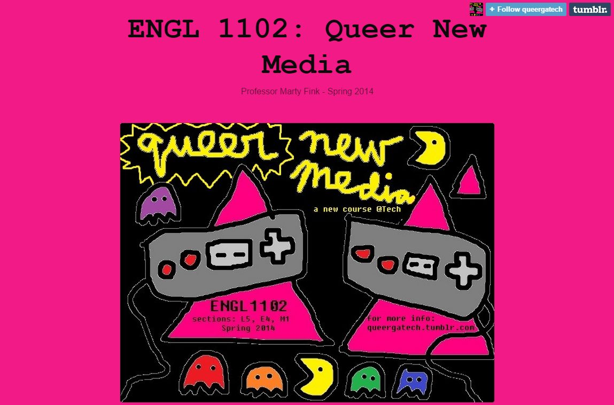
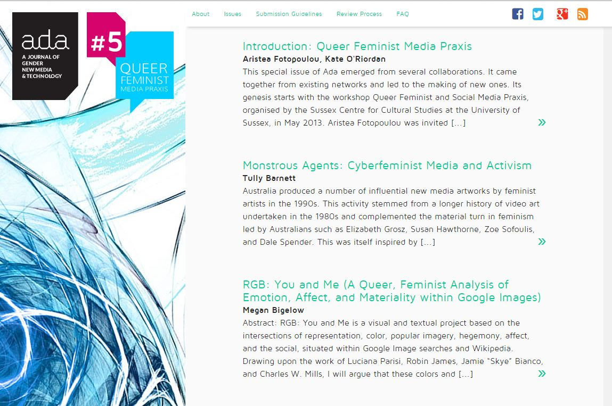

# QUEER (Draft)

### [Edmond Y. Chang](http://www.edmondchang.com/)
University of Oregon | Department of Women's and Gender Studies

---

##### Publication Status:
* unreviewed draft
* draft version undergoing editorial review
* **draft version undergoing peer-to-peer review** https://digitalpedagogy.commons.mla.org/
* published 

--- 	

## CURATORIAL STATEMENT

What is queer digital pedagogy?  What lies at the intersection and intertwingling of queer, technology, and teaching?
Foremost queer digital pedagogy understands that technology is never neutral and that the digital is a constellation of spaces, practices, and protocols that can be both liberatory and regulatory, both queer and deeply normative.
To queer the digital means to challenge the very idea that there are those who belong online or naturally "get tech" and those who are merely observers, visitors, or worst yet, unwelcome interlopers.
Though the language of "native" and "immigrant" likely came from John Perry Barlow's ["A Declaration of Independence of Cyberspace"](https://projects.eff.org/~barlow/Declaration-Final.html), Mark Prensky extends the problematic and techno-orientalizing metaphor, saying:

> What should we call these "new" students of today? Some refer to them as the N-[for Net]-gen or D-[for digital]-gen. But the most useful designation I have found for them is *Digital Natives*. Our students today are all "native speakers" of the digital language of computers, video games and the Internet. So what does that make the rest of us? Those of us who were not born into the digital world but have, at some later point in our lives, become fascinated by and adopted many or most aspects of the new technology are, and always will be compared to them, *Digital Immigrants* (1–2).

Queer digital pedagogy noisily refuses the "digital native" and "digital immigrant" narratives (now turned teaching philosophies and institutional policies), which rely on stereotypes and norms about race, gender, class, ability, and even pleasure. Queering the digital and queering pedagogy then is, in the words of Eve Sedgwick, about "promises to make invisible possibilities and desires visible; to make the tacit things explicit; to smuggle queer representation in where it must be smuggled and . . . to challenge queer-eradicating impulses frontally where they are to be so challenged" (3).

Given the black box-ness of code, virtual reality, and information technologies—which are paradoxically airy, alluring, transparent yet arcane, alienating, and obscured—this work of decoding, remaking, and transfiguring is much needed across everyday screens, workbenches, classrooms, and popular culture as a whole.

Teachers, programmers, scholars, librarians, artists, gamers, and off- and onliners must embrace "the open mesh of possibilities, gaps, overlaps, dissonances and resonances, lapses and excesses of meaning . . . [and] the experimental linguistic, epistemological, representational, political adventures" (Sedgwick 8) of queer digital pedagogy.  In other words, digital pedagogy must embrace a philosophy of teaching (with) technology that defies the desire for one-tool-fits-all situations and solutions.  There is no such thing as perfect communication, translation, implementation, or execution, but rather there are happy connections, coalitions, and conditions for experimentation and exploration.

The selections curated below represent the messiness and unruly impossibility of "representing" queer digital pedagogy in any easy, unitary, frictionless way. They are meant to be inspirations, puzzle pieces, and half-nibbled ideas that rub up against one another in fruitful and fraught ways.  They are provocations rather than proscriptions that hopefully demonstrate the remarkable range, color, and flexibility of what it means to intervene in print, analog, and low-tech (often read as “traditional”) humanities studies and to interrogate the technonormativity of digital media and methodologies.

They also reflect different perspectives, areas of interest, and different levels of proficiency with digital work. Digital pedagogy must follow the lead of queer theory and queer studies, which are increasingly intersectional and interdisciplinary, no longer seeing "sexuality as a singular mode of inquiry and instead makes sexuality a central category of analysis in the study of racialization, transnationalism, and globalization" (Halberstam 361). From syllabi to blog posts, from student works to institutional policies, from scholarly texts to digital games, the selections are often metacognitive in approach and content, revealing not only what it means to teach queer material digitally, or how to use technology queerly, but also the stakes in these reconfigurations and repurposings. They provide a scaffolding, a table full of curiosities to play with much in the spirit of Raymond Williams's original *Keywords* project—"a vocabulary: a shared body of words and meanings" (15).  While some of the artifacts below are plug-and-play, most serve as models and guides to be backward engineered, reimagined, and revised for a particular class or pedagogical goal.  In fact, no assignment, practice, or creation should be imported wholesale from one context to another without effort or attention to local conditions.  Each of the selections are prompts, tinker toys, and better questions than easy answers.

If queer pedagogy is about "the problem of curriculum [becoming] one of prolifierating identifications not closing them down" (Britzman 219), then queer digital pedagogy is about finding, creating, and playing with multimodal and polyamorous questions, algorithms, archives, and artifacts, analog and digital, flesh-to-flesh and virtual. Judith Halberstam argues, "[W]hile queer studies offers a potent critique of disciplinarity and pedagogy, it also offers an interesting interface with new digital technologies and the development of smart classrooms and Web-based learning . . . [with] flexible and innovated notions of archiving, canonicity, disciplinarity and intellectual labor in hand" (364). In other words, queer digital pedagogy asks teachers and students, readers and writers, makers and players to be perverse, to be critical and reparative, to invest in these queer sites and moments with "fascination and love" (Sedgwick 3). Whether you are tweeting close readings of *The Picture of Dorian Gray*, looking for resources about LGBT inclusion, or navigating a virtual maze as flashing-rainbow square, queer digital pedagogy demands not only a healthy suspicion of the promises and fantasies of technology but also a healthy desire for "this wave new technologies to bring new methods and topics to the classroom" (Halberstam 364).  It is this spirit, this utopian hope, that inspires the selections.

> Queerness is a structuring and educated mode of desiring that allows us to see and feel beyond the quagmire of the present . . . Queerness is that thing that lets us feel that this world is not enough, that indeed something is
missing . . . Queerness is also a performative because it is not simply a being but a doing for and toward the future. Queerness is essentially about the rejection of a here and now and an insistence on potentiality or concrete
possibility for another world. —Jose Esteban Munoz, *Cruising Utopia*

## CURATED ARTIFACTS

### "Best Practices: Creating an LGBT-inclusive School Climate"

* Source URL: <http://www.tolerance.org/lgbt-best-practices>
* Copy of Artifact: forthcoming
* Creator: [Southern Law Poverty Center](http://www.splcenter.org/)

Part of the Teaching Tolerance project, this website offers a list of resources and best practices for teachers, administartors, and schools to give them "the knowledge they need to create a climate in which their most vulnerable students feel safe and valued . . . to build an educational environment that is truly welcoming to all students." Though the resource is aimed at middle and secondary schools, the "LGBT 101"–style material and inclusive policies are a necessary starting point in developing vocabularies, course rationales, teaching philosophies, and ways to think about the institution.

### "Digital Pedagogy: Twitter, Close Reading, and Learning/Teaching in Public"

* Source URL: <http://litilluminations.wordpress.com/2014/01/31/digital-pedagogy-close-reading-and-learning-in-public/>
* Copy of Artifact: forthcoming
* Creator: [Petra Dierkes-Thrun](https://dlcl.stanford.edu/people/petra-dierkes-thrun?q=people/petra-dierkes-thrun) (Stanford University)

Dierkes-Thrun's website offers a quick overview of the variety of different digital pedagogy exercises and assignments she has developed for her literature seminars and feminist, gender, and sexuality classes at Stanford, including "Twitter for Crowdsourcing and Role-Play Exercises," close reading and collaborative interpretation exercises, and other teaching and learning tools. This resource serves as a jumping off point for adapting Dierkes-Thrun's assignments or for generating new ones. What is most useful is the inclusion of reflection on the assignments by both the instructor and the students. For example, in her write-up of the “Twitter Role-Play” assignment for *The Picture of Dorian Gray*, she writes, “Like so many of my traditional humanities teacher colleagues not originally trained in digital humanities, I have been a late convert to Twitter, but now I use it regularly and happily for professional and intellectual purposes . . . New ideas are sparked via these interactions; wise and thoughtful observations, hilarious and clever commentary happen here, engaging brains and hearts.  Most often, one leaves with a sense of having learned something worth contemplating, and being thankful for the open format. I knew Twitter was right for this new kind of exercise.”

### *Digital Storytelling Project*

* Source URL: <http://queeringthemuseum.org/current-projects/digital-storytelling-project/>
* Copy of Artifact: forthcoming
* Creator: [Queering the Museum](http://queeringthemuseum.org/)

The *Digital Storytelling Project* is a Seattle-based project suppored by Queering the Museum, a group dedicated to increasing LGBTQ representation in museums. The storytelling project invites LGBTQ individuals from the Puget Sound region to reflect on their lives, to use their own narration and photos to create a short video. The project allows people to tell their own stories, to decide how they want to be represented, and to share these stories in a queer-themed exhibit at The Museuem of History and Industry in Seattle.

### ENGL 1102: "Queer New Media"

* Source URL: <http://queergatech.tumblr.com/>
* Copy of Artifact: forthcoming
* Creator: [Marty Fink](http://lmc.gatech.edu/people/brittain.php) (Georgia Tech)

Multimodal, intersectional, and colorful, Fink's introductory course outlines ways to think about and create queer narratives and cultural productions. The course website provides examples of various student responses and projects, including student-made digital games. The strengths of this resource are in its eclecticism, its use of both popular culture and more traditional literature, and the examples of digital work created by students.  Fink’s course asks students to think about and translate James Baldwin’s *Giovanni’s Room* into digital presentations and provocations.

### "iLogs"

* Source URL: <http://www.edmondchang.com/466/assignments.html>
* Copy of Artifact: forthcoming
* Creator: [Edmond Y. Chang](http://www.edmondchang.com/) (Drew University)

These brief assignments ask students to keep and maintain a weekly "identity log" or "iLog," recording, detailing, and thinking about their own identities and identifications. These "iLogs" will function as a kind of identity workbook, an analytical and metacognitive journal, connecting students' observations and experiences to the texts, theories, and ideas of an Introduction to LGBT Studies class. Prompts include thinking about identities, sexuality, queer space, and popular culture, which are shared with the class via the class's Tumblr website. The overall course syllabus and reading list are included as well.  Though the “iLogs” are not formally graded (except on timeliness and completion), they generate a portfolio, an archive of ideas, objects, and occasions for discussion, study, and reflection.  Once collected together, students can see the breadth and depth of intellectual, critical, and even affective work they and their classmates have done over the course of a term.  See for example [iLog #4: "Queer Bodies"](http://engl466a.tumblr.com/tagged/iLog-4).

### *Lim*

* Source URL: <http://mkopas.net/files/Lim/>
* Copy of Artifact: forthcoming
* Creator: [Merritt Kopas](http://mkopas.net/)

On the surface, *Lim* is a very simple game where the play moves a small, flashing, multi-hued square through a maze populated by other squares. At first, the other squares do not bother the player's avatar as long as they blend in, changing their color to match those around them. But, as the player progresses, the other squares begin to attack the player's square. *Lim* is about many things: identity, difference, belonging, passing, inclusion, exclusion, community, and so on. The game is brief (less than ten minutes to play) and accessible via common web browsers, which makes it ideal for low- and high-tech classrooms. *Lim* also provides much needed opportunities to talk about how game content and narrative intersect with and are informed by game mechanics and algorithms, particularly in the moments of play when the game seems to glitch or have unintended results.  Finally, *Lim* is demonstrative of not only queer issues and concerns but also the success of queer, independent game-makers such as Kopas.

### "Queer Feminist Media Practice"

* Source URL: [http://adanewmedia.org/2014/07/issue5-fotopoulouoriordan/](http://adanewmedia.org/2014/07/issue5-fotopoulouoriordan/)
* Copy of Artifact: forthcoming
* Creator: [Aristea Fotopoulou](http://www.sussex.ac.uk/profiles/206365) and [Kate O'Riordan](http://www.sussex.ac.uk/profiles/30746) (editors, [*Ada: A Journal of Gender, New Media, and Technology*](http://adanewmedia.org/))

This special issue of *Ada* hopes, in the words of the editors, to explore "what the concept of praxis could offer in our thinking about the intersections of gender, digital media, and technology. Praxis in both Marxist and in Arendtian political thought brings together theory, philosophy and political action into the realm of the everyday" (n. pag.). The special issue also highlights the ways that digital projects like the journal *Ada* can be open source, committed to an "transparent, productive, and rigorous peer review process," and created, designed, published, and distributed collectively online.

### *Queer Geek Theory*: Classes

* Source URL: <http://www.queergeektheory.org/teaching_main/classes/>
* Copy of Artifact: forthcoming
* Creator: [Alexis Lothian](http://www.queergeektheory.org/) (University of Maryland)

This resource offers a range of courses and reflections on teaching queer, LGBTQ, and women's studies material. Included in Lothian's descriptions are specific mentions of incorporating digital humanities and digital technologies into the classes.  Lothian encourages the sharing of course rationales, assignments, and integrations of digital tools, saying, "I definitely consider all of the syllabi linked above to be open source documents from which other teachers should borrow as they see fit."  Lothian outlines her use of blogging platforms, WordPress plugins, Twitter, as well as more traditional classroom
technologies.  She says her course try to satisfy “learning objectives through engaging students with the practice and theory of digital humanities, new media, and technoculture studies, as well as with literature and film.  I use public websites, run on WordPress, to organize the classes and open them up beyond the walled spaces of learning management software. Students must (with guidance) think through the consequences of online public speech as part of their participation in the classes.”

### "Refracting the Digital Humanities"

* Source URL: <http://thejarahtree.com/2014/07/05/refracting-digital-humanities/>
* Copy of Artifact: forthcoming
* Creator: [Jarah Moesch](http://thejarahtree.com/) (University of Maryland, College Park)

Self-described as "an experimental artist-scholar who uses the queer sick body to challenge the limits of the phenomenological," Moesch's course and syllabus offer an intersectional way to examine the ways "the methods and tools used and produced by Digital Humanists function as organizing principles that frame how race, gender, sexuality, and ability." What is exemplary about this resource is the fact that Moesch's syllabus solidly combines theory and practice, exploring and doing. As the course description reads, "By pairing hands-on learning/making with Critical Race Theory, Queer, and Gender Theories, we will interrogate the structures of the tools themselves while creating our own collaborative practices and methods for ‘doing’ (refracting) DH differently."  In particular, Moesch’s course attends to a range of DH tools and methods including audio, computer code, and mapping.

### *#TransformDH*

* Source URL: <http://transformdh.org/>
* Copy of Artifact: forthcoming
* Creator: [#TransformDH](http://transformdh.org/) (Multiple Contributors)

What is important about the #TransformDH blog and collaborative project is the idea that the digital humanities must be a more open, inclusive, and diverse space, discipline, and set of inquiries. #TransformDH hopes to "do" race, ethnicity, gender, sexuality, and class. As a project that grew out of the experiences, scholarship, and activism of a handful of people across institutions, #TransformDH is exemplary in its demonstration of collaboration, interdisciplinarity, and grass-roots "making" and "doing" in digital humanities.  The website provides not only a [call-to-action](http://www.hastac.org/blogs/amanda-phillips/2011/10/26/transformdh-call-action-following-asa-2011) for transforming DH but also collects and curates a wide variety of stories, actions, perspectives, and projects walking the walk and talking the talk, including Natalia Cecire’s ["In Defense of Transforming DH"](http://nataliacecire.blogspot.com/2012/01/in-defense-of-transforming-dh.html), Roger Whitson’s ["Does DH Really Need to be Transformed? My Reflections on #MLA12"](http://www.rogerwhitson.net/?p=1358), and many others.

## RELATED MATERIALS

"Blogging (as) Feminist Digital Pedagogy." *Media Praxis*.  27 Jan. 2014. <https://aljean.wordpress.com/2014/01/27/blogging-as-feminist-digital-pedagogy/>.

O'Riordan, Kate and David J. Phillips. *Queer Online: Media, Technology, and Sexuality*. New York: Peter Lang, 2007.

"Queer Pedagogical Performance: Funded Project Evaluation." Simpson Center for the Humanities. University of Washington, 2012. <http://mkopas.net/files/2012_Report_QPP_Appended.pdf>.

*Queer Technologies*. 2013. <http://www.queertechnologies.info/>.

Queerness and Games Conference Videos. 2013–14. <http://www.twitch.tv/qgcon/profile>.

## WORKS CITED

"Best Practices: Creating an LGBT-inclusive School Climate." _Teaching Tolerance_. 2013. <http://www.tolerance.org/lgbt-best-practices>.

"Blogging (as) Feminist Digital Pedagogy." *Media Praxis*. 27 Jan. 2014.  <https://aljean.wordpress.com/2014/01/27/blogging-as-feminist-digital-pedagogy/>.

Britzman, Deborah P. "Is There a Queer Pedagogy? Or, Stop Reading Straight." *Curriculum: Toward New Identities*. Ed. William F. Pinar. New York: Routledge, 1998. 211–227.

Bryson, Mary and Suzanne de Castell. "Queer Pedagogy: Praxis Makes Im/Perfect." *Canadian Journal of Education* 18:3 (Summer 1993): 285–305.

Butler, Judith. "Critically Queer." *GLQ* 1:1 (Nov. 1993): 17–32.

Chang, Edmond Y. "Assignments: Identity Logs." Winter 2013.  <http://www.edmondchang.com/466/assignments.html>.

Dierkes-Thrun, Petra. "Digital Pedagogy: Twitter, Close Reading, and Learning/Teaching in Public." 31 Jan. 2014.
<http://litilluminations.wordpress.com/2014/01/31/digital-pedagogy-close-reading-and-learning-in-public/>.

"Digital Storytelling Project." *Queering the Museum*. [http://queeringthemuseum.org/current-projects/digital-storytelling-project/](http://queeringthemuseum.org/current-projects/digital-storytelling-project/).

Fink, Marty. "ENGL 1102: Queer New Media." Spring 2014. <http://queergatech.tumblr.com/>.

Fotopoulou, Aristea and Kate O'Riordan, Eds. "Queer Feminist Media Practice." *Ada: A Journal of Gender, New Media, and Technology*. Jul. 2014. <http://adanewmedia.org/issues/issue-archives/issue5/>.

Halberstam, Judith. "Reflections on Queer Studies and Queer Pedagogy." *Journal of Homosexuality*. 45:2–4 (Oct. 2008): 361–364.

Kopas, Merritt. *Lim*. Aug. 2012. <http://mkopas.net/files/Lim/>.

Lothian, Alexis. "Queer Geek Theory: Classes." Fall 2014.  <http://www.queergeektheory.org/teaching_main/classes/>.

Moesch, Jarah. "Refracting Digital Humanities." *The Jarah Tree*. 5 Jul. 2014. <http://thejarahtree.com/2014/07/05/refracting-digital-humanities/>.

O'Riordan, Kate and David J. Phillips. *Queer Online: Media, Technology, and Sexuality*. New York: Peter Lang, 2007.

Prensky, Marc. "Digital Natives, Digital Immigrants." *marcprensky.com*. 2001. <http://www.marcprensky.com/writing/Prensky%20-%20Digital%20Natives,%20Digital%20Immigrants%20-%20Part1.pdf>.

"Queer Pedagogical Performance: Funded Project Evaluation." Simpson Center for the Humanities. University of Washington, 2012. <http://mkopas.net/files/2012_Report_QPP_Appended.pdf>.

Queer Technologies. 2013. <http://www.queertechnologies.info/>.

Queerness and Games Conference Videos. 2013–14. <http://www.twitch.tv/qgcon/profile>.

Sedgwick, Eve Kosofsky. "Queer and Now." *Tendencies*. Durham, NC: Duke University Press, 1993. 1–20.

Somerville, Siobhan.  "Queer." *Keywords for American Cultural Studies*. Eds. Bruce Burgett and Glenn Hendler. New York: NYU Press, 2007. 187–191.

TransformDH. <http://transformdh.org/>.
