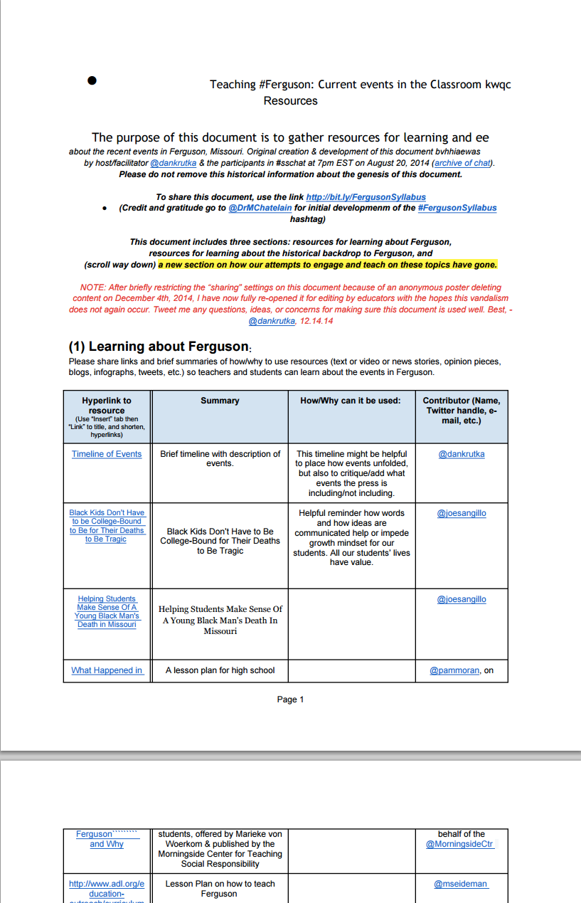
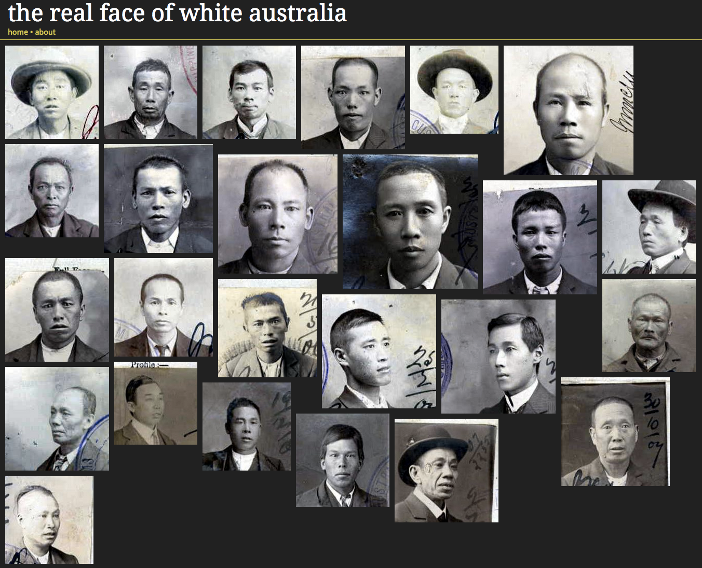
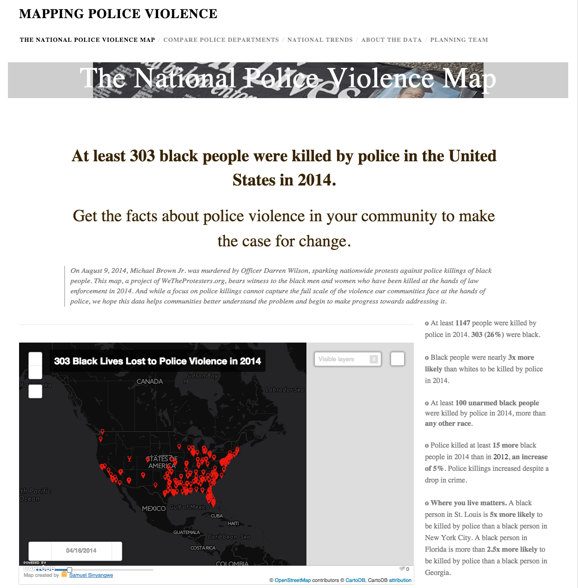
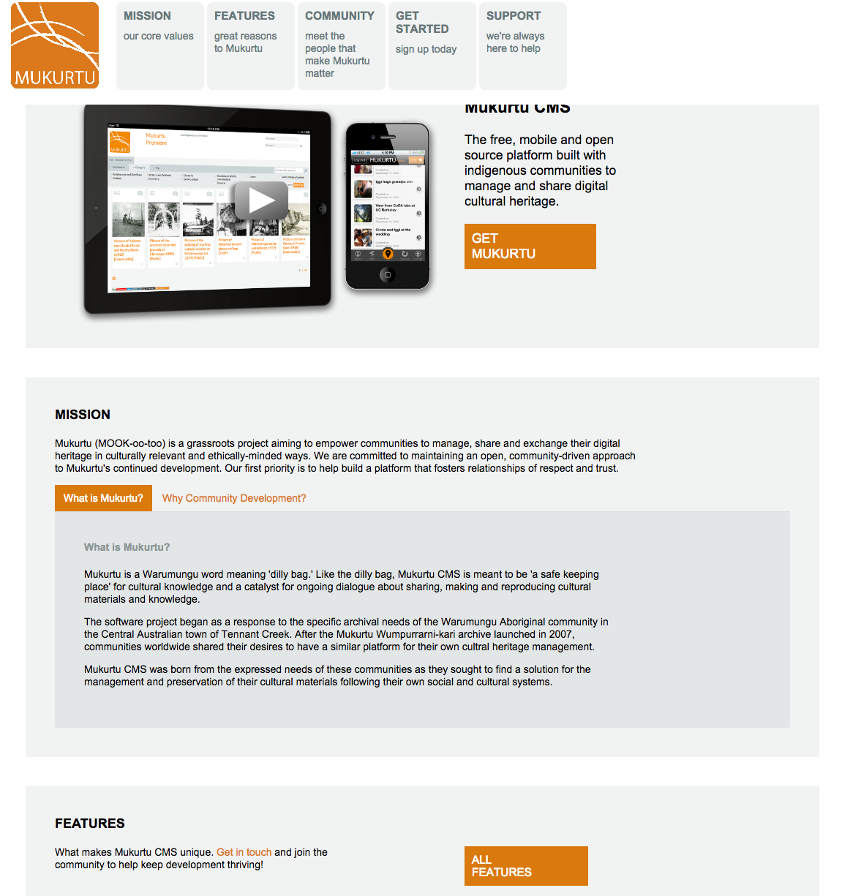
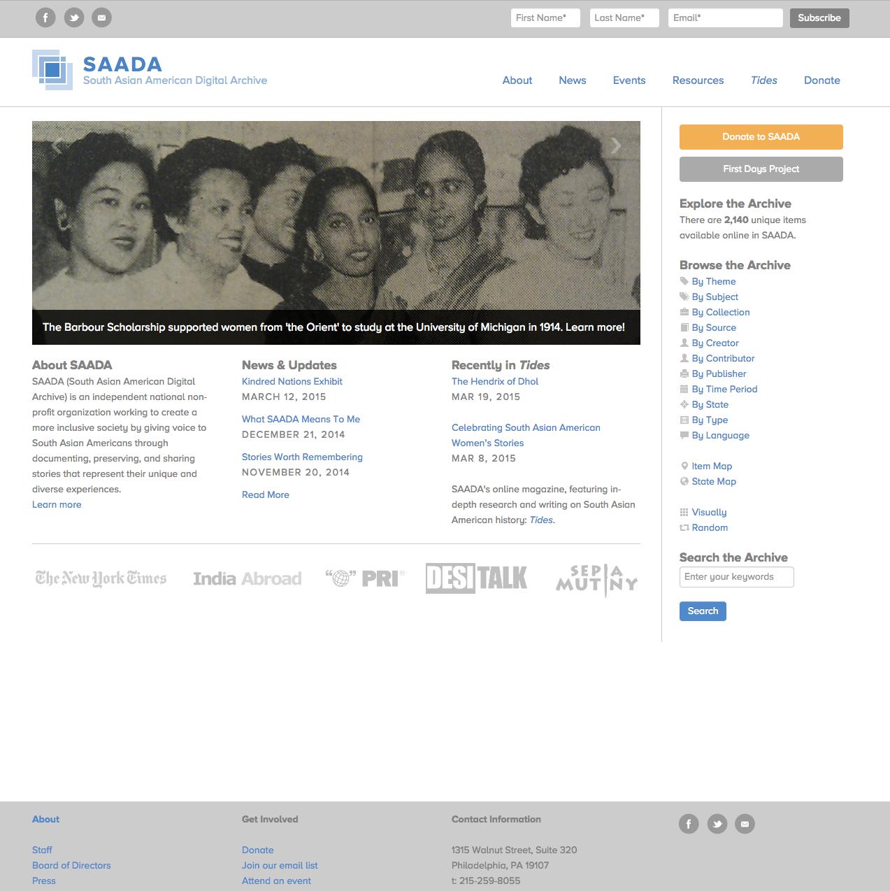
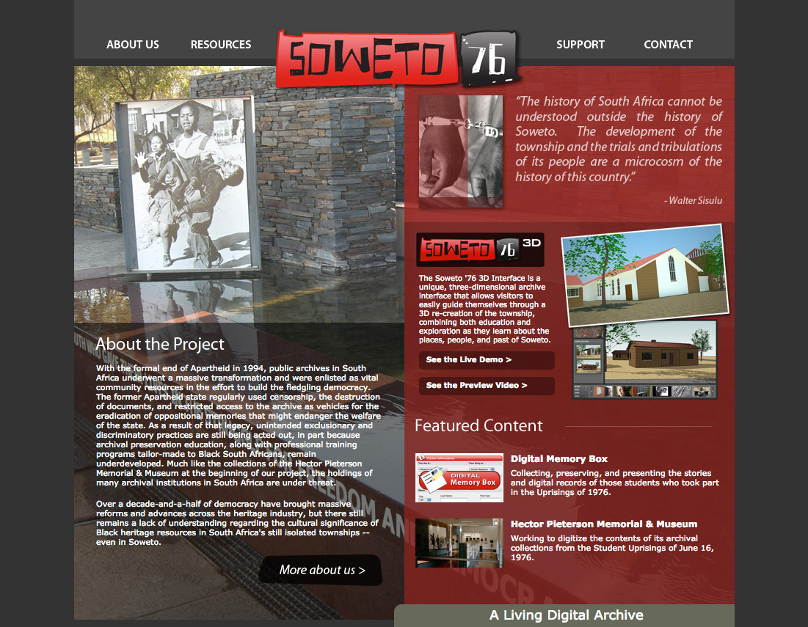
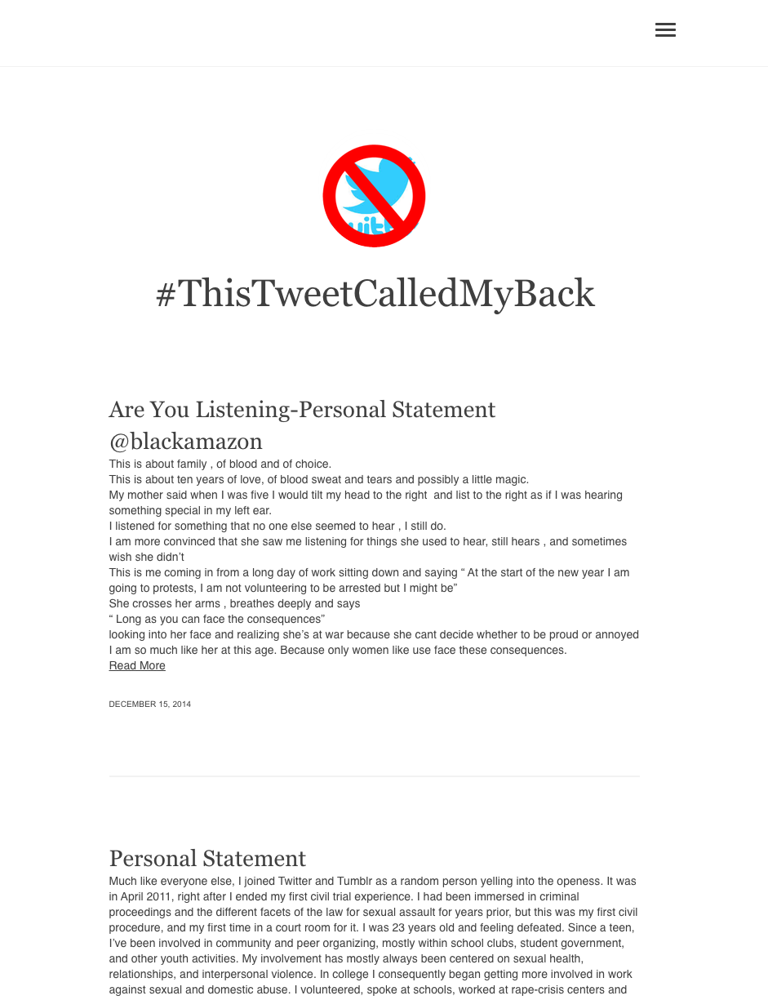
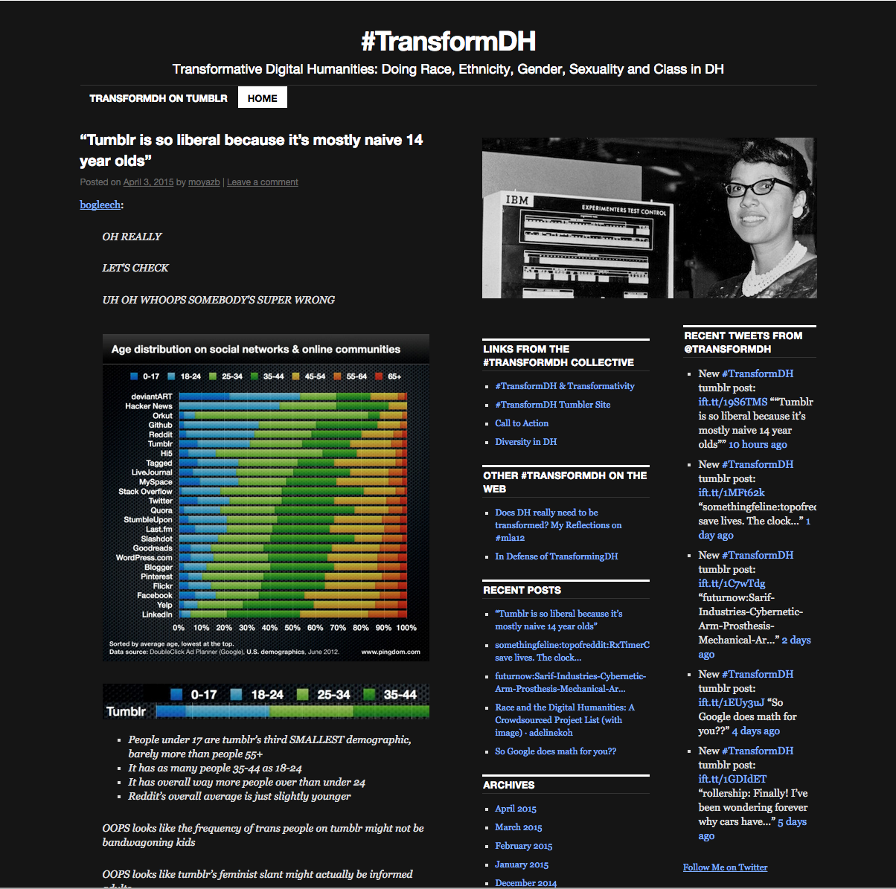
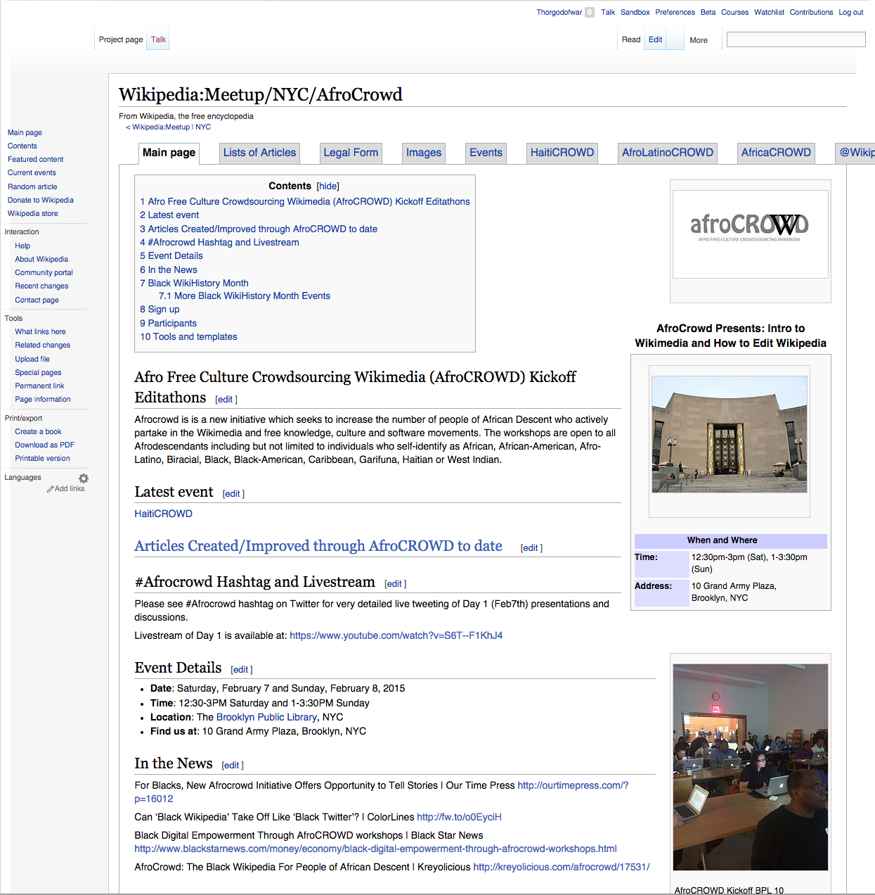

--- 
title: Digital Pedagogy in the Humanities
subtitle: Concepts, Models, and Experiments 
chapter: Race
URL: keywords/race.md
author: 
- family: Koh
  given: Adeline
editor: 
- family: Davis
  given: Rebecca Frost
publisher: Modern Language Association
type: book
---

# RACE (Draft)

## AUTHOR(S): [Adeline Koh](http://adelinekoh.org)
Stockton University | [adelinekoh.org](http://adelinekoh.org)

##### Publication Status:
* unreviewed draft
* draft version undergoing editorial review
* **draft version undergoing peer-to-peer review**
* published 

--- 

## CURATORIAL STATEMENT 

While it may not seem like it on first inspection, issues of race and ethnicity are deeply embedded in technology. European colonial
discourses from the eighteenth century onwards deployed the ideology that “civilized” groups deserved supremacy over others because of
their superior technology. They located this superiority in multiple fields, from advances in Western scientific knowledge to the West’s development of modern military
equipment and artillery. Postcolonial scholarship has largely
challenged this assumption, with critics arguing that the modernity
of non-Europeans actually predates the European construct of
modernity, or that notions of modernity need to be expanded
(Chakrabarty, Ong, Prakash, Diop). Even in contemporary discourse,
technology continues to be racialized by the assumption that people
in “developing” nations or from minority populations are outsiders
to technology. This belief is inaccurate. For example, as Anna
Everett has shown, far from being outsiders to the early years of
cyberspace, African Americans and African diasporic peoples were
actually early adopters of information age technology. The
persistence of this mode of thought in contemporary times indicates the cultural 
significance of race and ethnicity in technology and digital cultures. 

Given this historical backdrop, any responsible representation of race and
technology should offer challenges to and an expansion of how digital
pedagogy and digital humanities are defined. I make this deliberate political choice in my selection of artifacts in this keyword. Much seminal digital humanities
work on race does not fit into traditional notions of digital
humanities research because it has been initiated and developed outside of
the academy. I locate this work in activist politics, in new modes of crowdfunding, and
in private foundations, among others. The majority of this work has not
received the sorts of governmental, federal and institutional support
other less politicized work has. This is not a new critique; a variety
of scholars (Earhart, Koh) have argued that the majority of the extant digital humanities
corpora overly focuses on authors and cultural producers of European descent. 

Thus, on first look, a visitor to this project may find some of the selections in
this entry slightly odd. Some of these projects do not resonate as
typical “digital humanities” work because they began and continue to
exist outside of the academy without institutional support. Others
might appear unusual because they are simple blog posts or google
documents—artifacts whose production does not require much technical
expertise, thereby raising the question of whether they adequately
“count” as digital humanities pedagogy or research.

This choice is intentional. Through this curation, this collection seeks to expand 
the definition of “digital humanities” and “digital pedagogy” beyond the academy, and
beyond the conventional understanding that “doing digital humanities”
work requires deep technical knowledge. Through its composition, it
makes the argument that the included work should count as digital
humanities research and teaching.  This is because this work 1)
exists on digital infrastructures, and 2) because they are
representative of the definition of the humanities: the process and
documentation of the human experience.   The widespread reach of many of these artifacts, despite their not being located strictly within the academy, also speaks to the potential reach of digital work outside the ivory tower. For this reason, the digital is a tremendous space of possibility for traditional humanists, as it actively expands the boundaries of the humanities and humanities pedagogy beyond the academy itself, demonstrating the value of humanities questions to a larger public.  

This project thus defines “digital humanities pedagogy” as one which actively uses the digital space to create, build upon and sustain communities and
networks. It draws on bell hooks’ definition of “engaged
pedagogy,” a pedagogy which emphasizes the self-actualization of both
the teacher as well as the students, one which prioritizes having the
classroom as a community learn together the social, material and
political relationships that exist within the classroom and without.
It also draws upon Jesse Stommel’s concept of “critical digital
pedagogy,” which “centers its practice on community and
collaboration; must remain open to diverse, international voices […];
will not, cannot, be defined by a single voice but must gather a
cacophony of voices; must have use and application outside
traditional institutions of education.” 

The projects that make up this curated list exemplify these definitions of engaged pedagogy and critical digital pedagogy. I’ve used the following criteria in selecting these artifacts: 
* artifacts that break down the barrier between academia and the rest of the world
* artifacts that represent accessible technology (that includes rather than excludes)
* artifacts that represent activist technology
* artifacts that engage students with communities
* artifacts that pull students into larger networks
* artifacts that use technology to empower rather than disenfranchise 
* artifacts that help students develop their own understanding of diversity
* artifacts that exemplify how the classroom as a community learns together the social, material and political relationships that exist within the classroom and without.
A final note: this curated list is not
intended to be an exhaustive look at the field of race and the
digital humanities and digital pedagogy—indeed, it cannot completely
represent this entire field. This keyword, then, is only the
beginnings of an attempt to open up definitions of “digital
humanities” and “digital pedagogy.”

## CURATED ARTIFACTS

### African Diaspora PhD
* Artifact Type: Directory of Atlantic African diaspora history scholarship

* Source URL: http://africandiasporaphd.com/ 
* Copy of Artifact: forthcoming
* Creator: Jessica Marie Johnson (Michigan State University)

African Diaspora, Ph.D. is a curated blog that highlights scholarship and scholars in the field of Atlantic African diaspora history. This valuable resource is useful for students to gain an overview of current issues in Atlantic African diaspora history, and its relevance to contemporary race issues. It also provides a useful index of scholars working on this topic, many of whom are people of color. Students could be tasked with creating a literature review on this topic through researching this directory. This artifact represents scholarly activist technology in that it encourages students to be pulled into a larger network of Afrodiasporic knowledge production, and to discover that faculty of color are plentiful throughout the academy.  Sample assignments: 1) students could be tasked with creating a literature review on topics within Atlantic African diaspora history through researching this directory. 2) Students can be assigned to research the profile of Afrodisasporic scholars who work on contemporary race issues and reach out to them for interviews. 

### Ferguson Syllabus 
* Artifact Type: Crowdsourced Syllabus 

* Source URL: https://docs.google.com/document/d/1kwZl23Q9tgZ23dxSJWS-WpjZhOZ_mzVPtWL8-pWuLt8/edit/edit?pli=1#heading=h.l15kj4sa2rn0
* Copy of Artifact: forthcoming
* Creator: Marcia Chatelain, hashtag originator (Georgetown University), Dan Krutka, Google document host & faciliator (Texas Women's University)

This is a crowdsourced Google document containing resources and annotations that are helpful for instructors teaching about the events and reactions that occurred in Ferguson, MO in late 2014, when Michael Brown, an unarmed black teenager, was shot and killed by white police officer Darren Wilson. Wilson has not faced any charges for his actions. Widespread protests in Ferguson and on social media have resulted. Prof. Marcia Chatelain at Georgetown University then started the hashtag #FergusonSyllabus to provide sources for people wishing to learn and teach more about the historical context that resulted in the Michael Brown shooting, in particular, larger patterns of systemic racism and police brutality. This google document is one such product of the #FergusonSyllabus hashtag. It collates many sources offered by the public, including annotations, links, and ideas for instructors.

### Invisible Australians: The Real Face of White Australia 
* Artifact Type: Archive/Exhibit 

* Source URL: http://invisibleaustralians.org/faces/ 
* Copy of Artifact: forthcoming
* Creator: Kate Bagnall (ANU College of Asia and the Pacific), Tim Sherratt (National Library of Australia, University of Canberra)

This archival project seeks to overturn the actual effectiveness of the "White Australia Policy," a state-directed racial policy developed in Australia since 1901 to restrict the immigration of non-white ethnicities into Australia, and the integration of racial minorities into Australian culture. Drawn from records of the National Archives of Australia, the visual wall of portraits of non-white Australians documents both the inaccuracy of the myth of an all-white Australia, as well as the monitoring and restriction of people who were the target of this policy.  This is an artifact that demonstrates the power of the digital archive to tell a story of racial integration that radically diverges from the ones sanctioned by the state.  *Invisible Australians* can be used in courses on global race and ethnicity, particularly to introduce students to archival sources and their use in government policy. Additionally, this website can be used in conjunction with others like [Digitizing Chinese Englishmen](http://chineseenglishmen.adelinekoh.org/) in courses on race in colonial and postcolonial literature. Instructors might be interested in pairing a reading of these digital archives with core postcolonial texts that have critiqued colonialism within the print archive, such as Michel-Rolph Trouillot’s *Silencing the Past*, V.Y. Mudimbe’s concept of the “colonial library” in *The Invention of Africa* and Edward Said’s *Orientalism*. Core questions can include: how have technologies been utilized in a variety of archives to authorize particular versions of history?

### Mapping Police Violence 
* Artifact Type: Mapping tool 

* Source URL: http://mappingpoliceviolence.org/ 
* Copy of Artifact: forthcoming
* Creator: Deray McKesson, Netta, Samuel Sinyangwe, all of WeTheProtestors.org

This site offers easy to read and to use visualizations of crowdsourced data on people who have been shot and/or killed by police. The collaborators draw their data from databases such as [FatalEncounters.org](http://www.fatalencounters.org/), the U.S. Police Shootings Database and [KilledByPolice.net](http://killedbypolice.net/), along with original research from the team. The visuals clearly show that the number of black and Hispanic people killed by the police since May 2013 is inordinately high as compared with other races and ethnicities. This artifact engages students with communities, represents activist technology, and encourages students to participate in a larger network of knowledge construction. *Mapping Police Violence’s*  easy to use tables and data could provide an interesting classroom project investigating police shootings in a certain region, as well as course projects involving race and state violence.  It can be easily used in conjunction with the analysis of the police [Stop and Frisk public database analysis assignment](https://docs.google.com/document/d/1hAes7gK2s5w_pmyg6cnv1R0Jm350ZxA9Ddt97JTKoss/edit#heading=h.tnglmrae3sjl) developed by  Faith Adichie, Anne Cong-Huyen, Elizabeth Constable, John Locke, Andrew Lucchesi, Heidi Knoblauch, and Andrea Rehn in [Digital Pedagogy Lab 2015](http://digitalpedagogylab.com), which trains students on how to do close readings of datasets and to visualize this data using different tools. Integrating the Mapping Police Violence project along with the Stop and Frisk public database analysis assignment exemplifies how the classroom as a community constructs and deconstructs the social, material and political relationships within the classroom and outside of it.  

### Mukurtu 
* Artifact Type: Content Management System for indigenous communities to preserve and share cultural heritage digitally

* Source URL: http://www.mukurtu.org/ 
* Copy of Artifact: forthcoming 
* Creator: Kim Christen (University of Washington, Pullman) and Michael Ashley (University of California at Berkeley)

Mukurtu is an open source content management system aimed at empowering indigenous communities to manage, share and exchange digital heritage in relevant and ethically-minded ways. It began as a response to the archival needs of the Waramungu Aboriginal community in the Central Australian town of Tennant Creek. While Mukurtu is free and open source, items contained within the database can be given different levels of permission for viewing and interacting, thereby providing greater flexibility for communities unwilling for their heritage collections to be completely open to the public. This artifact exemplifies many points of my selection criteria--it is an attempt to build an empowering, activist technology, an artifact that engages students with communities and larger networks, and helps students develop their own understanding of diversity.

The CMS can easily be used in multiple ways for class  projects: for example, exploring its functionality and reporting on its affordances and limitations in comparison with other similar database exhibition tools (for example, Omeka, Scalar, Wordpress, Drupal etc.), and working together with a local community to build their own particular instance of Mukurtu for their uses.

### SAADA (South Asian American Digital Archive)
 * Artifact Type: Archive

* Source URL: https://www.saadigitalarchive.org/ 
* Copy of Artifact: forthcoming
* Creator and Affiliation: Samip Mallick (SAADA) 

SAADA is a digital archive that aims to increase the digital representation of South Asian Americans through documenting, preserving and sharing their stories. SAADA is registered as a non-profit organization based in Philadelphia, PA. Similar to *Invisible Australians*, this is an artifact that represents activist technology through making these narratives visible and available. Its genesis outside of the support of a traditional academic institution also breaks down the barrier between academia and the rest of the world. Instructors can easily integrate much of the archive's material into courses on South Asia, American studies, or diaspora studies as secondary material, getting students to research additional metadata and context to the objects, as well as possibly getting students involved in volunteering for the archive. 

A suggested assignment could be for students to do a comparative close reading of the archive’s resource [Saint Nihal Sing’s “Colour Line in the United States of America” (1908)](https://www.saada.org/item/20110621-216) with W.E.B. DuBois’s notion of the “color-line” as the problem of the twentieth century, published only five years earlier in DuBois’ *The Souls of Black Folk* (1903).  Sing compares the struggle of African Americans with the Indian struggle for Independence, which allows for fruitful comparisons of global anticolonialism across the United States and India in the early twentieth century. 

    
### Soweto76
* Artifact Type: 3D digital archive

* Source URL: http://www.soweto76archive.org/ 
* Copy of Artifact: forthcoming
* Creator: Angel David Nieves (Hamilton College) 

This is a 3D virtual representation of the black township of Soweto, South Africa in 1976 on the Unity platform. It allows visitors to guide themselves through the 3D recreation of the township and learn about the historical significance of various places in Soweto. 1976 is an important historical year for the township as black high school students from Soweto took to the streets to protest the introduction of Afrikaans in place of English as the medium of instruction in local schools. Up to 700 students may have died in the protest. This protest was due to the perception of Afrikaans being linked to apartheid and to the language of the oppressor. 

Student intern Kevin Xiao (Hamilton ‘15) participated in this project as a modeler and virtual environmental artist for two years, using blueprints and architectural drawings to model accurate recreations of the traditional homes of the Soweto township in Johannesburg, South Africa, which were then imported into the Unity game engine. 

The materials in the archive will be an excellent addition to courses on South Africa or about global race and ethnicity by introducing elements of visualization and geography into study of this historical protest. The three-dimensional quality of this resource helps students to understand the importance of space, place and physical location in racial segregation during Apartheid, where black and colored people were physically barred from entering spaces for whites. A possible assignment might be for students to work on the archive demo along with Google maps to compare how Soweto has changed since 1976, and to discuss the implications of these changes. A 3D demo of the archive is available for public use here: [http://soweto76archive.org/3d/](http://soweto76archive.org/3d/)

### #ThisTweetCalledMyBack 
* Artifact Type: Hashtag and tumblr blog

* Source URL: https://twitter.com/search?f=realtime&q=%23thistweetcalledmyback&src=typd 
    http://thistweetcalledmyback.tumblr.com/ 
* Copy of Artifact: forthcoming
* Creator: @tgirlinterruptd, @chiefelk, @bad_dominicana, @aurabogado, @so_treu, @blackamazon, @thetrudz 

&#35;ThisTweetCalledMyBack is a hashtag movement from late 2014, in which women of color activists on Twitter called attention to the appropriation of much of their work on social media by both journalists, activists and academic. The hashtag references the seminal book *This Bridge Called My Back: Writings by Radical Women of Color*, edited and first published in 1981 by Cherríe Moraga, Gloria Anzaldua and Toni Cade Bambara. 

This artifact checks off many of my selection criteria: it merges academia with the world, it represents a form of activist technology that engages students with community, and pulls them into a larger network. 

The hashtag can be taught in conjunction with themes of the appropriation of work by women of color in feminist movements, in relation to hashtag activism and new social media feminist movements, and in comparison to their pre-internet counterparts.

An excellent complementary reading to this artifact is Dorothy Kim’s “[The Rules of Twitter](http://www.hybridpedagogy.com/journal/rules-twitter/).” A concrete assignment could be to ask students to do a comparison of the major metaphors in both the original text as well as the tweetstream: what constitutes the “bridge”? who travels on it? and what does this show about change (or lack of change) in intersectional feminisms today? 

### #TransformDH 
* Artifact Type: Tumblr blog

* Source URL: http://transformdh.org/ 
* Copy of Artifact: forthcoming
* Creator: Anne Cong-Huyen (Whittier College), Alexis Lothian (University of Maryland),  Amanda Phillips (University of California, Davis), Melanie Kohnen (New York University), Moya Bailey (Northeastern  University), Marta S. Rivera Monclova (PhDeviate), Tanner Higgin (Common Sense Media), Fiona Barnett (Duke University), Anna Everett (University of California, Santa Barbara), Lisa Nakamura (University of Michigan), Tara McPherson (University of Southern California), Natalia Cecire (University of Sussex), Jessica M. Johnson (Michigan State University)

&#35;TransformDH is a fluid collective of people and ideas invested in the representation and scholarship of marginalized communities in the digital humanities. This artifact demonstrates the creation of a community and effort to pull students into larger networks. 
The tumblr blog would be good as an assigned reading in digital humanities classes, particularly for considering the relationship of its content to the field at large. For example, students could compare some of the publications to the tumblr with other digital humanities publications (e.g. *Debates in the Digital Humanities*, *Digital Humanities Quarterly*), to discuss what overlap there is between research topics.

### Afro Free Culture Wikimedia (AfroCROWD) Kickoff Edit-a-thons
* Artifact Type: Wikipedia Edit-A-Thon 

* Source URL: https://en.wikipedia.org/wiki/Wikipedia:Meetup/NYC/AfroCrowd
* Copy of Artifact: forthcoming
* Creator and Affiliation: Multiple Wikipedia editors

AfroCROWD is a Wikimedia initiative to increase the number of people of African descent who actively take part in the Wikimedia and free knowledge, culture and software movements. The event is part of Black WikiHistory Month, and is open to all Afrodescents who self-identify as being part of the diaspora. Student clubs and organizations focused on the African diaspora might be interested in organizing in-person nodes for these edit-a-thons. 

This artifact represents activist technology, one which uses technology to empower, as well as engaging students within a larger network of knowledge production. 

Instructors who are teaching more racially and ethnically diverse classes can also help add to the project by contributing to the [WikiProject African Diaspora](https://en.wikipedia.org/wiki/Wikipedia:WikiProject_African_diaspora) Educators who want to get started teaching with Wikipedia can look at [my blog post on resources on getting started](http://www.adelinekoh.org/blog/2015/03/05/resources-on-integrating-wikipedia-into-your-classroom/), and contact the [Wiki Education Foundation](http://wikiedu.org/), an organization that has been developed especially to give classroom support for education. 

## RELATED MATERIALS

* Everett, Anna. *Digital Diaspora: A Race for Cyberspace* Albany, NY: SUNY Press, 2009. 

* Harding, Sandra, ed. *The Postcolonial Science and Technology Reader* Durham: Duke University Press, 2011. 

* Koh, Adeline. *NITLE Race and the Digital Humanities Zotero Bibliography* (https://www.zotero.org/groups/nitle_race_and_digital_humanities/items)

* McPherson, Tara. "Why Are the Digital Humanities So White? Or Rethinking the Histories of Race and Computation" *Debates in the Digital Humanities* ed: Matt Gold. Minnesota, University of Minnesota Press. [<http://dhdebates.gc.cuny.edu/debates/text/29>](http://dhdebates.gc.cuny.edu/debates/text/29) 

* Nakamura, Lisa and Peter Chow-White (eds). *Race After the Internet* New York: Routledge, 2011. 

## WORKS CITED

Adichie, Faith, Anne Cong-Huyen, Elizabeth Constable, John Locke, Andrew Lucchesi, Heidi Knoblauch, and Andrea Rehn. [Stop and Frisk Public Database Analysis Social Justice Assignment](https://docs.google.com/document/d/1hAes7gK2s5w_pmyg6cnv1R0Jm350ZxA9Ddt97JTKoss/edit#heading=h.tnglmrae3sjl).  [Digital Pedagogy Lab](http://www.digitalpedagogylab.com/identity). Web. 1 Sep. 2015

*AfroCROWD* Web. [<https://en.wikipedia.org/wiki/Wikipedia:Meetup/NYC/AfroCrowd>](https://en.wikipedia.org/wiki/Wikipedia:Meetup/NYC/AfroCrowd) 3 Apr. 2015. 

Bagnall, Kate and Tim Sherratt. *Invisible Australians: The Real Face of White Australia*
Web. [<http://invisibleaustralians.org/faces/>](http://invisibleaustralians.org/faces/) 3 Apr. 2015.

Chakrabarty, Dipesh. *Provincializing Europe: Postcolonial Thought and Historical Difference.* Princeton: Princeton University Press, 2007.

Christen, Kim and Michael Ashley. *Mukurtu* Web. [<http://www.mukurtu.org/>](http://www.mukurtu.org/) 3. Apr. 2015. 

Cong-Huyen, Anne et al. *#TransformDH*  Web. [<http://transformdh.org/>](http://transformdh.org/) 3 Apr. 2015.

Chatelain, Marcia. *#Ferguson Syllabus* Web. [<https://docs.google.com/document/d/1kwZl23Q9tgZ23dxSJWS-WpjZhOZ_mzVPtWL8-pWuLt8/edit/edit?pli=1#heading=h.l15kj4sa2rn0]>](https://docs.google.com/document/d/1kwZl23Q9tgZ23dxSJWS-WpjZhOZ_mzVPtWL8-pWuLt8/edit/edit?pli=1#heading=h.l15kj4sa2rn0]) 3. Apr. 2015. 

Diop, Cheikh Anta. 1974. *The African Origin of Civilization: Myth or Reality.* Chicago: Chicago Review Press, 2012.

Earhart, Amy. “Can Information be Unfettered? Race and the New Digital Humanities Canon.” *Debates in the Digital Humanities.* Ed. Matt Gold. Minneapolis: University of Minnesota Press, 2012.

Everett, Anna. *Digital Diaspora: The Race for Cyberspace.* Albany, NY: SUNY Press, 2009.

Harding, Sandra, ed. *The Postcolonial Science and Technology Reader* Durham: Duke University Press, 2011. 

hooks, bell. *Teaching to Transgress: Education as the Practice of Freedom.* New York: Routledge, 1994.

Johnson, Jessica M. *African Diaspora PhD* Web. [<http://africandiasporaphd.com/>](http://africandiasporaphd.com/) 3 Apr. 2015.

Kim, Dorothy. “The Rules of Twitter.” Hybrid Pedagogy. http://www.hybridpedagogy.com/journal/rules-twitter/ 4. Dec 2014. Web.

Koh, Adeline. Digitizing Chinese Englishmen. Web. http://chineseenglishmen.adelinekoh.org. 1 Sept 2015.

Koh, Adeline. “Inspecting the Nineteenth-century Literary Digital Archive: Omissions of Empire.” *Journal of Victorian Culture.* 19.3 (2014): 385-395.

Koh, Adeline. *NITLE Race and the Digital Humanities Zotero Bibliography* (https://www.zotero.org/groups/nitle_race_and_digital_humanities/items)

Koh, Adeline. “Resources on Integrating Wikipedia Into Your Classroom.” http://www.adelinekoh.org/blog/2015/03/05/resources-on-integrating-wikipedia-into-your-classroom/ Sep 1 2015. Web. 

Mallick, Samip. *SAADA (South Asian American Digital Archive.)* Web. [<https://www.saadigitalarchive.org/>](https://www.saadigitalarchive.org/) 3 Apr. 2015.

McKesson, Deray, et al. *Mapping Police Violence* Web. [<http://mappingpoliceviolence.org/>](http://mappingpoliceviolence.org/) 

McPherson, Tara. "Why Are the Digital Humanities So White? Or Rethinking the Histories of Race and Computation" *Debates in the Digital Humanities* ed: Matt Gold. Minnesota, University of Minnesota Press. [<http://dhdebates.gc.cuny.edu/debates/text/29>](http://dhdebates.gc.cuny.edu/debates/text/29) 

Mudimbe, V.Y. The Invention of Africa: Gnosis, Philosophy and the Order of Knowledge. Purdue: Indiana University Press, 1988. 

Nakamura, Lisa and Peter Chow-White (eds). *Race After the Internet* New York: Routledge, 2011. 

Nieves, Angel David. *Soweto76* Web. [<http://www.soweto76archive.org/>](http://www.soweto76archive.org/)

Nonini, David M. and Aihwa Ong. *Ungrounded Empires: The Cultural Politics of Modern Chinese Nationalism.* New York: Routledge, 1997.

Prakash, Gyan. *Another Reason: Science and the Imagination of Modern India.* Princeton: Princeton University Press, 1999.

Said, Orientalism. New York: Vintage Books, 1978. 

Saint Nihal Sing, “Color Line in the United States of America…” Modern Review, 1908. The South Asian American Digital Archive. 1 Sep 2015, Web. https://www.saada.org/item/20110621-216 

Stommel, Jesse. “Critical Digital Pedagogy: A Definition.” *Hybrid Pedagogy.* November 18, 2014. [<http://www.hybridpedagogy.com/journal/critical-digital-pedagogy-definition/>](http://www.hybridpedagogy.com/journal/critical-digital-pedagogy-definition/)

@tgirlinterruptd, et al. *ThisTweetCalledMyBack* Web. [<https://twitter.com/search?f=realtime&q=%23thistweetcalledmyback&src=typd>](https://twitter.com/search?f=realtime&q=%23thistweetcalledmyback&src=typd) 3 Apr. 2015.

Trouillot, Michel-Rolph. Silencing the Past: Power and the Production of History. Boston: Beacon Press, 1997. 

Wiki Education Foundation. http://wikiedu.org/ 1 Sep

