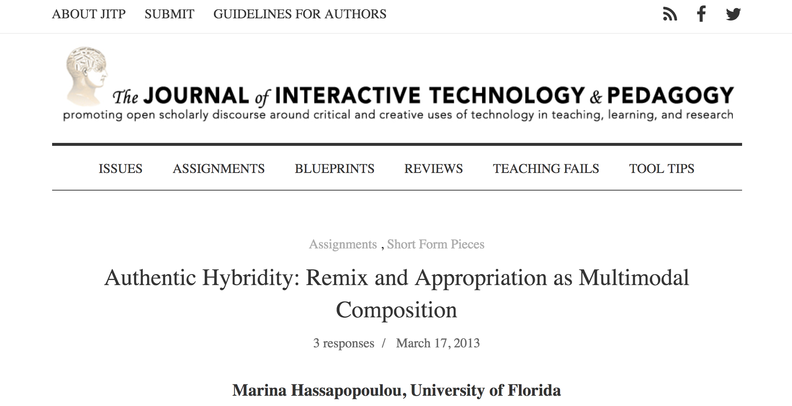
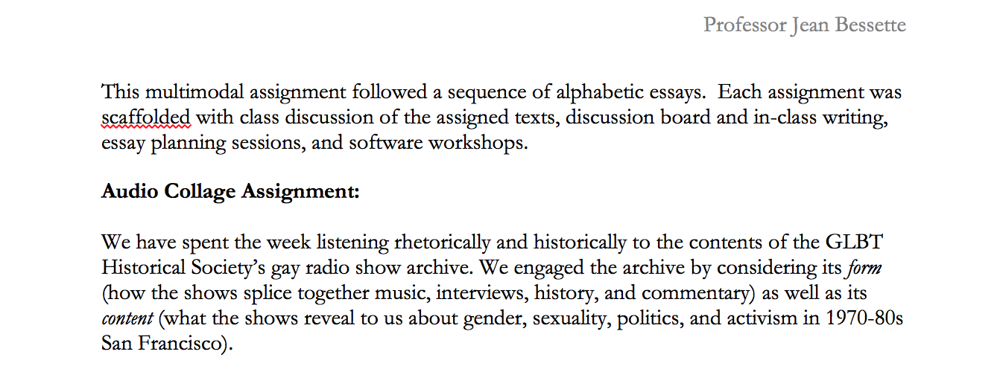
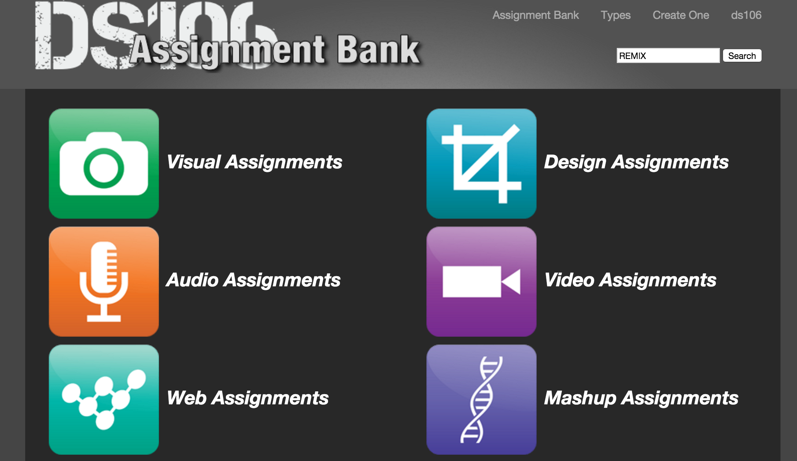
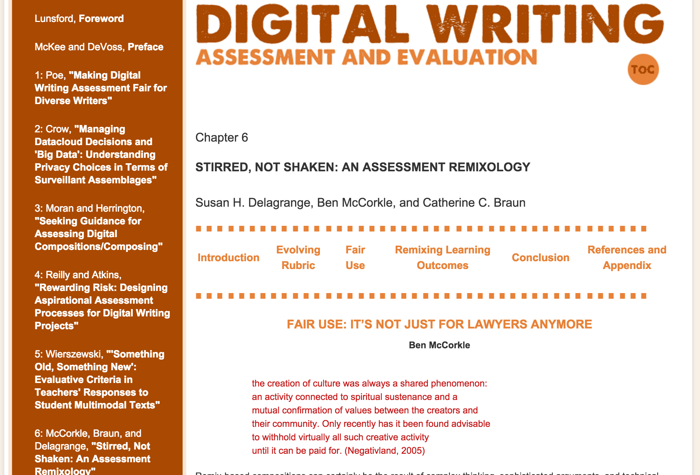
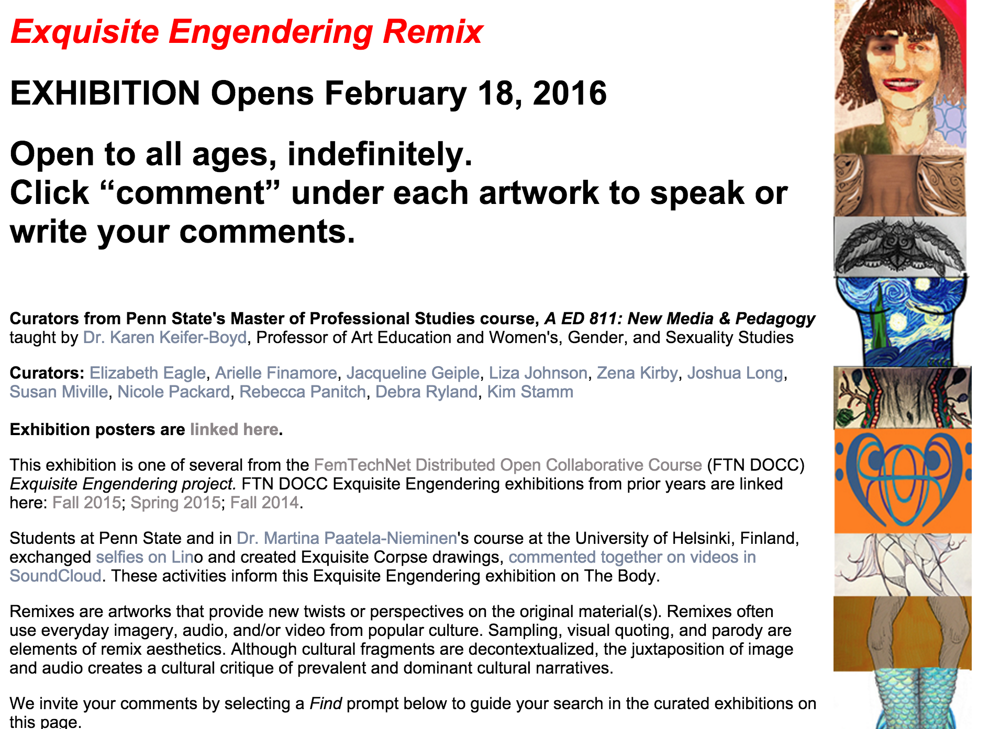
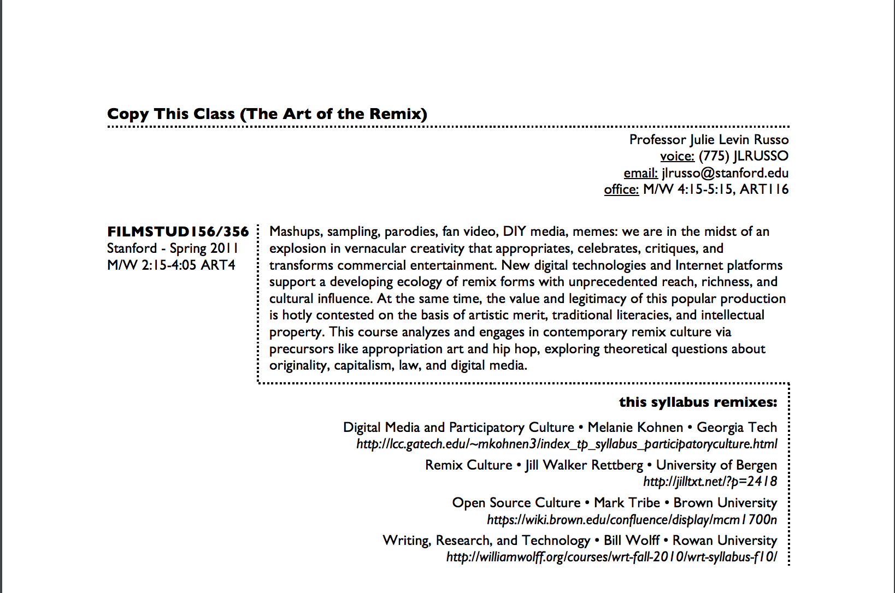
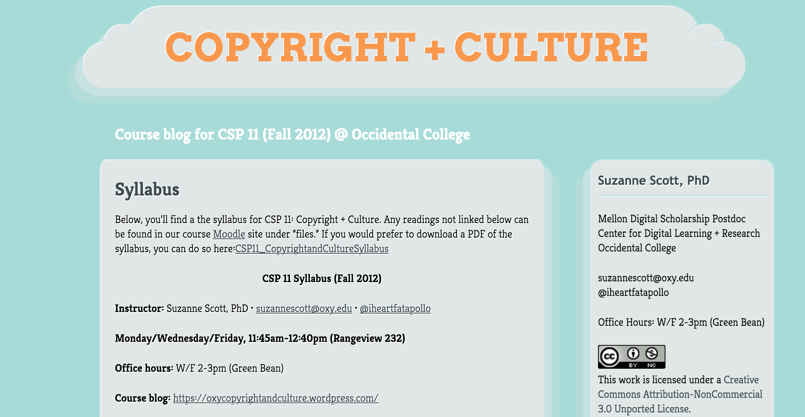
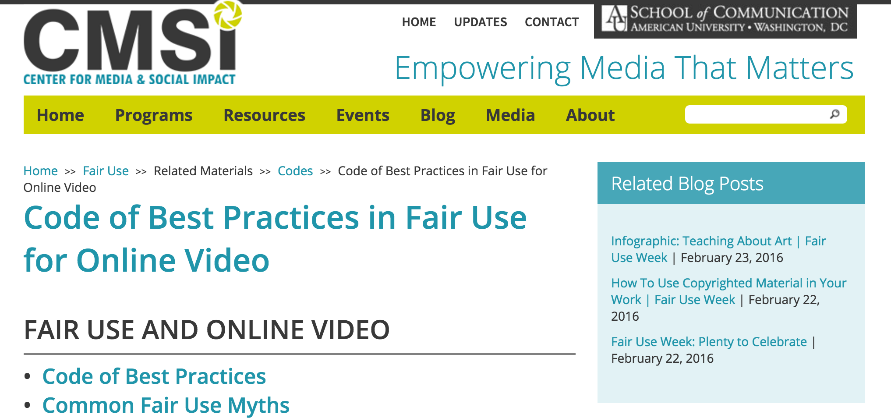
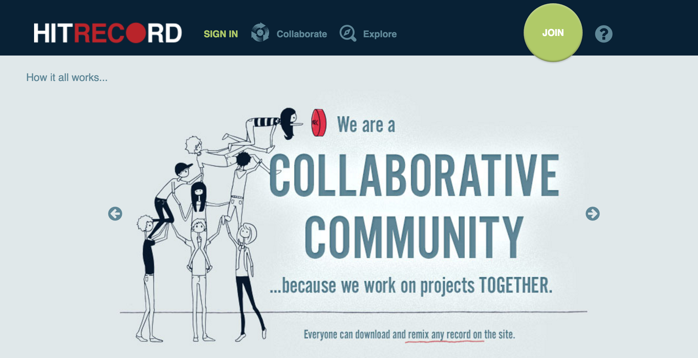

--- 
title: Digital Pedagogy in the Humanities
subtitle: Concepts, Models, and Experiments 
chapter: Remix
URL: keywords/remix.md
author: 
- family: Middleton
  given: Kim
editor: 
- family: Davis
  given: Rebecca Frost
publisher: Modern Language Association
type: book
---

# Remix

### Kim Middleton
Mount Saint Mary's University, Los Angeles 

##### Publication Status:
* unreviewed draft
* draft version undergoing editorial review
* draft version undergoing peer-to-peer review
* **draft version undergoing MLA copyediting**
* awaiting pre-print copy
* published 

---

### Cross-Reference Keywords: assessment, authorship, hybrid, multimodal, open, sound, video

---  

## CURATORIAL STATEMENT 

At its most deceptively simple, remix is nothing more than the act of identifying existing materials, and altering and combining them to create something new. Anyone who has used the internet or listened to music in the past 40 years has experienced a remix; it is fair to say that students have grown up with them. Remix objects (songs, memes, mashups, etc.) are now so deeply embedded in daily media consumption that their existence as representatives of a digital culture with its own protocols, politics, aesthetics and audiences is practically invisible.  

Where did remix come from? Some scholars ground contemporary practices of remix historically, in the long trajectories of mimesis, or the rise of industrialization (Church, Sonvilla-Weiss). The most popular antecedent of remix, however, lies in the [*sound*](https://digitalpedagogy.mla.hcommons.org/keywords/sound/) subcultures of New York City in the 1970s (e.g., disco, hip hop). There, DJs looped a song to extend it, or extracted small samples of tracks and reassembled them to serve as the basis for an entirely different composition. Whether the medium was audio, video, text, or some combination of these, practitioners used similar approaches to modify and reassemble materials to suit the tastes of their tribes, therein extending the definition of authorship for community engagement. Twentieth century technologies, in the meantime, evolved from analog to digital modes, making the foundational practices of remix—cut, paste, layer, juxtapose—available to extraordinary numbers of amateurs and artists. Yet for all of the simplicity of those functions, the accessibility of remix practices also encoded an array of complex implications belied by the “pop” face of remix. As Russo and Coppa explain in their analysis of fan video: “Technological innovations and Internet platforms support a developing ecology of remix forms with unprecedented reach…and cultural influence. At the same time, the value and legitimacy of this popular production is hotly contested on the basis of artistic merit, traditional literacies, and intellectual property” (“Fan/Remix”). 

Simultaneously pervasive and controversial, remix emerged as a fundamental vernacular practice that requires defense. Law professor and activist Lawrence Lessig situates the right to remix as “a critical expression of creative freedom that…no free society should restrict” (56). He defends this bold claim by placing remix at the center of a culture in which citizens have the ability not only to consume cultural artifacts made by professionals, but to contribute to the culture by creating and re-creating what is around them. Like Lessig, Henry Jenkins identifies this phenomenon as “participatory culture,” wherein individuals and affinity groups “archive, annotate, appropriate, and recirculate media content in powerful new ways,” and in doing so, refine competencies that underpin their cultural engagement (8-9). The exuberance of both scholars is tempered by the significant challenges to remix as civic engagement—most notably, the corporate and governmental insistence on legal copyright as imprimatur of a work’s ownership, which prevents its use as a source for new work. 

The pedagogical exigency of remix, then, grows out of two specific, but linked, contexts. On the one hand, the ubiquity of remix in popular culture conceals the complex meaning-making that it can and does perform. On the other hand, its foundational practices exist in constant and ever-changing tension with high-stakes legal and economic consequences. The technological ease with which users remix existing content challenges our cultural beliefs about [*authorship*](https://digitalpedagogy.mla.hcommons.org/keywords/authorship/) and ownership; passive consumption and active participation; creativity, critique, and claim; yet the everyday habits of consuming, composing, and recirculating remixes already comprise a coherent logic for daily interaction. Bringing remix into the classroom, then, creates the space for students to investigate these contested concepts, as they appear in the media and materials of everyday life, through experimentation with the critical tools of varied academic disciplines. Work with remix can attenuate students to the moments when scholarly fields question or collaborate with these commonplace practices. Further, as Virginia Kuhn has noted, it calls into question our own aesthetic and ideological criteria as it “lays bare the constructed nature of the original” (“Rhetoric”). Teaching remix provides an opportunity to participate in a shared project with students: the examination of a common philosophical investment in “originals,” and the collective transformation of these as contribution to civic and cultural life.

The artifacts that follow were chosen for the ways that they provide pragmatic approaches to those pedagogical exigencies of remix. They focalize various contexts and meaning making, and elucidate the terrain of copyright and its participatory-friendly adjacent fair use. The list begins with assignment, assessment, and student work resources, prime candidates for instructors new to remix to incorporate into existing courses. Syllabi follow, for those who intend to devote an entire semester to the topic. The two final artifacts function both as primary source material and serve as examples of the active life of remix outside the classroom. 

## CURATED ARTIFACTS 

# Authentic Hybridity: Remix and Appropriation as Multimodal Composition

* Artifact Type: assignment/lesson plan 
* Source URL: https://jitp.commons.gc.cuny.edu/authentic-hybridity-remix-and-appropriation-as-multimodal-composition/8
* Artifact Permissions: In JITP Assignment Bank,  CC-BY-NC-SA 3.0
* Creator: Marina Hassapopoulou

In this short article for *The Journal of Interactive Technology and Pedagogy*, Marina Hassapopoulou describes an early assignment in her English Composition class, wherein students are prompted to choose a video and an image from the internet that represents them, and to consider whether these artifacts might require modification to fully capture their identities. Her seemingly simple guidelines open out to reveal the complex thinking about the internet and about themselves that students must undertake to complete the assignment. The article goes on to capture her rationale, required course viewings, and unexpected outcomes for the assignment, as well as several examples of her students’ work. Hassapopoulou has found a way to engage students in thinking about the motivations for remix without the need for significant technological expertise, making her assignment a perfect place for instructors to begin integrating remix into their courses. 
 

# *Flows of Reading: Engaging with Texts*

* Artifact Type: Online Digital Book
* Source URL: http://scalar.usc.edu/anvc/flowsofreading/index
* Artifact Permissions: CC-BY-NC
* Copy of the Artifact:
* Creators: Erin Reilly, Ritesh Meta, Henry Jenkins, USC Annenberg Center for Communication and Journalism

The non-linear, digital book *Flows of Reading* provocatively takes as its case study the canonical American novel *Moby Dick*. The section titled “Appropriation and Remixing” argues for an understanding of literature as an appropriative practice, and also provides some creative examples of remix assignments that connect popular culture to canonical literature. The subsections “Reading a Remix” and “Creating a Remix” offer both assignments and multimedia content that guide students through the questions that underpin good remix practice (e.g., “when and how should they borrow from other people’s work” (10)). Those with particular interests in a comprehensive lesson plan should also examine the affiliated [*Teachers’ Strategy Guide Unit: Appropriation and  Remixing*](http://www.newmedialiteracies.org/teachers-strategy-guide-approp/). While its content is designed for high school students, the activities are easily adaptable for more advanced students.

# Audio Collage Assignment

* Artifact Type: assignment
* Source URL: 
* Artifact Permissions: CC-BY-NC
* Copy of the Artifact:  [Audio Collage Assignment](files/remix-Audio-Collage-Assignment.pdf)
* Creator: Jean Bessette, University of Vermont

This 4-6 minute audio collage assignment is designed, as Jean Bessette describes in an article from the 2016 issue of the *Computers and Composition* journal, to “explore a focused, complex, and nuanced topic in gender and sexuality” (75). Here, students select and assemble materials from an online archive of gay liberation radio shows. In the article, she interprets two case studies of student projects, and highlights the emergence of their personal and rhetorical inquiry within the confines of the assignment. In addition to the model assignment, however, Bessette makes a larger argument about the outcomes of the approach. The process of listening to prepare to make the collage involves both listening widely to a number of elements in the archive, and listening iteratively in the selection and editing process. These, she contends, contribute not only to students’ increased engagement with the texts, but also to an openness toward difference when the archive material is far from students’ experience and comfort zone.

# ds106

* Artifact Type: Assignment bank
* Source URL: http://assignments.ds106.us/
* Artifact Permissions: assignment submission conditional on sharing
* Copy of the Artifact:
* Creator: Jim Groom and ds106 community, University of Mary Washington

The ds106 assignment bank provides an almost-overwhelming cache of possibilities adaptable for different audiences and courses. For the sake of navigational efficiency, curious teachers should first click on their preferred genre for the assignment (e.g., writing, visual, audio). Typing “remix” into the search bar for that genre narrows the field of assignments further. The community of users has rated each assignment, guiding instructors to the most successful and engaging materials. The “messy” nature of the bank speaks to its origin as an [open](https://digitalpedagogy.mla.hcommons.org/keywords/open/) source. Created by self-described “edupunk” Jim Groom, ds106 is a course that lives in multiple departments at the University of Mary Washington, and also exists as a “headless” course—a self-paced set of readings, activities and assignments that participants can choose to take. At the Connected Learning project, Howard Rheingold provides a thorough [case study](http://connectedlearning.tv/case-studies/ds106-enabling-open-public-participatory-learning) of ds106 as an example of the principle of open, public learning. 

# Stirred, Not Shaken: An Assessment Remixology

* Artifact Type: assessment rubric 
* Source URL: http://ccdigitalpress.org/dwae/06_mccorkle.html
* Artifact Permissions: CC-BY-NC
* Copy of the Artifact:
* Creators: Susan H. Delagrange, Ben McCorkle, and Catherine C. Braun, The Ohio State University

Delagrange, et al. suggest a clear, implementable process to navigate the complex process of [assessment](https://digitalpedagogy.mla.hcommons.org/keywords/assessment/) for remix assignments. In the tab “Evolving Rubric,” McCorkle outlines a set of steps for instructors and students to collaboratively create a grading rubric. In addition, he provides examples of student work that can help sharpen students’ analysis of the criteria included in the assessment. Part of the larger 2013 collection [*Digital Writing, Assessment and Evaluation*](http://ccdigitalpress.org/dwae/),“Stirred, Not Shaken” also contributes a set of sample assignments and evaluation processes for remix projects in writing courses, and describes additional expository and reflective writing assignments that expand students’ concepts of remix practices and circulation. In addition to these assignments, authors put forward a narrative describing the implementation of fair use and an assessment of the role of remix in larger institutional learning outcomes. 

# Exquisite Engendering Remix Exhibition

* Artifact Type: Exhibition of student work
* Source URL: http://cyberhouse.arted.psu.edu/811/
* Artifact Permissions: permission of author
* Copy of the Artifact:
* Creators: Karen Keifer-Boyd, Penn State University

Karen Keifer-Boyd’s final class project for her graduate course in Art Education provides a variegated set of exemplary student remixes, and her [http://cyberhouse.arted.psu.edu/visualculture/projects/Remix_Assignment.pdf](detailed assignment) also offers a wealth of resources to inform students’ understanding of potential approaches and digital tools. This exhibition highlights the effects of situating remix in a larger series of interactions. As part of FemTechNet’s Distributed Open Collaborative Course (a detailed description can be found in their [*Roadshow Blog Series*](http://femtechnet.org/2015/05/ftn-roadshow-blog-series-course/)), the Exquisite Engendering Remix students spent a semester in conversation with students at the University of Helsinki, a collaboration which clearly contributed to the spirit of openness and dialogue about their remixes. The participatory nature of their work is evident in this final exhibition, which encourages the audience to comment on the videos; in fact, the website offers a series of prompts to focus those comments toward the exhibition’s theme of gender.

# Copy This Class (The Art of the Remix)

* Artifact Type: Syllabus
* Source URL: http://j-l-r.org/wp-content/uploads/remix-syllabus-final.pdf
* Artifact Permissions: CC BY-SA 3.0
* Copy of the Artifact: [Copy This Class Syllabus](files/remix-copythisclasssyllabus.pdf)
* Creator: Julie Levin Russo, The Evergreen State College

Julie Levin Russo’s undergraduate film studies course takes remix as its central topic. Through the assigned reading, media, and experiences each week, students are introduced to remix from a historical perspective and a philosophical one. Russo’s course plays through an array of contexts that highlight the variety and complexity of remix as object, and as a set of practices (e.g., appropriation, authorship, sampling, “playbor”). Collaborative student remix projects comprise a significant portion of the semester, making evident the core value of participation and peer engagement in remix culture. Finally, in a knowing wink to our own habits of syllabus composition, Russo cites the syllabi and assignments that she has remixed to create this course.

# Copyright + Culture

* Artifact Type: Syllabus
* Source URL: https://oxycopyrightandculture.wordpress.com/syllabus/
* Artifact Permissions: CC BY-NC 3.0
* Copy of the Artifact:
* Creator: Suzanne Scott, University of Texas at Austin

Suzanne Scott’s 2012 course *Copyright + Culture* foregrounds the fundamental conflicts between intellectual property and cultural production/participation—-the very positions that condition the creation and circulation of remix. The course goals articulate the ways that students can engage these larger questions in sophisticated ways: through practice, collaboration, and critical engagement with the history and philosophy of art and authorship, and case studies in fair use, fandom, and transformative works. Designed for first year students, *Copyright + Culture* also features a set of assignments (including a collaborative remix video project) that invites students to hone their argumentation skills across a variety of platforms. For more information about Scott’s video essay assignment and its careful navigation of fair use and copyright claims, see her essay [*Teaching Transformativity/Transformative Teaching: Fair Use and the Video Essay*](http://www.teachingmedia.org/teaching-transformativitytransformative-teaching-fair-use-and-the-video-essay), which is also included in the [*Multimodal*](https://digitalpedagogy.commons.mla.org/keywords/multimodal/) keyword entry. 

# Code of Best Practices in Fair Use for Online Video

* Artifact Type: Resource guide
* Source URL: http://cmsimpact.org/code/code-best-practices-fair-use-online-video/
* Artifact Permissions: after the list of the authoring committee on the page (http://cmsimpact.org/code/code-best-practices-fair-use-online-video/), see statement: "Feel free to reproduce this work in its entirety. For excerpts and quotations, depend upon fair use.”
* Copy of the Artifact:
* Creator: The Program on Information Justice and Intellectual Property and The Center for Media and Social Impact, American University

Originally published in 2008, the CMSI report and resources provide a thorough-yet-readable guide to delineate fair use practices from copyright violations. Structured with reference to the six allowable contexts for fair use, the guide elucidates each of these principles, and also describes the limitations of each. To help students apply these principles, the [“Fair Use Scenarios”](http://cmsimpact.org/resource/fair-use-scenarios/), located in CMSI’s “teaching tools” tab, serve as concrete writing or discussion prompts. Over and above the “Code of Best Practices” material, the CMSI website features materials like the excellent introduction to copyright, “Recut, Reframe, Recycle,” a study of fair use practices in transformative works, and a list of linked examples that adhere to these practices—all of which can be assigned as course content. While the resources here are predominantly applicable to video, they offer a philosophical framework with which to assess the use of audio and textual materials as well. 

# hitRECord

* Artifact Type: Collaborative project
* Source URL: https://www.hitrecord.org/
* Artifact Permissions: screenshot only (public website)
* Copy of the Artifact:
* Creator: Joseph Gordon-Levitt

HitRECord is an online open community that encourages participants to contribute their compositions for others to combine, modify, and remix. Their contributions also can be incorporated into the site’s own collaborative projects (e.g., [“The In-Between Moments”](https://www.hitrecord.org/records/1904767/albums?startTime=52)). As a pedagogical resource, HitRECord can be used for its list of “creative challenges,” sorted by genre (writing, cinematography, animation, etc.), which functions as a de facto assignment bank for instructors to adopt as individual and collaborative class projects. A more daring use of the site would capitalize on it as a platform through which one can mentor students undertaking the messy process of “remix in the wild”— the navigation of participatory culture outside the boundaries of the classroom. To contribute to HitRECord requires students to understand its working assumptions about authorship and ownership, fair use, and collaboration, and to align it with their own. As an independent study or capstone, engagement in the HitRECord community offers advanced students an object lesson in the friction between the pragmatics and ideals of participatory culture. 

## RELATED MATERIALS

Ito, Mizuko, et al. *Hanging Out, Messing Around, and Geeking Out: Kids Living and Learning with New Media.* MIT Press, 2010. [https://mitpress.mit.edu/books/hanging-out-messing-around-and-geeking-out] Accessed 22 Feb. 2016. 

Manovich, Lev. *The Language of New Media.* Cambridge, MA: MIT Press, 2001. 
Navas, Eduardo. *Remix Theory.* [http://remixtheory.net/] Accessed 22 Feb. 2016.

Ridolfo, Jim and Danielle Nicole DeVoss. “Composing for Recomposition: Rhetorical Velocity and Recovery.” *Kairos: A Journal of Rhetoric, Technology, and Pedagogy.* vol 13, no. 2, 2009. [http://kairos.technorhetoric.net/13.2/topoi/ridolfo_devoss/index.html] Accessed 22 Feb. 2016. 

Taylor, Brett. director. *RiP!: A Remix Manifesto.* 2008. Web. [https://vimeo.com/8040182]

## WORKS CITED

Bessette, Jean. “Audio, Archives, and the Affordance of Listening in a Pedagogy of ‘Difference.’” *Computers and Composition.* vol. 39, March 2016, pp. 71-82. http://www.sciencedirect.com/science/journal/87554615

Church, Scott H. “A Rhetoric of Remix.” *The Routledge Companion to Remix Studies.* Taylor and Francis, 2017, pp. 43-53. 

Delagrange, Susan, et. al. “Stirred, Not Shaken: An Assessment Remixology.” *Digital Writing Assessment & Evaluation,* edited by McKee, Heidi A., and Dànielle Nicole DeVoss, Computers and Composition Digital Press/Utah State University Press, 2013. ccdigitalpress.org/dwae/06_mccorkle.html. Accessed 22 Feb. 2016. 

“ds106 Assignment Bank.” *ds106.* University of Mary Washington. assignments.ds106.us/. Accessed 15 Sept. 2017. 

Hassapopoulou, Marina. “Authentic Hybridity: Remix and Appropriation as Multimodal Composition.” *The Journal of Interactive Technology and Pedagogy.* jitp.commons.gc.cuny.edu/authentic-hybridity-remix-and-appropriation-as-multimodal-composition/8. Accessed 15 Sept. 2017. 

HitRECord.org LLC. *HitRECord.* www.hitrecord.org. Accessed 15 Sept. 2017.

Ito, Mizuko, et al. *Hanging Out, Messing Around, and Geeking Out: Kids Living and Learning with New Media.* MIT Press, 2010. mitpress.mit.edu/books/hanging-out-messing-around-and-geeking-out. Accessed 22 Feb. 2016. 

Jenkins, Henry, et al. *Confronting the Challenges of Participatory Culture: Media Education for the 21st Century.* MIT Press, 2009. mitpress.mit.edu/books/confronting-challenges-participatory-culture. Accessed 22 Feb. 2016. 
Keifer-Boyd, Karen, et. al. “Exquisite Engendering Remix Exhibition.” Pennsylvania State University. cyberhouse.arted.psu.edu/811/. Accessed 22 Feb. 2016.
Keifer-Boyd, Karen. “FTN Roadshow Blog Series—Course.” *FemTechNet.* FemTechNet. femtechnet.org/2015/05/ftn-roadshow-blog-series-course/. Accessed 22 Feb. 2016. 
Kuhn, Virginia. “The Rhetoric of Remix.”*Transformative Works and Cultures.* vol. 9 (2012). dx.doi.org/10.3983/twc.2012.0358. Accessed 22 Feb. 2016.
Lessig, Lawrence. *Remix: Making Art and Commerce Thrive in a Hybrid Economy.” Bloomsbury Press. 2008.
Manovich, Lev. *The Language of New Media.* MIT Press, 2001. 
McKee, Heidi A., and Dànielle Nicole DeVoss, Eds. *Digital Writing Assessment & Evaluation.* Computers and Composition Digital Press/Utah State University Press, 2013. ccdigitalpress.org/dwae/. Accessed 22 Feb. 2016.

Navas, Eduardo. *Remix Theory.* remixtheory.net/. Accessed 22 Feb. 2016.

Program on Information Justice and Intellectual Property and The Center for Media and Social Impact. “Code of Best Practices in Fair Use for Online Video.” *Center for Media and Social Impact.* American University. 2017. cmsimpact.org/code/code-best-practices-fair-use-online-video/. Accessed 15 Sept. 2017.

Project New Media Literacies. “Teachers’ Strategy Guide Unit: Appropriation and  Remixing.” *Project New Media Literacies.* USC Annenberg School for Communication and Journalism. www.newmedialiteracies.org/teachers-strategy-guide-approp/. Accessed 22 Feb. 2016.

Reilly, Erin, et. al. *Flows of Reading: Engaging with Texts.* Teachers College Press and the National Writing Project. 2013. scalar.usc.edu/anvc/flowsofreading/index. Accessed 15 Sept. 2017.

Rheingold, Howard. “DS106: Enabling Open, Public, Participatory Learning.” *Connected Learning.* MacArthur Foundation. clalliance.org/resources/ds106-enabling-open-public-participatory-learning/. Accessed 22 Feb. 2016.

Ridolfo, Jim and Danielle Nicole DeVoss. “Composing for Recomposition: Rhetorical Velocity and Recovery.” *Kairos: A Journal of Rhetoric, Technology, and Pedagogy.* 13.2 (2009). kairos.technorhetoric.net/13.2/topoi/ridolfo_devoss/. Accessed 22 Feb. 2016.

Russo, Julie Levin. *Copy this Class (The Art of Remix).* j-l-r.org/wp-content/uploads/remix-syllabus-final.pdf. Accessed 22 Feb. 2016.

Russo, Julia Levin and Francesca Coppa. “Fan/Remix Video (A Remix).” *Transformative Works and Cultures.* vol. 9, 2012. dx.doi.org/10.3983/twc.2012.0431 Accessed 22 Feb. 2016. 

Scott, Suzanne. “Copyright + Culture Syllabus.” *Copyright + Culture.* Occidental College. 2012. oxycopyrightandculture.wordpress.com/syllabus/. Accessed 22 Feb. 2016. 

Scott, Suzanne. “Teaching Transformativity/Transformative Teaching: Fair Use and the Video Essay.” *Cinema Journal Teaching Dossier*, Vol 1, no. 2, 2013. teachingmedia.org/teaching-transformativitytransformative-teaching-fair-use-and-the-video-essay. Accessed 22 Feb. 2016.

Sonvilla-Weiss, Stefan. “Good Artists Copy; Great Artists Steal: Reflections on Cut-Copy-Paste Culture.” *The Routledge Companion to Remix Studies.* Taylor and Francis, 2017, 54-67.

Taylor, Brett. director. *RiP!: A Remix Manifesto.* 2008. vimeo.com/8040182. Accessed 15 Sept. 2017. 

“Teaching Tools.” *Center for Media and Social Impact.* 15 Sept. 2017. cmsimpact.org/resources/teaching-tools/. Accessed 15 Sept. 2017. 
