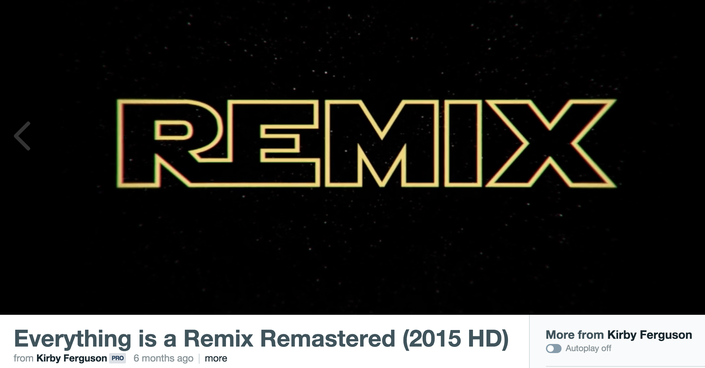

{\rtf1\ansi\ansicpg1252\cocoartf1348\cocoasubrtf170
{\fonttbl\f0\fswiss\fcharset0 Helvetica;}
{\colortbl;\red255\green255\blue255;\red38\green38\blue38;\red26\green26\blue26;\red6\green8\blue9;
}
\margl1440\margr1440\vieww23180\viewh14120\viewkind0
\deftab720
\pard\pardeftab720

\f0\fs24 \cf0 \expnd0\expndtw0\kerning0
\
# REMIX\
\
## Kim Middleton\
Mount Saint Mary\'92s University, Los Angeles\
\
---\
\
##### Publication Status:\
* unreviewed draft\
\
--- \
\
## CURATORIAL STATEMENT \
\
At its most deceptively simple, remix is nothing more than the act of identifying existing materials, and altering and combining them to create something new. If you\'92ve used the internet or listened to music in the past 40 years, you\'92ve experienced a remix, and it\'92s fair to say that our students have grown up with them. Remix objects (songs, memes, mashups, etc.) are now so deeply embedded in our collective consciousness and daily media consumption that their existence as representatives of a digital culture with its own protocols, politics, aesthetics and audiences is practically invisible.  \
\
Where did remix come from? Scholars point to the overlapping histories of collage in visual art, cut-ups in literature, found footage assemblage in film. The most popular antecedent of remix lies in the sound subcultures of New York City in the 1970s (e.g., disco, hip hop). There, DJs looped a song to extend it, or extracted small samples of tracks and reassembled them to serve as the basis for an entirely different composition. Whether the medium was audio, video, text, or some combination of these, practitioners used similar approaches to modify and reassemble materials to suit the tastes of their tribes, therein extending the definition of authorship for community engagement. Twentieth century technologies, in the meantime, evolved from analog to digital modes, making the foundational practices of remix\'97\'97cut, paste, layer, juxtapose\'97-available to extraordinary numbers of amateurs and artists. For all of the simplicity of those functions, however, the sudden accessibility of remix practices also encoded an array of complex implications belied by the \'93pop\'94 face of remix. As Julie Levin Russo and Francesca Coppa explain in their analysis of fan video: \'93Technological innovations and Internet platforms support a developing ecology of [video] remix forms with unprecedented reach, richness, and cultural influence. At the same time, the value and legitimacy of this popular production is hotly contested on the basis of artistic merit, traditional literacies, and intellectual property\'94 (1.2). \
\
Simultaneously pervasive and controversial, remix emerged as a fundamental vernacular practice that requires defense. Law professor and activist Lawrence Lessig situates the right to remix as \'93a critical expression of creative freedom that\'85no free society should restrict\'94 (56). He defends this bold claim by placing remix at the center of a culture in which citizens have the ability not only to consume cultural artifacts made by professionals, but to contribute to the culture by creating and re-creating what is around them. Like Lessig, Media Studies scholar Henry Jenkins identifies this phenomenon as \'93participatory culture,\'94 wherein individuals and affinity groups \'93archive, annotate, appropriate, and recirculate media content in powerful new ways.\'94 For Jenkins, these extant participatory practices suggest a set of goals for those coming of age in this era: \'93encourage youths to develop the skills, knowledge, ethical frameworks, and self-confidence needed to be full participants in contemporary culture\'94 (8-9). The exuberance of both scholars (and many more like them) is tempered by the significant challenges to remix as civic engagement\'97-most notably, the corporate and governmental insistence on legal copyright as imprimatur of a work\'92s ownership, which prevents its use as a source for new work. \
\
The pedagogical exigency of remix, then, grows out of two specific, but linked, contexts. On the one hand, the ubiquity of remix in popular culture conceals the complex meaning-making that it can and does perform. On the other hand, its foundational practices exist in constant and ever-changing tension with high-stakes legal and economic consequences for engaging in those same practices. Remix challenges our cultural beliefs about authorship and ownership; passive consumption and active participation; creativity, critique, and claim; yet the everyday habits of consuming, composing, and recirculating remixes already comprise a coherent logic for daily interaction. Bringing remix into our classes, then, creates the space for students to investigate these contested concepts as they appear in the media and materials of everyday life through experimentation with the critical tools of our varied academic disciplines. Remix allows us to attenuate our students to the moments when our fields question or collaborate with these commonplace practices, and when it calls into question our own aesthetic and ideological criteria. In \'93The Rhetoric of Remix,\'94 Virginia Kuhn notes the subversive function of the genre: \'93Remix lays bare the constructed nature of the original and often calls attention to its own construction\'94 (5.4). Teaching remix provides an opportunity for us to participate in a shared project with our students: the examination of our common philosophical investment in \'93originals,\'94 and the transformation of our collective contributions to the evolving cultural logic of our time.\
 \
The artifacts that follow were chosen for the ways that they provide pragmatic approaches to those pedagogical exigencies of remix\'97revealing its array of contexts and meaning making, and elucidating the terrain of copyright and its participatory-friendly concept fair use. The list begins with syllabi, which offer models that illustrate a semester-long engagement with remix. Next are sources for assignments, assessment, an example of student work, all of which could be adapted for a module in a standing course. The list ends with three sources that can be incorporated as primary source material and/or serve as examples of the active life of remix outside the classroom. \
\
\
\
## CURATED ARTIFACTS \
\
# Copy This Class (The Art of the Remix)\
\
\pard\pardeftab720
\cf2 \expnd0\expndtw0\kerning0
\cf0 \expnd0\expndtw0\kerning0
\
* Syllabus\
* Source URL: {\field{\*\fldinst{HYPERLINK "http://j-l-r.org/wp-content/uploads/remix-syllabus-final.pdf"}}{\fldrslt \expnd0\expndtw0\kerning0
http://j-l-r.org/wp-content/uploads/remix-syllabus-final.pdf}}\
* Creative Commons: Attribution-ShareAlike License\
* Creator: Julie Levin Russo, The Evergreen State College\
\
Julie Levin Russo\'92s undergraduate film studies course takes remix as its central topic. Through the assigned reading, media, and experiences each week, students are introduced to remix from a historical perspective and a philosophical one. Russo\'92s course is plays through an array of contexts that highlight the variety and complexity of remix as object, and as a set of practices (e.g., appropriation, authorship, sampling, \'93playbor\'94). Collaborative student remix projects comprise a significant portion of the semester, making evident the core value of participation and peer engagement in remix culture. Finally, in a knowing wink to our own habits of syllabus composition, Russo cites the syllabi and assignments that she has remixed to create this course.\
\
\
# Copyright + Culture\
\
\cf2 \expnd0\expndtw0\kerning0
\cf0 \expnd0\expndtw0\kerning0
\
* Syllabus\
* Source URL: {\field{\*\fldinst{HYPERLINK "http://cyberhouse.arted.psu.edu/811/"}}{\fldrslt \expnd0\expndtw0\kerning0
https://oxycopyrightandculture.wordpress.com/syllabus/}}\
* Permissions: permission of author, Creative Commons: Attribution Non-Commercial License\
* Creator: Suzanne Scott, University of Texas at Austin\
\
Suzanne Scott\'92s 2012 course *Copyright + Culture* foregrounds the fundamental conflicts between intellectual property and cultural production/participation\'97-the very positions that condition the creation and circulation of remix. The content of the course is interdisciplinary in nature; it attends to the history and philosophy of art and authorship, and provides case studies in fair use, fandom, and transformative works. Designed for first year students, *Copyright + Culture* also features a set of assignments (including a collaborative remix video project) that invites students to hone their argumentation skills across a variety of platforms, hearkening back to Kuhn\'92s call for a \'93rhetoric of remix.\'94 For more information about Scott\'92s video essay assignment and its careful navigation of fair use and copyright claims, see her [{\field{\*\fldinst{HYPERLINK "http://www.teachingmedia.org/teaching-transformativitytransformative-teaching-fair-use-and-the-video-essay/"}}{\fldrslt \cf3 \expnd0\expndtw0\kerning0
\ul \ulc3 teachingmedia.org/teaching-transformativitytransformative-teaching-fair-use-and-the-video-essay}}\cf3 \expnd0\expndtw0\kerning0
\ul \ulc3 ]\ulnone (\cf0 \expnd0\expndtw0\kerning0
*Cinema Journal Teaching Dossier*), which is also included in the [{\field{\*\fldinst{HYPERLINK "https://digitalpedagogy.commons.mla.org/keywords/multimodal/"}}{\fldrslt https://digitalpedagogy.commons.mla.org/keywords/multimodal/}}](*Multimodal*) keyword entry. \
\
\
# ds106\
\
\cf2 \expnd0\expndtw0\kerning0
\cf0 \expnd0\expndtw0\kerning0
\
* Assignment bank\
* Source URL: {\field{\*\fldinst{HYPERLINK "http://scalar.usc.edu/anvc/flowsofreading/index"}}{\fldrslt \expnd0\expndtw0\kerning0
http://assignments.ds106.us/}}\
* Permissions: open online course\
* Creator: Jim Groom and ds106 community, University of Mary Washington\
\
The \'93ds\'94 in ds106 stands for \'93Digital Storytelling,\'94 a genre that encourages individuals to use digital tools to tell stories about their lives. The first iteration of the course was a 2010 Computer Science class at the University of Mary Washington, taught by self-described \'93edupunk\'94 Jim Groom. Grounded in a pedagogical commitment to participatory culture (students regularly blog, tweet, as well as complete assignments), ds106 has spread across disciplines at UMW, over additional campuses, and also exists as a \'93headless\'94 course\'97a self-paced set of readings, activities and assignments that any participants can choose to take. (At the Connected Learning project, Howard Rheingold provides a thorough [{\field{\*\fldinst{HYPERLINK "http://connectedlearning.tv/case-studies/ds106-enabling-open-public-participatory-learning"}}{\fldrslt \expnd0\expndtw0\kerning0
http://connectedlearning.tv/case-studies/ds106-enabling-open-public-participatory-learning}}](case study) of ds106 as an example of the principle of open, public learning.) While the ds106 website makes syllabi and participant work visible and available for use, its assignment bank is a true treasure trove of ideas provided both by faculty and students of the wider community. Assignments are sorted by type and/or genre (e.g., writing, visual, audio, mashup). These can also be searched by term; currently, a search for \'93remix\'94 yields 27 different assignments. Distinct from those, the [{\field{\*\fldinst{HYPERLINK "http://remix.ds106.us/"}}{\fldrslt \expnd0\expndtw0\kerning0
http://remix.ds106.us/}}](Remix Machine) experiment will randomly combine an entry in the assignment bank with one of 31 \'93remix cards\'94 that provide different approaches to remix, making for a seemingly-endless stream of ideas for assignments and activities to suit various learning objectives. \
\
\
# Audio, Archives, and the Affordance of Listening in a Pedagogy of \'93Difference\'94\
\
\cf2 \expnd0\expndtw0\kerning0
\cf0 \expnd0\expndtw0\kerning0
\
*article about teaching\
*Source URL: {\field{\*\fldinst{HYPERLINK "http://www.sciencedirect.com/science/journal/87554615"}}{\fldrslt \expnd0\expndtw0\kerning0
http://www.sciencedirect.com/science/journal/87554615}}\
* Permissions: all rights reserved by Elsevier\
* Creator: Jean Bessette, University of Vermont\
\
In this article from the 2016 issue of the *Computers and Composition* journal, Jean Bessette describes an 4-6 minute audio collage assignment designed to \'93explore a focused, complex, and nuanced topic in gender and sexuality\'94 (75). Here, students select and assemble materials from an online archive of gay liberation radio shows. She interprets two case studies of student projects, and highlights the emergence of their personal and rhetorical inquiry within the confines of the assignment. In addition to the model assignment, however, Bessette makes a larger argument about the outcomes of the approach. The process of listening to prepare to make the collage involves both listening widely to a number of elements in the archive, and listening iteratively in the selection and editing process. These, she contends, contribute not only to students\'92 increased engagement with the texts, but also to an openness toward difference when the archive material is far from students\'92 experience and comfort zone.\
\
\
# *Flows of Reading: Engaging with Texts*\
\
\cf2 \expnd0\expndtw0\kerning0
\cf0 \expnd0\expndtw0\kerning0
\
* Online Digital Book\
* Source URL: {\field{\*\fldinst{HYPERLINK "http://scalar.usc.edu/anvc/flowsofreading/index"}}{\fldrslt \expnd0\expndtw0\kerning0
http://scalar.usc.edu/anvc/flowsofreading/index}}\
* Permissions: permission pending\
* Creators: Erin Reilly, Ritesh Meta, Henry Jenkins, USC Annenberg Center for Communication and Journalism\
\
The stated goal of *Flows of Reading* is \'93to inspire teachers and students to reflect on what can be considered as reading\'85\cf4 \expnd0\expndtw0\kerning0
and models a new type of reader\'96one who reads across different media and who understands reading as an activity of sharing, deconstructing, and making meaning.\cf0 \expnd0\expndtw0\kerning0
\'94 Provocatively, it takes as its case study the canonical American novel *Moby Dick*. As such, it presents a powerful, imaginative resource for thinking about the ways that remix pedagogy can collaborate with some of our most traditional texts and literacies. The section titled \'93Appropriation and Remixing\'94 argues for an understanding of literature as an appropriative practice, and also provides some creative examples of remix assignments that connect popular culture to canonical literature. Composed in Scalar, the non-linear, born-digital book includes a profusion of multimedia content to be read along with the text. As such, *Flows of Reading* suggests multiple uses and adaptations for the classroom. The book and its sections can be read as course texts; its assignments and examples are also ripe for adaptation for courses with different foci. Those with particular interests in assignments and modules should also examine the affiliated [{\field{\*\fldinst{HYPERLINK "http://www.newmedialiteracies.org/teachers-strategy-guide/"}}{\fldrslt \expnd0\expndtw0\kerning0
http://www.newmedialiteracies.org/teachers-strategy-guide/}}](*Reading in a Participatory Culture* Teachers\'92 Strategy Guide). While its content is designed for high school students, the activities are easily adaptable for more advanced students. \
\
\
# Stirred, Not Shaken: An Assessment Remixology\
\
\cf2 \expnd0\expndtw0\kerning0
\cf0 \expnd0\expndtw0\kerning0
\
* Ebook chapter \
* Source URL: {\field{\*\fldinst{HYPERLINK "http://ccdigitalpress.org/dwae/06_mccorkle.html"}}{\fldrslt \expnd0\expndtw0\kerning0
http://ccdigitalpress.org/dwae/06_mccorkle.html}}\
* Permissions: Open Access, Creative Commons License\
* Creators: Susan H. Delagrange, Ben McCorkle, and Catherine C. Braun, The Ohio State University\
\
Part of the larger 2013 collection [{\field{\*\fldinst{HYPERLINK "http://ccdigitalpress.org/dwae/"}}{\fldrslt \expnd0\expndtw0\kerning0
http://ccdigitalpress.org/dwae/}}](*Digital Writing, Assessment and Evaluation*),\'93Stirred, Not Shaken\'94 provides a set of sample assignments and evaluation processes for remix projects in writing courses, and describes additional analytical and reflective writing assignments that expand students\'92 concepts of remix practices and circulation. In addition to these assignments, authors provide a project evaluation rubric developed in collaboration with students; a narrative describing the implementation of fair use; and an assessment of the role of remix in larger institutional learning outcomes. \
\
\
# Exquisite Engendering Remix Exhibition\
\
\cf2 \expnd0\expndtw0\kerning0
\cf0 \expnd0\expndtw0\kerning0
\
* Exhibition of student work\
* Source URL: {\field{\*\fldinst{HYPERLINK "http://cyberhouse.arted.psu.edu/811/"}}{\fldrslt \expnd0\expndtw0\kerning0
http://cyberhouse.arted.psu.edu/811/}}\
* Permissions: permission of author\
* Creators: Karen Keifer-Boyd, Penn State University\
\
At its most basic level, Karen Keifer-Boyd\'92s final class project for her graduate course in Art Education provides a varied set of student remixes. On the whole, however, the course is far more ambitious, situating remix in a larger series of interactions. The course itself is one node on a larger network of individuals teaching FemTechNet\'92s Distributed Open Collaborative Course, which is designed to forward \'93a feminist approach for 21st century learning and teaching in the age of social media connectivity\'94 (a more detailed description of the FTN DOCC can be found in their [{\field{\*\fldinst{HYPERLINK "http://femtechnet.org/2015/05/ftn-roadshow-blog-series-course/"}}{\fldrslt \expnd0\expndtw0\kerning0
http://femtechnet.org/2015/05/ftn-roadshow-blog-series-course/}}](*Roadshow Blog Series*)). The Exquisite Engendering Remix students spent a semester in conversation with students at the University of Helsinki, a collaboration which clearly contributed to the spirit of openness and dialogue about their remixes. The participatory nature of their work is evident in the final exhibition, which encourages the audience to comment on the videos; in fact, the website offers a series of prompts to focus those comments toward the exhibition\'92s theme of gender. The [{\field{\*\fldinst{HYPERLINK "http://cyberhouse.arted.psu.edu/visualculture/projects/Remix_Assignment.pdf"}}{\fldrslt \expnd0\expndtw0\kerning0
http://cyberhouse.arted.psu.edu/visualculture/projects/Remix_Assignment.pdf}}](detailed assignment) for the remix also offers a wealth of resources to inform students\'92 understanding of approaches and digital tools. \
\
# Code of Best Practices in Fair Use for Online Video\
\
\pard\pardeftab720
\cf2 \expnd0\expndtw0\kerning0
\cf0 \expnd0\expndtw0\kerning0
\
* Resource guide\
* Source URL: {\field{\*\fldinst{HYPERLINK "http://www.centerforsocialmedia.org/fair-use/related-materials/codes/code-best-practices-fair-use-online-video#getting"}}{\fldrslt \expnd0\expndtw0\kerning0
http://www.centerforsocialmedia.org/fair-use/related-materials/codes/code-best-practices-fair-use-online-video#getting}}\
* Permissions: pending\
* Creator: The Program on Information Justice and Intellectual Property and The Center for Media and Social Impact, American University\
\
Published in 2008, the CMSI report and resources provide a thorough-yet-readable guide to delineate fair use practices from copyright violations. Structured with reference to the six allowable contexts for fair use, the guide elucidates each of these principles, and also describes the limitations of each. In addition to the guide to best practices, the website also features related reports, including an introduction to copyright and \'93Recut, Reframe, Recycle,\'94 a study of fair use practices in transformative works, and a list of linked examples that adhere to these practices. While the resources here are predominantly applicable to video, they offer a philosophical framework with which to assess the use of audio and textual materials as well. \
\
\
# Everything is a Remix\
\
\cf2 \expnd0\expndtw0\kerning0
\cf0 \expnd0\expndtw0\kerning0
\
* Documentary film \
* Source URL: {\field{\*\fldinst{HYPERLINK "http://everythingisaremix.info/watch-the-series/"}}{\fldrslt \expnd0\expndtw0\kerning0
https://vimeo.com/139094998}}\
* Permissions: \
* Creator: Kirby Ferguson\
\
This short, four-part documentary film is a student-friendly overview of remix that frames the history of the genre in multiple fields (music, film, technology) with an over-arching thematic: \'93copy/transform/combine.\'94 These practices, Ferguson contends, are not just the fundamental building blocks of remix, but of creativity writ large. The film begins with side-by-side comparisons of music samples and builds to an analysis of intellectual property and copyright, and the future of creativity and ownership. The [{\field{\*\fldinst{HYPERLINK "http://everythingisaremix.info/"}}{\fldrslt \expnd0\expndtw0\kerning0
http://everythingisaremix.info/}}](companion website) to the film houses a list of hardware and software used to make the film; a complete list of the texts that Ferguson references; and, perhaps most importantly as a model for student remixes, a comprehensive list complete with time stamps and links to the original sources of the samples used throughout. \
\
\
# hitRECord\
\
\cf2 \expnd0\expndtw0\kerning0
\cf0 \expnd0\expndtw0\kerning0
\
* Creative online community/production company\
* Source URL: {\field{\*\fldinst{HYPERLINK "https://www.hitrecord.org/"}}{\fldrslt \expnd0\expndtw0\kerning0
https://www.hitrecord.org/}}\
* Permissions: \
* Creator: Joseph Gordon-Levitt\
\
HitRECord is an online open community that encourages participants to contribute their original writing, drawing, music, video, animation, etc. compositions for others to combine, modify, and remix. Founded in 2005 by the actor Joseph Gordon-Levitt, the site has evolved into a community that issues challenges to creators, and creates collaborative projects for commercial distribution; thus far, the hitRECord community has produced CDs, books, short films and a television show. Profits are distributed to creators whose work is featured in each project via a collaboratively-negotiated formula. the hitRECord website and community provides a few different opportunities for work with students. First, it can function as a case study for \'93remix in the wild\'94\'97it\'92s a functioning participatory community that encourages and monetizes remix. Students may examine its working assumptions about authorship and ownership, about fair use, and collaboration. Second, instructors could incorporate the communities\'92 creative challenges and active projects, repurposing them as course assignments. Finally, a course could require and support students\'92 participation and contribution to HitRECord. In this last instance, designing accompanying analytical assignments to ensure that students parse their own expectations about the circulation and potential for modification to their own work would help to mitigate any concerns about joining an extensive online community.\
\
\
## RELATED MATERIALS\
\
Ito, Mizuko, et al. *Hanging Out, Messing Around, and Geeking Out: Kids Living and Learning with New Media.* Cambridge, MA: MIT Press, 2010. Web. [{\field{\*\fldinst{HYPERLINK "https://mitpress.mit.edu/sites/default/files/titles/free_download/9780262013369_Hanging_Out.pdf"}}{\fldrslt \expnd0\expndtw0\kerning0
https://mitpress.mit.edu/sites/default/files/titles/free_download/9780262013369_Hanging_Out.pdf}}]\
\
\pard\pardeftab720\sa240
\cf0 \expnd0\expndtw0\kerning0
Manovich, Lev. *The Language of New Media.* Cambridge, MA: MIT Press, 2001. Print.\
\pard\pardeftab720
\cf0 \expnd0\expndtw0\kerning0
Navas, Eduardo. Remix Theory. n.p., n.d., web. [{\field{\*\fldinst{HYPERLINK "http://remixtheory.net/"}}{\fldrslt \expnd0\expndtw0\kerning0
http://remixtheory.net/}}]\
\
Ridolfo, Jim and Danielle Nicole DeVoss. \'93Composing for Recomposition: Rhetorical Velocity and Recovery.\'94 *Kairos: A Journal of Rhetoric, Technology, and Pedagogy.* 13.2 (2009): n. pag. Web. 22 Feb. 2016. [{\field{\*\fldinst{HYPERLINK "http://kairos.technorhetoric.net/13.2/topoi/ridolfo_devoss/index.html"}}{\fldrslt \expnd0\expndtw0\kerning0
http://kairos.technorhetoric.net/13.2/topoi/ridolfo_devoss/index.html}}]\
\
*RiP!: A Remix Manifesto.* Dir. Brett Taylor. 2008. Web. [{\field{\*\fldinst{HYPERLINK "https://vimeo.com/8040182"}}{\fldrslt \expnd0\expndtw0\kerning0
https://vimeo.com/8040182}}]\
\
\
\
\
## WORKS CITED\
\
Ito, Mizuko, et al. *Hanging Out, Messing Around, and Geeking Out: Kids Living and Learning with New Media.* Cambridge, MA: MIT Press, 2010. Web. \
\
\pard\pardeftab720\sa240
\cf0 \expnd0\expndtw0\kerning0
Jenkins, Henry, et al. *Confronting the Challenges of Participatory Culture: Media Education for the 21st Century.* Cambridge, MA: MIT Press, 2009. Web.\
Keifer-Boyd, Karen. \'93FTN Roadshow Blog Series\'97Course.\'94 *FemTechNet.* FemTechNet. Web. 22 Feb. 2016. \
Kuhn, Virginia. \'93The Rhetoric of Remix.\'94*Transformative Works and Cultures.* vol. 9 (2012). n. pag. Web. 22 Feb. 2016.\
Lessig, Lawrence. *Remix: Making Art and Commerce Thrive in a Hybrid Economy.\'94 London, England: Bloomsbury Press. 2008.\
Manovich, Lev. *The Language of New Media.* Cambridge, MA: MIT Press, 2001. \
\pard\pardeftab720\sl390
\cf2 \expnd0\expndtw0\kerning0
McKee, Heidi A., and D\'e0nielle Nicole DeVoss DeVoss, Eds. Digital Writing Assessment & Evaluation. Logan, UT: Computers and Composition Digital Press/Utah State 	University Press, 2013. Web.\
\cf0 \expnd0\expndtw0\kerning0
\
\pard\pardeftab720
\cf0 \expnd0\expndtw0\kerning0
Navas, Eduardo. Remix Theory. n.p., n.d., Web. Web. 22 Feb. 2016.\
\
Project New Media Literacies. \'93The Teachers\'92 Strategy Guide: Reading in a Participatory Culture.\'94 *Project New Media Literacies.* USC Annenberg School for 		Communication and Journalism. Web. 22 Feb. 2016.\
\
Rheingold, Howard. \'93DS106: Enabling Open, Public, Participatory Learning.\'94 *Connected Learning.* MacArthur Foundation. Web. 22 Feb. 2016.\
\
Ridolfo, Jim and Danielle Nicole DeVoss. \'93Composing for Recomposition: Rhetorical Velocity and Recovery.\'94 *Kairos: A Journal of Rhetoric, Technology, and Pedagogy.* 13.2 (2009): n. pag. Web. 22 Feb. 2016.\
\
*RiP!: A Remix Manifesto.* Dir. Brett Taylor. 2008. Web. \
\
Russo, Julia Levin and Francesca Coppa. \'93Fan/Remix Video (A Remix).\'94 *Transformative Works and Cultures.* vol. 9 (2012). n. pag. Web. 22 Feb. 2016. \
\
Scott, Suzanne. \'93Teaching Transformativity/Transformative Teaching: Fair Use and the Video Essay.\'94 \kerning1\expnd0\expndtw0 *Cinema Journal Teaching Dossier*, Vol 1:2 (Spring/Summer 		2013). \expnd0\expndtw0\kerning0
Web. 22 Feb. 2016.\
}