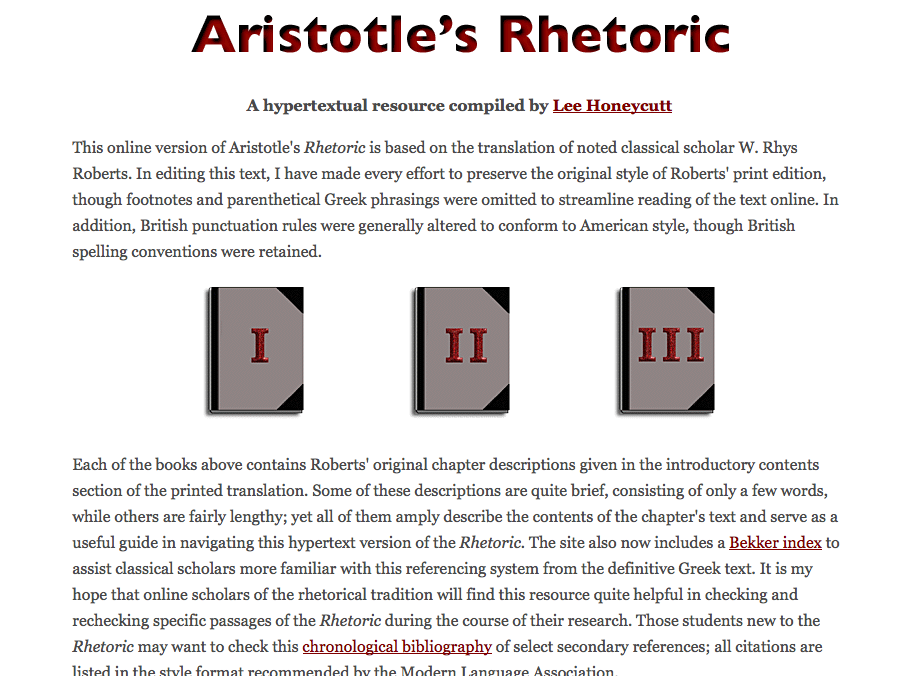
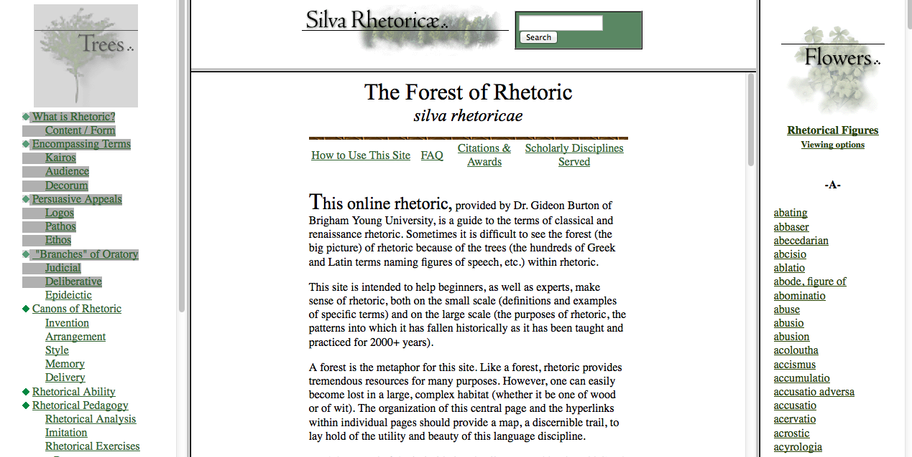
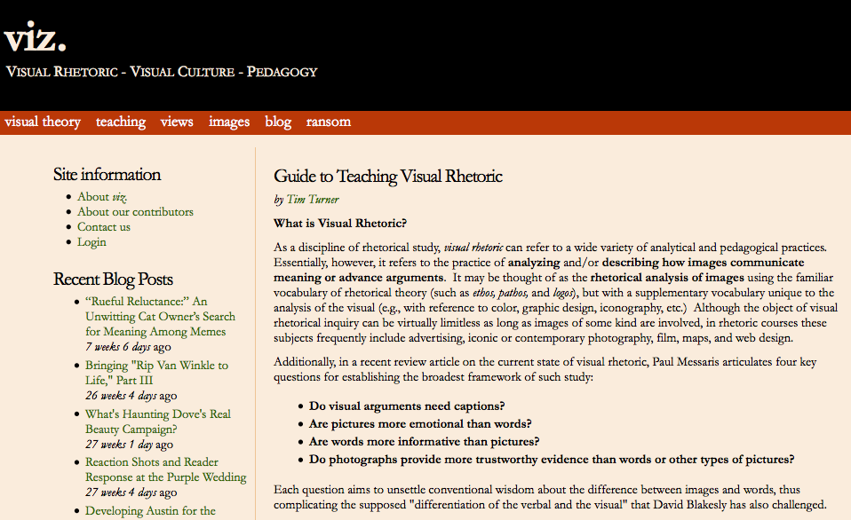
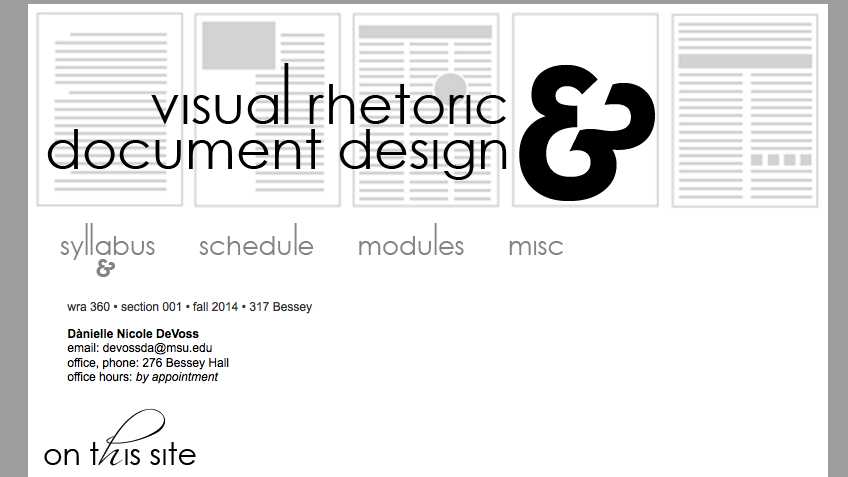

# Rhetoric (Draft)

## Douglas Eyman
George Mason University

---

##### Publication Status:
* unreviewed draft
* draft version undergoing editorial review
* **draft version undergoing peer-to-peer review** https://digitalpedagogy.commons.mla.org/
* published 

--- 

##Rhetoric as Digital Pedagogy/Digital Pedagogy as Rhetoric

In the Western tradition, efforts to theorize and codify best practices in rhetoric (the best known example of which is Aristotle's _On Rhetoric_) led fairly quickly to attempts to develop a curriculum for teaching rhetoric (most famously portrayed in the works of Cicero and Quintilian), which in turn became the foundations of teaching in the liberal arts tradition. In other words, "rhetoric" and "pedagogy" have always been intertwined.

Rhetoric is a theory about how communication works, a method for analyzing texts and performances, and a heuristic for the production of effective oral, written, and visual communication. The provenance of rhetoric is the question of how knowledge can be made in the face of uncertainty or where multiple probabilities of potential meaning are at play. For example, we may all agree that a particular object is a table (there is no uncertainty there), but when we argue about where to put it, we are using rhetoric to define the possibilities and choose the best outcome. The key word in the preceding sentence, however is "argue"—rhetoric comes into play in the process of communication. We can analyze the argument over table-placement using rhetorical methods to evaluate the propositions suggested by those who are arguing, and we can use rhetoric to help craft a more persuasive argument if we are participants in the argument (it has also been suggested that design is an applied form of rhetoric, and as such it could also help make a better table, too).

All choices about meaningful communication, regardless of medium, are effectively rhetorical choices and can be analyzed as such. Historically, the Humanities arise from the classical trivium of rhetoric, grammar, and logic; many contemporary humanities fields   continue to rely upon rhetorical theories and methods to carry out their work. Literary studies, for instance, uses rhetorical methods (directly derived from classical rhetoric) to analyze a broad range of texts (from novels and poems to film, animation, and digital works). Creative writers use rhetorical heuristics to craft texts. And researchers in all fields use rhetoric in the course of developing and performing scholarship itself.

In the field of composition, rhetoric has once again returned to prominence as an approach to the teaching of writing that requires attention to audience, purpose, and context. As the majority of writing (both in school and in the workplace) has effectively become digital writing, produced using word processing software, composition has necessarily taken up the challenge of adapting print-centric pedagogies to digital production, and developing new strategies for new forms of writing, such as the audio essay, the visual narrative, the video documentary, and the video game machinima performance. In fact, as can be seen in the resources below, visual and digital rhetorics are being folded into first-year writing curricula, as well as being offered as discrete courses that allow for a more thorough immersion in digital writing practices.

Through rhetoric's insistence on foregrounding the relationship between writer and audience, we can also begin paying more attention to the rhetorical functions of design, whether through analysis of visual rhetoric or the impact of document design on the composition process.

As the teaching of writing continues to embrace the idea of multimodal composing, we are seeing new ways to adapt and adopt rhetoric to new modes of digital production and performance. The collection presented here begins with resources that provide a basic overview and reference of Classical Rhetoric (in the Western tradition), followed by sources that take up the teaching of Visual Rhetoric and Digital Rhetoric as distinct branches of rhetorical analysis and making. Each category contains example syllabi and assignments that can be adapted for use in a range of humanities courses.

The works included here represent examples of materials that are both well-crafted and typical of approaches to classical, visual, and digital rhetoric. While the term 'digital rhetoric' is sometimes used as a title for web-design courses (and those courses certainly draw upon rhetoric as a heuristic for production), the aim of this list is to cast digital rhetoric as a fairly broad practice, and thus these selections focus on a wider array of composition courses.

There are, of course, many more excellent syllabi, assignments, and scholarly journals that address visual and digital rhetoric, but I hope that these examples will showcase the wide range of approaches to and the integral relationship of rhetoric and digital pedagogy.

## CURATED ARTIFACTS

## Classical Rhetoric and Composition

### Aristotle's _On Rhetoric_

* <http://rhetoric.eserver.org/aristotle/>
* Author: Aristotle, Trans. Rhys Roberts
* Lee Honeycutt, Alpine Lakes Design; Rhetoric and Composition eServer

Aristotle's _On Rhetoric_ is one of the foundational texts of the Western rhetorical tradition. Partly in response to Plato's disparagement of rhetoric (and the Sophists in particular), Aristotle first defines rhetoric (the shortened version of which is 'the art of persuasion'), and then analyzes and codifies the practices of effective rhetorical communication. Lee Honeycutt designed and published the first online version of the text, continuing to refine it through 2011. The online version is easy to use and quite accessible. I regularly assign it in the undergraduate composition and rhetoric courses I teach as a starting point for our own interpretations and definitions of rhetoric and rhetorical practice. Honeycutt has also made available Quintilian's _Institute's of Oratory_, (see  http://rhetoric.eserver.org/quintilian/ ), which is a twelve volume compendium that serves as an encyclopedia of pedagogical approaches to teaching rhetoric.

### Silva Rhetoricae: The Forest of Rhetoric

* <http://rhetoric.byu.edu/>
* Author: Gideon Burton
* Brigham Young University

Burton's _Silva Rhetoricae_ is a comprehensive catalog of rhetorical schemes and figures, but it also provides a very thorough introduction to classical rhetoric. Following an arboreal metaphor, the user can access the trees and branches of rhetoric, which include the canons of rhetoric (invention, organization, style, memory, delivery), the three primary appeals (ethos, pathos, logos), and the primary uses of rhetoric (forensic, deliberative, epideictic), as well as an overview of the history of rhetoric and the ways in which it has been taught. The user can also sort through the 'flowers,' which include the myriad terms for rhetorical figures and tropes, presented with definitions and examples (essentially a digital version of Lanham's _Handlist of Rhetorical Terms_). This is an excellent resource for those new to rhetoric, but it is also quite handy for scholars of rhetoric as well.

### University of Kentucky Writing, Rhetoric, and Digital Studies Teaching Materials Database

* <https://wrd.as.uky.edu/teaching-materials-database>
* Members of the UK Writing, Rhetoric, and Digital Studies program
* University of Kentucky department of Writing, Rhetoric, and Digital Studies

This site provides a database of teaching materials that can be searched based on assignment type (e.g. classroom activity, major project, group activity) and primary focus (such as speech, writing, digital, performance, etc.). Some of the materials were developed by faculty at UK, but many are links to external documents or examples. While keyed to the specific writing courses at the University of Kentucky, the wide range of assignments and their explicit grounding in rhetoric make these ideal starting points for the development of assignments and projects that can easily be adapted to other institutions and contexts. Examples of digital rhetoric assignments include 'Creating sonic postcards,' 'The Worst Powerpoint EVER,' and 'Web Design and Digital Literacy.'

### Toward A Decolonial Digital Progymnasmata

* <http://www.timothyrdougherty.net/toward-a-decolonial-digital-progymnasmata/>
* Author: Timothy Dougherty

This blog post provides a provocative consideration of the relationship between the Greco-Roman Era approaches to rhetoric and non-Western rhetorical traditions. The  [progymnasmata](http://en.wikipedia.org/wiki/Progymnasmata/ "Wikipedia: Progymnasmata") was a series of exercises that students of rhetoric would analyze and imitate; the students were expected to master these forms before producing their own arguments. While there are not yet any examples of a fully-formed pedagogy that marries digital forms and the traditional progymnasmata, this post is representative of the kind of thinking about how new technologies can mediate or modify traditional rhetoric practices, particularly in light of a continuing focus on global and cross-cultural rhetorical practices.

## Visual Rhetoric

### Guide to Teaching Visual Rhetoric

* <https://web.archive.org/web/20111013163034/http://viz.cwrl.utexas.edu/node/411>
* Author: Tim Turner
* _viz. Visual Rhetoric - Visual Culture - Pedagogy_

This overview provides a brief definition of visual rhetoric and describes a two-fold approach to visual pedagogy, with the development of visual literacy through analysis and visual competency through production. Turner provides a listing of both short-term and major project example assignments, a list of tools, and links to additional resources. _viz_, the blog/journal where this work appears is an excellent general resource for instructors interested in visual and digital rhetoric.

### Syllabus: Visual Rhetoric and Document Design

* <https://www.msu.edu/user/devossda/360/index.html>
* Dànielle DeVoss
* Michigan State University

Drawing on the work of Robin Williams and Anne Wysocki, among others, DeVoss's syllabus itself exemplifies design principles in addition to providing a well-crafted course that brings in visual rhetoric theory and method to support creative activities in the course modules. I find that the modular approach works particularly well for teaching design-oriented courses, whether visual rhetoric, document design, or web authoring and design.

### Assignment: Narrative Title Sequence

* <http://www.d.umn.edu/~cstroupe/f11/4260/narrative_title/narrative_title_sequence.html>
* Craig Stroupe
* Visual Rhetoric and Culture, University of Minnesota at Duluth

This example of visual rhetoric requires a combination of analysis (of title sequences for television shows) and production, albeit focused on the pre-production elements of creating a storyboard rather than culminating in the production of a video. Students need to engage principles of visual rhetoric (through "Technical Visual Criteria") and storytelling, but the assignment also requires a "commentary" that provides context, reflection, and a formal self-analysis of the finished product. The assignment includes links to both student project examples and narrative title sequences from classic and contemporary television shows and films. This is an example of a visual rhetoric assignment that can be adapted to serve many different purposes (for instance, students could be directed to re-cast existing title sequences as critiques of actual films, or they could design sequences that address a particular event, topic, or cultural practice). This could also serve as the first part of a larger project that moves students through production of script, storyboard, stills, and video.

## Digital Rhetoric

### Why Teach Digital Writing?

* <http://kairos.technorhetoric.net/10.1/binder2.html?coverweb/wide/index.html>
* The WIDE Research Center Collective
* _Kairos: A Journal of Rhetoric, Technology, and Pedagogy_ 10.2 (2005)

While not a pedagogical guide per se, this webtext, published in _Kairos_, provides a series of scholarly arguments about both values and methods of teaching writing as a digital practice. Perhaps most germane to this collection are the sections on "a rhetorical view of writing" and "how we should teach digital writing"—together these elements pull together the rhetorical practices (and theories) that support digital writing instruction and the pedagogical methods that make those connections explicit. Along with the scholarly argument, the authors have layered in examples of approaches and assignments throughout the text. This work not only addresses digital writing as rhetorical practice, it is itself an example of digital rhetoric at work in the context of academic scholarship.

### Syllabus Resource: Digital Rhetoric: A Syllabus Approach

* <https://sites.google.com/site/digitalrhetoricssyllabus/>
* Emily Legg, Adam Strantz, & Alex Layne
* Purdue Univeristy Department of English

This site, much like the University of Kentucky database, collects and collates materials that support digital rhetoric practices in the teaching of composition (in this case, Purdue University's first year composition courses). The authors present a course rationale and structure, sample syllabi, and sample assignments. While not a comprehensive resource, it is coherent in terms of its approach, and the sample assignments (which include a 'Collaborative Spaces Review' that links physical presence and digital writing, a data visualization project, and a digital archive research assignment) are sketched out rather than fully formed—these assignments can thus serve a heuristic function for instructors who want to design their own variants, informed by their own local contexts.

### Assignment: (C).omprehensive (O).nline (D).ocument (E).valuation

* <http://kairos.technorhetoric.net/10.2/binder.html?praxis/ridolfo/index.html>
* Jim Ridolfo
* _Kairos: A Journal of Rhetoric, Technology, and Pedagogy_

In this assignment, Jim Ridolfo provides a rationale and an introduction to using digital network tools to provide a richer sense of the network as real space and context that affects rhetorical choices when producing digital writing. Usually not seen in writing classes, these tools are typically used by system administrators and network technicians, but Ridolfo provides lucid instructions and explanations of how to use these tools. He also provides sample worksheets and rubrics for the larger assignment. I've included this as an example assignment in this collection because it extends the framework of digital rhetoric beyond the visual/multimodal or even the hypertextual and shows how to connect digital writing practices to the networks in which they circulate, which is a critical feature of digital rhetoric practice. It is perhaps too easy to conflate digital rhetoric with web design as the main (or only) approach, and this assignment provides at least one facet of the richer procedures and ecologies in which digital rhetoric operates.

## Related Materials

Ramage, John D. _Rhetoric: A User's Guide_. Boston: Longman, 2006. Print.

Handa, Carolyn. _Visual Rhetoric in a Digital World: A Critical Sourcebook_. Boston: Bedford/St. Martin's, 2004. Print.

Zappen, James P. "Digital rhetoric: Toward an integrated theory." _Technical Communication Quarterly_ 14.3 (2005): 319–325. Print.

DigiRhet.Net "Teaching Digital Rhetoric: Community, Critical Engagement, and Application."  _Pedagogy: Critical Approaches to Teaching Literature, Language, Composition, and Culture_ 6.2 (2006): 231–259. Print.

Gayle Morris Sweetland Digital Rhetoric Collaborative. 2014. Web. 1 November 2014.  <http://www.digitalrhetoriccollaborative.org>

## Works Cited

Aristotle. _On Rhetoric_. Ed. Lee Honeycutt. Trans. W. Rhys Roberts. 2011. Web. 1 November 2014. <http://rhetoric.eserver.org/aristotle/>

Burton, Gideon. _Silva Rhetoricae: The Forest of Rhetoric_. 2007. Web. 1 November 2014. <http://rhetoric.byu.edu/>

DeVoss, Dànielle. "Digital Rhetoric and Document Design." Syllabus. 2014. Web. 1 November 2014. <https://www.msu.edu/user/devossda/360/index.html>

DigiRhet.Net "Teaching Digital Rhetoric: Community, Critical Engagement, and Application."  _Pedagogy: Critical Approaches to Teaching Literature, Language, Composition, and Culture_ 6.2 (2006): 231–259. Print.

Dougherty, Tim. "Toward A Decolonial Digital Progymnasmata." 2011. Web. 1 November 2014. <http://www.timothyrdougherty.net/toward-a-decolonial-digital-progymnasmata/>

Gayle Morris Sweetland Digital Rhetoric Collaborative. 2014. Web. 1 November 2014. <http://www.digitalrhetoriccollaborative.org>

Handa, Carolyn. _Visual Rhetoric in a Digital World: A Critical Sourcebook_. Boston: Bedford/St. Martin's, 2004. Print.

Lanhman, Richard. _Handlist of Rhetorical Terms_. Berkeley: University of California P., 1991. Print.

Legg, Emily, Strantz, Adam, and Alex Layne. Digital Rhetoric: A Syllabus Approach. 2010. Web. 1 November 2014. <https://sites.google.com/site/digitalrhetoricssyllabus/>

Quintilian. _Institutes of Oratory_. Ed. Lee Honeycutt. Trans. John Selby Watson. 2011. Web. 1 November 2014. <http://rhetoric.eserver.org/quintilian/>

Ramage, John D. _Rhetoric: A User's Guide_. Boston: Longman, 2006. Print.

Ridolfo, Jim. "(C).omprehensive (O).nline (D).ocument (E).valuationa" _Kairos: A Journal of Rhetoric, Technology, and Pedagogy_ 10.2 (2005). Web. 1 November 2014. <http://kairos.technorhetoric.net/10.2/binder.html?praxis/ridolfo/index.html>

Stroupe, Craig. "Narrative Title Sequence." (2011). Web. 1 November 2014. <http://www.d.umn.edu/~cstroupe/f11/4260/narrative\_title/narrative\_title\_sequence.html>

The WIDE Research Center Collective. "Why Teach Digital Writing?" _Kairos: A Journal of Rhetoric, Technology, and Pedagogy_ 10.2 (2005). Web. 1 November 2014. <http://kairos.technorhetoric.net/10.1/binder2.html?coverweb/wide/index.html>

Turner, Tim. "Guide to Teaching Visual Rhetoric." _viz. Visual Rhetoric, Visual Culture, Pedagogy_ (2014). Web. 1 November 2014. <http://viz.cwrl.utexas.edu/node/411>

University of Kentucky Writing, Rhetoric, and Digital Studies. (2013). Teaching Materials Database. Web. 1 November 2014. <https://wrd.as.uky.edu/teaching-materials-database>

Zappen, James P. "Digital rhetoric: Toward an integrated theory." _Technical Communication Quarterly_ 14.3 (2005): 319–325. Print.
