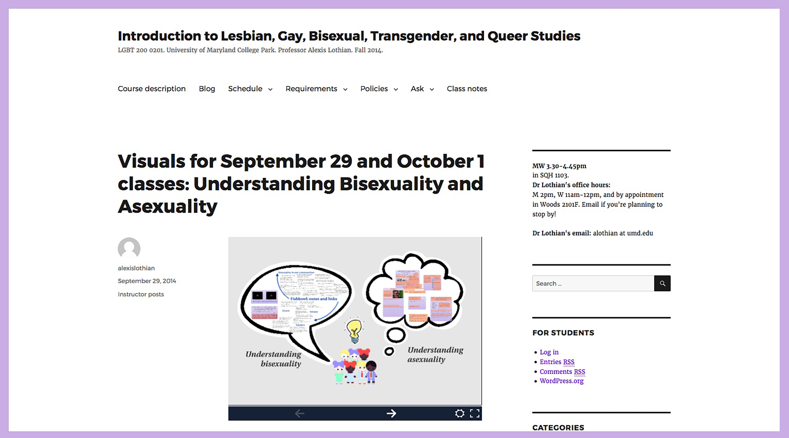
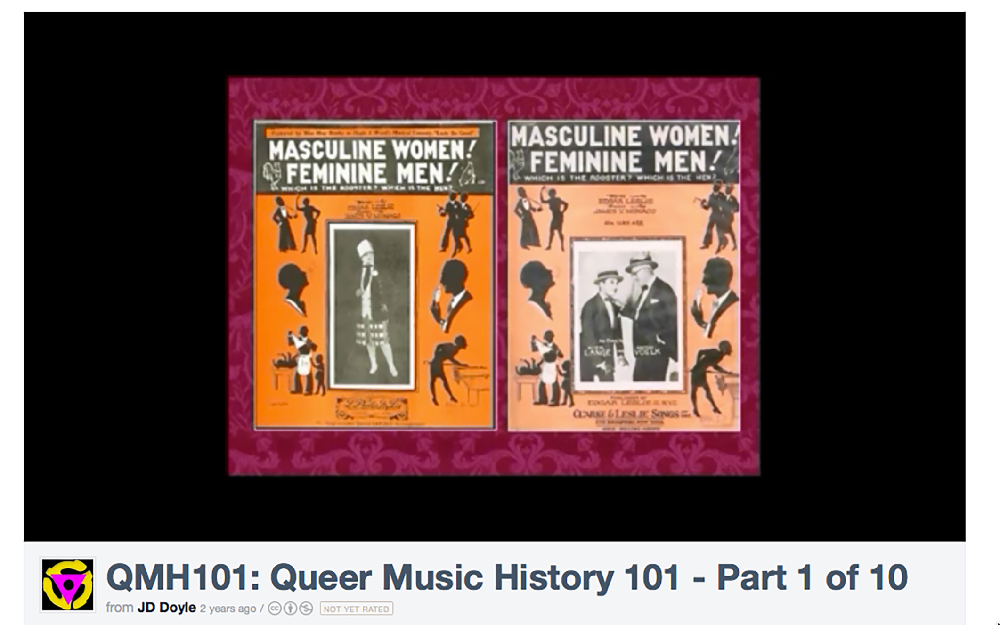
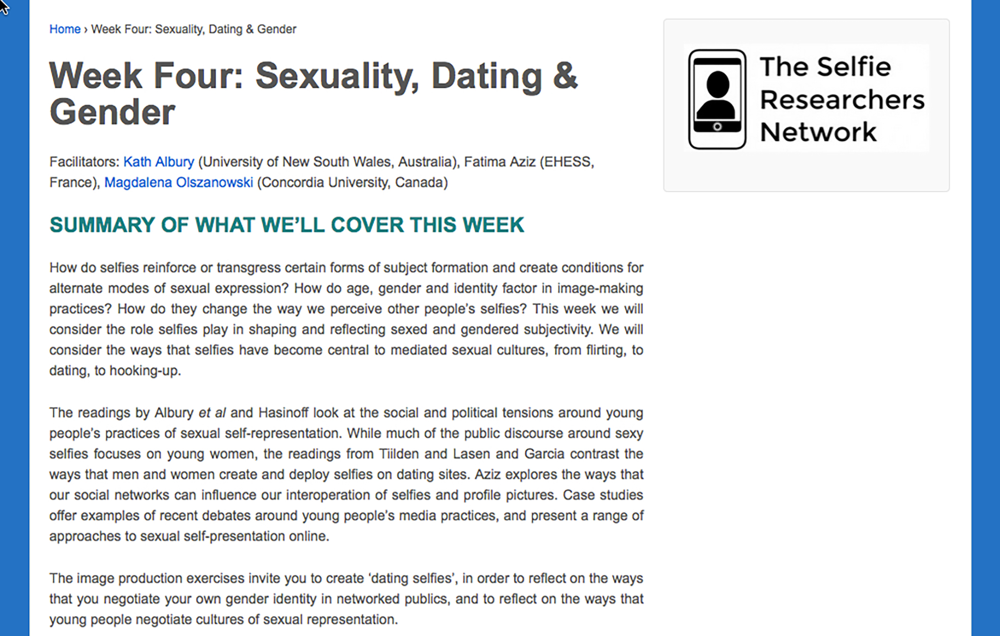
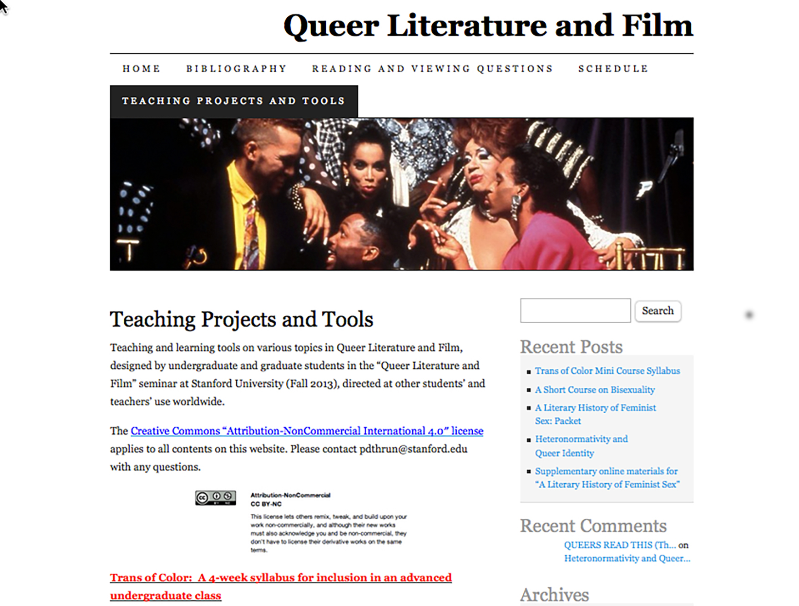
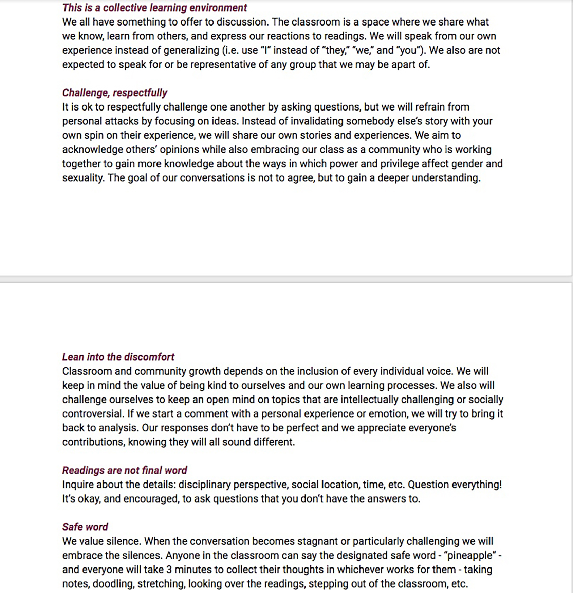
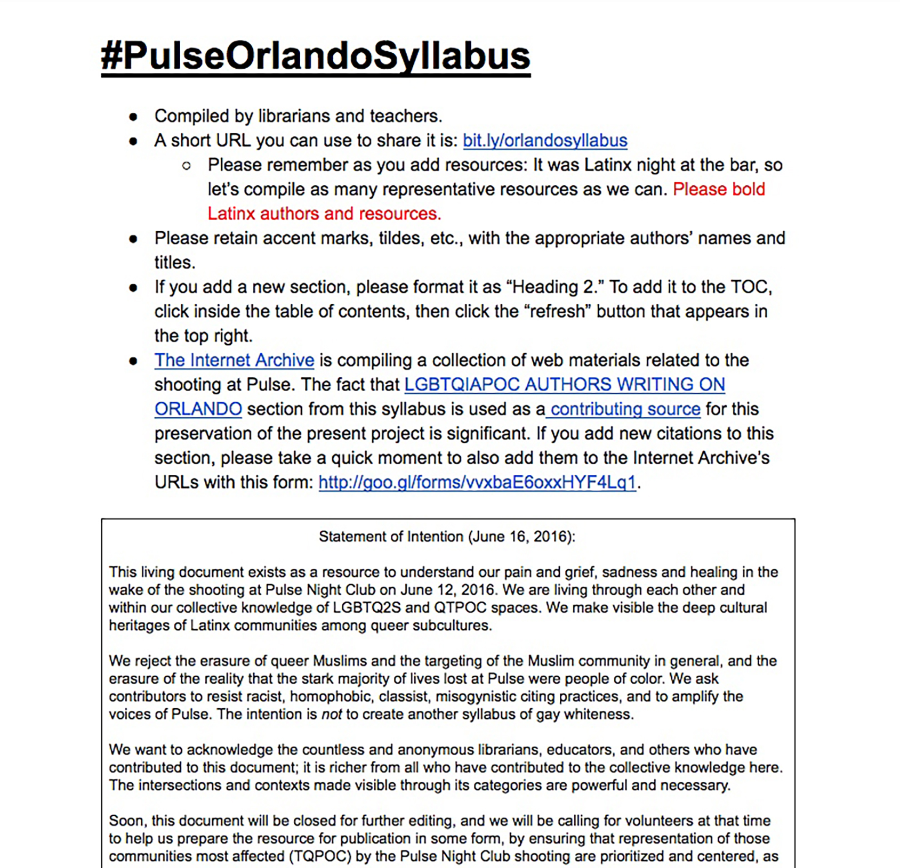
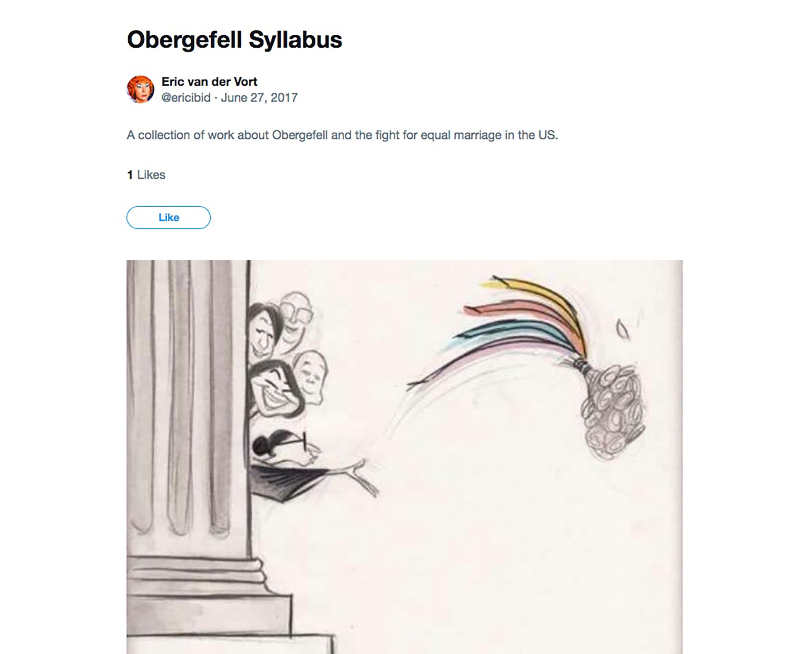
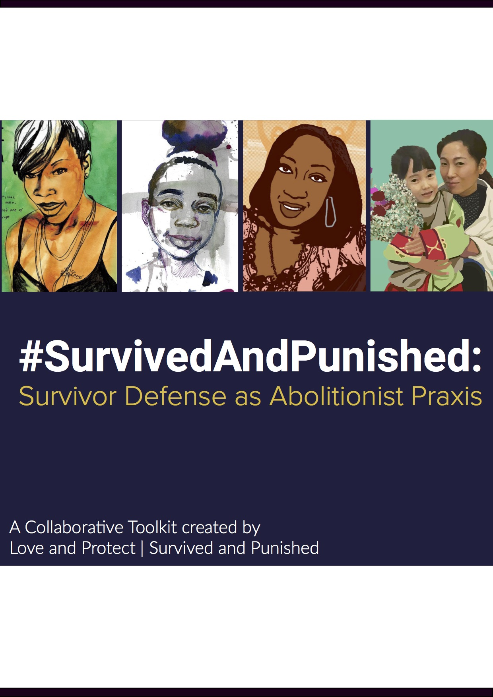
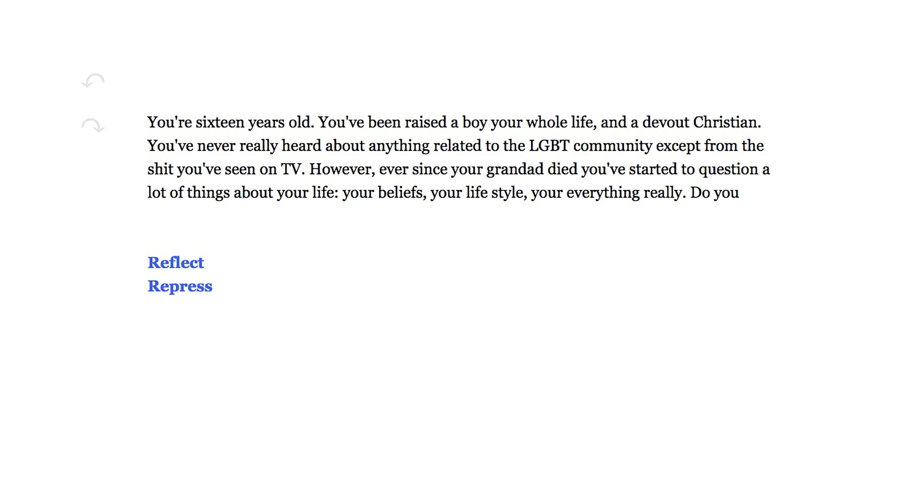

# SEXUALITY

## ALEXIS LOTHIAN
University of Maryland College Park | queergeektheory.org

## ANNA M. STORTI
University of Maryland College Park | annamstorti.com
---

##### Publication Status:
* unreviewed draft
* draft version undergoing editorial review
* draft version undergoing peer-to-peer review
* **draft version undergoing MLA copyediting**
* awaiting pre-print copy
* published 
---
### Cross-reference keywords: gender, intersectionality, queer, social justice
---

 ## CURATORIAL STATEMENT

“Sexuality” is a slippery subject. As part of the trifecta “race, gender, and sexuality,” it alludes to orientation and the erotic, marking identities and communities defined by relationships and object choices that deviate from a heterosexual norm. Yet it also names the inchoate affects of desire and their operation in an unfixed and often fraught nexus of power and knowledge whose meanings and usage shift over time and space. As a field of study, sexuality functions as an analytic to engage the individual, collective, and institutional ways that power is distributed and enforced. Sexuality is a keyword that exists on multiple scales: bodily, community, national, political, systemic, digital. The term offers us a way to make sense of how the complexities of power are inextricably connected to the ways we understand, voice, and express our sexualities––always mediated by the shifting, emerging, and overlapping networked publics of digital media.

As an academic subject, sexuality sounds risky, even dangerous, to some. "Sexuality" does not appear in the title of the program in which we teach, but our students still field concerned questions from family and friends wondering why they would sign up for such a class. Working in one of the US's longest established LGBT Studies programs, we feel these concerns less acutely than Alison Piepmeier, whose department at University of South Carolina Upstate had funding pulled by a conservative legislature after inviting a lesbian comedian to campus, or Christ Friend, whose high school classroom was vandalized with homophobic abuse. Yet we still hear from students that career advisers recommend they drop LGBTQ classes from their resumes when applying for jobs. 

Taking the study of sexuality in culture seriously means reorienting expectations about what legitimate scholarly topics can be. It is more than a willingness to talk about sex; more than a gesture to discuss difference. It means examining the convergence of economic, social, and cultural histories––unlearning prior assumptions while learning that sexuality is as much a study of discourse, discipline, resistance, kinship, desire, art, and performance as it is a matter of life and death. In his keyword Queer, Ed Chang explores how queer studies challenges presumptions about the digital and about pedagogy; to complement his collection, we have focused on resources that emphasize the encounters with individual and collective identities, histories, cultures, and politics that studying sexuality requires. 

Never a subject that can be discussed purely within the bounds of a classroom or an academic field, sexuality is part of private and public life––and for students and teachers alike, digital practices are inseparable from our sexual acts and identities. Classes in gender and sexuality bring together students for whom the recognition of hard-won identities is a dual mode of survival and precarity with those whose normative identifications let them believe they have much to learn about others and little about themselves. Groups and identities clash; people take things personally; discussions leave the classroom and enter the political sphere. Sexuality is not a siloed entity; it demands intersectional thinking. 

A digital pedagogy of sexuality, then, must attempt to account for a bewildering array of practices and experiences in private and public life. Learning from and alongside our students, we must seek to understand the ways that knowledge about sexuality is folded into and produced in networked publics. At the same time, we must not lose sight of the histories, contexts, and media landscapes within which our understandings of sex and gender identities, relationships, and orientations have developed. The archives of sexuality studies can help make sense of the ideas about sexual politics and identities that proliferate wildly in the networks our students frequent. Such emergent formations are difficult to pin down in a collection intended to function as a long term pedagogical resource.

The set of artifacts gathered below focuses on what is most useful when teaching around a moving target. It showcases some ways teachers can honor the multiple kinds of knowledge students bring to a class, and some ways that students can work collectively or individually to bring new knowledges into being. Materials collected include both teachers' materials and sources from the production of digital knowledge about sexuality outside of academic settings. The collection begins with three course sites, two from university classes and one created as a public resource, that suggest ways of organizing class structures around the particular needs of studying sexuality as history, identity, and culture. Then two assignments highlight ways that students can combine research with their own situated knowledges and networks. Following these is an instructor-student collaboration used to establish open and respectful communication in the sexuality studies classroom. Then two online syllabi trace the ways race, violence, and legality contribute to the ways that sexuality is understood in the digital era. Next is an online toolkit on sexual violence and prison abolition providing resources for teaching about the too-frequent imbrication of sexuality and violence. The final example showcases student work with a project that engages sexuality studies through digital creative production.

#### Introduction to Lesbian, Gay, Bisexual, Transgender, and Queer Studies
Screenshot: 

* Artifact Type: course site
* Source URL: http://lgbtqintro.queergeektheory.org/visuals-for-september-29-and-october-1-classes-understanding-bisexuality-and-asexuality/
* Permissions: Creative Commons License
* Creator and Affiliations: Alexis Lothian, University of Maryland College Park

In Alexis Lothian's Fall 2014 200-level LGBT Studies class, Lothian had great success in the use of Prezi to create dynamic discussion transcripts. To highlight the class’s development of its own archive of shared knowledge, Lothian would take notes directly into an [online presentation](https://prezi.com/ihbm45egxrli/bisexuality-and-asexuality-2016/) she had created in advance. The transcription of student comments makes them easier to unpack and contextualize, while separating their content from the person who has spoken them. It also enables any students who have difficulty processing oral discussions to participate more fully. This practice is especially well suited to situations where students analyzing personal experiences, and could be adapted to classrooms of many levels and sizes. A class-created archive such as this one could offer a tantalizing starting point for further research projects, as students might explore the origins and consequences of peers’ examples.

#### Tangled Community, Entangled Differences: Lesbians and Always More
Screenshot: 

* Artifact Type: course site
* Source URL: http://lezcom15.blogspot.com/p/how-class-will-be-organized-this-class.html
* Permissions: Form signed.
* Creator and Affiliations: Katie King, University of Maryland College Park
    
Katie King’s Spring 2015 Lesbian Communities and Differences course, a 400-level class cross-listed in Women’s Studies and LGBT Studies, is represented by modeling multimodal and collaborative pedagogy in digital and physical spaces. King demands that her students create a “tangled community” of their own while they study the entangled differences that constitute genders and sexualities organized in relation to the term “lesbian.” King invites her students to participate in “techno-crafty delights” that include research posters and website development; her own “techno-crafty” illustrations offer visuals of class themes such as “connecting (policing).” This example of teaching as entanglement models a collaborative pedagogy, enabled by the digital, that honors the intellectual and emotional complexity of its subject matter.

#### Queer Music History 101
Screenshot: 

* Artifact type: course site
* Source URL: http://www.qmh101.com/
* Permissions: Public resource explicitly created for sharing, but no CC license. Permission requested from creator.
* Creator and Affiliation: JD Doyle

JD Doyle's lesson plans, available as web pages, audio files, or in streaming video, cover the history of LGBT popular music from the 1920s to the 1980s. Created by veteran radio host JD Doyle, who presented a radio show on Queer Music Heritage from 2000 to 2015, the lessons offer a “two-hour crash course” drawn from the 375 hours of audio archived on Doyle’s main website. Visual and literary culture tend to be much better represented than audio material in both scholarship and teaching, and Doyle’s work provides an easily accessible entry point for those wishing to incorporate music into gender and sexuality-focused courses or to contextualize contemporary queer music cultures. In addition to using the lessons as they stand, Doyle’s archive opens possibilities for assigning student research in LGBT music history. It also offers a model for audio-based or podcasting assignments.

#### Selfie Syllabus Week Four: Sexuality, Dating and Gender
Screenshot: 

* Artifact Type: syllabus
* Source URL: http://www.selfieresearchers.com/week-four-sexuality-dating-gender/
* Permissions: Creative Commons License
* Creator and Affiliations: The Selfie Researchers Network: this week facilitated Kath Albury (University of New South Wales, Australia), Fatima Aziz (EHESS, France), Magdalena Olszanowski (Concordia University, Canada)

The Selfie Researchers Network, a transnational collective incorporating hundreds of teachers, students, artists, and others, developed the class “Studying Selfies: A Critical Approach” in late 2014. Week Four focused on how “sexuality and gender are expressed (or signalled) through selfies.” It includes several assignments in which students critically engage how digital visual culture mediates their own expressions of sexuality, whether those be straight, queer, or something else. For example, students are asked to choose a selfie for a dating site or a couple photo, using the example to analyze the practices by which they produce an image to be read in the context of sexuality discourses. Selfies open up many pedagogical possibilities regarding sexuality in networked publics. How are the emerging conventions of digital self-representation affecting sexual identities and communities? How can thinking critically about gender and sexuality lead to new understandings of ourselves and our selfies?

#### Queer Literature and Film: Teaching projects and tools
Screenshot: 

* Artifact Type: assignment
* Source URL: https://queerlitfilm.wordpress.com/teaching-projects-and-tools/
* Permissions: Creative Commons License
* Creator and Affiliation: Petra Dierkes-Thrun, Stanford University

Petra Dierkes-Thrun's assignment, for a mixed graduate and undergraduate class, cross-listed in Comparative Literature and in Feminist, Gender, and Sexuality studies at Stanford, asks groups of students to create a “mini crash course … designed as a compact three-week syllabus package complete with texts, handouts, assignments, and visual or video excerpts.” Many chose aspects of sexuality studies that are underrepresented in both scholarly writing and in available online resources for teaching. A student-designed advanced four-week syllabus in trans of color studies is one of the best resources we have found. For graduate classes in particular, it is the examples of student-originated pedagogical rationales – including a suggested curriculum for a Gay-Straight Alliance in a high school – that will be especially useful. It is also an exemplary work of public scholarship, making the digital pedagogy of sexuality both a subject and a method.

#### Community Agreements
Screenshot: 

* Artifact Type: collaborative project
*  Source URL: https://go.umd.edu/agreements
* Permissions: Form signed.
* Creator and Affiliation: Anna Storti, University of Maryland, College Park

In Anna Storti’s Fall 2017 introductory course in LGBT Studies, students study how sexuality and gender play an integral role in history, politics, culture, philosophy, and the everyday. The “Community Agreements” aim to establish a class consensus in approaching course material that may be uncomfortable or challenging to engage. The document compiles a list of classroom commitments constructed collaboratively between Storti and her students. It is a living document subject to change. The agreements provide students the space to develop their own stance and approach to course material. It also allows everyone in the classroom to hold themselves and each other accountable in their communication styles, critical perspectives, and learning processes. Moments of discomfort are an integral part of the learning process; the practice of establishing “Community Agreements” equips us with strategies to effectively lean into that discomfort. 

#### Pulse Orlando Syllabus
Screenshot: 

* Artifact Type: syllabus
* Source URL: bit.ly/orlandosyllabus
* Permissions: Public resource explicitly created for sharing, but no CC license. Permission requested from creators.
* Creator and Affiliation: Jamie Berrout @jamieberrout, Venus Selenite @venusselenite, Oliver Bendorf @ohbendorf, and Lydia Willoughby @willoughbrarian

The #PulseOrlandoSyllabus is a collaborative document compiled in the wake of the shooting at Pulse Night Club on June 12, 2016. This document exists as a resource to understand the violence that predominantly affected queer Latinx communities in Orlando. It showcases the collective knowledges of LGBTQ2S and QTPOC communities in order to remember the lives lost as well as to interrogate, challenge, and resist the endurance of racism and heterosexism. The #PulseOrlandoSyllabus was created with the intent to resist racist, homophobic, classist, and misogynistic citing practices. A variety of categories are featured including: ‘Self Care,’ ‘LGBTQ and Ally Collectives and Cooperatives,’ ‘Scholarly Books,’ ‘Archival Collections,’ ‘Movies,’ ‘Zines,’ ‘Music,’ ‘Podcasts,’ ‘Comics,’ ‘Websites,’ ‘Memes,’ ‘Resources for K-12 Schools,’ ‘Mental Health Resources,’ and ‘Activism and Action Steps.’ The syllabus offers instructors an approach to studies of sexuality where an analysis of race, violence, and place are at the center.  

#### Obergefell Syllabus
Screenshot: 

* Artifact Type: syllabus
* Source URL: https://twitter.com/i/moments/879706862878429185
* Artifact: [Sexuality-Obergefell Syllabus.html](files/Sexuality-Obergefell Syllabus.html)
* Permissions: Public resource explicitly created for sharing, but no CC license. Permission requested from creator.
* Creator and Affiliation: Eric van der Vort (@ericibid); Political Science, Syracuse University

The Obergefell Syllabus is a publicly accessible resource on the Supreme Court case Obergefell v. Hodges (2015) and the movement for marriage equality in the United States. Eric van der Vort created the syllabus in June 2017 with a series of Twitter tweets that include academic articles and books, essays, law reviews, anthologies, and podcasts. Each source documents the impact, history, and critiques of the fight for marriage equality. It first features scholarly articles that examine the relationship between the state and the family. While the syllabus includes peer-reviewed literature from public policy, sociology, and history, legal studies guides the Obergefell syllabus. It links to scholarship documenting the potential impact constitutional power has on other marginalized groups including the links between Black citizenship and Black marriage, feminist legal advocacy, and undocumented gay migrants. The syllabus concludes with overarching critiques of marriage equality and possible future directions of LGBT legal movements. 
 
#### #SurvivedAndPunished: Survivor Defense as Abolitionist Praxis
Screenshot: 

* Artifact Type: collaborative project
*  Source URL: https://view.publitas.com/survived-and-punished/toolkit/page/1
* Permissions: Public resource explicitly created for sharing, but no CC license. Permission requested from creators.
* Creator and Affiliation: Love and Protect (@loveprotectorg) & Survived and Punished (@survivedandpunished)

#SurvivedAndPunished is a collection of tools, tips, lessons and resources for survivors of sexual and gender-based violence. Sexuality’s pleasures and dangers intimately touch the lives of our students, ourselves, and others. Violence is pervasive. This resource shows how activist communities help us understand and combat sexual and gendered violence on and off line, including activities that teachers can bring directly into the classroom. The 29-page online toolkit begins by contextualizing the movement’s investment in prison abolition through explanations of gender justice, criminalization, and systems of incarceration. It then dives into pointed lessons on supporting immigrant and transgender survivors, letter writing to incarcerated people, working with lawyers, event planning, crowdfunding, and cultivating an online presence. As much as the toolkit gathers functional applications for survivors and students of sexual violence, it also archives the movement’s work which is led by Black women, women of color, immigrants, and trans and queer people.

#### Coming of Age
Screenshot: 

* Artifact Type: student work  
* Source URL: http://philome.la/UMDAnnaD/trans-story-final/play
* Permissions: Form signed.
* Creator and Affiliation: Anna Dennis

This student project, interactive fiction game was created as a final project in Alexis Lothian’s class in 2016. The game invites players into the world of a young person discovering their sense of gender and sexual identity through experiences of pleasure, possibility, and community as well as violence and oppression. Created in response to [an open-ended assignment] (http://dcc208fa16.queergeektheory.org/requirements/creative-explorations/game-design-document/), Dennis’s game showcases how creative assignments can allow students to narrate their own relationships to sexuality, and how such narration can then itself become a pedagogical resource for others. Her project was inspired by online games from queer and trans creators––including anna anthropy’s [Dys4ia](https://w.itch.io/dys4ia), which uses simple graphics to explore multiple dimensions of gender transition, and micha cárdenas’s [Redshift and Portalmetal](http://micharoja.itch.io/redshift-and-portalmetal), which combines poetry, video, and storytelling to highlight the inseparability of sexuality and gender from disability, colonialism, race, and ecology.

## RELATED MATERIALS

Against Equality Collective. "Against Equality: Queer Challenges to the Politics of Inclusion." http://www.againstequality.org/

Bedford, Kate and Janet R Jakobsen (eds). ”Toward a Vision of Sexual and Economic Justice." http://sfonline.barnard.edu/sexecon/

Elisa Kreisinger, “Queer Video Remix and LGBTQ Online Communities.” http://dx.doi.org/10.3983/twc.2012.0395

Keogh, Brendan. “Just Making Things and Being Alive about It: The Queer Games Scene.”https://www.polygon.com/features/2013/5/24/4341042/the-queer-games-scene.

OutHistory.org. http://outhistory.org.

## WORKS CITED

Anthropy, Anna. Dys4ia. 2012. https://w.itch.io/dys4ia

Bedford, Kate and Janet R Jakobsen (eds). ”Toward a Vision of Sexual and Economic Justice." Scholar and Feminist Online 7.3. Summer 2009. http://sfonline.barnard.edu/sexecon/

Berrout, Jamie, Venus Selenite, Oliver Bendorf, and Lydia Willoughby. “#PulseOrlando Syllabus.” June 16, 2016. bit.ly/orlandosyllabus

cárdenas, micha. "Redshift and Portalmetal." 2015. http://micharoja.itch.io/redshift-and-portalmetal.

Dennis, Anna. “Coming of Age.” 2016. http://philome.la/UMDAnnaD/trans-story-final/play

Dierkes-Thrun, Petra. "Queer Literature and Film: Teaching Projects and Tools." 2013. https://queerlitfilm.wordpress.com/teaching-projects-and-tools/

Doyle, JD. "Queer Music History 101." http://www.qmh101.com/

Friend, Chris. "Finding My Voice As a Minority Teacher." Hybrid Pedagogy: A Digital Journal of Learning, Teaching, and Technology. February 12, 2014. http://www.hybridpedagogy.com/journal/speaking-out/

Keogh, Brendan. "Just Making Things and Being Alive About It: The Queer Games Scene." Polygon. May 24, 2013. http://www.polygon.com/features/2013/5/24/4341042/the-queer-games-scene

King, Katie. "Tangled Community, Entangled Differences: Lesbians and Always More." 2015. http://lezcom15.blogspot.com/

Kreisinger, Elisa. "Queer Video Remix and LGBTQ Online Communities." Transformative Works and Cultures 9 (2012). http://dx.doi.org/10.3983/twc.2012.0395

Love and Protect | Survive and Punish. “#SurvivedAndPunished: Survivor Defense as Abolitionist Praxis.” http://www.survivedandpunished.org/sp-toolkit.html

Lothian, Alexis. "Introduction to Lesbian, Gay, Bisexual, and Transgender Studies." 2014. http://lgbtqintro.queergeektheory.org/

Piepmeier, Alison. "USC Upstate Closes Gender Studies Center That Booked Lesbian Play." Charleston City Paper. Charleston, SC, May 13, 2014. http://www.charlestoncitypaper.com/charleston/usc-upstate-closes-gender-studies-center-that-booked-lesbian-play/Content?oid=4918613

Selfie Researchers Network. "Selfie Syllabus." 2014. http://www.selfieresearchers.com/the-selfie-course/selfie-syllabus/

Storti, Anna, et al. “Community Agreements. 2017. https://go.umd.edu/agreements

Van der Vort, Eric. “Obergefell Syllabus.” 27 June 2017. https://twitter.com/i/moments/879706862878429185

