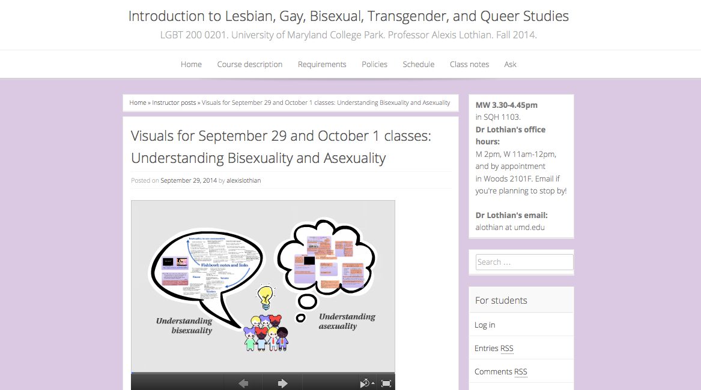
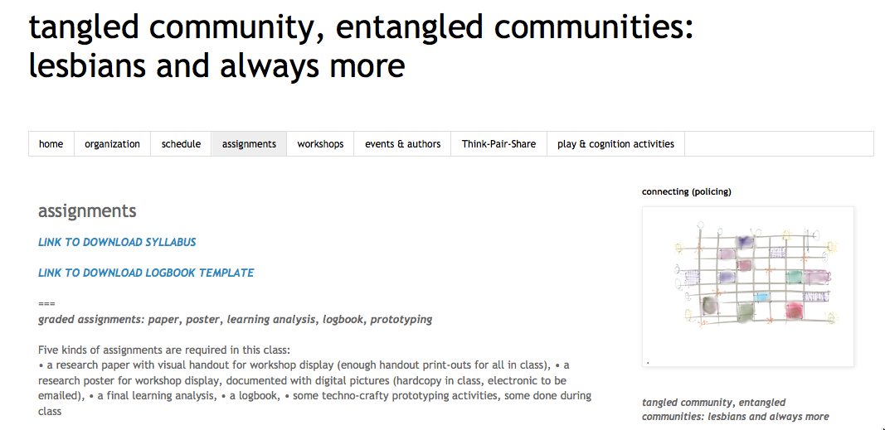
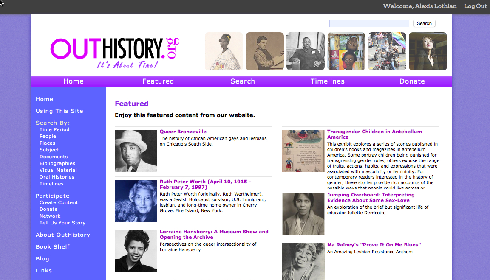
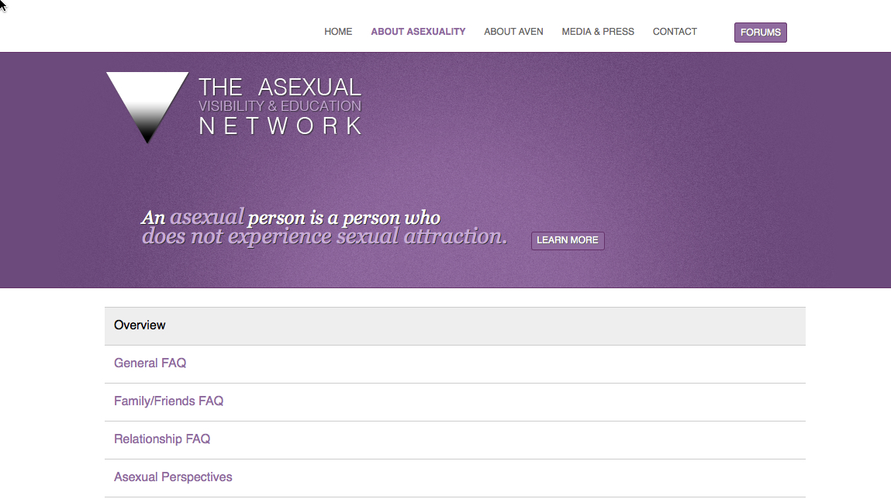
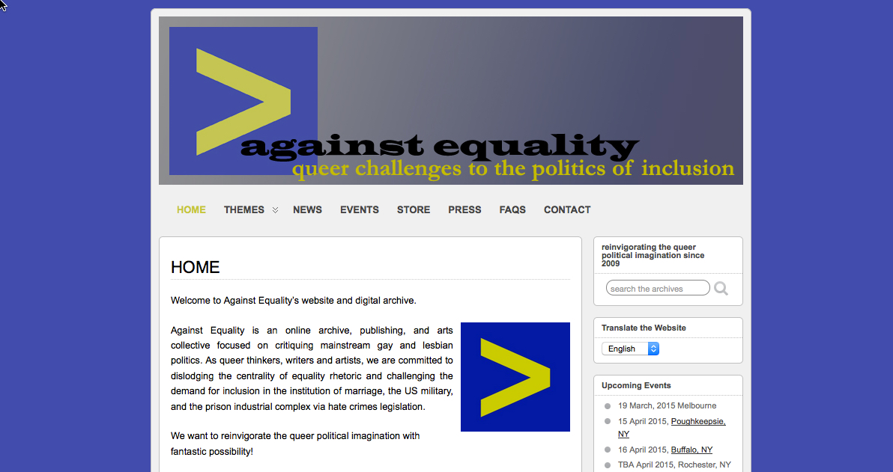
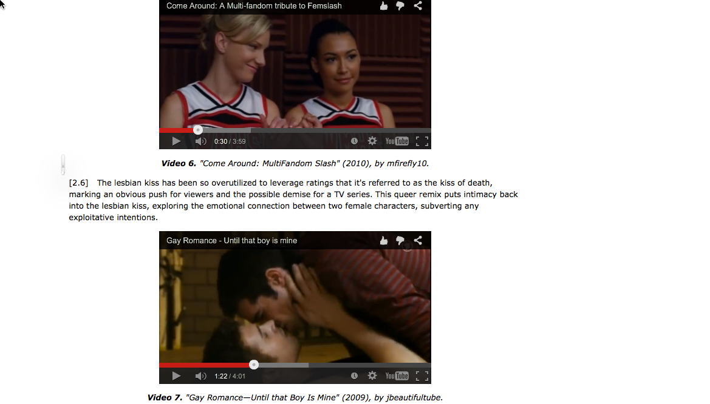
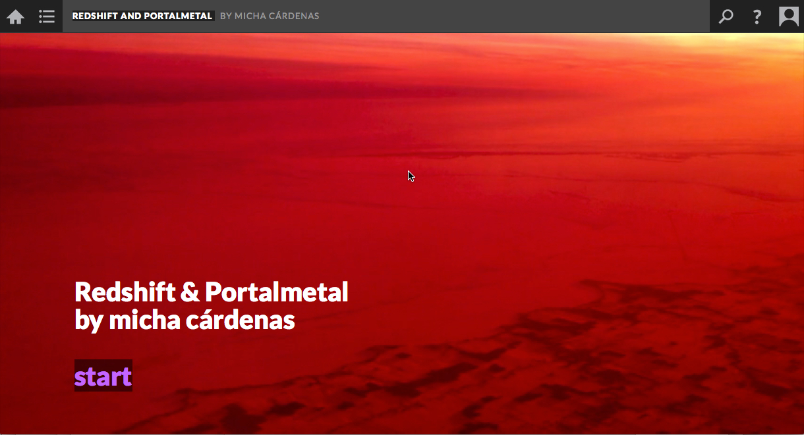

# SEXUALITY (Draft)

### [Alexis Lothian](http://www.queergeektheory.org/)
University of Maryland College Park, Women's Studies

---

##### Publication Status:
* unreviewed draft
* draft version undergoing editorial review
* **draft version undergoing peer-to-peer review**
* published

---

## CURATORIAL STATEMENT

“Sexuality” is a slippery subject. On one hand, as part of the trifecta “race, gender, and sexuality,” or in “Gender and Sexuality Studies,” it stands for identities and communities defined by relationships and object choices that deviate from a heterosexual norm. On the other, it names the inchoate affects of desire itself: who and what we want or don't want, and why those wantings matter. As an academic subject, sexuality and its overdetermined referents make for frequent discomfort; the very idea of studying sexuality sounds risky to some. "Sexuality" does not appear in the title of the program in which I teach, (LGBT Studies, part of the Women's Studies department at the University of Maryland College Park), but my students still tell me that they field concerned questions from family and friends wondering why they would sign up for such a class. Working in one of the country's longest established LGBT Studies programmes (Lindemann), I feel these concerns less acutely than the faculty at University of South Carolina Upstate who had funding pulled by a conservative legislature after inviting a lesbian comedian to campus (Piepmeier), or the gay high school teacher whose classroom has been vandalized with homophobic abuse (Friend). Yet I still hear from students that career advisers have recommended they drop LGBTQ classes and activities from their resumes when applying for jobs.

Taking the study of sexuality in culture seriously, especially when students are encountering it for the first time, means reorienting expectations about what legitimate topics for scholarly analysis and classroom discussion can be. Everyone has prior knowledge that has to be unlearned. In his curation of resources for the keyword Queer, Ed Chang explores how queer studies challenges presumptions about the digital and about pedagogy; to complement his collection, I have focused on resources that emphasize the encounters with individual and collective identities, histories, and cultures that studying sexuality requires. 

Classes in gender and sexuality bring together students for whom the recognition of hard-won identities feels like a matter of life and death, along with those who think that their normative gender and heterosexual identifications mean that a class on sexuality will teach them much about others and little about themselves. Groups and identities clash; people take things personally; discussions leave the classroom and enter the political sphere. Sexuality is never a subject that can be discussed purely within the bounds of a classroom or an academic field. It is part of private and public life – and for students and teachers alike, digital practices are inseparable from our sexual acts and identities. 

A digital pedagogy of sexuality, then, must attempt to account for a bewildering array of practices and experiences in private and public life.  Learning from and along with our students, we must seek to understand the ways that knowledge about sexuality is constantly shared informally in networked publics. At the same time, we must not lose sight of the larger histories and contexts within which our current understandings of sex and gender identities, relationships, and orientations, have developed – influencing and being influenced by our changing media landscapes. The archives of sexuality studies can help make sense of the ideas about sexual politics and identities that proliferate wildly in the networks our students frequent, from the popularity of new identity formations and acronyms on Tumblr to the kinds of interaction encouraged by Grindr and Tinder. Such emergent formations are difficult to pin down in a collection that is intended to function as a long term pedagogical resource. 

The set of artifacts gathered below aims to speak to the processes that are most useful when teaching around a moving target: that showcase the ways in which teachers can honor the multiple kinds of knowledge students bring to a class, and the ways that class members can work collectively to bring new knowledges into being together. Materials collected here include both teachers' materials and sources from the production of digital knowledge about sexuality outside of academic settings. Activist, historical, or community collections and works of creative media production sit alongside syllabi and assignments. The collection begins with two syllabi that suggest ways of organizing hybrid digital/in-person class structures around the particular needs of classes focused on sexuality as history, identity, and culture. Then two examples of assignments highlight ways that students can combine research with the knowledges and networks they bring in from outside the academy, at levels from introductory to graduate. Following these are four archives of extensive resources, from a range of academic and non-academic origins, which can be incorporated into class as assigned texts, origin points for student research, and examples of the way that knowledge about sexuality as history, politics, and identity circulates online. The last two items showcase digital cultural production that centers on sexuality, combining popular culture and new media art in various ways. In addition to subjects for discussion and analysis, the last examples in particular may usefully serve as exemplars for multimodal assignments in which students use creative means to explore sexuality studies.

### Introduction to Lesbian, Gay, Bisexual, Transgender, and Queer Studies

* Source URL: http://lgbtqintro.queergeektheory.org/category/instructor-posts/
* Creator: Alexis Lothian (University of Maryland College Park)

This is the website from my Fall 2014 200-level LGBT Studies class, whose digital pedagogy elements included an anonymous "ask" feature that gave students the opportunity to pose confidential questions at any time. The most successful digital element, though, turned out to be my use of Prezi in class. To highlight the class’s development of its own archive of shared knowledge, I would take notes directly into an online presentation I had created with images, topics of discussion, and so forth. The transcription of student comments makes them easier to unpack and contextualize, while separating their content from the person who has spoken them. It also enables any students who have difficulty processing oral discussions to participate more fully. While this practice is not only useful for the study of sexuality, it proved especially well suited to situations where students are analyzing personal experiences, and it is a technique that could be adapted to classrooms of many levels and sizes. The Prezi that combines discussions of [bisexuality and asexuality](https://prezi.com/4cztizkbjyjx/bisexuality-and-asexuality/) shows the way that student contributions have been gathered. A class-created archive such as this one could offer a tantalizing starting point for further research projects, as students might explore the origins and consequences of the examples their peers have shared.

### Tangled Community, Entangled Differences: Lesbians and Always More

* Source URL: http://lezcom15.blogspot.com/
* Creator: Katie King (University of Maryland, College Park)

This is the website for Katie King’s Spring 2015 Lesbian Communities and Differences course, a 400-level class cross-listed in Women’s Studies and LGBT Studies. The structure of the course models multimodal and collaborative pedagogy in digital and physical spaces, as King demands that her students create “tangled community” of their own while they study the entangled differences that constitute genders and sexualities organized in relation to the term “lesbian.” King invites her students to participate in “techno-crafty delights” that include research posters and web site development; her own “techno-crafty” illustrations offer visuals of class themes such as “connecting (policing).” This example of teaching as entanglement models a collaborative pedagogy, enabled by the digital, that honors the complexity – both intellectual and emotional – of its subject matter.

### Week Four: Sexuality, Dating and Gender

* Source URL: http://www.selfieresearchers.com/week-four-sexuality-dating-gender/
* Creators: The Selfie Researchers Network: this week facilitated Kath Albury (University of New South Wales, Australia), Fatima Aziz (EHESS, France), and Magdalena Olszanowski (Concordia University, Canada)

This is one element of the collective work of the Selfie Researchers Network, a group incorporating hundreds of teachers, students, visual artists, reporters, and others from around the globe. The class, titled “Studying Selfies: A Critical Approach,” ran online in late 2014. Week Four focused on how “sexuality and gender are expressed (or signalled) through selfies.” It includes several assignments in which students critically engage the ways that digital visual culture mediates their own expressions of sexuality, whether those be straight, queer, or anything in between. For example, students are asked to choose or create a selfie for a dating site or a couple photo, using the example to analyze the practices by which they produce an image to be read in the context of sexuality discourses. The use of selfies on social media and dating sites opens up many pedagogical possibilities for classes concerned with sexuality in networked publics. How are the emerging conventions of digital self-representation affecting sexual identities and communities? How can thinking critically about gender and sexuality lead to new understandings of ourselves and our selfies?

### Queer Literature and Film: Teaching Projects and Tools

* Source URL: https://queerlitfilm.wordpress.com/teaching-projects-and-tools/
* Creator: Petra Dierkes-Thrun (Stanford University)

This is an assignment from a mixed graduate and undergraduate class, cross listed in Comparative Literature and in Feminist, Gender, and Sexuality studies at Stanford. Groups of students were asked to create a “mini crash course . . . designed as a compact three-week syllabus package complete with texts, handouts, assignments, and visual or video excerpts.” Many chose aspects of sexuality studies that are underrepresented in both scholarly writing and in available online resources for teaching. A student-designed advanced four-week syllabus in trans of color studies is one of the best resources I have found. For graduate classes in particular, it is the examples of student-originated pedagogical rationales (including a suggested curriculum for a Gay-Straight Alliance in a high school) that will be especially useful. It is also an exemplary work of public scholarship, making the digital pedagogy of sexuality both a subject and a method.
 
### OutHistory.org

* Source URL: http://outhistory.org/
* Creators: Jonathan Ned Katz and John D’Emilio (University of Illinois Chicago), and Claire Potter (New School)

Launched in 2008 by the historian Jonathan Ned Katz, OutHistory.org is one of the largest and longest-established online resources to address the history of sexuality and LGBTQ cultures. Committed to “active community participation in the discovery and creation of lesbian, gay, bisexual, and transgender history,” the site includes digitized publications, oral histories, and images, often featuring extensive explanation and annotation. While its organization is not always intuitive, the site offers many pedagogical opportunities, allowing students to explore primary sources and also to engage the politics of historical interpretation and narrative framing: to what extent can we name a historical example of sexual dissidence or gender nonconformity by the names we use today? For example, [a collection of buttons from New York City’s Lesbian History Archives](http://outhistory.org/exhibits/show/lesbian-buttons/button-gallery/symbols1) highlights the changing visual shorthands of LGBTQ culture and activism; students could research these further or compare with similar ephemera from different times and places. OutHistory also encourages teachers to work with its curators to bring student research online, creating further archives as a form of digital pedagogy. 

### Queer Music History 101

* Source URL: http://www.qmh101.com/
* Creator: J.D. Doyle

This is a set of lesson plans available as web pages, audio files, or in streaming video, covering the history of LGBT popular music from the 1920s to the 1980s. Created by veteran radio host JD Doyle, who presented a radio show on Queer Music Heritage from 2000 to 2015, the lessons offer a “two-hour crash course” drawn from the 375 hours of audio archived on Doyle’s main website. Visual and literary culture tend to be much better represented than audio material in both scholarship and teaching, and Doyle’s work provides an easily accessible entry point for those wishing to incorporate music into gender and sexuality-focused courses or to contextualize contemporary queer music cultures. In addition to using the lessons as they stand, Doyle’s archive opens possibilities for assigning student research in LGBT music history. It also offers a model for audio-based or podcasting assignments.

### About Asexuality

* Source URL: http://www.asexuality.org/home/overview.html
* Creator: Asexual Visibility and Education Network

This is the online home of the Asexual Visibility and Education Network (AVEN), an organization of people who identify as asexual (defined by the AVEN as “someone who does not experience sexual attraction.” I have included it in this list because my undergraduate students have been fierce advocates for the inclusion of the emergent identity formation of asexuality in sexuality studies classes, where it has not as yet become commonplace. The asexual community is one that has come together largely through online networks (Chasin); a digital pedagogic approach both allows students to encounter the community in its originating context and encourages discussion of how online life is shifting the possibilities for sexual identification. AVEN’s website includes a detailed FAQ describing the consensus definitions of asexuality to which members of the community have come, along with links to research, personal narratives, and other resources that can be used to explore conflicts and complexities around the terms of identification that have developed within the asexual community. 

### Against Equality: Queer Challenges to the Politics of Inclusion

* Source URL: http://www.againstequality.org/
* Creator: Against Equality Collective

Created by a queer activist collective that “began as an effort to combat the erasure of queer radical history and activism by the mainstream gay and lesbian community” Against Equality’s website gathers links to published articles that challenge the mainstream gay and lesbian movement’s focus on marriage, inclusion in the military, and hate crime laws. Organized around these three headings, the archive offers a panoply of accessible political writing from a range of radical perspectives. The archivists describe themselves as “committed to archiving radical work from all parts of our collective queer history, which is as messy, complex, and complicated as any other,” in an “ongoing effort to document queer history as what it was, not what we wish it would have been.” As a pedagogical tool, this archive is especially valuable for the discussions and disagreements it will provoke among students. The [collection of pieces on marriage](http://www.againstequality.org/about/marriage/), which gathers writings and media excerpts going back to the 1980s and provides an accessible history of queer political counterarguments to marriage-focused activism, may be of particular interest.

### Queer Video Remix and LGBTQ Online Communities

* Source URL: http://journal.transformativeworks.org/index.php/twc/article/view/395/264
* Creator: Elisa Kreisinger

This 2012 article, published in the open access journal Transformative Works and Cultures, brings together examples of video remix focused on queer sexual desire and discusses the online communities from which they emerged. Kreisinger describes the ways that “new media tools and technologies enable creators to deconstruct appropriated pop culture texts and experiment directly with mainstream images of gender and sexuality, recreating more diverse and affirming narratives of representation.” As a pedagogical tool, the examples in the article open up conversations about the ways that sexuality shapes the experience of engaging with popular culture, as well as the influence of discursive communities on how online video is received. Kreisinger’s selections also provide models for potential student projects in queer video remix. Not all of the video embeds still work, meaning that classroom use of this resource will necessarily instigate a conversation about the ephemerality of digital cultural production.

### Redshift and Portalmetal

* Source URL: http://micharoja.itch.io/redshift-and-portalmetal
* Creator: micha cárdenas (University of Washington, Bothell)

Combining a text-based game structure with video, music, spoken word, and dance, micha cárdenas’s game was made with [Scalar] (http://scalar.usc.edu), a media-rich open scholarly publishing format that can be used for teaching, gaming, and writing. Cárdenas’s virtuoso use of the software maps the movement of a trans woman of color through a science fiction future. Highlighting the inseparability of sexuality and gender from disability, colonialism, race, and the environment with elliptical, player-driven storytelling, cárdenas’s game offers a pedagogy, unbounded by the requirements of courses and classrooms, for ethical inhabitation of a poisoned, violent, yet still pleasure-filled world in which sexuality names one of many inseparable modes of connection.

“We cannot just split endlessly into smaller and smaller atoms, 
more specific groupings,
tiny electron clouds,
because that would only lead to individualism,
we have to help each other,
to be able to survive the tearing winds of these worlds,
and travel across the stars together,
more important than anything else:
connected, connecting.” 

## RELATED MATERIALS

Keogh, Brendan. "Just Making Things and Being Alive About It: The Queer Games Scene." <http://www.polygon.com/features/2013/5/24/4341042/the-queer-games-scene>.

“Queer and Feminist New Media Spaces.” HASTAC Scholars Forums. <http://www.hastac.org/forums/hastac-scholars-discussions/queer-feminist-new-media-spaces>

Queer Rebels, KB Boyce, and Celeste Chan. "Welcome to the Queer Rebellion." Ada: A Journal of Gender, New Media & Technology <http://adanewmedia.org/2015/01/issue6-feminist-hack-welcome-to-the-queer-rebellion/>

"Queer Suicide: A Teach-In." Social Text Periscope. Ed. Eng-Beng Lim. <http://socialtextjournal.org/periscope_topic/queer_suicide_a_teach-in/>.

"Toward a Vision of Sexual and Economic Justice." Scholar and Feminist Online. Ed. Kate Bedford and Janet R Jakobsen. <http://sfonline.barnard.edu/sexecon/>.

## WORKS CITED

Against Equality Collective. "Against Equality: Queer Challenges to the Politics of Inclusion." Web. <http://www.againstequality.org/>.

Asexual Visibility and Education Network. "About Asexuality." Web. <http://www.asexuality.org/home/overview.html>.

cárdenas, micha. "Redshift and Portalmetal." 2015. Web. <http://micharoja.itch.io/redshift-and-portalmetal>.

Chasin, CJ Deluzio. "Reconsidering Asexuality and Its Radical Potential." Feminist Studies 39.2 (2015): 405-426. Print.

Dierkes-Thrun, Petra. "Queer Literature and Film: Teaching Projects and Tools." 2013. Web. <https://queerlitfilm.wordpress.com/teaching-projects-and-tools/>.

Doyle, J.D. "Queer Music History 101." Web. <http://www.qmh101.com/>.
"Queer Suicide: A Teach-In." Social Text Periscope. Ed. Eng-Beng Lim. Web. <http://socialtextjournal.org/periscope_topic/queer_suicide_a_teach-in/>.

Friend, Chris. "Finding My Voice As a Minority Teacher." Hybrid Pedagogy: A Digital Journal of Learning, Teaching, and Technology (February 12, 2014). Web. <http://www.hybridpedagogy.com/journal/speaking-out/>.

"Toward a Vision of Sexual and Economic Justice." Scholar and Feminist Online. Ed. Kate Bedford and Janet R Jakobsen. 2009. Web. <http://sfonline.barnard.edu/sexecon/>.

Keogh, Brendan. "Just Making Things and Being Alive About It: The Queer Games Scene." Polygon. May 24, 2013. Web. <http://www.polygon.com/features/2013/5/24/4341042/the-queer-games-scene>.

King, Katie. "Tangled Community, Entangled Differences: Lesbians and Always More." 2015. Web. <http://lezcom15.blogspot.com/>.

Kreisinger, Elisa. "Queer Video Remix and LGBTQ Online Communities." Transformative Works and Cultures 9 (2012). Web. <http://journal.transformativeworks.org/index.php/twc/article/view/395/264>.

Lindemann, Marilee. "Building (and Rebuilding) LGBT Studies at the University of Maryland." Feminist Studies 39.2 (2013): 507-511. Print.

Lothian, Alexis. "Introduction to Lesbian, Gay, Bisexual, and Transgender Studies." 2014. Print. <http://lgbtqintro.queergeektheory.org/>.
OutHistory.org. Web. <http://outhistory.org>.

Piepmeier, Alison. "USC Upstate Closes Gender Studies Center That Booked Lesbian Play." Charleston City Paper. Charleston, SC, May 13, 2014. Web. <http://www.charlestoncitypaper.com/charleston/usc-upstate-closes-gender-studies-center-that-booked-lesbian-play/Content?oid=4918613>.

"Queer and Feminist New Media Spaces." HASTAC Scholars Forums. February 22, 2010. Web. <http://www.hastac.org/forums/hastac-scholars-discussions/queer-feminist-new-media-spaces>.

Queer Rebels, KB Boyce, and Celeste Chan. "Welcome to the Queer Rebellion." Ada: A Journal of Gender, New Media & Technology 6 (2015). Web. <http://adanewmedia.org/2015/01/issue6-feminist-hack-welcome-to-the-queer-rebellion/>.

Selfie Researchers Network. "Selfie Syllabus." 2014. Web. <http://www.selfieresearchers.com/the-selfie-course/selfie-syllabus/>.
