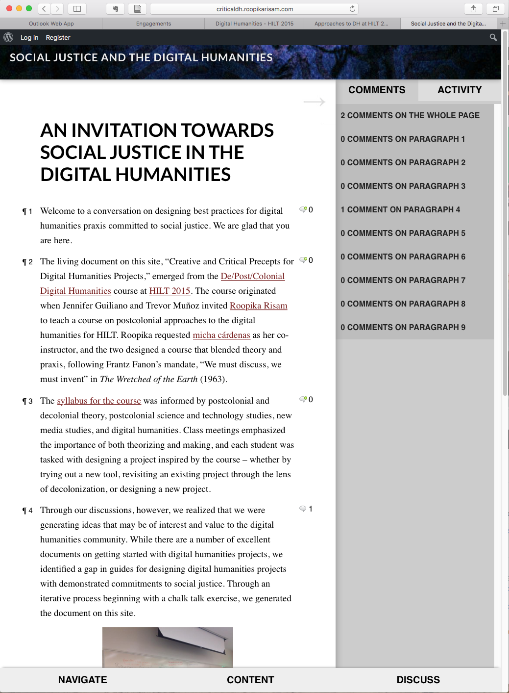
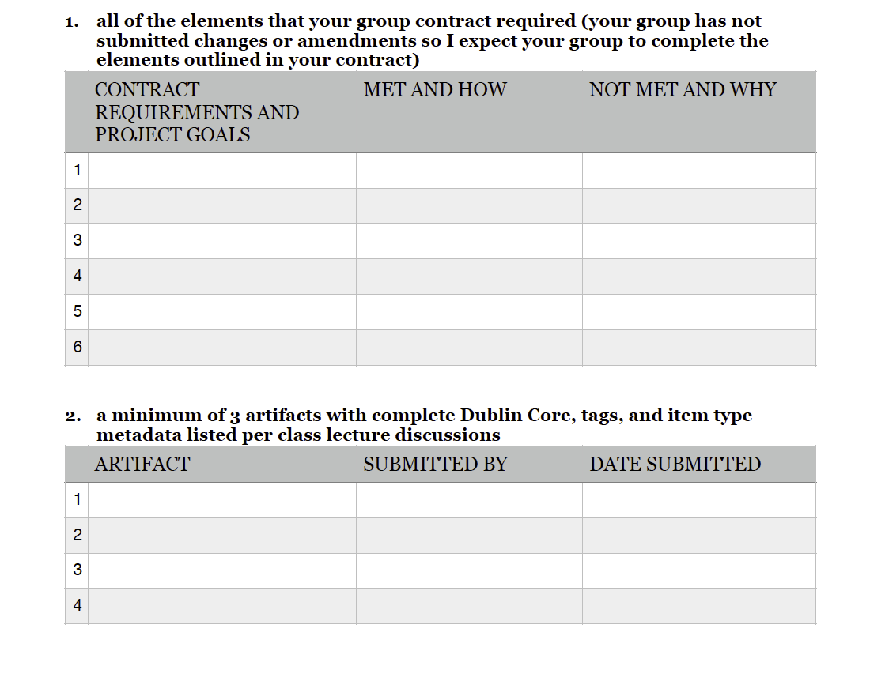
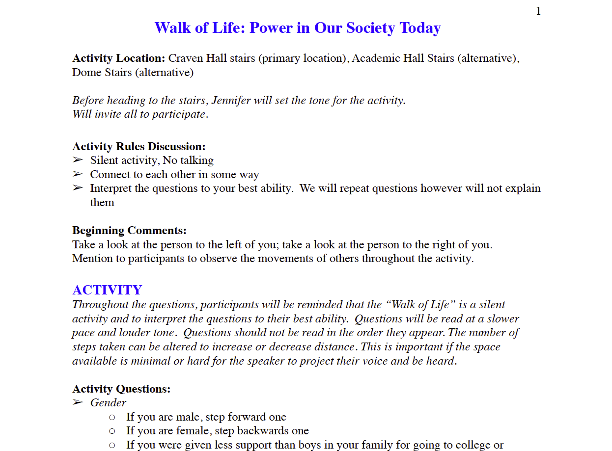

# SOCIAL JUSTICE (Draft)

## Toniesha Taylor
Prairie View A&M University | [http://www.drtonieshaltaylor.com](http://www.drtonieshaltaylor.com )

---

##### Publication Status:
* unreviewed draft
* draft version undergoing editorial review
* **draft version undergoing peer-to-peer review**
* published 

--- 

## CURATORIAL STATEMENT
The opportunity to think through the ways I teach social justice as not only a theoretical or abstract concept but a concrete manifestation of a world my students and I can build as active citizens has been a wonderful yet arduous task. As an activist scholar engaged in teaching research and service at one of the  Historically Black Colleges and Universities (HBCU), I am constantly faced with the question, do I teach for the sake of learning and enlightenment or do I teach for the sake of enlightened action and equity? I always work toward the latter. So to think critically about the ways I and my colleagues in various disciplines make this possible is a demanding yet joyous task. 

There are three key thoughts or frames that guide my thinking around teaching social justice, discussions with colleagues on how they may engage the same task, and how I have chosen to curate the works included here. First, faculty have to be willing, and able, to acknowledge their privileges at all levels and access points. The meaning of social justice is more fluid than perhaps scholars engaged in the study of languages and communication are comfortable with. It is impossible to find even disciplinary consistency. One element that seems consistent in those that teach and engage in social justice pedagogy is the recognition of privilege. The idea that you cannot change what you cannot name or that you cannot or will not change a system from which you benefit seems a central conceit. For faculty, this means we must recognize and engage in simple truths about our institutional privileges. It may be true that the act of teaching social justice theory is revolutionary on a university campus that does not hold equity or equality as a principal tenant of its mission or its lived practice. If you are teaching in an institution such as this with the protection of tenure at the rank of full professor you may find it easier to teach the revolution in your classrooms, while your colleague listed in one of many titles afforded the non-tenured (adjunct, lecturer, temporary faculty appointment, seasonal faculty appointment, guest lecturer) may not find teaching revolutionary content so comforting. Even the smallest gesture--assigning readings on social justice written during the British period of political enlightenment--may seem a step too far in a community not at all open to the conversation for a faculty member not afforded the employment protections of a medieval system of higher education.  Let me say here, I have tenure, I recognized my privilege, and I chose to leverage that privilege within the system to mentor and, at times, protect scholars whose desire is to teach, research, and engage in social justice activism in and out of the classroom. I ask that when we recognize our privilege, we do not end at the act of acknowledgment, but turn that acknowledgment into action. 
	
Second, social justice work, or action, is needed at all levels within the system at the same time. There are a number of excellent scholar-activists engaged in social justice work in ways that are digital and analog, on and off line. Some of those actions cross paths, like a great mix tape, and some stay firmly within their lane with discrete identities, like straight ahead jazz or rhetorical critique of the canonical literature. However you work to make a more socially just world, it is important to acknowledge the difference in effect and affect of the work with your students. Digital work(s) is often read as having less risk and subsequently less effect, however, the research on cyberbullying suggests that the psychological effects of digital are real. Social justice work in digital spaces must occur while work in physical spaces occurs. As professors it is important that we stay observant to avoid violence and bullying in digital spaces. While it is important to attend protests as protestors or as human rights observers, it is equally important to live tweet protests to get the word out or be in contact with school administrators to facilitate post-protest discussion to ensure policy changes that have a positive impact. Ensuring students are clear on the types of actions and the outcomes (known and unknown) and can clearly articulate their level of engagement and active/activist choices is extremely valuable. 
	
Finally, as instructors with our intersectional privileges, we need to recognize that we teach students with intersectional privileges. As people it is importation to understand that teaching and learning about social justice should be about theory, method, and action. I began this discussion saying that there are is not one single definition of social justice adhered to by all scholars engaged in this work. However, there are theories and philosophies of social justice commonly referred to by those engaged in the work. It is important to assign readings to your classes that meet the needs of interdisciplinary work and discussion. Social justice is an intersectional interdisciplinary work. We cannot fight or change socially unjust systems if we do not know the languages of injustice. When we know the languages of injustice (which are inextricably linked to one another), we can replace them with languages of justice.  Method applies differently to research on social justice versus social justice actions. As the instructor, I believe it is my responsibility to engage in actions and teach ethical research methods to ensure my students have a mentor they can follow. Actions matter. Actions are diverse. Actions are lasting. To this end, it is important to have application and discussion of social justice within the course time. Activists often speak of self-care; this concept particularly applies to teaching and learning. Build conversation into your courses and activities. Social justice is a hard-won community project, but it does not last if community members cannot replicate the small conversations and actions needed to sustain it. It does not matter if you and your students are “in these streets” or you are engaged in writing, reading, and communication—it matters that the actions taken can be sustained by the community. That means you have to talk with and care for each other. 
	
Curating the keyword social justice forced me to consider the number of ways in which I engage in digital pedagogy, digital humanities, and social justice as well as providing an opportunity to talk with my colleagues and friends who do this work well. In curating this keyword I have considered the various digital and traditional ways professors work through social justice as a lived praxis.  Included are ten pieces that demonstrate social justice pedagogy. The first three are syllabi focused on social justice that include activities where students have to create digital content as part of the learning process. Artifacts 4-6 are class activities related to the third syllabus listed. Artifact 7 requires some tech and media engagement by the faculty member and the  students. When tied to discussions on the use of words used to create databases, computer programs, and metadata, this activity allows students to think about privilege and language. Artifact 8 is a traditional classroom activity that requires no technology. As a traditional activity it can be used in a digital humanities class to engage students in discussion to provide language for understanding their privilege or the limits of privilege. Artifacts 9 and 10 are examples of public scholarship.  As such they allow scholars a way to engage in social justice work at an introductory level as either participants or observers.  Finally, some elements are self-explanatory (Ronda Ragsdale's #SoJust Teach-In) where others may need a bit more context (Toniesha Taylor’s COMM 4543 syllabus). Each artifact includes a short contextual statement and metadata to add in use.

## CURATED ARTIFACTS

### An Invitation Towards Social Justice in the Digital Humanities

* Artifact Type: course site
* Source URL: [http://criticaldh.roopikarisam.com](http://criticaldh.roopikarisam.com) 
* Artifact Permissions: © Social Justice and the Digital Humanities 2016. All rights reserved.
* Copy of the Artifact: 
* Creator and Affiliation: Roopika Risam, Salem State University
micha cárdenas, University of Southern California

Dr. Risam developed “An Invitation Towards Social Justice in the Digital Humanities” course site with micha cárdenas for the DE/POST/COLONIAL DIGITAL HUMANITIES course delivered at HILT (Humanities Intensive learning and Teaching) in 2015. Scholars interested in digital humanities who attend HILT have a number of courses to choose from each summer. This course site provides scholars unable to attend access to the course syllabus, limited materials, and discussions. This is a unique artifact as it provides extensive digital sources and conversation around building pedagogy for scholars interested in teaching social justice in the digital humanities. When we ask undergraduate and graduate students to engage in social justice we should be considerate of the methods of action, research, and learning possible. Consider the discussion on “Material Conditions” and the list of questions Risam and cárdenas provide. This artifact is a perfect example of the practical ways in which scholar-activists can think through multiple levels of access and change.

### Race Class Social Justice Syllabus — Dr. Melissa Harris-Perry

* Artifact Type: syllabus
* Source URL: [http://ajccenter.wfu.edu/wp-content/uploads/2014/06/RaceClassSocialJusticeFall2015W.pdf](http://ajccenter.wfu.edu/wp-content/uploads/2014/06/RaceClassSocialJusticeFall2015W.pdf) 
* Artifact Permissions: 
* Copy of the Artifact: 
* Creator and Affiliation: Melissa Harris-Perry, Wake Forest University

The syllabus created by Dr. Harris-Perry is an excellent example of an interdisciplinary teaching created for an introductory level political science class, the readings on social justice come from journalists, activists, and scholars with various disciplinary backgrounds. Central to this syllabus is the combination of theory, method and action. Students are required to read theory and build definitions for their engagement through written assignments. They engage in practical methods for social action in the “Tool Kit” building assignment and finally engage in direct action in the social action activity and writing reflection. 

This is an excellent example of a course taught in an educational environment with clearly supported infrastructure for sustained social action. Dr. Harris-Perry is at a university and in a center where social engagement is supported and required in humanities and other courses. This syllabus should be used as a guide for including social action as a course requirement where the university climate is supportive of such action.

### Advanced Writing for the Discipline

* Artifact Type: Syllabus
* Source URL: [http://www.drtonieshaltaylor.com/teaching](http://www.drtonieshaltaylor.com/teaching) 
* Artifact Permissions: 
* Copy of the Artifact: [files/social_justice-Advanced-Writing-for-the-discipline.pdf](files/social_justice-Advanced-Writing-for-the-discipline.pdf)
* Creator and Affiliation: Toniesha L. Taylor, Prairie View A&M University

This syllabus is for a course that teaches advanced research writing and design in communication studies to undergraduate students, including social justice frameworks and digital humanities methods as they apply to communication research.  This particular syllabus, and the activity artifacts to follow, allow readers to see examples of the application of social justice pedagogy and digital humanities methods. This course required students to work with the [White Violence/Black Resistance](https://sites.google.com/site/bkresist/) topic developed with an eye toward determining archival interventions as a means of social justice. Students created curated projects on Omeka as their final application of course content. 

### GIS Mapping Introduction

* Artifact Type:
* Source URL:  
* Artifact Permissions: 
* Copy of the Artifact: [files/social_justice-GISMapping_Introduction.pdf](files/social_justice-GISMapping_Introduction.pdf)
* Creator and Affiliation: Noel M. Estwick, Prairie View A&M University 

This activity was created by Dr. Estwick for COMM 4543 where he was a guest lecturer. He delivered four lectures during the course of the sixteen week semester on GIS mapping. This is a great example of an activity that introduces students to the method of data collection for GIS Mapping and to gain valuable applicable understanding of the physicality of place and space as relates to communication research. Dr. Estwick asked students to contribute to the GIS data on historical markers and social justice sites on campus with this activity. Students enjoyed getting out of the classroom in subsequent activities where they used GIS devices and cameras to gather data on the physical space. 

### Group Contract (COMM 4543)

* Artifact Type:
* Source URL: [http://www.drtonieshaltaylor.com/teaching](http://www.drtonieshaltaylor.com/teaching) 
* Artifact Permissions: 
* Copy of the Artifact: [files/social_justice-Group-Contract.pdf](files/social_justice-Group-Contract.pdf)
* Creator and Affiliation: Toniesha L. Taylor, Prairie View A&M University

Group work is always interesting. One of  the things that I find valuable is some form of social contract between participants. Contracts, when presented thoughtfully, can be negotiated equitably and ethically. When teaching social justice it is good to model a socially justice paradigm. I start this assignment by discussing the ways in which students need to consider the meaning of work, individual versus collaborative contribution, and work product. It is important to talk about what the contract means for the students and how you, as the instructor, will interpret the guidelines they set when you grade/assess work product resulting from the contract. This activity is designed to help students create a collaborative contract that recognizes the amount of work and shared responsibility of group mates. Guide them to writing an equitable contract, remember they may not know how to write a contract without totalitarian or authoritarian language. The directions for the assignment are included in the syllabus for COMM 4543. This artifact is an an example of a contract written by a small group of students to ensure their success on the class project. The included sample was written by students whose names and contact information have been removed. 

### Final Assignment CHECK LIST (Digital Humanities Project)

* Artifact Type: Handout
* Source URL: [http://www.drtonieshaltaylor.com/teaching](http://www.drtonieshaltaylor.com/teaching) 
* Artifact Permissions: 
* Copy of the Artifact: [files/social_justice-FINAL-ASSIGNMENT-CHECK-LIST.pdf](files/social_justice-FINAL-ASSIGNMENT-CHECK-LIST.pdf)
* Creator and Affiliation: Toniesha L. Taylor, Prairie View A&M University

This handout is used by students to organize their final projects. The expectation is that students will complete this assignment and submit it with the final project write-up after the curated project is presented to the entire class and invited guests. This assignment allows students to indicate the amount of work completed by each group member, if/when/how tasks were completed. Students are expected to indicate who completed elements and if that matched the contract worked out at the start of the semester. This assignment, in collaboration with the group member evaluation allows students to understand the importance of collaborative work and responsibility. Finally, assignments like these allow instructors to teach applied social justice and equity in project based work given that group work is a central tenant of media professions, encouraging students to create and maintain equatable groups gives them both the tools and language to create similar groups in their professionals endeavors. 

### Transferring Intersectional and Performative Responses

* Artifact Type:
* Source URL: [http://www.drtonieshaltaylor.com/](http://www.drtonieshaltaylor.com/) 
* Artifact Permissions: 
* Copy of the Artifact: [files/social_justice-Transferring-Intersectional-and-Performative-Responses.pdf](files/social_justice-Transferring-Intersectional-and-Performative-Responses.pdf)
* Creator and Affiliation: Dr. Robert Gutierrez-Perez, Assistant Professor of Communication, University of Nevada, Reno (Original Creator), Dr. Amber L. Johnson, Assistant Professor of Communication, St. Louis University, and Dr. Toniesha L. Taylor, Associate Professor of Communication, Prairie View A&M University

Dr. Johnson and I modified this activity from one created by Dr. Robert Gutierrez-Perez. Dr. Guiterrez-Perez's original activity used music and focused on themes and terms around marriage equality. Dr. Johnson and I have have expanded the activity to include video and use hashtags, themes and terms used to discuss race, class, gender and sexuality. Dr. Johnson and I adapted the original activity as a creative interactive performance delivered at the Western States Communication Association Conference.  Since then we have each adapted the activity for classroom delivery in various communication classrooms. This activity allows professors to engage in mediated representations of intersectional identities. Moreover students are able to discuss the ways in which they understand social justice actions through identity matrixes. When delivered in classrooms this activity can be used to start conversation. 

### Walk of Life - Power in Society

* Artifact Type:
* Source URL:  
* Artifact Permissions: 
* Copy of the Artifact: [files/social_justice-Walk-of-Life.pdf](files/social_justice-Walk-of-Life.pdf)
* Creator and Affiliation: Dr. Dreama G. Moon, California State University, San Marcos

Over the years I have had the opportunity to use this activity with students in a number of situations. This is a great early to mid-semester activity. This activity serves to demonstrate the various ways in which privileges are lived and intersectional. Dr. Moon indicates in the instructions campus locations to complete this activity. Indoor and outdoor staircases are preferred locations for this exercise. It is important that students “lose sight” of each other or have distance. At the same time they need to be able to hear the instructor deliver the statements the further away they get. Interior staircases in the middle of buildings are nice as long as the instructor’s voice will not disturb other classes. I have delivered this activity in high traffic areas. Since students are not supposed to talk to each other or ask questions, the fact that their peers, not enrolled in the class may walk around them and not know what is going on seems to add to the heightened sense of recognizing privilege. 

### Saturday School

* Artifact Type: Activity
* Source URL: [http://funknbeans.com/category/saturdayschool/](http://funknbeans.com/category/saturdayschool/) 
* Artifact Permissions: 
* Copy of the Artifact: 
* Creator and Affiliation:  Rhonda Ragsdale, Lone Star College - North Harris

There are a number of ways to engage in digital pedagogy. Professor Ragsdale’s work on the #SaturdaySchool is a wonderful example of public engagement in teaching and learning. The site includes write-ups for each week’s theme on social justice. Professor Ragsdale runs the weekly twitter conversation throughout the day engaging with hundreds if not thousands of followers. As a form of direct action Professor Ragsdale brings critical engagement in social justice out of the college classroom and on Twitter with all sorts of audiences. As a classroom activity students can participate with the conversation as an observer or as a participant. Those interested in using this activity to teach methods of public intellectualism will find Professor Ragsdale’s philosophy on teaching and learning clearly thought through and honestly executed. Over time Professor Ragsdale has added the tag #SoJust to the #SaturdaySchool grouping and advertises the weekly tag 24 hours prior to the start of the live discussion. Students and professor will find the discussion productive and useful. 

### #SoJust Saturday School Teach-In

* Artifact Type: Activity
* Source URL: [https://twitter.com/profragsdale/status/743878457164079105](https://twitter.com/profragsdale/status/743878457164079105) 
* Artifact Permissions: 
* Copy of the Artifact: 
* Creator and Affiliation: Rhonda Ragsdale, Lone Star College - North Harris

Professor Ragsdale [https://twitter.com/profragsdale](https://twitter.com/profragsdale) generously created this eight point layout for instructors who wish to engage in future teach-ins. As a form of social justice, teach-ins are sustainable and proven means to engage all sorts of people in learning. As an introductory activity for instructors learning to engage audiences, a Twitter teach-in is an easy lift. Professor Ragsdale shows would-be instructors in an easy to follow 8 step discussion on the rules, the practices and methods of the teach-in. Participants are encouraged to use and follow the hashtags to participate whenever they want. For classroom instructors, this is a great way to engage students in class by asking them review and participate in the hashtag. It is also an excellent way to discuss media literacy, critical thinking, and digital presentations of information. 

## RELATED MATERIALS

Crenshaw, Kimberle. “Mapping the Margins: Intersectionality, Identity Politics, and Violence Against Women of Color.” *Stanford Law Review* 43 (1993): 1241-1299. Print. 

Earhart, Amy E., and Toniesha L. Taylor. “Pedagogies of Race: Digital Humanities in the Age of Ferguson.” *Debates in Digital Humanities*, edited by Lauren Klein and Matthew Gold, 2016. Minneapolis: University of Minnesota Press. http://dhdebates.gc.cuny.edu/debates/text/72 

Lee, Wenshu. “The Desire to Know and to Love Is Never Too Small: My Musings on 
Teaching and Social Justice.” *Social Justice and Communication Scholarship*, edited by Omar Swartz, Routledge, 2012, pp. 193-214.

Liu, Alan. “The Digital Humanities and Identity Issues.” Alan Liu, 
http://liu.english.ucsb.edu/the-digital-humanities-and-identity-issues/ Accessed 15 November 2016. 

Swartz, Omar. “Social Justice and the Challenge for Communication Studies.” *Social 
Justice and Communication Scholarship*, edited by Omar Swartz, Routledge, 2012, pp. 1-20.

## WORKS CITED

Ragsdale, Rhonda. “#SaturdaySchool.” *funknbeans*, 
http://funknbeans.com/category/saturdayschool/ . Accessed 12 December 2016. 

