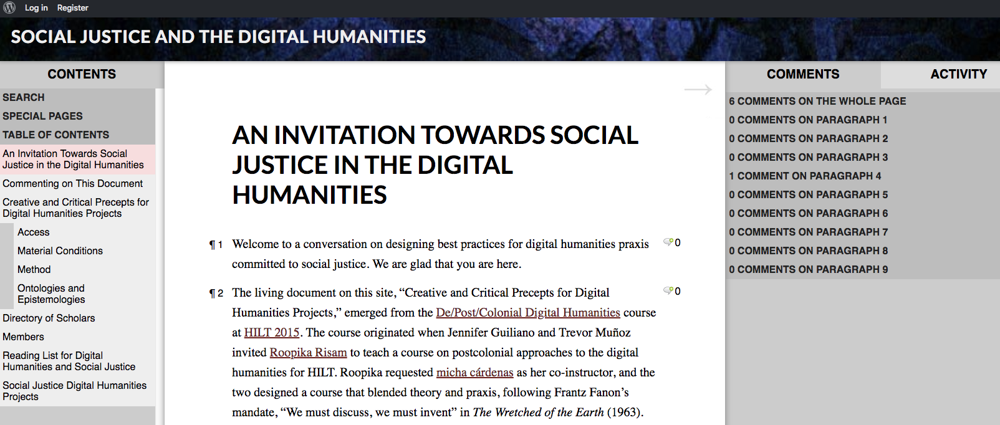
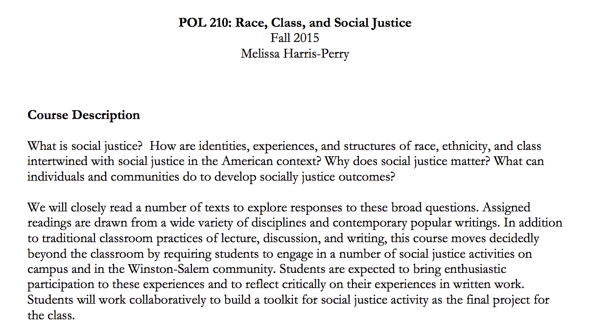
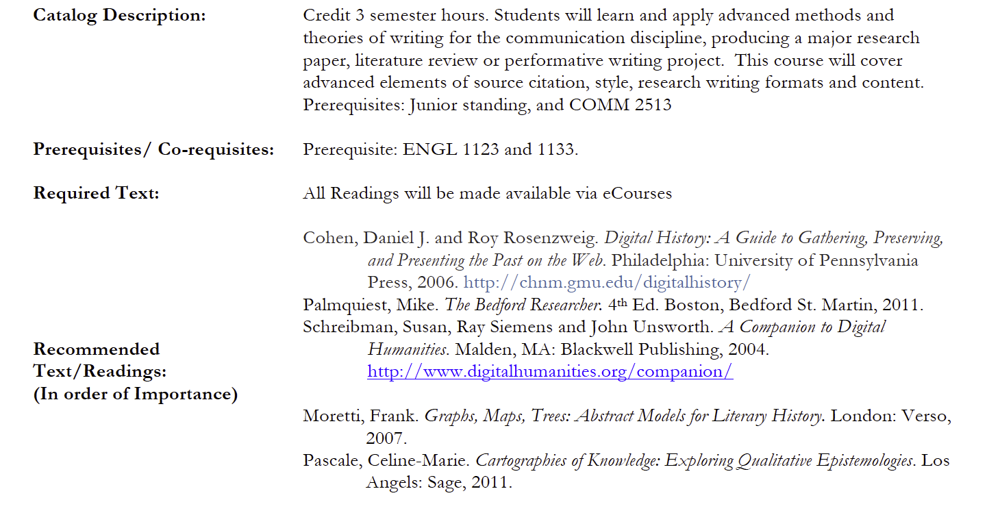
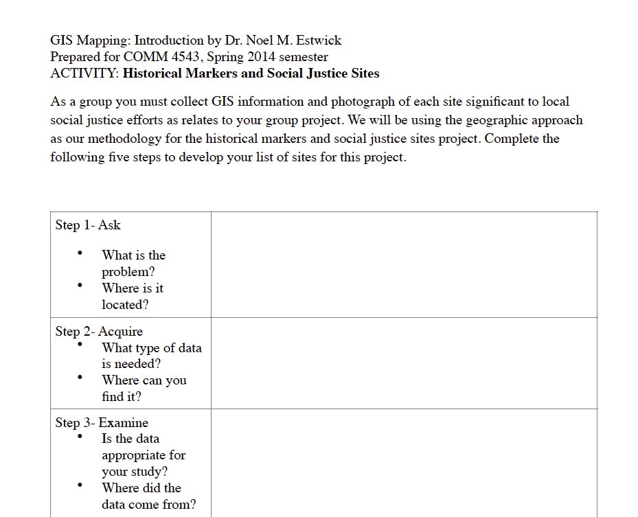
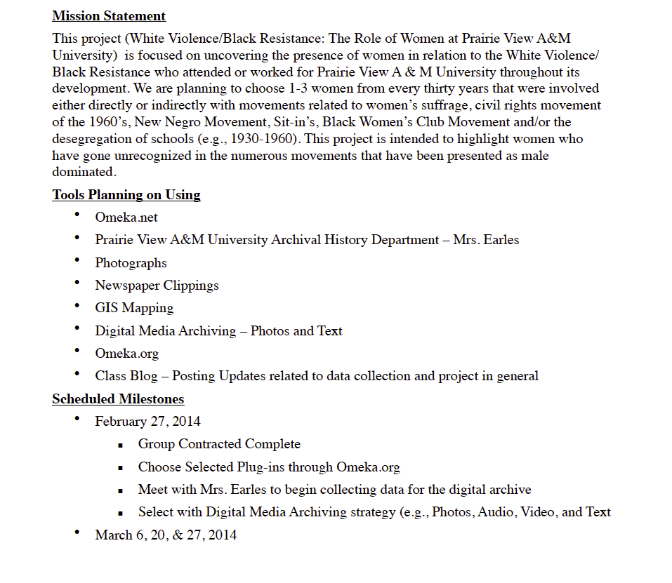
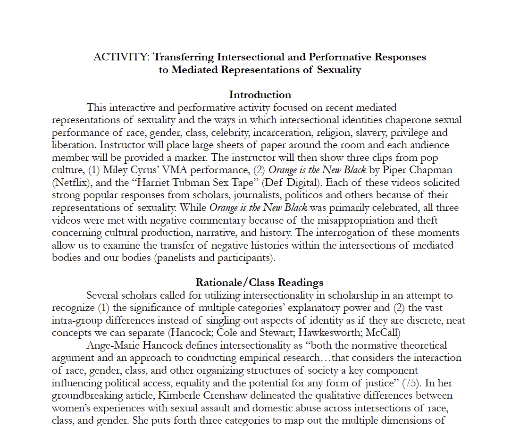
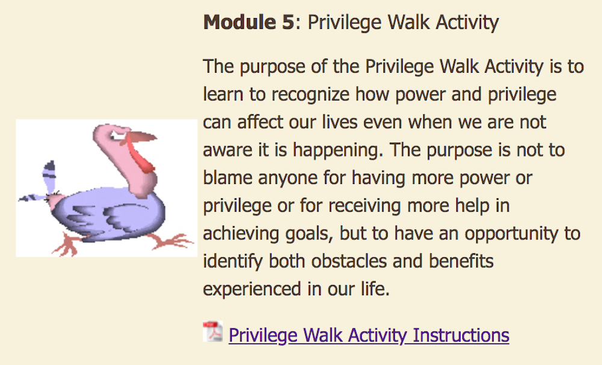
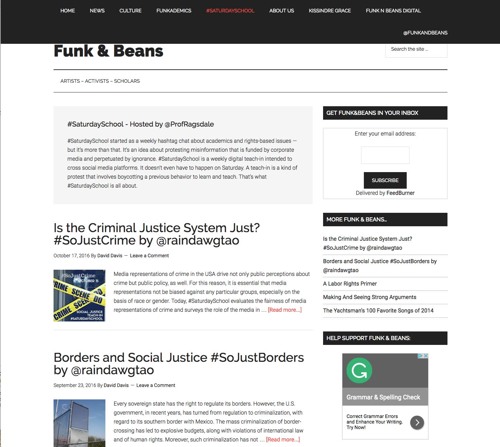
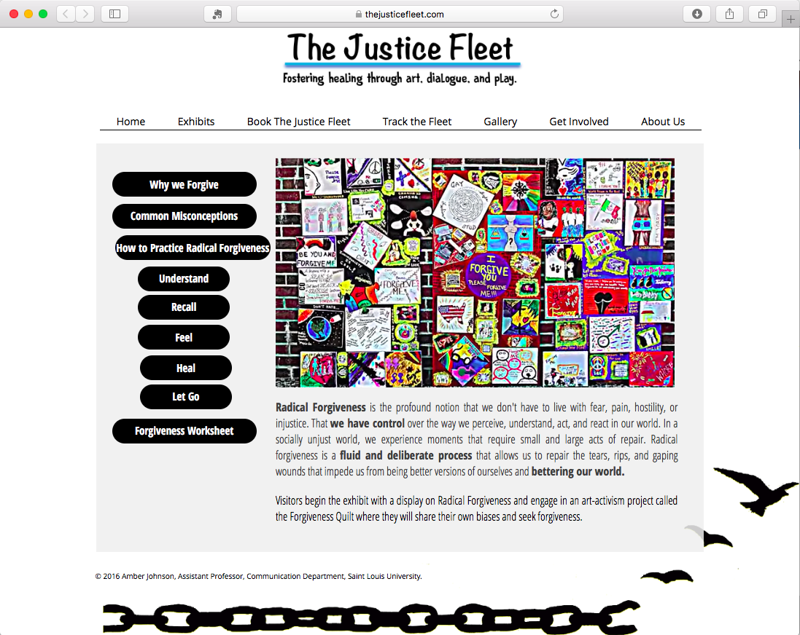

--- 
title: Digital Pedagogy in the Humanities
subtitle: Concepts, Models, and Experiments 
chapter: Social Justice
URL: keywords/social_justice.md
author: 
- family: Taylor
  given: Toniesha
editor: 
- family: Davis
  given: Rebecca Frost
publisher: Modern Language Association
type: book
---

# Social Justice

### Toniesha Taylor

Prairie View A&M University | [http://www.drtonieshaltaylor.com](http://www.drtonieshaltaylor.com)

##### Publication Status:
* unreviewed draft
* draft version undergoing editorial review
* draft version undergoing peer-to-peer review
* **draft version undergoing MLA copyediting**
* awaiting pre-print copy
* published 

---

### Cross-Reference Keywords: access, archive, collaboration, digital divides, gender, labor, race, sexuality

---  

## CURATORIAL STATEMENT

Social justice work, as framed here is an embodied first person experience with the understanding that we can only change what we can name and can only name what we can experience. There are two key thoughts or frames that guide teaching social justice and how I have chosen to curate the works included here. First, faculty must be willing, and able, to acknowledge our privileges at all levels and access points. Definitional frames for social justice are more fluid than scholars engaged in the study of languages and communication are comfortable. I operationalize social justice pedagogy as engaged the equitable creation of teaching and learning spaces where socially constructed identities are equitably presented, valued and involved in the building and maintenance of society. This definition starts with the frame that society, as currently configured, is not equitable. Rather, privilege is the social force guiding social interaction. To create socially just space, we must name privileges. For faculty, this means we must recognize and engage in simple truths about our institutional privileges. Research one institutions afford different access points in socially liberal states than those in socially conservative states. Private institutions may invest in technology at various rates than a public university were technology is a primary focus. Alongside institutional privileges are positional privileges of the faculty at different teaching levels. It may be true that the act of teaching social justice theory is revolutionary on a university campus that does not hold equity or equality as a principal tenant of its mission or its lived practice. For those teaching with the protection of tenure, at the rank of full professor, it may be easier to teach revolution and practice equity within classrooms. While a colleague listed in one of many titles afforded the non-tenured (adjunct, lecturer, seasonal faculty appointment) may not find it comfortable to teach the same content. 

Institutional privilege concerning teaching location and faculty rank is important to recognize since they are framed within socially constructed identity matrix. Students and faculty are embodied within racialized, gendered, classed, sexuality presented selves. Certain people are deemed citizens or non-citizens, socially accepted or not. Our access to systems is tied to our perceived belonging. As such, when engaged in social justice work as faculty we need to take the time to have conversations around privilege that are intersectional and equitable. At this moment as faculty our power is always present; therefore the same or more time for discussion should be afforded to students whose grades are dependent on their performance of social justice within our classrooms. 

Second, it is importation to focus teaching and learning through social justice grounded in theory, method, and action (Swartz 4; Wenshu 197). The readings, discussions, actions, and activities assigned to courses should meet the needs of interdisciplinary work and analysis. Social justice is intersectional and interdisciplinary. We cannot fight or change socially unjust systems if we do not know the languages of injustice. When we are aware of languages of injustice (which are inextricably linked to one another), we can replace them with languages of justice. This work starts by looking at our reading lists and activities. Do we create assignments to engage in actions that privilege the non-disabled? Do we use texts that marginalize or erase Latinx experience? Does the focus on digital assume knowledge, access or experience not mentioned in the course instruction? These are all questions we need to ask and answer. Creating a syllabus that includes digital projects but does not provide time to talk about the construction of racism or transphobia in the comment sections of websites may not yield the level of social change hoped. Ensuring students are clear on the types of actions and the outcomes (known and unknown) and can articulate their level of engagement as an active/activist choice is extremely valuable. Lasting social change can and does occur when students are invested in and can articulate the change they seek to maintain. It does not happen when the digital project created has limited connection to the rest of the world our students, and we inhabit. 

In curating social justice keyword, there are ten pieces that demonstrate digital social justice pedagogy linked to social justice praxis. The first three are syllabi focused on social justice that include activities where students have to create digital content as part of the learning process. Artifacts 4–6 are class activities related to the third syllabus listed. Artifact 7 focuses discussions on the use of words to create databases, computer programs, and metadata; this activity allows students to think about privilege and language. Artifact 8 is an activity focused on embodied privileges. Artifacts 9 and 10 are examples of public scholarship. As such they allow scholars a way to engage in social justice work at an introductory level as either participants or observers.

## CURATED ARTIFACTS

## An Invitation Towards Social Justice in the Digital Humanities

* Artifact Type: course site
* Source URL: [http://criticaldh.roopikarisam.com](http://criticaldh.roopikarisam.com) 
* Artifact Permissions: © Social Justice and the Digital Humanities 2016. All rights reserved.
* Creator and Affiliation: Roopika Risam, Salem State University
micha cárdenas, University of Southern California

Roopika Risam, developed “An Invitation Towards Social Justice in the Digital Humanities” course site with micha cárdenas, Jeremy Boggs, Ashley Byock, Vinamarata Kaur, Joan Lubin, Emily Sessions, Danica Savonick, and Sveta Stoytcheva for the DE/POST/COLONIAL DIGITAL HUMANITIES course delivered at HILT (Humanities Intensive learning and Teaching) in 2015. The course site provides scholars access to the course syllabus, limited materials, and discussions. This is a unique artifact as it provides extensive digital sources and conversation around building pedagogy for scholars interested in teaching social justice in the digital humanities. The discussion on “Material Conditions” and the list of questions Risam et. al. provide is a perfect example of how to engage students in social justice with consideration of the methods of action, research, and learning possible while thinking through multiple levels of access and change.

## Race Class Social Justice Syllabus — Dr. Melissa Harris-Perry

* Artifact Type: syllabus
* Source URL: [http://ajccenter.wfu.edu/wp-content/uploads/2014/06/RaceClassSocialJusticeFall2015W.pdf](http://ajccenter.wfu.edu/wp-content/uploads/2014/06/RaceClassSocialJusticeFall2015W.pdf) 
* Artifact Permissions: 
* Copy of the Artifact:
* Creator and Affiliation: Melissa Harris-Perry, Wake Forest University

The syllabus created by Dr. Harris-Perry is an example of interdisciplinary teaching for an introductory level political science class; the readings on social justice come from journalists, activists, and scholars with various disciplinary backgrounds. Central to this syllabus is the combination of theory, method, and action. Students are required to read theory and build definitions for their engagement through written assignments. They engage in practical methods for social action in the “Tool Kit” building assignment and finally participate in adirect action activity and writing reflection. 

The syllabus is an excellent example of a course taught in an educational environment with clearly supported infrastructure for sustained social action. As a guideline for creating socially engaged discourse within the classroom this syllabus demonstrates activities that live in closed and open digital space. Finally, it exemplifies the intentional creation of classroom space to hold conversations that contextualize social action. 

## Advanced Writing for the Discipline Syllabus -- Dr. Toniesha L. Taylor

* Artifact Type: Syllabus
* Source URL: [http://www.drtonieshaltaylor.com/teaching](http://www.drtonieshaltaylor.com/teaching) 
* Artifact Permissions: CC BY-NC
* Copy of the Artifact: [files/social_justice-Advanced-Writing-for-the-discipline.pdf](files/social_justice-Advanced-Writing-for-the-discipline.pdf)
* Creator and Affiliation: Toniesha L. Taylor, Prairie View A&M University

This syllabus is for a course that teaches advanced research writing and design in communication studies to undergraduate students, including social justice frameworks and digital humanities methods as they apply to communication research.  This particular syllabus, and the related activity artifacts, allow readers to see examples of the application of social justice pedagogy and digital humanities methods. This course required students to work with the [White Violence/Black Resistance](https://sites.google.com/site/bkresist/) topic developed with an eye toward determining archival interventions as a means of social justice. Students created curated projects on Omeka as their final application of course content. 

## GIS Mapping Introduction

* Source URL:  N/A
* Artifact Permissions: CC-BY-NC
* Copy of the Artifact: [files/social_justice-GISMapping_Introduction.pdf](files/social_justice-GISMapping_Introduction.pdf)
* Creator and Affiliation: Noel M. Estwick, Prairie View A&M University 

This activity was created by Dr. Estwick for COMM 4543 where he was a guest lecturer. He delivered four lectures during the sixteen week semester on GIS mapping. This activity introduces students to the method of data collection for GIS mapping allowing them to gain valuable understanding of the physicality of place and space in relation to communication research. Dr. Estwick asked students to contribute to the GIS data on historical markers and social justice sites on campus with this activity. 

GIS mapping activities like this one are used to teach metadata and natural language impacts on mapping data. Students were asked to think critically about language choices. They focused on the digital structures of maps and access, and particularly on how race, class, and gender descriptors of locations within preexisting GIS metadata structures guide the input of new sites in a database.  

## Group Contract (COMM 4543)

* Source URL: [http://www.drtonieshaltaylor.com/teaching](http://www.drtonieshaltaylor.com/teaching) 
* Artifact Permissions: CC BY-NC
* Copy of the Artifact: [files/social_justice-Group-Contract.pdf](files/social_justice-Group-Contract.pdf)
* Creator and Affiliation: Toniesha L. Taylor, Prairie View A&M University

Some form of equitable social contract is valuable between course participants. Contracts, when presented thoughtfully, can be negotiated equitably and ethically. When teaching social justice, it's critical to model a social justice paradigm. Start this assignment by discussing how students can consider the meaning of work, individual versus collaborative contribution, and work product. Remember, students may not know how to write a contract without totalitarian or authoritarian language. Guide them to writing an equitable contract. It is important to talk about how the instructor will interpret the guidelines they set when grading/assessing work product resulting from the contract. This activity is designed to help students create a collaborative contract that recognizes the amount of work and shared the responsibility of group mates. The directions for the assignment are in the COMM 4543 syllabus. Names and contact information removed from this student sample. 

## Transferring Intersectional and Performative Responses

* Source URL: [https://www.drtonieshaltaylor.com/single-post/2017/01/05/ACTIVITY-Transferring-Intersectional-and-Performative-Responses-to-Mediated-Representations-of-Sexuality](https://www.drtonieshaltaylor.com/single-post/2017/01/05/ACTIVITY-Transferring-Intersectional-and-Performative-Responses-to-Mediated-Representations-of-Sexuality) 
* Copy of the Artifact: [files/social_justice-Transferring-Intersectional-and-Performative-Responses.pdf](files/social_justice-Transferring-Intersectional-and-Performative-Responses.pdf)
* Artifact Permissions: CC BY-NC
* Creator and Affiliation: Dr. Robert Gutierrez-Perez, Assistant Professor of Communication, University of Nevada, Reno (Original Creator), Dr. Amber L. Johnson, Assistant Professor of Communication, St. Louis University, and Dr. Toniesha L. Taylor, Associate Professor of Communication, Prairie View A&M University

Dr. Johnson and Dr. Taylor modified this activity from one created by Dr. Robert Gutierrez-Perez. Dr. Guiterrez-Perez’s original activity used music and focused on themes and terms around marriage equality. Johnson and Taylor expanded the activity to include video and use hashtags, themes and terms used to discuss race, class, gender and sexuality. Johnson and Taylor adapted the original activity as a creative interactive performance delivered at the Western States Communication Association Conference.  Since then they have each adapted the activity for classroom delivery in various communication classrooms. This activity allows professors to engage in mediated representations of intersectional identities. Moreover students are able to discuss the ways in which they understand social justice actions through identity matrixes. When delivered in classrooms this activity can be used to start conversation. 

## Privilege Walk Activity

* Source URL:  https://www.albany.edu/ssw/efc/activities.html
* Artifact Permissions:  © 2009 University at Albany, School of Social Welfare
* Copy of the Artifact: Available at [https://www.albany.edu/ssw/efc/pdf/Module%205_1_Privilege%20Walk%20Activity.pdf](https://www.albany.edu/ssw/efc/pdf/Module%205_1_Privilege%20Walk%20Activity.pdf)
* Creator and Affiliation: Catherine K. Lawrence, University at Albany

The privilege walk activity has gone viral, including youtube videos of different groups performing the exercise, a [high school lesson plan](https://peacelearner.org/2016/03/14/privilege-walk-lesson-plan/) from the Peace Learner community website (Layne and Chiu), [one version](http://www.youthdeved.ie/sites/youthdeved.ie/files/The_Walk_of_Life.pdf) from the National Youth Council of Ireland, and versions shared informally between instructors (Moon, 2015).  This early version comes from “Expanding the Family Circle,” a grant-funded child welfare training curriculum.  The activity demonstrates the various ways in which privileges are lived and are intersectional, as students step forward or back in response to statements read by the instructor.  As part of digital pedagogy the exercise allows for conversations about privilege and how it is experienced and replicated in digital space. Once students have an embodied notion of their privilege, they might also be encouraged to craft their own statements illustrating privilege in digital spaces.

## Saturday School

* Artifact Type: Activity
* Source URL: [http://funknbeans.com/category/saturdayschool/](http://funknbeans.com/category/saturdayschool/) 
* Artifact Permissions:
* Copy of the Artifact: 
* Creator and Affiliation: Rhonda Ragsdale, Lone Star College - North Harris

Professor Ragsdale’s #SaturdaySchool and #SoJust Twitter teach-in is an excellent example of public engagement in teaching and learning. The site includes write-ups for each week’s theme on social justice. Professor Ragsdale runs the weekly twitter conversation throughout the day engaging with hundreds to thousands of followers per week. As a form of direct action, Professor Ragsdale brings critical engagement in social justice out of the college classroom and on Twitter with all sorts of audiences. As a classroom activity, students can participate in the conversation as an observer or as a participant. Social justice Twitter teach-ins are an effective activity teachers can use to engage in public discourse over the course of the semester. Dr. Ragsdale provides a step by step guide for scholars new to using hashtags or social media teach-ins in the classroom at [https://twitter.com/profragsdale/status/743878457164079105](https://twitter.com/profragsdale/status/743878457164079105)  

## Radical Forgiveness--The Justice Fleet

* Artifact Type: Activity
* Source URL: [https://www.thejusticefleet.com/copy-of-home) 
* Artifact Permissions: © Amber Johnson, Assistant Professor, Communication Department, Saint Louis University
* Copy of the Artifact: 
* Creator and Affiliation: Amber L. Johnson, Saint Louis University 

For many scholars and activists notions of social justice include clear concepts of self-care and radical forgiveness. Scholar and activist Angela Davis provides a clear and compelling reason for why social justice must include radical forgiveness to create sustained change (van Gelder). For social justice digital pedagogy, it is viable to use digital story-telling and art as part of the process of self-care and radical forgiveness. Dr. Amber Johnson has built an excellent website complete with lesson plans for executing radical forgiveness. Designed to occur in the classroom where students are creating corporeal art, these lessons also allow students to construct digital projects and spaces where an instructor can teach social justice as radical forgiveness. As both physical and digital constructions of the world, students and teacher use creative space for justice work. Dr. Johnson provides a step-by-step process for engagement in the tough work of radical forgiveness including definitions of forgiveness.  

## The Prophetic Ministry of Bishop Henry McNeal Turner Syllabus -- Dr. Andre Johnson

* Artifact Type: Syllabus
* Source URL: 
* Artifact Permissions: CC BY-NC
* Copy of the Artifact: [The Prophetic Ministry of Bishop Henry McNeal Turner Syllabus](files/social_justice-HMT-syllabus.pdf)
* Creator and Affiliation: Andre Johnson, The University of Memphis 

Some digital archive projects are social justice projects in practice and context. One such project is Dr. Andre Johnson's digital archive the "The #HMTProject" focused on the writings and study of the 19th century African Methodist Episcopal Bishop Henry McNeal Turner. As a model of historical rhetoric and digital archive, the #HMTProject provide students a means to engage historical text in understanding Bishop Turner's use of the prophetic to embody social justice. Director Dr. Johnson along with his research team Kimberley Travers, Dianna Watkins-Dickerson, and James Morgan III digitized or provide links to over sixty writings, over twenty letters, ten books or manuscripts written by Bishop Turner. The artifact included here is Dr. Johnson's syllabus which, focusing specifically on Sep. 21, contains embedded links and discussion questions as an example of how to engage students in debates on the practical use of texts within the historical context. 

## RELATED MATERIALS

Crenshaw, Kimberle. “Mapping the Margins: Intersectionality, Identity Politics, and Violence Against Women of Color.” *Stanford Law Review* 43 (1993): 1241–1299. Print. 

Earhart, Amy E., and Toniesha L. Taylor. “Pedagogies of Race: Digital Humanities in the Age of Ferguson.” *Debates in Digital Humanities*, edited by Lauren Klein and Matthew Gold, 2016. Minneapolis: University of Minnesota Press. [http://dhdebates.gc.cuny.edu/debates/text/72 ](http://dhdebates.gc.cuny.edu/debates/text/72)

Lee, Wenshu. “The Desire to Know and to Love Is Never Too Small: My Musings on 
Teaching and Social Justice.” *Social Justice and Communication Scholarship*, edited by Omar Swartz, Routledge, 2012, pp. 193–214.

Liu, Alan. “The Digital Humanities and Identity Issues.” Alan Liu, 
[http://liu.english.ucsb.edu/the-digital-humanities-and-identity-issues/](http://liu.english.ucsb.edu/the-digital-humanities-and-identity-issues/) Accessed 15 November 2016. 

Swartz, Omar. “Social Justice and the Challenge for Communication Studies.” *Social 
Justice and Communication Scholarship*, edited by Omar Swartz, Routledge, 2012, pp. 1–20.

## WORK CITED

Estwick, Noel M. “GIS Mapping Introduction.” 2016. PDF file

Harris-Perry, Melissa. “Race Class Social Justice Syllabus.” Ann Julia Cooper Center, http://ajccenter.wfu.edu/wp-content/uploads/2014/06/RaceClassSocialJusticeFall2015W.pdf. Accessed 11 December 2016.

Johnson, Amber L. Radical Forgiveness--The Justice Fleet. https://www.thejusticefleet.com/copy-of-home. Accessed 15 September 2017.

Johnson, Amber L. and Toniesha L. (Original Creator, Robert Gutierrez-Perez). “Transferring Intersectional and Performative Responses.”  DrTonieshaLTaylor, https://www.drtonieshaltaylor.com/single-post/2017/01/05/ACTIVITY-Transferring-Intersectional-and-Performative-Responses-to-Mediated-Representations-of-Sexuality. Accessed 11 December 2016.

Johnson, Andre. “The Prophetic Ministry of Bishop Henry McNeal Turner Syllabus.” 2017. PDF file.

Lawrence, Catherine K. “Privilege Walk Activity Instructions”. *Expanding the Family Circle*. School of Social Welfare. University at Albany.  2009. https://www.albany.edu/ssw/efc/activities.html 

Layne, Rebecca and Ryan Chiu. “Privilege Walk Lesson Plan.” *Peace Learner*, 14 Mar. 2016, https://peacelearner.org/2016/03/14/privilege-walk-lesson-plan/. Accessed May 14, 2018.

Lee, Wenshu. “The Desire to Know and to Love Is Never Too Small: My Musings on 
Teaching and Social Justice.” *Social Justice and Communication Scholarship*, edited by Omar Swartz, Routledge, 2012, pp. 193–214.

Moon, Dreama G. “Walk of Life - Power in Society.” 2015. PDF file.

National Youth Council of Ireland. “The Walk of Life.” *Development Education Program*. http://www.youthdeved.ie/development_education/racism.  Accessed May 14, 2018.

Ragsdale, Rhonda. “Saturday School.” funknbeans, http://funknbeans.com/category/saturdayschool. Accessed 11 December 2016.

——“#SaturdaySchool.” *funknbeans*, 
[http://funknbeans.com/category/saturdayschool/](http://funknbeans.com/category/saturdayschool/). Accessed 12 December 2016. 

Risam, Roopika, micha cárdenas, Jeremy Boggs, Ashley Byock, Vinamarata Kaur, Joan Lubin, Emily Sessions, Danica Savonick, and Sveta Stoytcheva. “An Invitation Towards Social Justice in the Digital Humanities.” Social Justice and Digital Humanities, http://criticaldh.roopikarisam.com. Accessed 15 September 2017.

Swartz, Omar. “Social Justice and the Challenge for Communication Studies.” *Social 
Justice and Communication Scholarship*, edited by Omar Swartz, Routledge, 2012, pp. 1–20.

Taylor, Toniesha L. “Advanced Writing for the Discipline Syllabus.” DrTonieshaLTaylor, http://www.drtonieshaltaylor.com/teaching. Accessed 11 December 2016. 

——“Group Contract (COMM 4543).” 2015. PDF file.

van Gelder, Sarah. "The Radical Work of Healing: Fania and Angela Davis on a New Kind of Civil Rights Activism." *yes! Magazine* 18 Feb. 2016, http://www.yesmagazine.org/issues/life-after-oil/the-radical-work-of-healing-fania-and-angela-davis-on-a-new-kind-of-civil-rights-activism-20160218. Accessed September 15, 2017.

