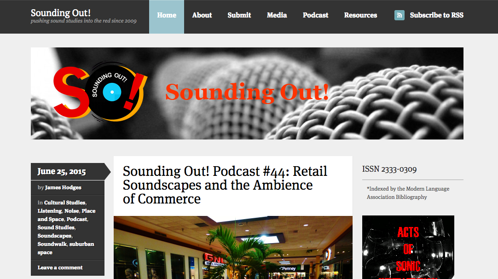
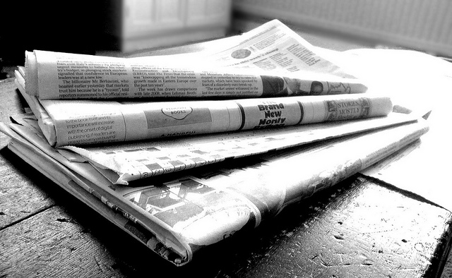
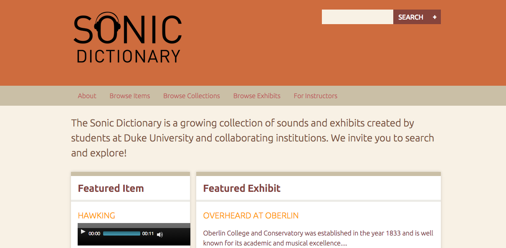
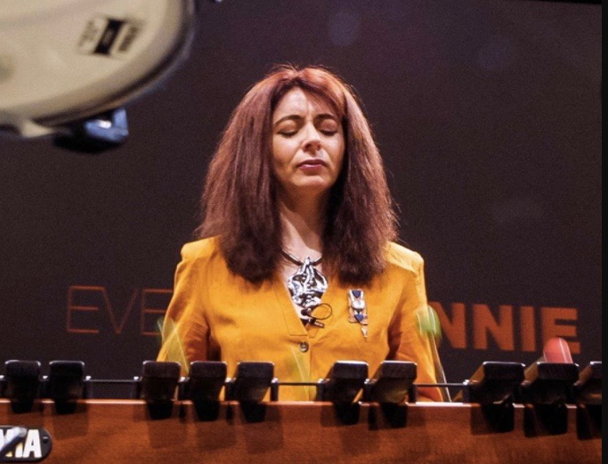

# SOUND

## Steph Ceraso

University of Virginia

##### Publication Status:
* unreviewed draft
* draft version undergoing editorial review
* draft version undergoing peer-to-peer review 
* **draft version undergoing MLA copyediting**
* published 

## CURATORIAL STATEMENT

There has been an explosion of writings on sound in the humanities since the early 1990s. “Sound studies” is often used as an umbrella term for the range of multidisciplinary work that “takes sound as its analytical point of departure” (Sterne 2). Over the last decade, opportunities to use audio files in digital publishing environments have also resulted in a growing collection of audible scholarship. Journals such as *Vectors,* *Kairos*, *Sensate*, *Enculturation*, and *Computers and Composition Online* continue to encourage submissions that take advantage of the sonic affordances of digital spaces.

Alongside this enthusiasm for sound in academia, mainstream digital audio technologies--like ProTools, GarageBand, Audition, open source audio editors like Audacity and Reaper, USB microphones, portable audio recorders, MIDI keyboards, and a plethora of music and recording apps for mobile devices--have created new possibilities for sonic engagement and production in everyday life. These technologies enable amateurs to manipulate and design sound in ways that were once limited to professionals. By watching video tutorials or simply tinkering with software, scores of people have taught themselves to independently produce high quality podcasts, songs, soundscapes, and other projects. Further, with platforms like iTunes, SoundCloud, and Creative Commons Audio, listeners have more access to downloadable audio files than ever before, which they can choose to consume, share, organize, and remix.

In spite of the buzz around sound and the mass availability of digital audio technologies, most humanities students have had very little (if any) formal sonic education in relation to digital media. Considering the increasingly significant role of sound in the academy and in everyday life, digital pedagogy needs to focus on helping students cultivate critical competencies for interacting and creating with sound.  

The artifacts listed below are intended to provide a starting point for developing a more robust sonic education in the humanities. This mix of pedagogical materials and digital tools encourages both the analysis and production of sonic media, as learning through doing is essential to understanding how sound works as a medium. While the selected artifacts can be used for a variety of goals and purposes, they are representative of four key approaches to incorporating sound into digital pedagogy:

**Writing with Sound:** This approach makes direct connections between alphabetic writing and sonic composition--drawing on familiar concepts like audience, genre, and rhetorical effects--while also asking students to consider the distinct affordances of sound. Hit podcasts such as *This American Life* and *Serial* have helped to popularize “sound writing” in classroom settings. Examples include assignments such as audio essays and voiceovers for [digital videos](https://github.com/curateteaching/digitalpedagogy/blob/master/keywords/video.md), both of which involve composing and recording written scripts.  

**Curating Sound:** Having students examine and/or produce digital sound archives is a great way to introduce them to critical curatorial practices. For example, digital collections of sonic artifacts (e.g. "Museum of Endangered Sounds," "The Sonic Memorial Project," "The Roaring 'Twenties'") involve thinking through questions of organization, representation, historical context, interpretation, and cultural value, to name a few. Additionally, teachers could use collections of sonic artifacts to highlight the possibilities and potential challenges associated with curating audio archives in digital spaces. While the limited scope of this entry prevents me from covering the broad range of materials that might be categorized under this pedagogical approach, it is worth mentioning that there are also some excellent sound archives that focus on the vocal performance of literature (e.g. "Ubuweb," "PennSound"), as well as a growing number of applications for analyzing sonic collections (e.g. "Sonic Visualizer," "Praat," and other tools being developed by "HiPSTAS").            

**Sound Mapping:** Sound maps, or digital maps with embedded sound files, have become a common genre of digital composition for scholarly and community-based work. Incorporating sound mapping activities into digital pedagogy is an approach that requires students to attend closely to sonic environments, or soundscapes. After students collect field recordings from a physical space (ground-level listening), they upload their sounds to a digital map of that space in order to create a bird's eye visualization of the soundscape. Sound mapping can be used to initiate discussions about what the sound patterns of a particular location reveal about its geography, inhabitants, culture, and much more. Sound mapping also raises important questions about what is gained or lost by transferring sound from physical to digital environments.

**Critical Listening:** Rather than taking listening for granted as something that people simply do, this approach involves teaching students to reflect on their own and others’ listening practices and to consider how listening practices have changed over time in response to personal, cultural, historical, and technological developments. It is also important to consider what critical listening involves for students who are deaf and hard-of-hearing. Inclusivity and [access](https://github.com/curateteaching/digitalpedagogy/blob/master/keywords/access.md) should be key considerations in listening pedagogy.

## CURATED ARTIFACTS

### *Sounding Out!* Blog

Screenshot: 
* Artifact Type: course reading
* Source URL: http://soundstudiesblog.com/
* Permissions: N/A (public blog)
* Creator: Jennifer Stoever (SUNY Binghamton)
* Tags: sound studies, course readings, blog

*Sounding Out!* blog provides a vast archive of media-rich writing aimed at bringing together academics, artists, professionals, and general readers interested in the cultural politics of sound and listening. This publication is a useful teaching resource because it offers diverse and insightful perspectives on sound in relation to embodiment, identity, power, culture, and technology. *Sounding Out!*'s engaging, reader-friendly style makes it a particularly beneficial source for exposing students to critical considerations of sound and listening for the first time. Topics discussed on this searchable blog range from the histories of sonic technologies to the politics of pop music. In addition to its weekly featured posts, *Sounding Out!* has an affiliated podcast and hosts special series and forums. For example, a provocative interdisciplinary forum on “Gendered Voices” examines the various ways that sound can shape and inform one's bodily experiences and notions of self.

### "Writing with Sound" Syllabus

Screenshot: 
* Artifact Type: syllabus
* Source URL: [files/sound-writing-with-sound-syllabus.pdf](files/sound-writing-with-sound-syllabus.pdf)
* Permissions: granted by creator
* Creator: Casey Boyle (The University of Texas, Austin)
* Tags: syllabus, writing, digital composition, podcast, scaffolding

Casey Boyle’s undergraduate rhetoric course explores the rhetorical affordances of sound as a form of writing, focusing specifically on sound in digital environments. Boyle takes a multidisciplinary approach by drawing on readings and audio texts from sound studies, critical theory, rhetoric and composition, journalism, and pop culture. Each week, the assigned readings and listenings are layered with and informed by new technical practices for students to learn. As the semester progresses, then, students cultivate a deeper understanding of sonic theories and practices and are able to apply that knowledge in the production of their own sonic projects. This balance of analysis and production allows students to develop technical skills with digital audio tools over an extended period of time, thus making a potentially unfamiliar mode of composing less overwhelming. Boyle provides an excellent road map for teachers interested in developing semester-long courses on sound as a communicative medium.

### Sonic Remediations of the News

Image:

* Artifact Type: assignment
* Source URL: [files/sound-sonic-remediation.pdf](files/sound-sonic-remediation.pdf)
* Permissions: granted by Flickr user Jon S; CC-BY 2.0 for image https://www.flickr.com/photos/62693815@N03/6276688407/in/photolist-ayDEMD-WZTknJ-5A3rn6-3yCizh-7DSX3q-hBXz-q6UuCd-ayHg8x-dki4iG-2XhTYB-qwLcCC-ayGksm-pfPNwX-8oHs4W-ayGkko-et5iFr-64PQAR-F4bK8-xQnaS-4XaGib-81aXSP-6sEnt-iyEc2R-hTtYVi-SJgjLk-kK7kk-nJ29pU-4A9eBb-d2kVuo-bQiacB-ikaRV-hTvHsn-b75gR8-dwyPFS-5W1aoU-5eM3mF-5r9aXK-48vQEC-RH3QZT-aUskV-ccWpgA-bp17zf-cwfo47-ayGkgu-dAtrEZ-7AUALs-q8M1Fy-4LXJMZ-8P94t2-BTmhz
* Creator: Jonathan Stone (The University of Utah)
* Tags: remediation, audio journalism, writing, digital composition

Jonathan Stone's assignment "Sonic Remediations of the News" invites students to transform a print news article into a "layered sonic artifact" using digital audio editing software. In the process of creating a sonic version of the print article--which includes recording a vocal track, adding music, sound effects, ambient noise, etc.--students experiment with the possibilities and constraints of both print and audio media. Stone's remediation project is a model assignment for calling attention to how different compositional modes and technologies profoundly shape the ways that writers present information. For teachers who are new to sonic projects like this one, Audacity (an open source multi-track digital audio editor and recording application) is a user-friendly option. The Audacity Manual is also a helpful resource that provides comprehensive information about how to use Audacity, including tutorials, tips, instructions about recording technologies, and explanations of the program’s various effects and technical features.

### "Audio Documentary”

Screenshot: 
* Artifact Type: assignment
* Source URL: [files/sound-audio-doc.pdf](files/sound-audio-doc.pdf)
* Permissions: granted by creator
* Creator: Steven Hammer (Saint Joseph’s University)
* Tags: audio journalism, documentary, fieldwork, collaboration, community

Steven Hammer’s undergraduate course on “Audio Design & Production” focuses on examining and creating an array of sonic work. For the final project of the class, Hammer asks students to compose a 45-60 minute audio documentary that takes up the theme of “silenced voices in Philadelphia.” Working in teams, students do research, collect field recordings and interviews, and decide on how to structure and edit their documentaries. Community-driven fieldwork is an excellent way to incorporate sonic practices and digital composing techniques into the classroom, and Hammer’s collaborative audio documentary is an example worth emulating. This assignment also presents an opportunity for students to read about and discuss the implications of using sound recording to represent others, particularly when it comes to representations of race and class. Thus, this project would pair especially well with readings like Jennifer Stoever's "Splicing the Sonic Color-Line" and Jonathan Stone's "Listening to the Sonic Archive."

### Third Coast International Audio Festival (TCIAF) Website

Screenshot: 
* Artifact Type: website/audio archive
* Source URL: https://www.thirdcoastfestival.org/
* Permissions: N/A (public website)
* Creator: Johanna Zorn (Executive Director and Founder of Third Coast)
* Tags: storytelling, listening, audio journalism, curation, audio archive

The Third Coast International Audio Festival (TCIAF) is an annual Chicago-based event that curates and celebrates the best audio stories from around the world. There are several elements of the site that make it a useful teaching resource. First, it has a searchable audio library, including podcasts, audio documentaries, sound art, and more. The audio library presents students with a sense of the wide range of sonic genres and styles that they might experiment with in their own work. Additionally, the curated archive can serve as a starting point for discussions about what is valued or not in audio journalism. For example, having students identify similarities (in themes, voices, technical features) across award-winning podcasts could lead to conversations about which kinds of cultural, gendered, and racial experiences are represented and which are left out; or perhaps discussions about when and why it is acceptable to use experimental narrative structures.

### Sonic Dictionary

Screenshot: 
* Artifact Type: website/audio archive
* Source URL: http://sonicdictionary.fhi.duke.edu/about
* Permissions: granted by creator
* Creator: Mary Caton Lingold (Virginia Commonwealth University)
* Tags: audio archive, collaboration, vocabulary, sonic dictionary

Sonic Dictionary is a growing archive of sound recordings collected by students at Duke University and collaborating institutions. Mary Caton Lingold initiated this project when she discovered that her students had trouble identifying particular musical sounds. When students do not know the meaning of a word, they can easily look it up in a dictionary. Lingold wanted students to have a similar reference guide for looking up what specific sounds sound like, so she had her students create one using the open source publishing platform Omeka. The goal of this ongoing project is to "enhance the vocabulary of sonic experience," and Lingold encourages other instructors and students to engage with and contribute to the Sonic Dictionary. The website also contains a range of student exhibits that explore the cultural significance of sound (e.g. "Sounds of the South"), as well as guidelines for contributors, sample lesson plans, and detailed instructor notes.

### Open Sound New Orleans

Screenshot: 
* Artifact Type: website/sound map
* Source URL: http://www.opensoundneworleans.com/core/
* Permissions: N/A (public website)
* Creators: Heather Booth and Jacob Brancasi (Project Directors)
* Tags: sound map, community, collaboration

Open Sound New Orleans is a large-scale community sound mapping project that encourages New Orleanians to capture the sounds of their lives and neighborhoods. In addition to being an effective model for similar community projects, Open Sound New Orleans could be used to initiate classroom discussions about the ways that sound is used to represent particular geographies and cultural experiences. For example, students might discuss which neighborhoods they think are “safe” or “dangerous” based on the sounds alone—an exercise that could amplify the racial and cultural assumptions that are attached to sound. Open Sound New Orleans (along with the “London Sound Survey” and “Western Soundscapes Archive,” among others) can also be used to introduce collaborative sound mapping assignments. Open source digital mapping platforms like “SoundCities” now make it easy for students to produce their own soundscape projects, which can be used in a variety of ways in the classroom.

### "Speaking Back to Our Spaces: The Rhetoric of Social Soundscaping"

Screenshot: 
* Artifact Type: multimodal scholarship/course material
* Source URL: http://harlotofthearts.org/index.php/harlot/article/view/150/122
* Permissions: N/A (Open Source Academic Journal)
* Creators: Kati Fargo Ahern (Long Island University) and Jordan Frith (University of North Texas)
* Tags: soundscape, community, collaboration, public space

In this engaging piece of multimodal scholarship, Kati Fargo Ahern and Jordan Frith explore the ways that mobile technologies allow listeners to participate in the production of everyday soundscapes. The authors identify a trend called “Social Soundscaping,” or “contributing, geo-locating, sharing, and modifying sounds uploaded and tagged to specific public spaces.” Social soundscaping practices enable people to have more control over the soundscapes of the public spaces they inhabit. Indeed, the authors’ Prezi presentation provides important contextual information about increasingly corporatized and privatized soundscapes in everyday life, which can give students a sense of how and why soundscaping or sound mapping projects can be used for different goals and purposes. Thus, “Speaking Back to Our Spaces” might be productively paired with Open Sound New Orleans or other digital sound maps. On a related note, “FoundSounds” is a free sound app for instructors interested in designing their own social soundscaping projects.

### *Touch the Sound*

Screenshot: 
* Artifact Type: film
* Source URL: http://www.imdb.com/title/tt0424509/
* Permissions: N/A
* Creator: Thomas Riedelsheimer (Director)
* Tags: sound, deafness, listening, multisensory

This 2004 documentary features deaf percussionist Evelyn Glennie. Due to her deafness, Glennie relies on sight and touch (vibration) to listen, and the film explores the multisensory ways she experiences the sonic world. *Touch the Sound* is a constructive teaching resource for several reasons. First, it encourages viewers to reflect upon their own and others’ listening practices. Second, Glennie makes explicit the multisensory aspects of listening that most hearing people take for granted. In this way, the film has the potential to expand students’ conceptions of listening. Lastly, Glennie’s beyond-the-ears listening practices present an opportunity to talk with students about designing more accessible sonic projects that account for a range of listeners with different bodily capacities and needs. Indeed, teaching students to create sonic work that can be engaged with via multiple modes and pathways (as opposed to the ears only) is important for encouraging more inclusive digital practices.

### "Digital Music and Sound" Syllabus

Screenshot: 
* Artifact Type: syllabus
* Source URL: [files/sound-digital-music-syllabus.pdf](files/sound-digital-music-syllabus.pdf)
* Permissions: granted by creator
* Creator: Tara Rodgers
* Tags: digital music, sound art, listening, digital composition

Tara Rodgers asks students to delve into the historical and cultural dimensions of digital sound and music. With a concentration on creative practices, her course examines digital audio in relation to topics such as DJing, electronic music genres, authorship, ownership, and technological progress. Students also learn to make their own audio projects. Rodgers devotes a substantial amount of time to texts, discussions, and assignments that are aimed at helping students cultivate critical listening habits—an admirable model for any sound-based syllabus. Most notably, this course provides an example of what an expansive approach to teaching with sound can look like. That is, rather than *only* treating sound as a semiotic mode of communication, this course amplifies the affective, physical aspects of sonic interactions, focusing specifically on bodily experiences and the relationship between sound and space. Rodgers’ syllabus represents an exciting range of possibilities for sonic education in the humanities.  

## RELATED MATERIALS

Miller, Paul D., Ed. *Sound Unbound: Sampling Digital Music and Culture*. Cambridge, MA: The MIT Press, 2008.

Oliveros, Pauline. *Deep Listening: A Composer's Sound Practice*. Bloomington, IN: iUniverse, Inc., 2005.  

Schafer, R. Murray. *The Soundscape: Our Sonic Environment and the Tuning of the World*. 1977. Rochester, VT: Destiny Books, 1994.  

"SoundCite." Tyler Fisher and Jeremy Gilbert, Creators. 2013. Knight Lab. Northwestern University. https://soundcite.knightlab.com/.

Yergeau, Melanie et al. *Multimodality in Motion: Disability & Kairotic Spaces*. Spec. issue of *Kairos: A Journal of Rhetoric, Technology, and Pedagogy* 18.1 (2013) http://kairos.technorhetoric.net/18.1/coverweb/yergeau-et-al/index.html.

## WORKS CITED

"Audacity." The Audacity Team. n.d. http://audacityteam.org/.

"The Audacity Manual." The Audacity Team. n.d. http://manual.audacityteam.org/.

“FoundSounds.” David Jensenius. 2015. https://foundsounds.me/.

"HiPSTAS." (High Performance Sound Technologies for Access and Scholarship) Tanya Clement.
2012. http://blogs.ischool.utexas.edu/hipstas/.

“London Sound Survey.” Ian Rawes. 2009. http://www.soundsurvey.org.uk/.

“Museum of Endangered Sounds.” Brendan Chilcutt. January 2012. http://savethesounds.info/.

"Omeka." Roy Rosenzweig Center for History and New Media. George Mason University. 2007.
http://omeka.org/.

"PennSound." Charles Bernstein and Al Filreis. University of Pennsylvania. 2005.
http://writing.upenn.edu/pennsound/.

"Praat." Paul Boesrma and David Weenink. n.d. http://www.fon.hum.uva.nl/praat/.

"The Roaring 'Twenties: An Interactive Exploration of the Historical Soundscape of New York
City." Emily Thompson. Design by Scott Mahoy. *Vectors Journal* (2013) http://vectors.usc.edu/projects/index.php?project=98

“The Sonic Memorial Project.” Davia Nelson and Nikki Silva. n.d. http://www.sonicmemorial.org/sonic/public/index.html

"Sonic Visualizer." Chris Cannam, Christian Landone, and Mark Sandler. 2010. http://www.sonicvisualiser.org/.

“SoundCities.” Stanza. 2000. http://www.soundcities.com/.

Sterne, Jonathan, Ed. *The Sound Studies Reader*. New York: Routledge, 2012.

Stoever, Jennifer. "Splicing the Sonic Color-Line: Tony Schwartz Remixes Postwar Nueva York." *Social Text* 28.1 (2010): 59-85.

Stone, Jonathan. "Listening to the Sonic Archive: Rhetoric, Representation, and Race in the Lomax Prison Recordings." *Enculturation* 19 (2015) http://enculturation.net/listening-to-the-sonic-archive.

"Ubuweb." Kenneth Goldsmith. 1996. http://www.ubuweb.com/.

“Western Soundscape Archive.” J. Willard Marriott Library. The University of Utah. November 2007. http://westernsoundscape.org/.
