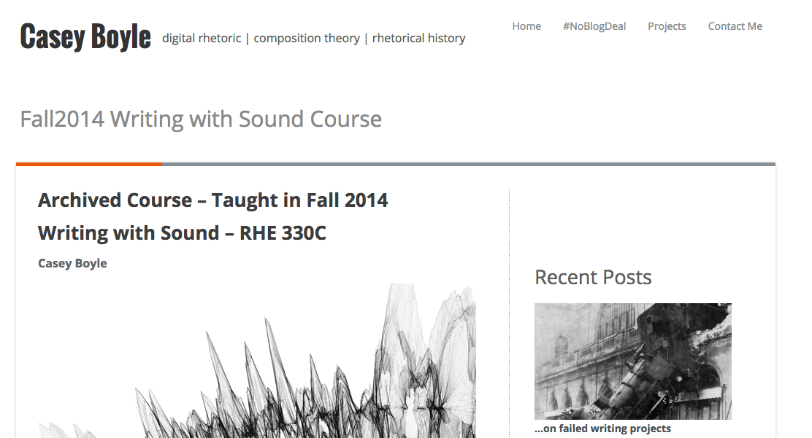
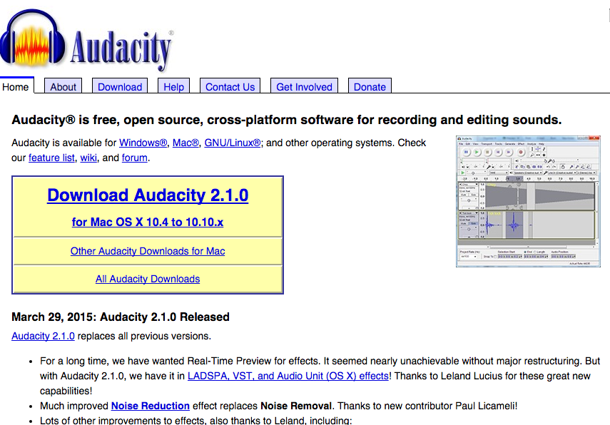
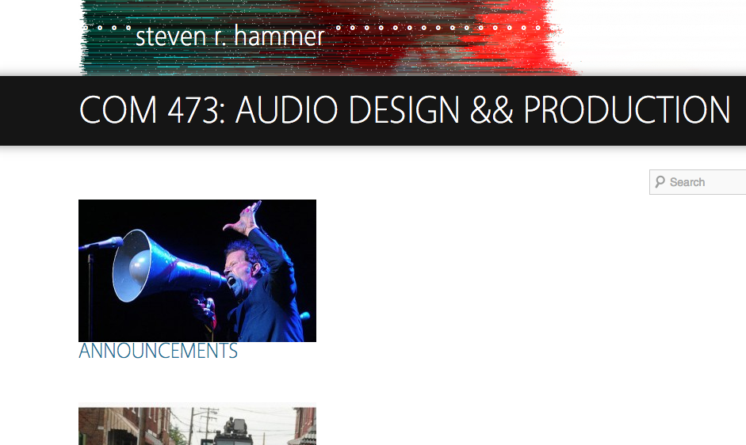
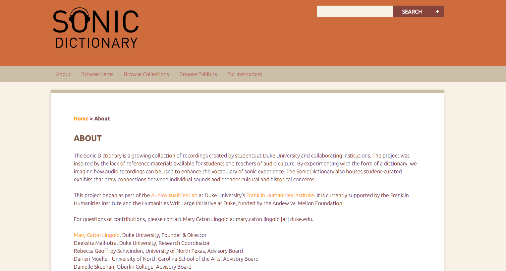
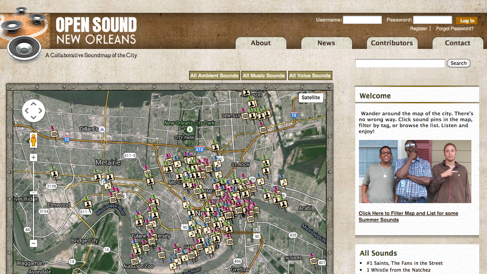
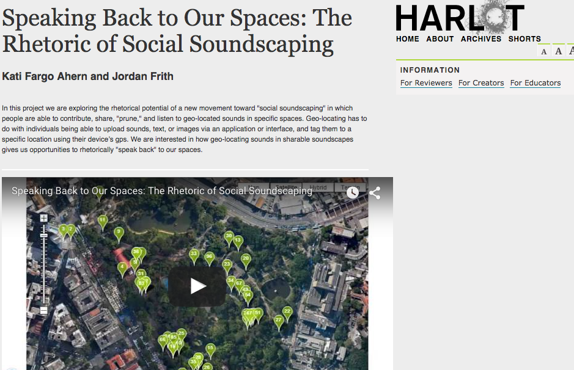
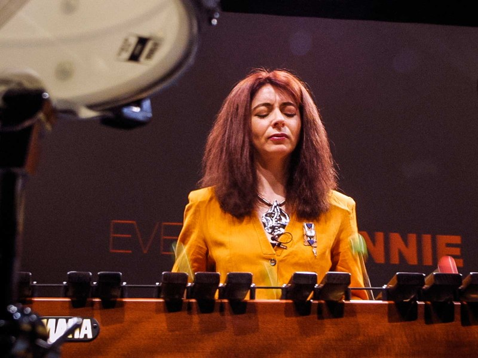
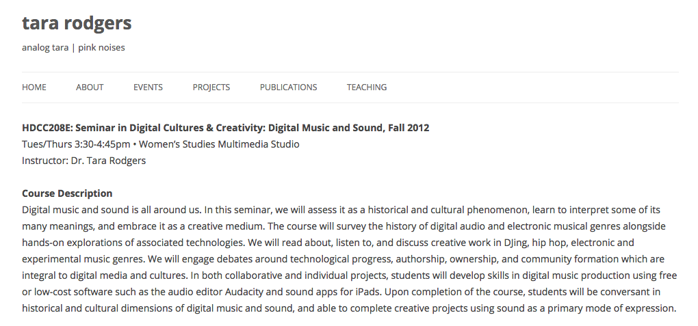

# SOUND (Draft)
 
### Steph Ceraso
University of Maryland, Baltimore County

---

##### Publication Status:
* unreviewed draft
* draft version undergoing editorial review
* **draft version undergoing peer-to-peer review https://digitalpedagogy.commons.mla.org/**
* published 

--- 

## CURATORIAL STATEMENT
 
There has been an explosion of writings on sound in the humanities since the early 1990s. “Sound studies” is often used as an umbrella term for the range of multidisciplinary work that “takes sound as its analytical point of departure” (Sterne 2). Over the last decade, opportunities to use audio files in digital publishing environments have also resulted in a growing collection of audible scholarship. Journals such as *Vectors,* *Kairos*, *Sensate*, *Enculturation*, and *Computers and Composition Online* continue to encourage submissions that take advantage of the sonic affordances of digital spaces.

Alongside this enthusiasm for sound in academia, mainstream digital audio technologies—--like ProTools, GarageBand, Audition, and open source audio editors like Audacity and Reaper—--have created new possibilities for sonic engagement and production in everyday life. These technologies enable amateurs to manipulate and design sound in ways that were once limited to professionals. By watching video tutorials or simply tinkering with software, scores of people have taught themselves to independently produce high quality podcasts, songs, soundscapes, and other projects. Further, with platforms like iTunes, SoundCloud, and Creative Commons Audio, listeners have more access to downloadable audio files than ever before, which they can choose to consume, share, organize, and remix. 

In spite of the buzz around sound and the mass availability of digital audio technologies, most humanities students have had very little (if any) formal sonic education in relation to digital media. Considering the increasingly significant role of sound in the academy and in everyday life, digital pedagogy needs to focus on helping students cultivate critical competencies for interacting and creating with sound.  

The artifacts listed below are intended to provide a starting point for developing a more robust sonic education in the humanities. I have provided a mix of pedagogical materials and digital tools to encourage both the analysis and production of sonic media, as I believe that learning through doing is essential to understanding how sound works as a medium. While the artifacts I have selected can be used for a variety of goals and purposes, they are representative of four key approaches to incorporating sound into digital pedagogy: 

**Writing with Sound:** This approach makes direct connections between alphabetic writing and sonic composition—--drawing on familiar concepts like audience, genre, and rhetorical effects—--while also asking students to consider the distinct affordances of sound. Hit podcasts such as This American Life and Serial have helped to popularize “sound writing” in classroom settings. Examples include assignments such as audio essays and voiceovers for digital videos, both of which involve composing and recording written scripts.  

**Curating Sound:** Having students examine and/or produce digital sound archives is a great way to introduce them to critical curatorial practices. For example, digital collections of sonic artifacts (e.g. "Museum of Found Sounds," "The Sonic Memorial Project," "The Roaring 'Twenties") involve thinking through questions of organization, representation, historical context, interpretation, and cultural value, to name a few. Teachers could also use collections of sonic artifacts to highlight the possibilities and potential challenges associated with curating audio archives in digital spaces.             

**Sound Mapping:** Sound maps, or digital maps with embedded sound files, have become a common genre of digital composition for scholarly and community-based work. Incorporating sound mapping activities into digital pedagogy is an approach that requires students to attend closely to sonic environments, or soundscapes. After students collect field recordings from a physical space (ground-level listening), they upload their sounds to a digital map of that space in order to create a bird's eye visualization of the soundscape. Sound mapping can be used to initiate discussions about what the sound patterns of a particular location reveal about its geography, inhabitants, culture, and much more. Sound mapping also raises important questions about what is gained or lost by transferring sound from physical to digital environments. 

**Critical Listening:** Rather than taking listening for granted as something that people simply do, this approach involves teaching students to reflect on their own listening practices and to consider how their listening practices have changed over time in response to personal, cultural, historical, and technological developments. Critical listening is a crucial part of sonic education.  

## CURATED ARTIFACTS

### *Sounding Out!* Blog

* Source URL: http://soundstudiesblog.com/
* Creator: Jennifer Stoever (SUNY Binghamton)

*Sounding Out!* blog provides a vast archive of media-rich writing aimed at bringing together academics, artists, professionals, and general readers interested in the cultural politics of sound and listening. This publication is a useful teaching resource because it offers complex and insightful perspectives on sound in relation to embodiment, identity, power, culture, and technology. *Sounding Out!*'s engaging, reader-friendly style makes it a particularly great source for exposing students to critical considerations of sound and listening for the first time. Topics discussed on this searchable, well-organized blog range from the histories of sonic technologies to the politics of pop music. In addition to its weekly featured posts, *Sounding Out!* has an affiliated podcast and hosts special series and forums. For example, in a provocative interdisciplinary forum on “Gendered Voices,” contributors explore subjects such as gendered music in the TV show *Scandal*, voice in transgendered experience, and cultural conceptions of gender and loudness. I've used this forum in my own classes to introduce an assignment called "My Listening Body." This project invites students to create an autobiographical piece of digital media in which they examine a past sonic experience that made them very aware of their bodies. Embodied experience in this assignment might refer to a particular physical (felt) sonic encounter and how it affected a student's emotions, behaviors, and thoughts; and/or to a sonic experience that caused a student to be hyper-aware of his or her race, class, gender, or another part of their embodied identities. The aim of this project is to heighten students' awareness of the various ways that sound can shape and inform one's bodily experiences and notions of self--something that the "Gendered Voices" forum models quite well.    

### "Writing with Sound" Syllabus

* Source URL: http://caseyboyle.net/fall2014-writing-with-sound-course/
* Copy of Artifact: Forthcoming
* Creator: Casey Boyle (University of Texas, Austin)

Casey Boyle’s undergraduate rhetoric course explores the rhetorical affordances of sound as a form of writing, focusing specifically on sound in digital environments. Boyle takes a multidisciplinary approach by drawing on readings and audio texts from sound studies, critical theory, rhetoric and composition, journalism, and pop culture. What I admire most about Boyle’s pedagogy is his careful scaffolding. Each week the assigned readings and listenings are layered with and informed by new technical practices for students to learn. As the semester progresses, then, students cultivate a deeper understanding of sonic theories and practices and are able to apply that knowledge in the production of their own sonic projects. The nice balance of analysis and production in the course schedule allows students to develop technical skills with digital audio tools over an extended period of time, thus making a potentially unfamiliar mode of composing more manageable and less overwhelming. Boyle’s innovative course provides an excellent road map for teachers interested in developing semester-long courses on sound as a communicative medium. 

### Sonic Remediations of the News

* Copy of Artifact: Forthcoming
* Creator: Jonathan Stone (The University of Utah)

Jonathan Stone's innovative assignment "Sonic Remediations of the News" invites students to transform a print news article into a "layered sonic artifact" using digital audio editing software. In the process of creating a sonic version of the print article--which includes recording a vocal track, adding music, sound effects, ambient noise, etc.--students experiment with the possibilities and constraints of both print and audio media. Stone's remediation project is a great model for developing assignments that call attention to how different compositional modes and technologies profoundly shape the ways that writers present information. For teachers who are new to assigning sonic projects like this, I would recommend asking students to use Audacity, an open source multi-track digital audio editor and recording application. The Audacity Manual is also a helpful supplemental resource because it provides comprehensive information about how to use Audacity, including tutorials, tips, instructions about recording technologies, and explanations of the program’s various effects and technical features. Because of its intuitive, boombox-like interface, I have had much success teaching this application to students with no prior audio editing experience. Between referring to the Audacity Manual and watching video tutorials on YouTube, students are able to make fairly sophisticated and professional sounding compositions. For instructors who may be worried about the technical learning curve involved in teaching students to make digital sound projects, Audacity and its thorough accompanying manual will prove to be a valuable (and free) resource. 

### "Audio Documentary”

* Source URL: http://www.stevenrhammer.com/com473/
* Copy of Artifact: Forthcoming
* Creator: Steven Hammer (Saint Joseph’s University)

Steven Hammer’s undergraduate communication course on “Audio Design & Production” focuses on examining and creating an array of sonic work. For the final project of the class, Hammer asks students to compose a 45-60 minute audio documentary that takes up the theme of “silenced voices in Philadelphia.” Working in teams, students do research, collect field recordings and interviews, and decide on how to structure and edit their documentaries. This assignment offers a strong model for designing a sound-based collaborative project. The topic is broad enough to be interpreted in various ways while still maintaining a clear purpose: to amplify the stories of underrepresented voices. Requiring all members of the class to wrestle with the same topic from different angles allows for an expansive and thoughtful exploration of the subject. Most significantly, this assignment gives students the opportunity to get out into the community and do real fieldwork. In addition to learning from community members that they might not otherwise encounter, the audio documentary project combines more familiar research practices (e.g. collecting information and interviewing) with technical skills that might be new to humanities students (e.g. using recording equipment, composing in digital audio editors). Thus, the assignment’s design allows students to rely on their previous research experiences while they work together to learn new technical knowledge. Community-driven fieldwork is an excellent way to incorporate sonic practices and digital composing techniques into the classroom, and Hammer’s collaborative audio documentary is an example worth emulating. Assignments like this also present a good opportunity for students to read about and discuss the implications of using sound recording to represent others, particularly when it comes to representations of race and class (Stoever, Stone).    

### Third Coast International Audio Festival (TCIAF) Website

* Source URL: http://www.thirdcoastfestival.org/library
* Creator: Johanna Zorn (Executive Director and Founder of Third Coast)

The Third Coast International Audio Festival (TCIAF) is an annual Chicago-based event that curates and celebrates the best audio stories from around the world. The website for the festival contains information about TCIAF’s podcast, local and national radio shows, and listening events. There are several elements of the site that make it a helpful teaching resource. First, it has a searchable audio library, including noteworthy and award-winning radio shows and podcasts, audio documentaries, experimental sound art, sonic portraits, recordings of past TCIAF conference speakers, and more. The audio library is a good place to find high quality examples, and it can also provide students with a sense of the wide range of sonic genres and styles that they might experiment with in their own work. Additionally, the curated archive can serve as a starting point for discussions about what is valued or not in audio journalism and entertainment. For example, having students identify similarities (in themes, voices, technical features) across award-winning podcasts could lead to conversations about which kinds of cultural, gendered, and racial experiences are represented and which are left out; or perhaps discussions about when and why it is acceptable to use experimental narrative structures or digital audio effects. Generally speaking, the site is filled with interesting sonic material that could be used for pedagogical purposes.  

### Sonic Dictionary

* Source URL: http://sonicdictionary.fhi.duke.edu/about 
* Creator: Mary Caton Lingold (Duke University)

Sonic Dictionary is an archive of over 500 sound recordings collected by students at Duke University and collaborating institutions. More than 200 undergraduates from 20 classes have contributed to the Sonic Dictionary. Mary Caton Lingold initiated this project when she discovered that her students had trouble identifying particular musical sounds correctly. When students do not know the meaning of a word, they can easily look it up in a dictionary. Lingold wanted students to have a similar reference guide for looking up what specific sounds sound like, so she had her students create one using the open source publishing platform Omeka. The goal of this ongoing project is to "enhance the vocabulary of sonic experience," and Lingold encourages other instructors to design assignments that ask students to engage with and contribute to the Sonic Dictionary. The website also contains a range of student curated exhibits that explore the cultural significance of sound (e.g. "Sounds of the South"). Additionally, there are guidelines for contributors, sample lesson plans, and detailed instructor notes. Sonic Dictionary is a fantastic resource for students and instructors interested in audio culture and archival practices.   

### Open Sound New Orleans 

* Source URL: <http://www.opensoundneworleans.com/core/>
* Creators: Heather Booth and Jacob Brancasi (Project Directors)

Open Sound New Orleans is a large-scale community sound mapping project that encourages New Orleanians to capture the sounds of their lives and neighborhoods. Contributors upload digital sound files to the project website, which then become part of a map of the rich sonic culture of New Orleans. Because contributors tag their sonic information, it is easy for users to search for specific sounds, themes, or locations. This project is unique because, unlike most sound mapping initiatives, it provides dispatches throughout the city that offer free training and recording equipment to interested individuals. Regardless of their economic or educational status, it is possible for all community members to participate in the project. In addition to being an effective model for similar community projects, Open Sound New Orleans is a wonderful teaching resource for discussing the ways that sound is used to represent particular geographies and cultural experiences. For example, when I included this project in one of my multimedia authoring courses, students discussed which neighborhoods they thought were “safe” or “dangerous” based on the sounds alone. This exercise initiated a conversation about the racial and cultural assumptions that are attached to sound. I also use Open Sound New Orleans (along with the “London Sound Survey” and the “Western Soundscapes Archive,” among others) to introduce collaborative sound mapping assignments. Open source digital mapping platforms like “SoundCities” now make it easy for students to produce their own soundscape projects, which can be used in a variety of ways in the classroom.

### “Speaking Back to Our Spaces: The Rhetoric of Social Soundscaping”

* Source URL: http://harlotofthearts.org/index.php/harlot/article/view/150/122
* Creators: Kati Fargo Ahern (Long Island University) and Jordan Frith (University of North Texas)

In this engaging piece of multimodal scholarship, Kati Fargo Ahern and Jordan Frith explore the ways that mobile technologies allow listeners to participate in the production of everyday soundscapes. The authors identify a trend called “Social Soundscaping,” or “contributing, geo-locating, sharing, and modifying sounds uploaded and tagged to specific public spaces.” Using apps on mobile devices, people can upload the sounds of their choosing to maps of physical locations. The idea is that interested individuals can wear headphones and use their WiFi-connected mobile devices to listen to location-specific soundscapes in a virtual environment while they are physically drifting through urban spaces. Additionally, listeners can add new sounds and modify or delete other contributors’ sounds, thus creating sonic environments that constantly change and evolve. Social soundscaping practices are significant because they enable people to have more control over the soundscapes of the public spaces they inhabit. Indeed, the authors’ Prezi presentation provides important contextual information about increasingly corporatized and privatized soundscapes in everyday life, which can give students a sense of how and why soundscaping or sound mapping projects can be used for different goals and purposes. Thus, “Speaking Back to Our Spaces” might be productively paired with Open Sound New Orleans or other digital sound maps. On a related note, “FoundSounds” is an excellent free sound app for instructors interested in designing their own social soundscaping projects.

### *Touch the Sound*

* Source URL: <http://www.imdb.com/title/tt0424509/>
* Creator: Thomas Riedelsheimer (Director)

This 2004 documentary film features deaf percussionist Evelyn Glennie, a world-renowned Scottish musician. Due to her deafness, Glennie relies on sight and touch (vibration) to listen. Touch the Sound follows Glennie through her everyday life to explore the multisensory ways that she experiences the sonic world. This film is a fantastic teaching resource for several reasons. First, *Touch the Sound* encourages viewers to reflect upon their own and others’ listening practices. Second, Glennie exemplifies how touch, sight, and sound work together during sonic interactions, making explicit the multisensory aspects of listening that most hearing people take for granted. In this way, the film has the potential to expand and enrich students’ conceptions of and approaches to listening. Lastly, the beyond-the-ears listening practices demonstrated in this film provide a perfect opportunity to talk to students about designing more accessible sonic projects, or projects that account for a range of listeners with different bodily capacities and needs. Indeed, teaching students to create sonic work that can be engaged with via multiple modes and pathways (as opposed to the ears only) is vitally important for encouraging more inclusive practices in digital pedagogy. 

### "Digital Music and Sound" Syllabus

* Source URL: http://www.analogtara.net/wp/teaching/digital-music-sound/
* Copy of Artifact: Forthcoming
* Creator: Tara Rogers (University of Maryland, College Park)

Tara Rogers’ honors seminar for the University of Maryland’s Digital Culture and Creativity program explores the historical and cultural dimensions of digital sound and music. With a concentration on creative practices, the course examines digital audio in relation to topics such as DJing, electronic music genres, authorship, ownership, and technological progress. Additionally, students learn to make their own audio projects, including a multichannel sound art installation, using Audacity and other sound apps. This syllabus contains an outstanding mix of popular readings, media, and theory. In addition, Rogers devotes a substantial amount of time to texts, discussions, and assignments that are aimed at helping students cultivate critical listening habits—--a great model for all sound-based courses. Finally, Rogers provides an example of what an expansive approach to teaching sound can look like. That is, rather than *only* treating sound as a semiotic mode of communication, this syllabus deals with the affective, physical aspects of sonic interactions, focusing specifically on bodily experiences and the relationship between sound and space. To my mind, this innovative syllabus represents an exciting range of possibilities for developing sonic education in the humanities.  

## RELATED MATERIALS

Miller, Paul D., Ed. *Sound Unbound: Sampling Digital Music and Culture*. Cambridge, MA: The MIT Press, 2008. 

Oliveros, Pauline. *Deep Listening: A Composer's Sound Practice*. Bloomington, IN: iUniverse, Inc., 2005.  

Schafer, R. Murray. *The Soundscape: Our Sonic Environment and the Tuning of the World*. 1977. Rochester, VT: Destiny Books, 1994.  

"SoundCite." Tyler Fisher and Jeremy Gilbert, Creators. 2013. Web. 20 June 2015. Knight Lab. Northwestern University. <https://soundcite.knightlab.com/>  

Yergeau, Melanie et al. “Multimodality in Motion: Disability & Kairotic Spaces.” *Kairos: A Journal of Rhetoric, Technology, and Pedagogy* 18.1 (2013). Web. 4 June 2015. <http://kairos.technorhetoric.net/18.1/coverweb/yergeau-et-al/index.html>

## WORKS CITED

"Audacity." The Audacity Team. n.d. Web. 8 Nov. 2015. <http://audacityteam.org/>

"The Audacity Manual." The Audacity Team. n.d. Web. 8 Nov. 2015. <http://manual.audacityteam.org/man/Main_Page>

“FoundSounds.” David Jensenius. 2015. Web. 24 June 2015. <https://foundsounds.me/>

“London Sound Survey.” n.d. Web. 20 June 2015. <http://www.soundsurvey.org.uk/>

“Museum of Endangered Sounds.” Brendan Chilcutt. January 2012. Web. 24 June 2015. <http://savethesounds.info/>

"Omeka." Roy Rosenzweig Center for History and New Media. George Mason Univeresity. 2007. Web. 8 Nov. 2015. <http://omeka.org/>

"The Roaring 'Twenties: An Interactive Exploration of the Historical Soundscape of New York City." Emily Thompson. Design by Scott Mahoy. *Vectors Journal* (2013) <http://vectors.usc.edu/projects/index.php?project=98>

"The Sonic Memorial Project." Davia Nelson and Nikki Silva. n.d. Web. 24 June 2015. <http://www.sonicmemorial.org/sonic/public/index.html>

"SoundCities." Stanza. 2000. Web. 23 June 2015. <http://www.soundcities.com/>

Sterne, Jonathan, Ed. *The Sound Studies Reader*. New York: Routledge, 2012. 

Stoever, Jennifer. "Splicing the Sonic Color-Line: Tony Schwartz Remixes Postwar Nueva York." *Social Text* 28.1 (2010): 59-85.

Stone, Jonathan. "Listening to the Sonic Archive: Rhetoric, Representation, and Race in the Lomax Prison Recordings." *Enculturation* 19 (2015) <http://enculturation.net/listening-to-the-sonic-archive>

"Western Soundscape Archive." J. Willard Marriott Library. The University of Utah. November 2007. Web. 24 June 2015. <http://westernsoundscape.org/>
