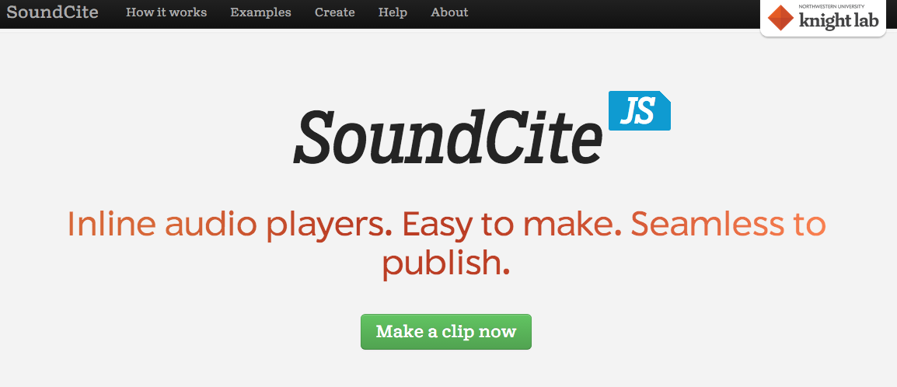

# SOUND (Draft)
 
### Steph Ceraso
University of Maryland, Baltimore County

---

##### Publication Status:
* unreviewed draft
* **draft version undergoing editorial review**
* draft version undergoing peer-to-peer review
* published 

--- 

## CURATORIAL STATEMENT
 
Though it has a long and rich history as a scholarly subject, there has been an explosion of writings on sound in the humanities since the early 1990s. “Sound studies” is often used as an umbrella term for the range of multidisciplinary work that “takes sound as its analytical point of departure” (Sterne 2). Over the last decade, opportunities to use audio files in digital publishing environments have also resulted in a growing collection of audible scholarship. Journals such as *Vectors,* *Kairos*, *Sensate*, *Enculturation*, and *Computers and Composition Online* continue to encourage submissions that take advantage of the sonic affordances of digital spaces.

JENTERY: I really like this introductory paragraph, especially how it almost immediately defines its subject. I also like "audible scholarship." I wonder, tho, if audiences will follow the tension/contrast suggested in the first sentence. Would that sentence work without "Though it has..."? Could you cut directly to "There has been..."?

Alongside this enthusiasm for sound in academia, mainstream digital audio technologies—--such as ProTools, GarageBand, Audition, and open source audio editors such as Audacity and Reaper—--have created new possibilities for sonic engagement and production in everyday life. These technologies enable amateurs to manipulate and design sound in ways that were once limited to professionals. By watching video tutorials or simply tinkering with software, scores of people have taught themselves to independently produce high quality podcasts, songs, soundscapes, and other projects. Further, with platforms like iTunes, SoundCloud, and Creative Commons Audio, listeners have more access to downloadable audio files than ever before, which they can choose to consume, share, organize, and remix. 

JENTERY: While I follow your claims for accessibility here (especially claims about accessible audio files), I do wonder if aspects of this paragraph (especially "once limited to professionals") ignore the cultures that congealed around ham radio, magnetic tape, and vinyl. Is there a way to mark what makes software distinct from these traditions, where large groups of amateurs also manipulated sound without formal training? In some ways, I wonder if it isn't arguable that, in the "pre-digital" past (especially with tape), a significant portion of people produced their own amateur audio. Thoughts? 

In spite of the buzz around sound and the mass availability of digital audio technologies, most humanities students have had very little (if any) formal sonic education—--particularly in relation to digital media. However, considering the increasingly significant role of sound in the academy and everyday life, digital pedagogy needs to do a better job of helping students cultivate critical competencies for interacting with and creating sonic work.  

JENTERY: I have to ask: would listening to lecture count as "sonic education"? Also, perhaps the last sentence (especially "do a better job") is a bit charged or value-laden? Is there a way to more concretely articulate why audible scholarship is necessary today? Finally, what would be the difference between "sound" and "sonic work"?

The artifacts listed below are intended to provide a starting point for developing a more robust sonic education in the humanities. I have provided a mix of pedagogical materials and digital tools to encourage both the analysis and production of sonic media, as I believe that learning through doing is essential to understanding how sound works as a medium. While the artifacts I have selected can be used for a variety of goals and purposes, they are representative of three key approaches to incorporating sound into digital pedagogy: 

JENTERY: This is great! Thanks.

*Writing with Sound:* This approach makes direct connections between alphabetic writing and sonic composition—--drawing on familiar concepts such as audience, genre, and rhetorical effects—--while also asking students to consider the distinct affordances of sound. Hit podcasts such as *This American Life* and *Serial* have helped to popularize “sound writing” in classroom settings. Examples include assignments such as audio essays and sound documentaries. 

JENTERY: From a reader's perspective, what would be the difference between "audio essays" and "sound documentaries" (on the one hand) and "sound essays" and "audio documentaries" (on the other)? 

*Sound Mapping:* Sound maps, or digital maps with embedded sound files, have become a common genre of digital composition for scholarly and community-based work. Incorporating sound mapping activities into digital pedagogy is an approach that requires students to attend closely to sonic environments, or soundscapes. Sound mapping can be used to initiate discussions about what the sound of a particular location reveals about its geography, inhabitants, culture, and much more. Sound mapping also raises important questions about what is gained or lost by transferring sound from physical to digital spaces. 

JENTERY: Here, I wonder if readers may expect a reference to field recording. What do you think? (I see it's mentioned below, in your comments about Hammer's work.) Perhaps a mention of scale, too? Not sure. Just thinking about how sound maps tend to shift between ground-level listening and bird's eye visualizations of sound patterns.  

*Critical Listening:* Rather than taking listening for granted as something that people simply do, this approach involves teaching students to cultivate critical listening habits and practices. Asking students to reflect on their own listening practices and consider how listening practices have changed over time in response to cultural, historical, and technological developments is a crucial part of sonic education.  

JENTERY: I really appreciate the second sentence. So important! In the first sentence, would you be willing to revise the use of "critical listening" to define "critical listening"? In other words, would another adjective work there? Or perhaps that portion ("cultivate ... practices") of the sentence is unnecessary? You could cut directly to the next sentence, which articulates (to me) what critical listening is?

## CURATED ARTIFACTS

### *Sounding Out!* Blog

* Source URL: http://soundstudiesblog.com/
* Creator: Jennifer Stoever (SUNY Binghamton)

*Sounding Out!* blog provides a vast archive of media-rich writing aimed at bringing together academics, artists, professionals, and general readers interested in the cultural politics of sound and listening. This site is a useful teaching resource because it offers complex and insightful perspectives on sound in an engaging, reader-friendly style--—an excellent quality, particularly if you are exposing students to critical considerations of sound and listening for the first time. Topics discussed on this searchable, well-organized blog range from the histories of sonic technologies to the politics of pop music. In addition to its weekly featured posts, *Sounding Out!* has an affiliated podcast and hosts special series and forums. For example, in a provocative, interdisciplinary forum on “Gendered Voices,” contributors explore subjects such as gendered music in the TV show *Scandal*, voice in transgendered experience, and cultural conceptions of gender and loudness. In short, *Sounding Out!* contains a wealth of material for teaching students about sound in relation to identity, power, culture, and technology. 

JENTERY: Great to see Sounding Out! on your list. If only in a sentence or two, would you be willing to speak to how you have (or someone else has) taught with SO! in a class? Perhaps a way that the "Gendered Voices" forum has been taught? Or the podcasts have been taught? Also, I got a bit lost at "an excellent quality." I wanted to make it "and excellent quality," but that doesn't seem quite right, either. 

### Audacity + Audacity Manual

* Source URLs: http://audacityteam.org/ + http://manual.audacityteam.org/o/index.html
* Creator: The Audacity Team

Audacity is an open source multi-track digital audio editor and recording application. The Audacity manual is a helpful supplemental resource because it provides comprehensive information about how to use Audacity, including tutorials, tips, instructions about recording technologies, and explanations of the program’s various effects and technical features. Because of its intuitive, boombox-like interface, I always recommend Audacity to teachers who are new to teaching sonic composition. I have had much success teaching this application to students with no prior audio editing experience. Between referring to the Audacity manual and watching video tutorials on YouTube, students are able to make fairly sophisticated and professional sounding compositions. For instructors who may be worried about the technical learning curve involved in teaching students to make digital sonic projects, Audacity and its thorough accompanying manual will prove to be a valuable (and free) resource. 

JENTERY: I like "boombox-like interface." Per chance, do you have a prompt or the like that requires Audacity? I'm just thinking about what readers may learn from seeing how you (or others) teach with Audacity. 

### "Writing with Sound" Syllabus

* Source URL: http://caseyboyle.net/fall2014-writing-with-sound-course/
* Copy of Artifact: Forthcoming
* Creator: Casey Boyle (University of Texas, Austin)

Casey Boyle’s undergraduate rhetoric course explores the rhetorical affordances of sound as a form of writing, focusing specifically on sound in digital environments. Boyle takes a multidisciplinary approach by drawing on readings and audio texts from sound studies, critical theory, rhetoric and composition, journalism, and pop culture. What I admire most about Boyle’s pedagogy is his careful scaffolding. Each week the assigned readings and listenings are layered with and informed by new technical practices for students to learn. As the semester progresses, then, students cultivate a deeper understanding of sonic theories and practices and are able to apply that knowledge in the production of their own sonic projects. The nice balance of analysis and production in the course schedule allows students to develop technical skills with digital audio tools over an extended period of time, thus making a potentially unfamiliar mode of composing more manageable and less overwhelming. Assignments for the course include an audio analysis of an existing podcast series, a “sonic remediation” of a print-based text, and an original, three episode podcast series. Boyle’s innovative course provides an excellent road map for teachers interested in developing semester-long courses on sound as a communicative medium. 

JENTERY: This is great. Thanks! 

### SoundCite

* Source URL: https://soundcite.knightlab.com/
* Creators: Tyler Fisher and Jeremy Gilbert (Northwestern University)

SoundCite is an open source tool that allows users to embed playable audio clips directly into a text. The SoundCite website provides in-depth instructions on how to use the tool, including a screencast demonstration and examples of how others have used it. I think SoundCite has great potential for classroom use, particularly for writing-intensive courses. Embedded audio can enrich student texts—--blog posts, music reviews, creative writing, or more traditional research papers—--by providing emotion, context, and concrete examples of sonic artifacts. Another advantage of using SoundCite is that it raises questions about when and how sound should be employed to augment written language. For example, I like to assign John Jeremiah Sullivan’s “The Ballad of Geeshie and Elvie,” a fantastic piece of multimedia journalism featured in *The New York Times*, as a starting point for talking about how to use a tool like SoundCite purposefully. I guide students in a conversation about the various ways that this text uses inline audio and other media, as well as how sound adds meaning and feeling to the article. In sum, SoundCite opens up many possibilities for experimenting with sound in digital texts. 

JENTERY: This is great, too. Here, I'll just echo my comment above, about Audacity. What if you included a prompt instead of the technology itself? Perhaps you could include your Sullivan prompt? 

### "Audio Documentary”

* Source URL: http://www.stevenrhammer.com/com473/
* Copy of Artifact: Forthcoming
* Creator: Steven Hammer (Saint Joseph’s University)

Steven Hammer’s undergraduate communication course on “Audio Design & Production” focuses on examining and creating an array of sonic work. For the final project of the class, Hammer asks students to compose a 45-60 minute audio documentary that takes up the theme of “silenced voices in Philadelphia.” Working in teams, students do research, collect field recordings and interviews, and decide on how to structure and edit their documentaries. This assignment offers a strong model for designing a sound-based collaborative project. The topic is broad enough to be interpreted in various ways while still maintaining a clear purpose: to amplify the stories of underrepresented voices. Requiring all members of the class to wrestle with the same topic from different angles allows for an expansive and thoughtful exploration of the subject. Most significantly, this assignment gives students the opportunity to get out into the community and do real fieldwork. In addition to learning from community members that they might not otherwise encounter, the audio documentary project combines more familiar research practices (e.g., collecting information and interviewing) with technical skills that might be new to humanities students (e.g., using recording equipment and composing in digital audio editors). Thus, the assignment’s design allows students to rely on their previous research experiences while they work together to learn new technical knowledge. Community-driven fieldwork is an excellent way to incorporate sonic practices and digital composing techniques into the classroom, and Hammer’s collaborative audio documentary is an example worth emulating.  

JENTERY: Also great! I'm not incredibly familiar with this particular syllabus, but is there a way (here or elsewhere) to more directly engaging the politics of representation at work? I'm especially thinking of Linda Martín Alcoff's "The Problem of Speaking for Others" but also Stoever's work on Schwartz and field recording ("Splicing the Sonic Color Line"). Thoughts? There's always the Lomax factor, too.  

### Third Coast International Audio Festival (TCIAF) Website

* Source URL: http://www.thirdcoastfestival.org/library
* Creator: Johanna Zorn (Executive Director and Founder of Third Coast)

The Third Coast International Audio Festival (TCIAF) is an annual Chicago-based event that curates and celebrates the best audio stories from around the world. The website for the festival contains information about TCIAF’s podcast, local and national radio shows, and listening events. There are several elements of the site that make it a helpful teaching resource. First, it has a searchable audio library, including noteworthy and award-winning radio shows and podcasts, audio documentaries, experimental sound art, sonic portraits, recordings of past TCIAF conference speakers, and more. The audio library is a good place to find high quality examples, and it can also provide students with a sense of the wide range of sonic genres and styles that they might experiment with in their own work. Additionally, the library can serve as a starting point for discussions about what is valued or not in audio journalism and entertainment. For example, having students identify similarities (in themes, voices, technical features) across award-winning podcasts could lead to conversations about which kinds of cultural, gendered, and racial experiences are represented and which are left out; or perhaps discussions about when and why it is acceptable to use experimental narrative structures or digital audio effects. Generally speaking, the site is filled with interesting sonic material that could be used for pedagogical purposes.  

JENTERY: This is also great. Would you be willing to either point to a specific recording in the library or (better yet) share a prompt asking students to work with the library?
 
###Open Sound New Orleans 

* Source URL: <http://www.opensoundneworleans.com/core/>
* Creators: Heather Booth and Jacob Brancasi (Project Directors)

Open Sound New Orleans is a large-scale community sound mapping project that encourages New Orleanians to capture the sounds of their lives and neighborhoods. Contributors upload digital sound files to the project website, which then become part of a map of the rich sonic culture of New Orleans. Because contributors tag their sonic information, it is easy for users to search for specific sounds, themes, or locations. This project is unique because, unlike most sound mapping initiatives, it provides dispatches throughout the city that offer free training and recording equipment to interested individuals. Regardless of their economic or educational status, it is possible for all community members to participate in the project. In addition to being an effective model for similar community projects, Open Sound New Orleans is a wonderful teaching resource for discussing the ways that sound is used to represent particular geographies and cultural experiences. For example, when I included this project in one of my multimedia authoring courses, students discussed which neighborhoods they thought were “safe” or “dangerous” based on the sounds alone. This exercise initiated a conversation about the racial and cultural assumptions that are attached to sound. I also use Open Sound New Orleans (along with the “London Sound Survey” and the “Western Soundscapes Archive,” among others) to introduce collaborative sound mapping assignments. Open source digital mapping platforms like “SoundCities” now make it easy for students to produce their own soundscape projects, which can be used in a variety of ways in the classroom.

JENTERY: Excellent. I love this description, including your comments on how you use sound mapping in your own teaching. I think most readers will follow what you mean by "soundscape," but it may warrant a brief definition. Is it the same as a sonic environment or ...? 

### “Speaking Back to Our Spaces: The Rhetoric of Social Soundscaping”

* Source URL: http://harlotofthearts.org/index.php/harlot/article/view/150/122
* Creators: Kati Fargo Ahern (Long Island University) and Jordan Frith (University of North Texas)

In this engaging piece of multimodal scholarship, Kati Fargo Ahern and Jordan Frith explore the ways that mobile technologies allow listeners to participate in the production of everyday soundscapes. The authors identify a trend called “Social Soundscaping,” or “contributing, geo-locating, sharing, and modifying sounds uploaded and tagged to specific public spaces.” Using apps on mobile devices, people can upload the sounds of their choosing to maps of physical locations. The idea is that interested individuals can wear headphones and use their WiFi-connected mobile devices to listen to location-specific soundscapes in a virtual environment while they are physically drifting through urban spaces. Additionally, listeners can add new sounds and modify or delete other contributors' sounds, creating sonic environments that constantly change and evolve. Social soundscaping practices are significant because they enable people to have more control over the soundscapes of the public spaces they inhabit. Indeed, the authors' Prezi presentation provides important contextual information about increasingly corporatized and privatized soundscapes in everyday life that can give students a sense of how and why soundscaping or sound mapping projects can be used for different goals and purposes. Thus, “Speaking Back to Our Spaces” might be productively paired with Open Sound New Orleans or other digital sound maps. On a related note, “FoundSound” is an excellent free sound app for instructors interested in designing their own social soundscaping projects.

JENTERY: I really like how you suggest pairing "Speaking Back" with Open Sound New Orleans. Just echoing a previous remark, I wonder if some brief definitions (here or earlier) might be helpful. For instance, some readers may not know the difference between a soundscaping and a sound mapping project, or if the two are treated synonymously. Elsewhere, sound studies practitioners may think of Murray Schafer's work here? Or work by Pauline Oliveros? 

### *Touch the Sound*
Note: Need different screen grab

* Source URL: <http://www.imdb.com/title/tt0424509/>
* Creator: Thomas Riedelsheimer (Director)

This 2004 documentary film features deaf percussionist Evelyn Glennie, a world-renowned Scottish musician. Due to her deafness, Glennie relies on sight and touch (vibration) to listen. Touch the Sound follows Glennie through her everyday life to explore the multisensory ways that she experiences the sonic world. This film is a fantastic teaching resource for several reasons. First, *Touch the Sound* encourages viewers to reflect upon their own and others' listening practices—--something that is too often ignored in educational settings. Second, Glennie exemplifies how touch, sight, and sound work together during sonic interactions, making explicit the multisensory aspects of listening that most hearing people take for granted. In this way, the film has the potential to expand and enrich student conceptions of and approaches to listening. Lastly, the beyond-the-ears listening practices demonstrated in this film provide a perfect opportunity to talk to students about designing more accessible sonic projects, or projects that account for a range of listeners with different bodily capacities and needs. Indeed, teaching students to create sonic work that can be engaged with via multiple modes and pathways (as opposed to the ears only) is vitally important for encouraging more inclusive practices in digital pedagogy. 

JENTERY: Great to see some film in this list! And I appreciate your nod to a democracy of the senses as well as to beyond-the-ears listening. Quick question: should "educational settings" be qualified? I'm thinking about music and composition here. Or even film studies and anthropology. 

### "Digital Music and Sound" Syllabus

* Source URL: http://www.analogtara.net/wp/teaching/digital-music-sound/
* Copy of Artifact: Forthcoming
* Creator: Tara Rogers (University of Maryland, College Park)

Tara Rodgers’s honors seminar for the University of Maryland's Digital Culture and Creativity program explores the historical and cultural dimensions of digital sound and music. With a concentration on creative practices, the course examines digital audio in relation to topics such as DJing, electronic music genres, authorship, ownership, and technological progress. Additionally, students learn to make their own audio projects, including a multichannel sound art installation, using Audacity and other sound apps. This syllabus contains an outstanding mix of popular readings, media, and theory. In addition, Rogers devotes a substantial amount of time to texts, discussions, and assignments that are aimed at helping students cultivate critical listening habits—--a great model for all sound-based courses. Finally, Rogers provides an example of what an expansive approach to teaching sound can look like. That is, rather than *only* treating sound as a semiotic mode of communication, this syllabus deals with the affective, physical aspects of sonic interactions, focusing specifically on bodily experiences and the relationship between sound and space. To my mind, this innovative syllabus represents an exciting range of possibilities for developing sonic education in the humanities.

JENTERY: Agreed! A great model, indeed. The reference to it here prompts me to think about other sound work, including work upon which Rodgers builds, that may be relevant to readers of this collection. Specifically, I'm thinking about sound art, electronic music, and sound poetry. Thoughts? Perhaps these areas are beyond the scope of the entry, but I thought I'd mention them. I feel like they intertwine nicely with a lot of the rhetoric and composition material included in the curated artifacts.   

## RELATED MATERIALS

Ceraso, Steph. “(Re)Educating the Senses: Multimodal Listening, Bodily Learning, and the Composition of Sonic Experiences." *College English* 77.2 (November 2014): 102-123. <http://www.ncte.org/library/NCTEFiles/Resources/Journals/CE/0772-nov2014/CE0772Educating.pdf>

Chilcutt, Brendan. “Museum of Endangered Sounds.” January 2012. Web. 24 June 2015. <http://savethesounds.info/>

Lingold, Mary Caton, Darren Mueller, and Whitney Trettien, Eds. *Provoke! Digital Sound Studies*. Duke University. January 2015. Web. 28 January 2015. <http://soundboxproject.com/index.html>

Nelson, Davia and Nikki Silva. “The Sonic Memorial Project.” n.d. Web. 24 June 2015. <http://www.sonicmemorial.org/sonic/public/index.html>

Yergeau, Melanie et al. “Multimodality in Motion: Disability & Kairotic Spaces.” *Kairos: A Journal of Rhetoric, Technology, and Pedagogy* 18.1 (2013). Web. 4 June 2015. <http://kairos.technorhetoric.net/18.1/coverweb/yergeau-et-al/index.html>

JENTERY: I'll just echo my previous comment here. Any room for sound art, music, or poetry? Or even for sound pedagogy, including research by Oliveros? 

## WORKS CITED

Jensenius, David. “FoundSounds.” 2015. Web. June 24 2015. <https://foundsounds.me/>

“London Sound Survey.” n.d. Web. 20 June 2015. <http://www.soundsurvey.org.uk/>

“SoundCities.” Stanza. 2000. Web. 23 June 2015. <http://www.soundcities.com/>

Sterne, Jonathan, Ed. *The Sound Studies Reader*. New York: Routledge, 2012. 

Sullivan, John Jeremiah. “The Ballad of Geeshie and Elvie.” *The New York Times*. April 13, 2014. Web. 17 May 2015. <http://www.nytimes.com/interactive/2014/04/13/magazine/blues.html?_r=0>

“Western Soundscape Archive.” J. Willard Marriott Library. The University of Utah. November 2007. Web. 24 June 2015. <http://westernsoundscape.org/>
