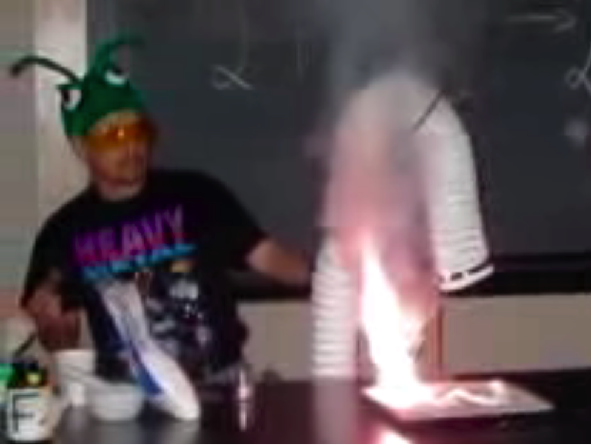
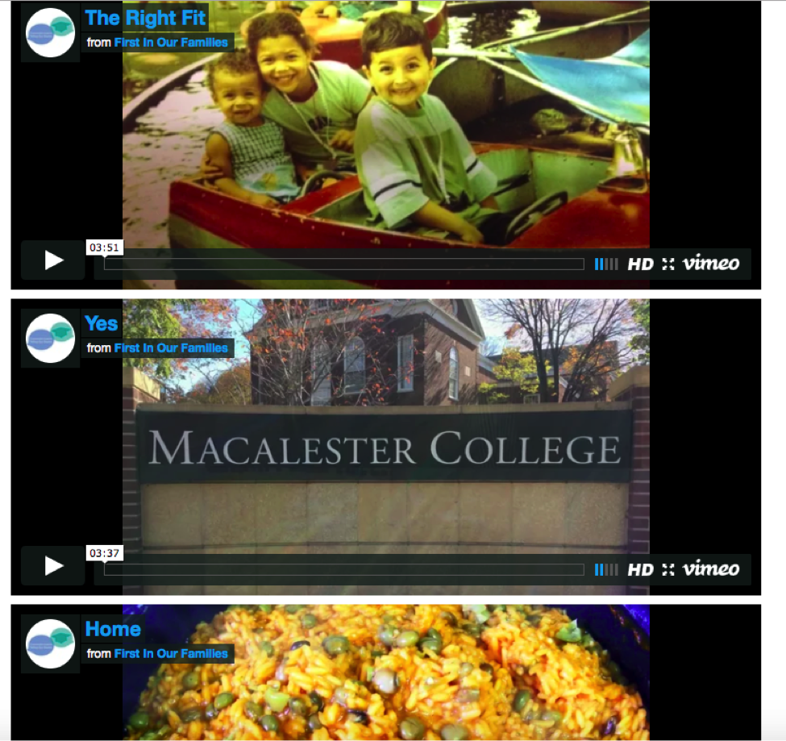
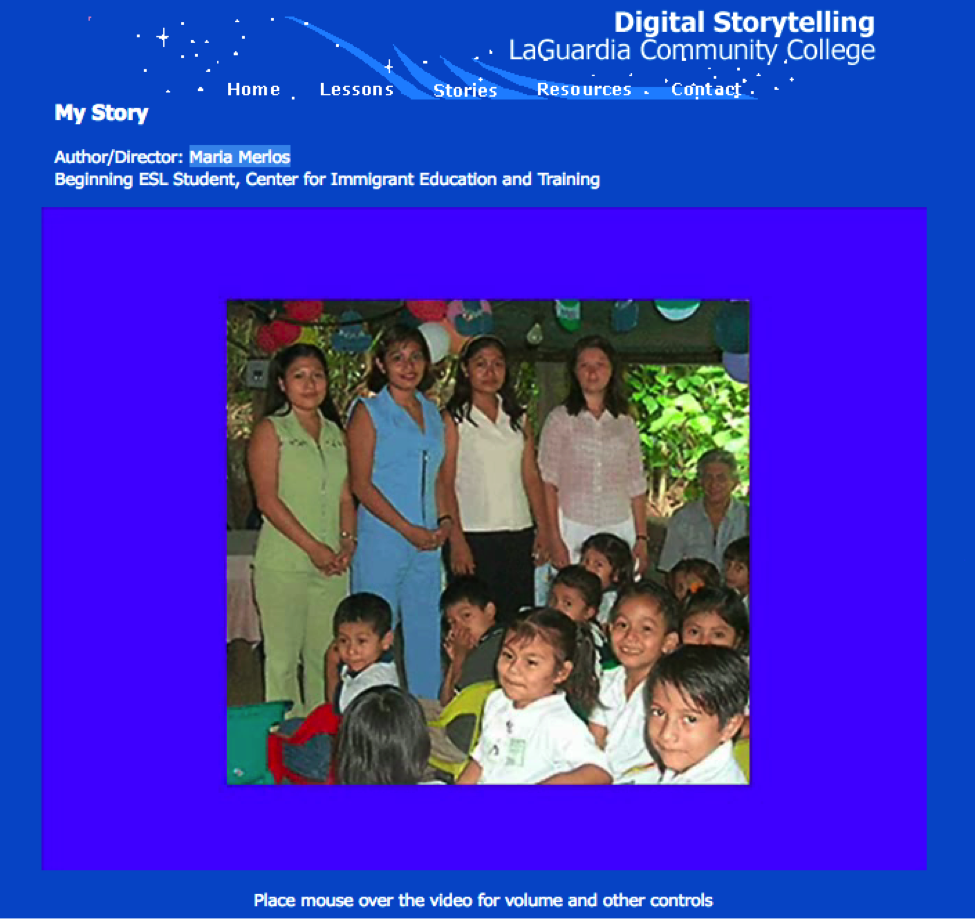
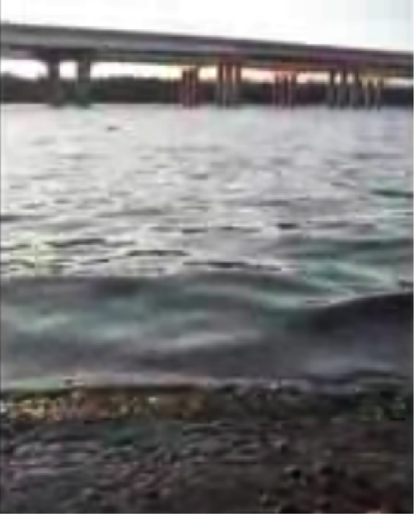
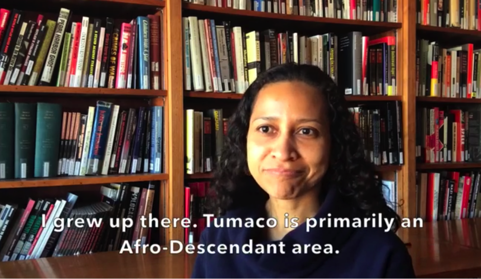
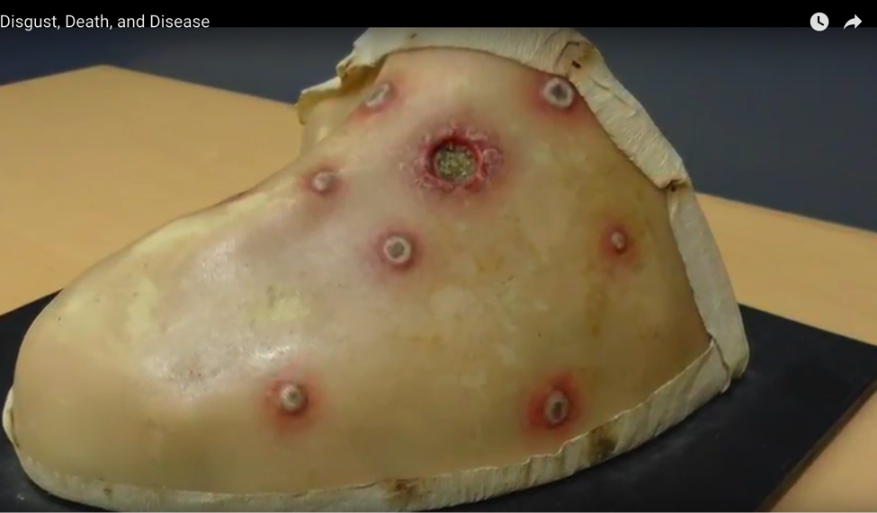
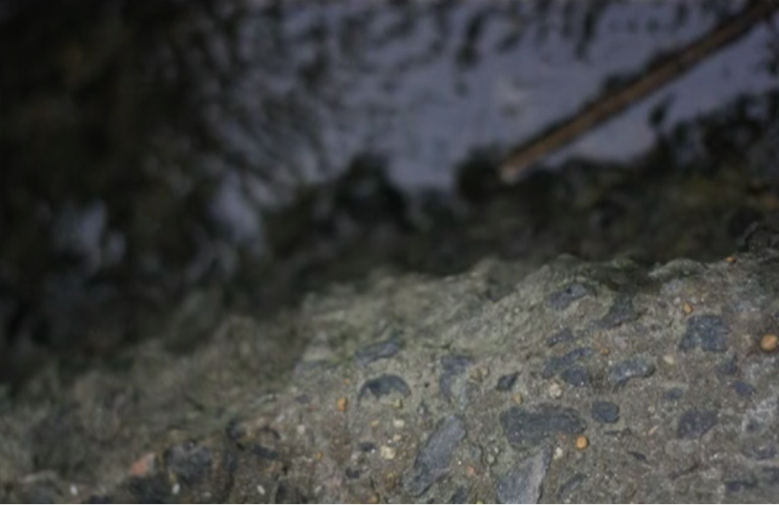
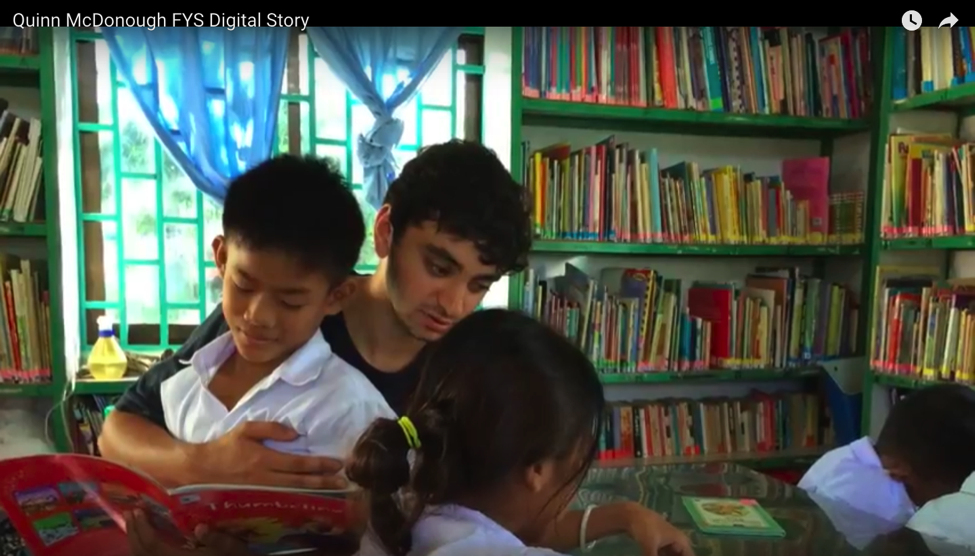
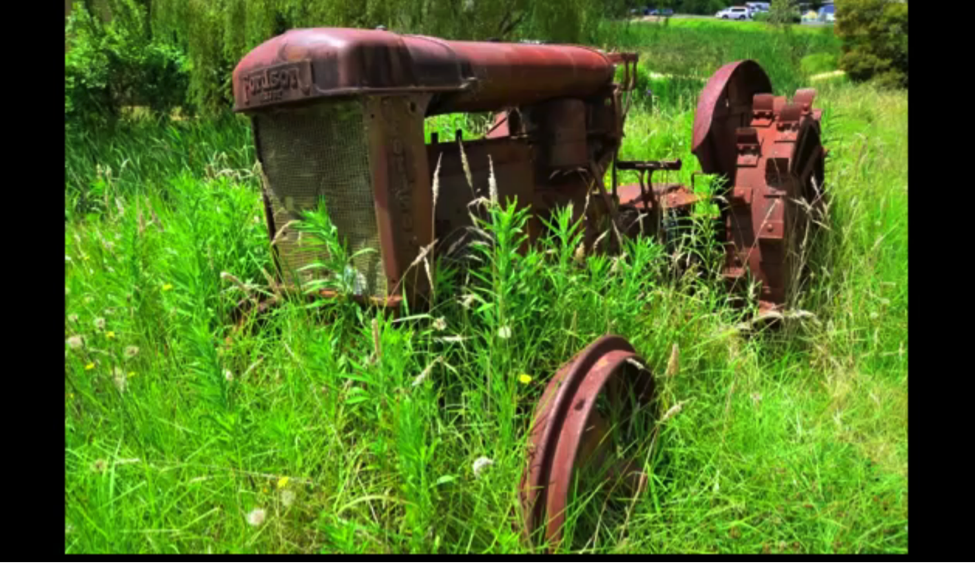

# STORYTELLING (Draft)

## Bryan Alexander
Bryan Alexander Consulting | [https://bryanalexander.org/](https://bryanalexander.org/)

---

##### Publication Status:
* unreviewed draft
* draft version undergoing editorial review
* **draft version undergoing peer-to-peer review**
* published 

--- 

## CURATORIAL STATEMENT

Storytelling is a synthetic approach to teaching and learning, one combining multiple domains, practices, and media.  Digital storytelling adds new formal and material features to narrative as an object of study, as a means of sharing research, and as a method for student expression.  Stories serve a signal pedagogical function, since storytelling has long been a classic object of study across the humanities.  Analyzing narratives is, after all, a core function of literary criticism.  Interpreting historical narratives (primary and secondary) is also a major aspect of historiography.  We can track stories across most of the rest of the humanities, as anthropology, music, communication, classical studies, archaeology, ethnography, philosophy, psychology, performance studies all select, represent, examine, and respond to stories through their respective methodological lenses.  In this light, story emerges as a major, if not the central preoccupation of the humanities.  Naturally this tendency appears in professional scholarship, undergraduate curriculum, and the continuum of work between those two poles, including undergraduate research.

Considered as part of a constructivist pedagogy, creating or co-creating stories can help a student rethink educational materials, producing meaning through narrative structure and [remix](https://github.com/curateteaching/digitalpedagogy/blob/master/keywords/remix.md).  Storytelling can combine [multiple media](https://github.com/curateteaching/digitalpedagogy/blob/master/keywords/multimodal.md), from analog forms (voice, props, whiteboards) to digital technologies (video, audio, augmented reality, etc.).  The instructor as storyteller offers another take on teaching as performance, turning class content into narrative while revising the [classroom](https://github.com/curateteaching/digitalpedagogy/blob/master/keywords/classroom.md) space into a performative zone of [collaborative](https://github.com/curateteaching/digitalpedagogy/blob/master/keywords/collaboration.md) creation.

Developments in technology and communication culture have changed the affordances storytelling presents.  New digital tools have reduced the barriers to producing media objects, including capturing, editing, and repurposing. New narrative forms have appeared, such as hypertext, locative media, and [gaming](https://github.com/curateteaching/digitalpedagogy/blob/master/keywords/gaming.md). Digital networks and social media built upon them enable rapid sharing of one’s creations to an ever-expanding, planetary audience.  As technologies have developed in the twenty-first century, digital storytelling has increased in popularity.  It has also ramified in formal development, as narrative creation expanded into gaming and social media, along with changes in [video](https://github.com/curateteaching/digitalpedagogy/blob/master/keywords/video.md) capture and presentation through mobile devices. Human creativity now has new scope at the level of individual users and small groups, leading to democratic possibilities for story creation and interaction.  This democratization complements or challenges the grand-scale, capital intensive media empires of the twentieth century, opening possibilities for creating counter-narratives and new spaces for critical media literacy.  The pedagogical benefits and opportunities are evident, most particularly in terms of teaching students to be critical, creative consumers and producers of digital media.  Put another way, digital storytelling is a sign of historical transformation, with necessary effects in education.

We can consider storytelling as a form of active engagement with media content.  The composition of a story now involves the possibility of capturing scenes from life via writing, data, audio, pictures, and video.  Creators can work those materials with content created elsewhere, either stemming from professional sources or amateur makers.  Storytelling allows for this kind of interplay of materials, their remixing and critical rearrangement, their integration into a creator’s line of thought or inquiry.  The Romantic model of a lone creator, generating ideas and art out of their fecund and isolated mind, which is also enshrined in most copyright law, does not accurately describe our present situation.  Our younger students have grown up in this new milieu, immersed more thoroughly in the digital context than their elders, generally speaking.  That constitutes another reason to teach with stories in campuses which draw students from that population, in addition to the media literacy rationale of engaging with media as they formally change.

The digital storytelling movement began in the 1990s, establishing a very specific curriculum for story creation and a distinct form for the results.  The brainchild of a San Francisco community theater project, the Center for Digital Storytelling (CDS, recently renamed [Storycenter](http://www.storycenter.org/)) developed a three day workshop for the composition of short, autobiographical video stories, then started offering small classes and teams of teachers which run to this day.  The CDS/Storycenter curriculum inspired many similar projects internationally, with facilitators helping people create three-minute autobiographical video narratives.  These narratives exist as videos, but do not necessarily include video content per se.  Instead they rely heavily on images and voiceovers, with the possible inclusion of other media objects: music, video transitions, title cards, sound effects, and so on. Technology training occurs at a minimal level, just enough to get the digital video editing and composition process across, rendering the tools more accessible to learners.  

While that curriculum crystallized and spread by 2000, digital technologies have advanced rapidly since that time, allowing new forms of storytelling to appear.  The narrative impulse has created projects in digital photography, audio (through podcasts), [blogging](https://github.com/curateteaching/digitalpedagogy/blob/master/keywords/blogging.md), social media, and new styles of media-integrated web publication (the New York Times’ “Snowfall” by John Branch or the [Cowbird](http://cowbird.com/) and [Voicethread](https://voicethread.com/) platforms).  Above all of these looms the vast culture industry that is computer gaming, with its nearly cinematic production levels at one end of the market, and manic creativity of small indygames on the other.  Story can now appear in a formal context, as clearly identified artifacts, as with the [Flickr Tell a story in 5 frames (Visual story telling) community](https://www.flickr.com/groups/visualstory/.).  Alternatively we see story elements added to larger artifacts, as when a game introduces characters to frame gameplay.  

The following artifacts express these aspects of storytelling, pointing to its recent developments and future potential. 

## CURATED ARTIFACTS

### Lipid Aggregation: an everyday experiment

* Artifact Type: digital story
* Source URL: [http://web.archive.org/web/20050317120314/chem.acad.wabash.edu/~trippm/Lipids/](http://web.archive.org/web/20050317120314/chem.acad.wabash.edu/~trippm/Lipids/) 
* Artifact Permissions: 
* Copy of the Artifact: 
* Creator and Affiliation: Mauricio Tripp, Unidad de Genómica Avanzada

A detailed description of a single chemical process, this story serves several useful functions, including: a purely academic topic without autobiographical content; a mixture of videography with scientific visualization tools; a learning object; and a faculty member’s research emphasis.  For a researcher (faculty member, graduate student, undergrad researcher) this is a useful venue for communicating research to a general audience, as well as to fellow specialists.

### Dad, What do you do for a living?

* Artifact Type: digital story
* Source URL: [https://web.archive.org/web/20111001233257/http://oit.williams.edu/itech/digitalstorytelling/eplT.mov](https://web.archive.org/web/20111001233257/http://oit.williams.edu/itech/digitalstorytelling/eplT.mov) 
* Artifact Permissions: 
* Copy of the Artifact:  
* Creator and Affiliation: Enrique Peacock Lopez, Williams College

A professor describes his passion for chemistry.  This story offers a good example of a blended autobiographical yet strongly academic story.  It is useful as a model for demonstrating the faculty member’s perspective, including the way he combines his research and teaching interests.

### First in Our Families

* Artifact Type: digital stories
* Source URL: [http://www.macalester.edu/cec/collegeaccess/FirstGenerationDigitalStorytelling/](http://www.macalester.edu/cec/collegeaccess/FirstGenerationDigitalStorytelling/) 
* Artifact Permissions: 
* Copy of the Artifact: 
* Creator and Affiliation: various, Macalaster College

These stories offer autobiographical reflections about the experience of being a first generation college student.  This site is valuable as an example of a suite of stories arranged around a single theme, as well as for representing an underrepresented yet crucial population.  A class or academic program could generate these to build community and shared purpose, while explaining their work and identity to a larger audience.

### My Story

* Artifact Type: digital story
* Source URL: [https://www.laguardia.edu/dstory/mystory.htm](https://www.laguardia.edu/dstory/mystory.htm)
* Artifact Permissions: copyright asserted
* Copy of the Artifact:  
* Creator and Affiliation: Maria Merlos, LaGuardia Community College 

This story offers autobiographical reflection on literacy and schooling, situating a student’s current English as a Second Language (ESL) studies, as well as an account of trauma and its aftermath. It is also valuable as a community college story. This story is in many ways classic StoryCenter (Center for Digital Storytelling) work, and as such accessible to any educator for whom autobiographical expression may be powerful.

### Delaware River 

* Artifact Type: digital story
* Source URL: [http://teachingwithmobiles.blogspot.com/2009/02/creating-reflective-digital-stories-to.html](http://teachingwithmobiles.blogspot.com/2009/02/creating-reflective-digital-stories-to.html) 
* Artifact Permissions: 
* Copy of the Artifact:  
* Creator and Affiliation: Bonnie Falconer, Seton Hall University

This story combines reflections on local ecosystems from ecological and personal perspectives. It offers a useful example of combining curriculum with autobiography, which could be developed by students or faculty. It also exemplifies the student perspective of engaging with a challenging academic topic. Formally, it’s a good example of using video to contrast photographs.

### Elisabet Ampudia Mesias

* Artifact Type: digital story
* Source URL: [http://immigrants.mndigital.org/exhibits/show/immigrantstories-exhibit/item/636](http://immigrants.mndigital.org/exhibits/show/immigrantstories-exhibit/item/636) 
* Artifact Permissions: Creative Commons Attribution-NonCommercial 4.0 International License.
* Copy of the Artifact: 
* Creator and Affiliation: Elisabet Ampudia Mesias, University of Minnesota

In this story, an immigrant reflects on her family’s history, roots, and transition to a new land. A very useful example of the migrant story, which may become a crucial theme for higher education in the Trump era, in that it humanizes the other and documents the reality of migration.  It is also a fascinating example of working through two languages in an audio-visual medium.   

### Disgust, Death, and Disease

* Artifact Type: digital story
* Source URL: [https://www.youtube.com/watch?v=980ZFJlwZXg](https://www.youtube.com/watch?v=980ZFJlwZXg) 
* Artifact Permissions: 
* Copy of the Artifact: 
* Creator and Affiliation: Amanda Boeing, Ohio State University 

In this story a student introduces a disease for a biology class, bringing her personal perspective to bear.  It’s a good example of a digital story about a challenging (viscerally, visually) topic, in contrast to many feel-good or inspirational themes.  This approach may encourage students to engage with challenging or threatening subjects.

### Aquaphobia 

* Artifact Type: digital story
* Source URL: [https://vimeo.com/17627563](https://vimeo.com/17627563)
* Artifact Permissions: 
* Copy of the Artifact: 
* Creator and Affiliation: june xie, Swarthmore College

In this story, a student reflects on her fear of water, stemming from a childhood incident.  Once more we see an autobiographical story, but one privileging psychological challenges. Like “Disgust, Death, and Disease” this is one venue for students to confront their own attitudes and predispositions. This reflection ties into an ecological curriculum, offering an example of blending the personal and the academic.  The visuals are largely impersonal, which is interesting in combination with the highly personal story.

### FYS Education in America, Spring 2015

* Artifact Type: digital story
* Source URL: [http://learndst.richmond.edu/quinn-mcdonnough/](http://learndst.richmond.edu/quinn-mcdonnough/)
* Artifact Permissions: 
* Copy of the Artifact: 
* Creator and Affiliation: Quinn McDonough, University of Richmond

In this story, a student considers his study abroad experience.  This story demonstrates how digital storytelling can help students rethink and reflect on study abroad, an established practice, given the challenges of returning students synthesizing their study abroad learning.  “FYS” also exemplifies a teacher reflecting on teaching, which is available to faculty, of course.

### Behind the Lens

* Artifact Type: digital story
* Source URL: [http://digitalstorytelling.coe.uh.edu/view_story.cfm?vid=467&otherid=featured&d_title=Featured%20Digital%20Stories](http://digitalstorytelling.coe.uh.edu/view_story.cfm?vid=467&otherid=featured&d_title=Featured%20Digital%20Stories)[http://digitalstorytelling.coe.uh.edu/video/Behind_the_lens.mp4](http://digitalstorytelling.coe.uh.edu/video/Behind_the_lens.mp4)
* Artifact Permissions: 
* Copy of the Artifact: 
* Creator and Affiliation: Sarah Buckle, University of Houston

This story shares an autobiographical meditation on photography.   Like "Dad, What do you do for a living?" “Behind the Lens” lets the creator explain and dive into their academic interest.  This would make a fruitful assignment for undergraduates as they complete their majors, not to mention for faculty and staff describing their work.  Formally, It is difficult to tell which photos are the author’s and which are from other sources, which is a common, interesting, and teachable problem.

## RELATED MATERIALS

Alexander, Bryan. *The New Digital Storytelling: Creating Narratives with New Media.* ABC-CLIO, 2011.

ds106 (Digital Storytelling open online course). [http://ds106.us/](http://ds106.us/)

Flickr Tell a story in 5 frames (Visual story telling) community. [https://www.flickr.com/groups/visualstory/](https://www.flickr.com/groups/visualstory/)

Lambert, Joe. *Digital Storytelling: Capturing Lives, Creating Community*, 4th edition. Routledge, 2012.

Storycenter. [http://www.storycenter.org/](http://www.storycenter.org/)

## WORKS CITED

Branch, John. "Snow Fall". *New York Times.* 20 December 2012. [http://www.nytimes.com/projects/2012/snow-fall/#/?part=tunnel-creek](http://www.nytimes.com/projects/2012/snow-fall/#/?part=tunnel-creek)
