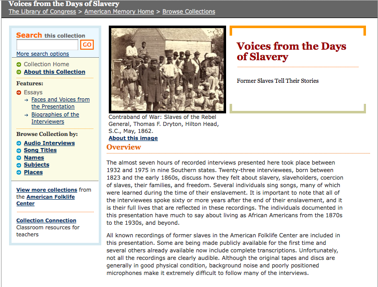
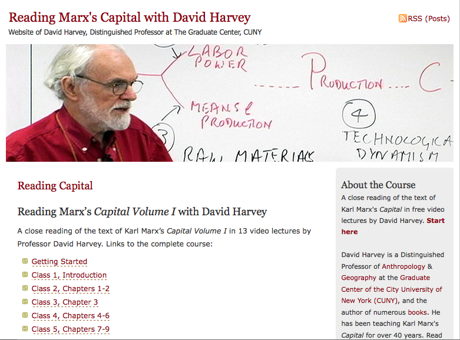
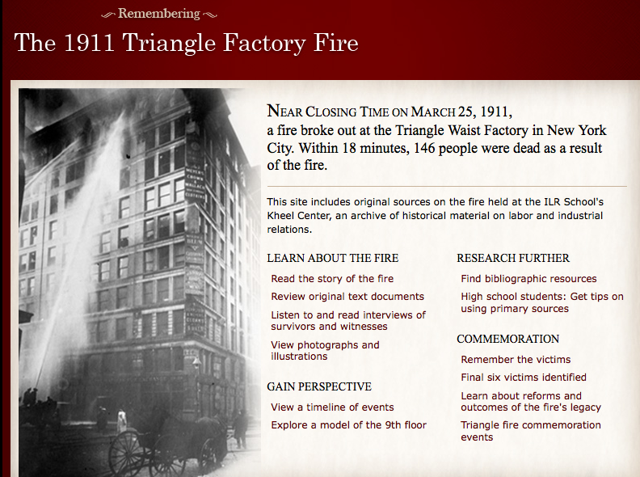
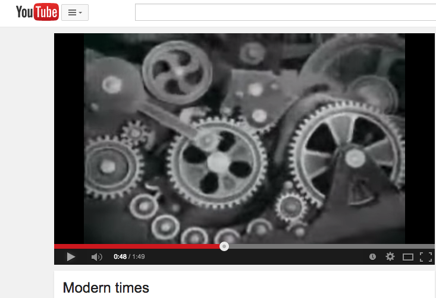
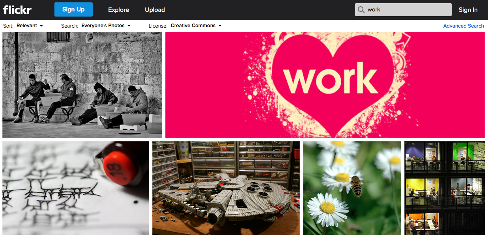

# KEYWORD ENTRY FOR "WORK"

## Stephen Brier
[Affiliation] [Website?]
KATHY: Steve, would you mind adding your affiliation & any website/url that you'd like attached to your name? 

## Pedagogical Resources 
* “African American History: From the Slave Trade to 1900,” Susan O’Donovan, [http://sites.fas.harvard.edu/~afam118/index.html](http://sites.fas.harvard.edu/~afam118/index.html) (syllabus)
* “Documents from Freedom: A Documentary History of Emancipation, 1861-1867,” Freedmen & Southern Society Project, [http://www.freedmen.umd.edu/sampdocs.htm](http://www.freedmen.umd.edu/sampdocs.htm) (website)
* “Voices from the Days of Slavery,” Library of Congress’s American Memory Project, [http://memory.loc.gov/ammem/collections/voices/](http://memory.loc.gov/ammem/collections/voices/) (website)
* “Reading Capital,” David Harvey, [http://davidharvey.org/reading-capital/](http://davidharvey.org/reading-capital/) (website)
* “Work,” Herb” database - American Social History Project, [http://herb.ashp.cuny.edu/items/browse/2?tags=Work](http://herb.ashp.cuny.edu/items/browse/2?tags=Work) (website)
* The 1911 Triangle Factory Fire website, Cornell University ILR School, [http://www.ilr.cornell.edu/trianglefire/](http://www.ilr.cornell.edu/trianglefire/) (website)
* Modern Times (1936), Charlie Chaplin, [https://www.youtube.com/watch?v=IjarLbD9r30](https://www.youtube.com/watch?v=IjarLbD9r30) (video)
* “Work, Social Class & Culture,” Samer Shehata, [https://blogs.commons.georgetown.edu/samershehata/courses/](https://blogs.commons.georgetown.edu/samershehata/courses/)  (syllabus)
* “Work,” Creative Commons-licensed images, Flickr, [https://www.flickr.com/search/?q=work&l=4](https://www.flickr.com/search/?q=work&l=4) (website)
* “The Toaster Project,” Thomas Thwaites, [http://www.thetoasterproject.org/page2.htm](http://www.thetoasterproject.org/page2.htm) (website)

KATHY: Steve, this is indeed an interesting set of resources. I notice that a great many of them are websites instead of specific assignments, syllabi, essays, and such. If we think about these websites as being discoverable by other faculty member, we can instead (for the purposes of this project) think about how they are used specifically for a course other than as a general resource. Is it possible to share instead assignments that have been used surrounding these websites? It could be something as simple as a writing assignment or blog prompt or as intricate as a research assignment or in-class set of instructions. (We can also chat about this offline, if it helps.) 

## Curatorial Statement 
Merriam-Webster Online [http://www.merriam-webster.com/dictionary/work] defines “work” as “a job or activity that you do regularly especially in order to earn money,” what Freud called “the compulsion to work…created by external necessity” (Freud 48). Most of us work essentially to make money to acquire the material things we need to survive and thrive, to reproduce ourselves (and our families). We also work because it is one of the key ways in which we define ourselves as human beings (homo faber). Work (sometimes) offers satisfaction, personal fulfillment, and even joy, and gives us meaning and identity. 

KATHY: This is a good start to the discussion surrounding the definition of work; but, instead of starting with the Merriam-Webster, do you think you could find more history in the OED Database about the evolution of this term (though it might be couched more in literature than in cultural documents)

But work also is and has been the cause of enormous pain and individual and collective oppression across time, inflicting anguish, injury, and even death upon those whose work is exploited, exploitation that is structured by a range of gender, sexual, racial, ethnic, age, and class identities. To understand the exploitative nature of work one need only recall such texts as Solomon Northup's 12 Years a Slave (1853), or the fate of the striking French coal miners in Emile Zola's Germinal (1885), or the Dust Bowl migrant family, the Joads, in John Steinbeck's Grapes of Wrath (1939).

KATHY: For the above paragraph, can you couch this in something concrete? a text, a happening, an event -- anything to create the ideas that you work through in the next paragraphs.

Because we often work for and with others, it is necessary to consider related concepts including “labor” and “class.” The first term can be used as a synonym for work; the latter can be defined as the social and economic relationships of individuals and groups to the methods and modes of production (how people work). In order to teach the idea of “work,” it is necessary to make the concept historical, to understand how work is shaped by the material and historical contexts in which human beings function in the economy and in society. 

I use curated digital and analog resources in two different pedagogical contexts: teaching the history of U.S. labor to workers enrolled in an M.A. in labor studies program in CUNY

KATHY: It's not clear if the students are workers or if this is part of the course content; can you clarify?

; and in the introductory course of the Interactive Technology and Pedagogy doctoral certificate program at the CUNY Graduate Center. I use history in both classrooms to help very different groups of students grapple with the ways in which a variety of technologies at key moments in the past have transformed the nature and purpose of how we work and why. These resources frame larger philosophical, historical, sociological, and cultural approaches to work. The pedagogical goal is to get students to use available digital and analog materials about work/labor/class to develop their own understandings about how work has evolved across time and in very different cultural, economic, and national contexts, using the historical and contemporary examples and case studies below:

KATHY: In this last sentence, work/labor/class seems to be conflated with this series of slashes. I seem to recall a lengthy email exchange about the contingent differences among these three terms. Did you want to explain that here (you get into the relationship above but it seems with the above sentence that they are interchangeable)? 

_1. Pre-industrial/pre-capitalist work in the United States_: I focus first on the economic roots of U.S. racial slavery in order for students to understand enslaved labor’s centrality to 19th century U.S. economic development, using Susan O’Donovan’s syllabus to explore current scholarship on U.S. slavery. As a fully racialized institution, U.S. slavery’s power and purpose as the key driver in the nation’s extraordinary economic growth is often obscured. Students need to understand that the forced labor of slaves made the dramatic economic expansion of the U.S. possible, and that slave work as unrelenting labor was at the center of the economic and social order of the United States before the Civil War. 

KATHY: The above section brings up historical moments in US history that are often difficult to face; you've got an interesting take here. With that being said, you mention "slave work" as slightly different from "labor." Is there a difference? If so, could I get you to tease that out?

Text documents like Solomon Northup’s memoir and the letters of newly emancipated slaves to the U.S. Freedmen’s Bureau offer compelling testimony about life and labor under slavery, while the actual voices of former slaves recorded and preserved by the Library of Congress between 1932 and 1975 convey rich details about the nature of exploitation of the life and labor of enslaved African Americans and the ways their lives and labor were transformed by emancipation. 

_2. Early capitalist production and factory work_: Textual, image, and video resources help students understand how technological affordances transform work and how work, in turn, changes human understandings and perceptions of the world. Thompson’s article helps students understand the ways in which early capitalist forms of factory work forced changes in basic human perceptions and understandings of the concept of time, while a reading of key chapters in Marx’s Capital, aided by Harvey’s video explications and his Companion to Marx’s Capital text, conveys the centrality of historical and materialist understandings of large-scale transformations of the capitalist work process. A variety of documents found on the “Herb” and “1911 Triangle Factory Fire” websites, along with secondary sources like Leon Stein’s 1962 classic, The Triangle Fire help students root theoretical insights from Marx and Thompson in concrete examples of early factory production, while Chaplin’s film scene offers an artistic and humorous view of that production process and its human indignities and resistances. 

_3. Work in the Contemporary, “Post-Industrial” World_: To explore changing and divergent material and cultural expressions of work in the global North and global South, students and teachers first use Shehata’s syllabus to broaden their focus to encompass non-U.S. cultures. Reading Ehrenreich’s Nickeled and Dimed about the exploited labor of U.S. low-wage service workers and Flickr Creative Commons images of work in the global North and global South help deepen students’ understanding of work in their own time. And Thwaites’s online and book project to deconstruct and then build a toaster lets us see the continued exploitation of natural resources and global South labor, even in our supposedly “post-industrial” world.

Students use these three sets of historical resources to produce multimedia presentations, supported by written academic analyses, evaluating the changing nature and forms of work across time and space. 
 
## 4. Curated Pedagogical Resources 

### _1. African American History Syllabus_

* Screenshot: 

* Copy of the Resource: O'Donovan syllabus.png

* Source URL: [http://sites.fas.harvard.edu/~afam118/index.html]

* Name of Creator: Susan O’Donovan

* Attribution Information: Susan O'Donovan, Harvard University 

This syllabus and additional digital Resources links on the Home Page offer a broad overview of current scholarship on African American history to 1900, with a strong emphasis on the experience of enslaved African Americans. The scholarly materials provided in the syllabus and the additional “Resources” section give students a strong introduction to the economic, cultural and personal impact of slavery on the enslaved and the enslavers. They should use it to find and read background scholarship and gather primary sources on slave labor and racial exploitation.

KATHY: Steve, can you provide an argument about why this should be included (as opposed to any other syllabus)? Is there some prevailing argument here? Is there something specifically about the reading list or the type of assignments in addition to the resources that's helpful?

### 2. _Documents from Freedom: A Documentary History of Emancipation, 1861-1867_ 

* Screenshot: 

* Source URL: [http://www.freedmen.umd.edu/sampdocs.htm](http://www.freedmen.umd.edu/sampdocs.htm)

* Name of Creator: Freedmen & Southern Society Project

* Attribution Information: Freedmen & Southern Society Project, University of Maryland

Documents from the accompanying website to the multi-volume *Freedom: A Documentary History of Emancipation, 1861-1867*: a selection of letters from former enslaved African Americans to the Freedmen’s Bureau, the federal agency charged with supporting the new emancipated slaves, during and immediately the Civil War, these primary documents allow students to read the ideas and thoughts and assess the feelings of recently-freed African Americans as they struggle with the meaning of freedom and their changed relationship to work and economic life in the postwar South. The pedagogical goal is for students to uncover evidence about work and economic relations, thus engaging in the kind of scholarly inquiry that professional historians undertake when they use primary sources to reconstruct what happened in the past on a particular subject and puzzle out its larger meaning. 

KATHY: Steve, is there a specific prompt to go with this resource that you could include? 

###_3.Recorded Voices of Former Slaves_  

* Screenshot: 

* Source URL: [http://memory.loc.gov/ammem/collections/voices/](http://memory.loc.gov/ammem/collections/voices/)

* Name of Creator: Library of Congress

* Attribution Information: American Memory Project, Library of Congress

Oral history interviews recorded by federal workers between 1932 and 1975 with former enslaved African Americans. The recordings offer a rich resources in the words and voices of former slaves themselves about life and labor in the slave South. The pedagogical goal is to gather audio materials (including work songs, several of which are sung by interviewees) on the attitudes of African American slaves toward field, house, skilled, and other forms of work and labor exploitation under slavery to be used, with the other curated resources to produce a multimedia presentation, supported by a written academic analysis, on the work of enslaved African Americans under the regime of racial slavery in the United States.

KATHY: Steve, is there a specific prompt to go with this resource that you could include? 

### _4. Reading Marx’s Capital_

* Screenshot: 

* Source URL: [http://davidharvey.org/reading-capital](http://davidharvey.org/reading-capital)

* Name of Creator: David Harvey

* Attribution Information: David Harvey, CUNY Graduate Center

David Harvey’s brilliant online video lectures on reading Capital are the digital jumping off point for deep immersion of students and teachers with historical materialist ideas about work, machine production, the creation of value, and the technological affordances that define material “progress.” Begin by reading E.P Thompson’s 1967 scholarly essay “Time, Work-Discipline and Industrial Capitalism,” which provides a bridge back to the pre-industrial forms of work under slavery while also pointing forward to the ways that industrial capitalism transformed notions of time. Thompson’s nuanced analysis historicizes the idea of work-discipline, a major theme that Marx takes up in the early chapters of Capital (chapters 7 through 15 are especially recommended at [https://www.marxists.org/archive/marx/works/1867-c1/](https://www.marxists.org/archive/marx/works/1867-c1/) or on paper). Harvey’s “Reading Capital” video classes 5 through 8 should be viewed in conjunction with reading Marx to deepen understanding of abstract and often difficult concepts. 

KATHY: Steve, is there a specific prompt to go with this resource that you could include? 

### _5. “Work” Documents from Herb Database_

* Screenshot: 

* Source URL: [http://herb.ashp.cuny.edu/items/browse/2?tags=Work](http://herb.ashp.cuny.edu/items/browse/2?tags=Work)

* Name of Creator: American Social History Project/Center for Media and Learning 

* Attribution Information: American Social History Project/Center for Media and Learning, CUNY Graduate Center

Search for and cull relevant text, image, items tagged “Work” on ASHP’s Herb historical database. The132 primary source documents span the history of work from the colonial period to the contemporary period, with a heavy emphasis on 19th century working environments and conditions. Students should use this archive to find specific historical instances of the larger themes that Marx and Thompson describe with respect to the introduction of machine production techniques. Students can be asked to use these primary sources to create interpretive and/or artistic renderings of factory work and the particular role that women, racial minorities, and immigrants have played in these work environments historically.

KATHY: Steve, is there a specific prompt to go with this resource that you could include? 

### _6. 1911 Triangle Shirtwaist Fire_

* Screenshot: 

* Copy of the Resource: Triangle Fire.png

* Source URL: [http://www.ilr.cornell.edu/trianglefire/](http://www.ilr.cornell.edu/trianglefire/)

* Name of Creator: Kheel Center, ILR School, Cornell University 

* Attribution Information: Kheel Center, ILR School, Cornell University 

The tragic and horrendous deaths of 146 factory workers, many of them young immigrant women, in the 1911 fire at the Triangle Shirtwaist factory in downtown Manhattan helped galvanize the movement for important workplace reforms and safety measures, underscoring the sometimes catastrophic impact of factory work on the human beings who provide the labor in those factories. The website (and Leon Stein’s powerful 1962 book on the subject) allow students to explore what happened, why, and what resulted from the tragic fire, helping them understand how historical actions and events related to work and workers continue to resonate into the present.

KATHY: Steve, is there a specific prompt to go with this resource that you could include? 

### _7. Assembly Line Scene in Charlie Chaplin’s Modern Times_

* Screenshot: 

* Source URL: [https://www.youtube.com/watch?v=IjarLbD9r30](https://www.youtube.com/watch?v=IjarLbD9r30)

* Name of Creator: Esteve Jaulent 

* Attribution Information: Charlie Chaplin, _Modern Times_, YouTube

A humorous, absurdist critique of factory work, Chaplin manages to spoof the deadening monotony of work on the assembly line while finding ways as he depicts an assembly line worker to subvert the basic intention of machine production to maximize output and thus profit. The scene of Chaplin as the assembly line worker being drawn into and merging with the wheels and gears of the giant production machine is an incomparable filmic rendering of Donna Haraway's Cyborg. The two-minute selection from _Modern Times_ manages to encapsulate all of the themes about work, work-discipline, machine production, exploitation, and worker resistance considered earlier.

KATHY: Steve, is there a specific prompt to go with this resource that you could include? 

### _8. Samer Shehata’s “Work, Social Class and Culture” syllabus_

* Screenshot: 

* Source URL: [https://blogs.commons.georgetown.edu/samershehata/courses/](https://blogs.commons.georgetown.edu/samershehata/courses/)

* Name of Creator: Samer Shehata 

* Attribution Information: Samer Shehata, Georgetown University

A rich overview of contemporary work and social class in the global North and the global South, stretching from England in 1844, India, Egypt, and Malaysia, and ending in contemporary New York and Los Angeles, Samer Shehata's syllabus historicizes and internationalizes our understandings of work. The pedagogical goal is to use such explorations in a range of countries and time periods (and those that teachers and students discover on their own via online searches) to deepen understanding of the differences in the ways work is conducted, valued, devalued, and exploited across the globe in the contemporary era. Using Shehata’s sources and others that can be discovered, including Barbara Ehrenreich’s recent study of low-wage service work, Nickled and Dimed, and the visual materials gleaned from the next curated source (Flickr), students should produce, singly or in teams, multimedia presentations and/or performances about contempor;ary work and workers that confront the banal statement that we live in a “post-industrial” world.

Kathy: Steve, I'd love to see that assignment included here. Think about it in terms of a faculty member searching through this project using the tag "work" and coming across an assignment, syllabus, etc., that he/she could use immediately (in class the next day or soon thereafter). 

### _9. Images of “Work” on Flickr_

* Screenshot: 

* Source URL: [https://www.flickr.com/search/?q=work&l=4](https://www.flickr.com/search/?q=work&l=4)

* Name of Creator: Miscellaneous 

* Attribution Information: Creative Commons-licensed images of “Work,” Flickr

Peruse and cull images of contemporary work in global North and global South countries, as gleaned from a search for Creative Commons-licensed images of “Work” on Flickr. Compare and contrast those images of work to ponder the question raised in the previous curated pedagogical resource about whether we live in a “post-industrial” world and use these images to illustrate the presentations about work in the contemporary period.

KATHY: You may have represent why cc license is desirable here; some readers in this project may not be aware of that importance. Here, too, an actual assignment to go with the resource would be better served to the audience.

### _10. Thomas Thwaite’s The Toaster Project_

* Screenshot: 

* Source URL: [http://www.thetoasterproject.org/page2.htm](http://www.thetoasterproject.org/page2.htm)

* Name of Creator: Thomas Thwaite 

* Attribution Information: Thomas Thwaite

Intent on taking a simple consumer produce—an electric toaster--and reverse engineering it, Thomas Thwaite takes us on a wild international journey that deconstructs the industrial production process and the work that makes cheap consumer products like toasters possible. Read the 2011 book first and then explore the Vimeos on the website to understand the nature of Thwaite’s effort to demystify the work process and the natural resources and human labor required to produce a “simple” material object like a toaster. Using the previous two pedagogical resources, produce a multimedia presentation, supported by a written academic analysis, contrasting ideas and images of work in the “modern” global North with images of work and production in the global South. What does Thwaite’s toaster project teach us about production and consumption? 

KATHY: Here, too, if you already have an assignment that does this, that would be great. We want to see that.

## 5. Related Materials 

* Solomon Northup, 12 Years a Slave, [http://docsouth.unc.edu/fpn/northup/northup.html](http://docsouth.unc.edu/fpn/northup/northup.html)

* Karl Marx, Capital Vol. 1, [https://www.marxists.org/archive/marx/works/1867-c1/](https://www.marxists.org/archive/marx/works/1867-c1/)

* E.P. Thompson, “Time, Work-Discipline and Industrial Capitalism,” Past and Present 38: 56-97, [http://www.jstor.org.ezproxy.gc.cuny.edu/stable/649749](http://www.jstor.org.ezproxy.gc.cuny.edu/stable/649749) 

* Barbara Ehrenreich, *Nickel and Dimed: On (Not) Getting By in America.* Print.

* Thomas Thwaites, *The Toaster Project: Or a Heroic Attempt to Build a Simple Electric Appliance from Scratch.* Print.

## 6. Works Cited
“Documents from Freedom: A Documentary History of Emancipation, 1861-1867.” Freedmen & Southern Society Project. 8 Nov. 2014 [http://www.freedmen.umd.edu/sampdocs.htm](http://www.freedmen.umd.edu/sampdocs.htm).

Ehrenreich, Barbara. *Nickel and Dimed: On (Not) Getting By in America.* New York: Metropolitan Books, 2001. 

Freud, Sigmund. *Civilization and Its Discontents.* New York: W.W. Norton & Co., 1991. 

Haraway, Donna. “A Cyborg Manifesto: Science, Technology, and Socialist-Feminism in the Late Twentieth Century.” *Simians, Cyborgs and Women: The Reinvention of Nature.* New York: Routledge, 1991. 149-81. 

Harvey, David. *A Companion to Marx’s Capital.* Brooklyn, NY: Verso, 2010.

__________,  “Reading Marx’s Capital with David Harvey.” Home page. 8 Nov. 2014.[http://davidharvey.org/reading-capital/](http://davidharvey.org/reading-capital/).

Marx, Karl. *Capital: A Critique of Political Economy.* Volume 1. Trans. Ben 	Fowkes. London: Penguin Classics, 1867/1990.[https://www.marxists.org/archive/marx/works/1867-c1/](https://www.marxists.org/archive/marx/works/1867-c1/).

*Modern Times.* Dir. Charlie Chaplin. 1936. YouTube. 8 Nov. 2014. [https://www.youtube.com/watch?v=DfGs2Y5WJ14](https://www.youtube.com/watch?v=DfGs2Y5WJ14).

Northup, Solomon. *12 Years a Slave.* 1853/1997. 8 Nov. 2014. [http://docsouth.unc.edu/fpn/northup/northup.html](http://docsouth.unc.edu/fpn/northup/northup.html).

O’Donovan, Susan. “Syllabus of African American History: From the Slave Trade to 1900.” Harvard University, 2006. [http://sites.fas.harvard.edu/~afam118/index.html](http://sites.fas.harvard.edu/~afam118/index.html).

*Remembering the 1911 Triangle Factory Fire.* Kheel Center, Cornell University ILR School. Home Page. 8 Nov. 2014 [http://www.ilr.cornell.edu/trianglefire/](http://www.ilr.cornell.edu/trianglefire/).

Shehata, Samer. “Syllabus of Work, Social Class & Culture.” Georgetown 	University, 2014.  [https://blogs.commons.georgetown.edu/samershehata/courses/](https://blogs.commons.georgetown.edu/samershehata/courses/).

Stein, Leon. *The Triangle Fire.* Ithaca, NY: Cornell University Press, 1962/2001.

“The Toaster Project.” Thomas Thwaites. Home Page. 8 Nov. 2014. [http://www.thetoasterproject.org/page2.htm](http://www.thetoasterproject.org/page2.htm).

Thompson, E.P. “Time, Work-Discipline and Industrial Capitalism.” *Past and Present* 38 (1967): 56-97 [http://www.jstor.org.ezproxy.gc.cuny.edu/stable/649749](http://www.jstor.org.ezproxy.gc.cuny.edu/stable/649749).

Thwaites, Thomas. *The Toaster Project or a Heroic Attempt to Build A Simple Electric Appliance from Scratch.* New York: Yale Architectural Press, 2011.
 
“Voices from the Days of Slavery.” American Memory Project. Library of Congress. 8 Nov. 2014 [http://memory.loc.gov/ammem/collections/voices/](http://memory.loc.gov/ammem/collections/voices/).

“Work” (Creative Commons-licensed images). Flickr. 8 Nov. 2014 [https://www.flickr.com/search/?q=work&l=4](https://www.flickr.com/search/?q=work&l=4).

“Work.” Herb: Social History for Every Classroom. American Social History Project. 8 Nov. 2014 [http://herb.ashp.cuny.edu/items/browse/2?tags=Work](http://herb.ashp.cuny.edu/items/browse/2?tags=Work).
